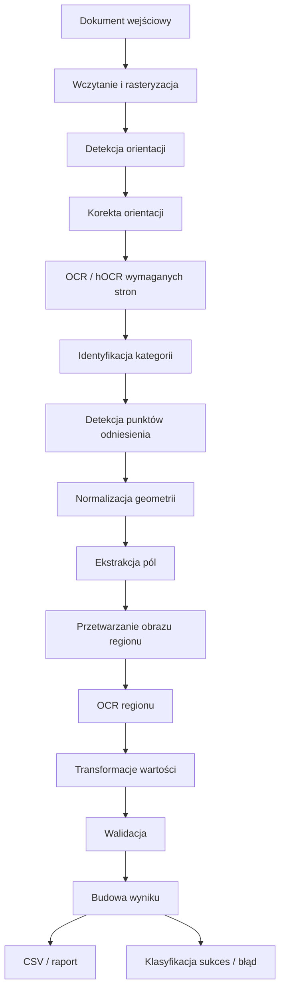
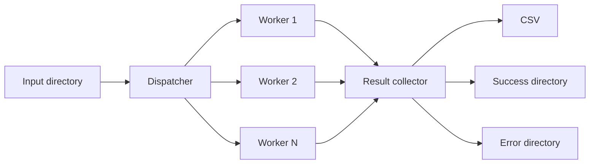
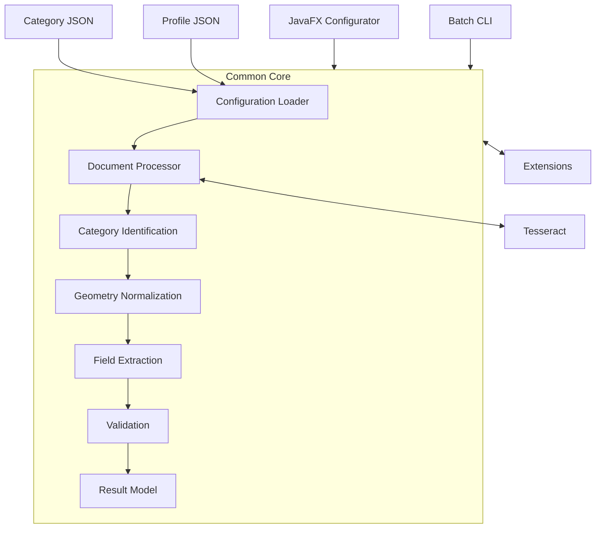

# System OCR do konfigurowalnej ekstrakcji danych z dokumentów

| Pole          | Wartość                            |
| ------------- | ---------------------------------- |
| ID dokumentu  | DOC-001                            |
| Tytuł         | Wizja i założenia projektu         |
| Wersja        | 0.1                                |
| Status        | Draft                              |
| Typ           | Dokument inicjujący / Vision       |
| Źródło prawdy | Repozytorium dokumentacji projektu |
| Zależności    | Brak                               |

## 1. Cel dokumentu

Celem dokumentu jest zebranie i uporządkowanie wstępnych założeń dla
systemu służącego do konfigurowalnego rozpoznawania kategorii dokumentów
oraz ekstrakcji, transformacji i walidacji danych z dokumentów
skanowanych.

Dokument definiuje wizję rozwiązania, zakres wysokopoziomowy, podstawowe
pojęcia, główny przepływ przetwarzania oraz najważniejsze decyzje
architektoniczne. Nie jest jeszcze szczegółową specyfikacją techniczną.
Kolejne dokumenty będą uszczegóławiały wymagania, model domenowy,
konfigurację JSON, architekturę, interfejsy rozszerzeń oraz plan
implementacji.

Dokumentacja projektu powinna być traktowana jako źródło prawdy dla
implementacji, w tym dla pracy wykonywanej przy pomocy narzędzi
programistycznych takich jak Codex.

## 2. Wizja systemu

System ma umożliwiać automatyczne przetwarzanie dużych zbiorów
formularzy i innych dokumentów o względnie stałym układzie graficznym.

Dla każdej obsługiwanej kategorii dokumentu analityk będzie mógł
przygotować osobną konfigurację opisującą między innymi:

- sposób identyfikacji kategorii dokumentu,
- strony dokumentu istotne dla danej kategorii,
- punkty odniesienia i kotwice,
- zasady normalizacji geometrii dokumentu,
- pola, które należy odczytać,
- położenie pól względem punktów odniesienia,
- operacje przygotowania obrazu przed OCR,
- operacje transformacji tekstu po OCR,
- walidatory wartości,
- zasady uznania przetwarzania dokumentu za poprawne lub błędne.

Po przygotowaniu konfiguracji ta sama logika będzie wykorzystywana
zarówno interaktywnie podczas jej tworzenia i testowania, jak i w
masowym przetwarzaniu dokumentów.

## 3. Problem biznesowy

Dane znajdujące się na skanowanych formularzach często muszą być ręcznie
odczytywane i przepisywane do systemów informatycznych. Proces taki jest
czasochłonny, kosztowny i podatny na błędy.

Typowe systemy OCR potrafią rozpoznać tekst, ale nie posiadają wiedzy
biznesowej dotyczącej:

- rodzaju przetwarzanego dokumentu,
- znaczenia poszczególnych fragmentów dokumentu,
- oczekiwanej lokalizacji danych,
- oczekiwanego formatu wartości,
- sposobu walidacji wartości,
- specyficznych problemów obrazu występujących w formularzach.

Projektowany system ma stanowić warstwę ponad silnikiem OCR i umożliwiać
deklaratywne opisanie tych informacji bez konieczności modyfikowania
kodu aplikacji dla każdej nowej kategorii dokumentu.

## 4. Cele biznesowe

Główne cele systemu:

1.  Ograniczenie ręcznego przepisywania danych ze skanowanych
    dokumentów.
2.  Automatyczna klasyfikacja dokumentów.
3.  Automatyczna ekstrakcja określonych danych.
4.  Walidacja odczytanych wartości.
5.  Obsługa dokumentów różniących się skalą, przesunięciem, orientacją i
    jakością skanu.
6.  Możliwość przygotowywania nowych kategorii dokumentów bez
    rekompilacji aplikacji.
7.  Interaktywne przygotowanie i testowanie konfiguracji przez
    analityka.
8.  Masowe przetwarzanie dziesiątek tysięcy dokumentów.
9.  Możliwość ponownego przetwarzania dokumentów, których nie udało się
    poprawnie rozpoznać.
10. Rozszerzalność systemu o nowe algorytmy przetwarzania, detektory,
    transformacje i walidatory.

## 5. Zakres rozwiązania

System będzie składał się ze wspólnego rdzenia oraz co najmniej dwóch
aplikacji wykorzystujących ten rdzeń.

### 5.1. Wspólny rdzeń

Wspólna biblioteka będzie zawierała całą logikę domenową i
przetwarzania, w szczególności:

- wczytywanie konfiguracji,
- obsługę dokumentów,
- integrację z Tesseract OCR,
- analizę hOCR,
- identyfikację kategorii,
- wykrywanie punktów odniesienia,
- normalizację geometrii,
- ekstrakcję regionów,
- przetwarzanie obrazów,
- OCR regionów,
- transformacje tekstu,
- walidację,
- generowanie wyników.

Rdzeń nie powinien zależeć od JavaFX ani od CLI.

### 5.2. Aplikacja konfiguracyjna

Aplikacja desktopowa oparta o JavaFX będzie przeznaczona przede
wszystkim dla analityka przygotowującego konfiguracje.

Powinna umożliwiać między innymi:

- otwarcie przykładowego dokumentu,
- wyświetlenie jego stron,
- wykonanie OCR,
- prezentację informacji pozycyjnych pochodzących z hOCR,
- zaznaczanie regionów dokumentu,
- wybieranie rozpoznanych elementów tekstowych,
- definiowanie reguł identyfikacji,
- definiowanie punktów odniesienia,
- definiowanie pól,
- konfigurowanie pipeline'u pola,
- uruchamianie próbnej ekstrakcji,
- prezentację wartości pośrednich i końcowych,
- prezentację wyników walidacji,
- zapis konfiguracji kategorii do JSON.

### 5.3. Aplikacja CLI

Druga aplikacja będzie lekką aplikacją uruchamianą z wiersza poleceń.

Jej zadaniem będzie masowe przetwarzanie dokumentów na podstawie
gotowych konfiguracji.

CLI powinno przede wszystkim:

- przyjąć konfigurację uruchomienia,
- wczytać profil kategorii,
- znaleźć dokumenty wejściowe,
- uruchomić dispatcher,
- przetwarzać dokumenty równolegle,
- raportować postęp,
- generować wynik,
- przenosić dokumenty do odpowiednich katalogów końcowych,
- zwrócić odpowiedni kod zakończenia procesu.

## 6. Technologie bazowe

Na obecnym etapie przyjęto:

- język: Java,
- GUI: JavaFX,
- OCR: Tesseract,
- reprezentacja wyników OCR z geometrią: hOCR,
- konfiguracja: JSON,
- wynik podstawowy: CSV,
- wersjonowanie konfiguracji i dokumentacji: Git.

Spring Boot nie jest wymagany dla podstawowej wersji systemu.
Architektura rdzenia powinna być niezależna od konkretnej technologii UI
oraz mechanizmu uruchamiania.

Szczegółowe wersje Java, Tesseracta oraz bibliotek zostaną ustalone w
dokumencie architektury technicznej.

## 7. Obsługiwane dokumenty

Zakładane formaty wejściowe:

- PDF,
- TIFF,
- PNG,
- JPEG/JPG.

Dokument może zawierać jedną lub wiele stron.

Konfiguracja kategorii określi, które strony są istotne dla
identyfikacji i ekstrakcji. System nie powinien wykonywać kosztownego
OCR stron, które nie są potrzebne żadnej z aktywnych kategorii.

Dla zestawu aktywnych kategorii należy wyznaczyć maksymalny zakres stron
wymagany przez którąkolwiek kategorię i odpowiednio planować
przetwarzanie.

## 8. Profil przetwarzania

Oprócz konfiguracji poszczególnych kategorii przewiduje się konfigurację
profilu uruchomienia.

Profil będzie wskazywał między innymi:

- aktywne kategorie dokumentów,
- lokalizację konfiguracji kategorii,
- parametry wykonania,
- potencjalne nadpisania parametrów kategorii.

Pozwoli to uruchamiać ten sam silnik z różnymi zestawami obsługiwanych
dokumentów.

## 9. Konfiguracja kategorii dokumentu

Każda kategoria będzie opisana osobnym plikiem JSON.

Przykładowo:

```text
profiles/
  default.json

categories/
  vat-form.json
  customer-form.json
  registration-form.json
```

Konfiguracja kategorii będzie logicznie podzielona co najmniej na:

1.  metadane,
2.  reguły identyfikacji,
3.  wymagania dotyczące stron,
4.  definicję punktów odniesienia,
5.  normalizację geometrii,
6.  definicję pól,
7.  pipeline'y przetwarzania,
8.  walidację.

Dokładny JSON Schema zostanie opisany w osobnym dokumencie.

## 10. Główny pipeline przetwarzania dokumentu

Docelowy przepływ można przedstawić następująco:



Pipeline zostanie szczegółowo opisany w osobnym dokumencie.

## 11. Orientacja dokumentu

System musi uwzględniać dokumenty zeskanowane:

- prawidłowo,
- obrócone o 90°,
- obrócone o 180°,
- obrócone o 270°.

Przed właściwą analizą dokument powinien zostać doprowadzony do
oczekiwanej orientacji.

Mechanizm orientacji powinien być konfigurowalny i możliwy do
wyłączenia, jeżeli dla danego procesu nie jest potrzebny.

W przyszłości należy również rozważyć korektę niewielkiego
przekrzywienia skanu (deskew), niezależnie od obrotów o wielokrotność
90°.

## 12. Identyfikacja kategorii

Identyfikacja odpowiada wyłącznie na pytanie:

> Do jakiej kategorii należy dokument?

Nie powinna być mieszana z późniejszą ekstrakcją pól.

Reguły identyfikacji mogą bazować między innymi na:

- występowaniu tekstu na stronie,
- występowaniu tekstu w określonym regionie,
- kombinacjach warunków AND,
- alternatywnych grupach warunków OR,
- kodach QR,
- kodach kreskowych,
- innych detektorach rozszerzających system.

Przykładowa logika:

```text
(
    contains("FORMULARZ VAT")
    AND region(top-right).contains("ABC")
)
OR
(
    qr.value matches określony wzorzec
)
```

Szczegółowa reprezentacja logiczna zostanie określona później.

## 13. Dopasowanie tekstu

Ze względu na błędy OCR system powinien przewidywać różne strategie
dopasowania tekstu.

Minimalny zestaw:

- `EXACT` -- dokładne dopasowanie,
- `NORMALIZED` -- dopasowanie po podstawowej normalizacji,
- `FUZZY` -- dopasowanie tolerujące określony poziom różnicy.

Parametry fuzzy matching powinny być częścią konfiguracji reguły, a nie
wartością zaszytą globalnie w kodzie.

## 14. Punkty odniesienia

Po ustaleniu kategorii dokumentu system powinien znaleźć punkty
odniesienia wykorzystywane do określenia rzeczywistego położenia
formularza.

Punktem odniesienia może być przykładowo:

- fragment tekstu,
- kod QR,
- kod kreskowy,
- charakterystyczny element wykrywalny przez rozszerzenie.

Punkt odniesienia powinien zwracać ustandaryzowaną informację
geometryczną niezależnie od sposobu jego wykrycia.

Przykładowy model wyniku:

```text
ReferencePoint
- id
- type
- bounds
- center
- confidence
- rotation
- detectedValue
```

Dzięki temu dalsza część silnika nie musi wiedzieć, czy geometria
została ustalona na podstawie tekstu, QR czy innego detektora.

## 15. QR i kody kreskowe

QR może pełnić jednocześnie kilka funkcji:

- identyfikować kategorię dokumentu,
- dostarczać wartość biznesową,
- stanowić stabilny punkt odniesienia,
- pomagać w ustaleniu skali,
- pomagać w ustaleniu orientacji i pochylenia.

Architektura nie powinna jednak uzależniać się wyłącznie od QR.

Detekcja kodów powinna być realizowana przez wymienny komponent
implementujący odpowiedni kontrakt rozszerzenia.

Konkretna biblioteka Java zostanie wybrana podczas projektowania
technicznego.

## 16. Normalizacja geometrii

Po identyfikacji kategorii następuje osobny etap normalizacji geometrii.

Jego zadaniem jest przeliczenie geometrii rzeczywistego skanu na układ
współrzędnych wynikający z konfiguracji wzorcowej.

Należy uwzględnić co najmniej:

- przesunięcie,
- skalowanie,
- rotację.

Jeżeli będzie to potrzebne, model może zostać później rozszerzony o
bardziej zaawansowane transformacje.

Preferowane jest wykorzystanie wielu punktów odniesienia, jeśli są
dostępne. Pozwoli to dokładniej oszacować transformację niż przy
pojedynczej kotwicy.

Wszystkie późniejsze regiony pól powinny być wyznaczane względem
znormalizowanego układu odniesienia.

## 17. Definicja pól

Każda kategoria będzie definiowała własny zestaw pól.

Przykładowe pola:

- imię,
- nazwisko,
- PESEL,
- NIP,
- REGON,
- numer klienta,
- data,
- kwota,
- dowolna inna wartość właściwa dla kategorii.

Pole powinno określać między innymi:

- nazwę techniczną,
- nazwę biznesową,
- stronę,
- sposób wyznaczenia regionu,
- zależność od punktów odniesienia,
- pipeline przygotowania obrazu,
- parametry OCR,
- pipeline transformacji tekstu,
- walidator lub walidatory,
- informację, czy pole jest wymagane.

## 18. Przetwarzanie obrazu regionu

Niektóre formularze zawierają wartości wpisywane w kratki lub ramki.
Może to pogarszać jakość OCR.

Dlatego po wyznaczeniu regionu pola, ale przed OCR wartości, system
powinien umożliwiać wykonanie sekwencji operacji na obrazie.

Przykładowe operacje:

- usunięcie ramek,
- usunięcie linii,
- usunięcie pustych marginesów,
- kondensacja/zbliżenie znaków,
- progowanie,
- skalowanie,
- kontrast,
- jasność,
- inne przyszłe filtry.

Operacje powinny być implementowane jako rozszerzenia i konfigurowane
per pole.

Kolejność operacji wewnątrz pipeline'u pola ma znaczenie i musi być
zachowana.

## 19. OCR regionu

Po przygotowaniu obrazu region może zostać ponownie przekazany do
Tesseracta.

Pozwala to stosować inną strategię dla:

- OCR całej strony potrzebnego do klasyfikacji i geometrii,
- OCR małego, specjalnie przygotowanego regionu potrzebnego do
  precyzyjnego odczytu wartości.

Parametry Tesseracta mogą w przyszłości być konfigurowane per typ pola
lub per pole.

## 20. Transformacje wartości

Po OCR surowy tekst może wymagać przekształcenia przed walidacją.

Przykładowe transformacje:

- `trim`,
- usuwanie białych znaków,
- normalizacja znaków,
- `substring`,
- ograniczenie maksymalnej długości,
- usunięcie znaków niedozwolonych,
- zamiana znaków według zdefiniowanych reguł np. na zasadzie podobieństwa wizualnego 'S' -> '5', 'I' -> '1' itp.

Przykład:

```text
OCR: "1234567890123"
transform: substring(0, 11)
result: "12345678901"
validator: PESEL
```

Transformacje powinny być rozszerzalne przez jasno zdefiniowany
interfejs.

## 21. Walidacja

Walidacja następuje po transformacji wartości.

Przewidywane walidatory obejmują między innymi:

- PESEL,
- NIP,
- REGON,
- wartości słownikowe,
- imiona,
- wyrażenia regularne,
- długość,
- zakres liczbowy,
- format daty.

Walidacja nie musi oznaczać odrzucenia samej wartości. Wynik powinien
zachowywać zarówno wartość odczytaną/przetworzoną, jak i status
walidacji.

Przykładowo:

```text
value = "12345678901"
validationStatus = INVALID
validationMessage = "Invalid PESEL checksum"
```

Polityka określająca, kiedy błędna walidacja całego pola powoduje
uznanie dokumentu za błędny, zostanie doprecyzowana w wymaganiach
funkcjonalnych.

## 22. Model rozszerzeń

System powinien być projektowany jako rozszerzalny silnik.

Na obecnym etapie przewiduje się co najmniej następujące typy
rozszerzeń:

### 22.1. Reference Detector

Wykrywa punkt odniesienia lub charakterystyczny obiekt.

Przykłady:

- tekst,
- QR,
- kod kreskowy.

### 22.2. Image Processor

Przetwarza obraz regionu.

Przykłady:

- usuwanie ramek,
- kondensacja zawartości,
- jasność / kontrast.

### 22.3. Value Transformer

Przetwarza wynik tekstowy.

Przykłady:

- substring,
- trim,
- normalizacja.

### 22.4. Validator

Waliduje wartość.

Przykłady:

- PESEL,
- NIP,
- REGON,
- słownik imion.

### 22.5. Classification Matcher

Realizuje określony sposób dopasowania używany podczas klasyfikacji.

Interfejsy rozszerzeń i mechanizm ich rejestracji zostaną zaprojektowane
osobno.

Nie przesądza się jeszcze, czy rozszerzenia będą ładowane dynamicznie z
zewnętrznych JAR-ów, czy początkowo będą rozszerzeniami kodowymi
rejestrowanymi wewnątrz aplikacji. API powinno jednak nie blokować
przyszłego dynamicznego ładowania.

## 23. Przetwarzanie wsadowe

Tryb CLI musi być przygotowany do przetwarzania dziesiątek tysięcy
dokumentów.

Podstawowym modelem będzie dispatcher oraz konfigurowalna pula workerów.



Liczba workerów powinna być parametrem uruchomienia.

Dispatcher nie powinien znać szczegółów OCR ani ekstrakcji. Jego rolą
jest zarządzanie pracą.

## 24. Bezstanowy Document Processor

Procesor pojedynczego dokumentu powinien być projektowany jako
bezstanowy względem innych dokumentów.

W praktyce oznacza to:

- dokument A nie może wpływać na wynik dokumentu B,
- błąd jednego dokumentu nie może zatrzymać całego wsadu,
- ten sam processor powinien być bezpieczny do użycia w modelu
  równoległym albo łatwy do tworzenia per worker,
- wynik przetwarzania powinien być jawnie zwracanym obiektem.

Stan współdzielony powinien ograniczać się przede wszystkim do
niezmiennych konfiguracji, cache'y bezpiecznych wątkowo i kontrolowanych
zasobów technicznych.

## 25. Katalogi przetwarzania

Minimalnie przewiduje się trzy katalogi:

### Input

Dokumenty oczekujące na przetworzenie.

### Success

Dokumenty poprawnie przetworzone.

### Error

Dokumenty, których nie udało się poprawnie przetworzyć.

Przyczyny trafienia do `Error` mogą obejmować między innymi:

- nierozpoznaną kategorię,
- niejednoznaczną kategorię,
- brak wymaganych punktów odniesienia,
- brak wymaganych pól,
- błędy walidacji zgodnie z polityką kategorii,
- błąd OCR,
- uszkodzony dokument,
- błąd techniczny.

Po poprawieniu konfiguracji operator może ponownie przekazać dokumenty z
katalogu błędów do przetwarzania.

Należy rozważyć również katalog `processing` lub inny mechanizm
atomowego przejmowania dokumentu, aby uniknąć wielokrotnego
przetwarzania tego samego pliku.

## 26. Wynik CSV

Podstawowym wynikiem wsadu będzie CSV.

Pierwsze kolumny powinny zawierać informacje techniczne, przykładowo:

```text
fileName
category
processingStatus
errorCode
errorMessage
...
```

Następnie powinny pojawić się kolumny odpowiadające polom biznesowym.

Ponieważ różne kategorie posiadają różne pola, wynik CSV będzie zawierał
sumę kolumn występujących we wszystkich aktywnych kategoriach profilu.

Dla pól nieistniejących w danej kategorii wartość pozostanie pusta.

Dla wartości wymagających jawnego raportowania walidacji należy
przewidzieć dodatkowe kolumny, np.:

```text
pesel
pesel_validation
nip
nip_validation
```

Dokładny kontrakt eksportu zostanie zdefiniowany osobno.

## 27. Obsługa błędów

System powinien rozróżniać co najmniej:

- błędy techniczne,
- błędy dokumentu,
- błędy klasyfikacji,
- błędy ekstrakcji,
- błędy walidacji,
- błędy konfiguracji.

Błędy powinny posiadać stabilne kody maszynowe oraz czytelny opis.

Przykład:

```text
CATEGORY_NOT_FOUND
REFERENCE_POINT_NOT_FOUND
REQUIRED_FIELD_NOT_FOUND
FIELD_VALIDATION_FAILED
OCR_FAILED
INVALID_CONFIGURATION
UNSUPPORTED_DOCUMENT
```

Szczegółowa taksonomia błędów zostanie utworzona później.

## 28. Raportowanie postępu

Przy dużych wsadach aplikacja CLI powinna raportować co najmniej:

- liczbę znalezionych dokumentów,
- liczbę dokumentów oczekujących,
- liczbę aktualnie przetwarzanych,
- liczbę zakończonych sukcesem,
- liczbę zakończonych błędem,
- procent wykonania,
- czas przetwarzania,
- opcjonalnie szacowany czas pozostały.

Raportowanie nie może istotnie wpływać na wydajność OCR.

## 29. Iteracyjna konfiguracja

Typowy proces przygotowania nowej kategorii:

1.  Analityk otwiera reprezentatywny dokument.
2.  Uruchamia OCR.
3.  Definiuje reguły identyfikacji.
4.  Definiuje punkty odniesienia.
5.  Definiuje pola i regiony.
6.  Konfiguruje operacje przetwarzania obrazu.
7.  Konfiguruje OCR pola.
8.  Konfiguruje transformacje.
9.  Konfiguruje walidatory.
10. Testuje konfigurację.
11. Otwiera kolejny dokument tej samej kategorii.
12. Weryfikuje wynik.
13. Poprawia konfigurację, jeśli jest zbyt zależna od pojedynczego
    skanu.
14. Powtarza proces na większym zbiorze testowym.
15. Zatwierdza konfigurację i zapisuje ją w repozytorium.

GUI powinno wspierać ten cykl możliwie bezpośrednio.

## 30. Zasady architektoniczne

### 30.1. Configuration as Data

Kategorie dokumentów są danymi konfiguracyjnymi, a nie kodem.

Dodanie nowej kategorii nie powinno wymagać rekompilacji systemu.

### 30.2. Common Core

JavaFX i CLI korzystają z tego samego silnika.

Nie wolno duplikować logiki ekstrakcji pomiędzy aplikacjami.

### 30.3. Separation of Concerns

Klasyfikacja, geometria, ekstrakcja, transformacja i walidacja są
odrębnymi etapami.

### 30.4. Stateless Processing

Przetwarzanie pojedynczego dokumentu jest niezależne od pozostałych
dokumentów.

### 30.5. Extensibility

Nowe algorytmy powinny być dodawane przez stabilne kontrakty/interfejsy.

### 30.6. Testability

Logika domenowa nie powinna zależeć od UI ani CLI.

Poszczególne etapy pipeline'u powinny być możliwe do testowania
niezależnie.

### 30.7. Observability

Proces masowy musi dostarczać wystarczających informacji
diagnostycznych, aby ustalić przyczynę niepowodzenia konkretnego
dokumentu.

### 30.8. Reproducibility

Powinno być możliwe ustalenie, przy użyciu jakiej wersji konfiguracji
został przetworzony konkretny dokument.

Wymaga to wersjonowania konfiguracji lub przechowywania jej
identyfikatora/hashu w wyniku diagnostycznym.

## 31. Wymagania wysokiego poziomu

System powinien:

- działać lokalnie bez zależności od usług chmurowych,
- nie wymagać płatnego silnika OCR,
- umożliwiać wersjonowanie konfiguracji w Git,
- obsługiwać wielostronicowe dokumenty,
- obsługiwać różne orientacje skanów,
- działać na dużych wsadach,
- umożliwiać równoległe przetwarzanie,
- izolować błędy pojedynczych dokumentów,
- umożliwiać ponowne przetwarzanie błędów,
- umożliwiać ręczne przygotowanie konfiguracji w GUI,
- umożliwiać automatyczne wykonanie tej samej konfiguracji z CLI.

## 32. Poza zakresem pierwszej wersji

Na obecnym etapie nie zakłada się jako podstawowego wymagania:

- aplikacji webowej,
- architektury klient-serwer,
- obsługi wielu użytkowników,
- uwierzytelniania użytkowników,
- centralnej bazy danych konfiguracji,
- usług chmurowych OCR,
- uczenia modeli ML do klasyfikacji dokumentów,
- ręcznego przepisywania danych przez operatora jako części procesu
  produkcyjnego.

Elementy te mogą zostać rozważone w przyszłości, ale nie powinny
komplikować pierwszej architektury.

## 33. Otwarte decyzje projektowe

Poniższe kwestie wymagają dalszego doprecyzowania:

1.  Wersja Java/JDK.
2.  System budowania i struktura modułów.
3.  Konkretne biblioteki do PDF/TIFF.
4.  Biblioteka do QR i kodów kreskowych.
5.  Mechanizm integracji z natywnym Tesseractem.
6.  Mechanizm automatycznej detekcji orientacji.
7.  Algorytm deskew.
8.  Reprezentacja współrzędnych wzorcowych.
9.  Algorytm wyliczania transformacji z wielu punktów odniesienia.
10. Semantyka niejednoznacznej klasyfikacji.
11. Polityka błędów walidacji.
12. Dokładny format CSV.
13. JSON Schema konfiguracji kategorii.
14. JSON Schema profilu.
15. Mechanizm rejestracji i ewentualnego dynamicznego ładowania
    rozszerzeń.
16. Model współbieżności i ograniczanie liczby równoległych procesów
    Tesseract.
17. Format logów i raportu diagnostycznego.
18. Strategia testów regresyjnych na rzeczywistych dokumentach.

## 34. Proponowana struktura dokumentacji

Docelowo dokumentacja może zostać podzielona następująco:

```text
docs/
  01-vision.md
  02-glossary.md
  03-functional-requirements.md
  04-non-functional-requirements.md
  05-architecture.md
  06-domain-model.md
  07-processing-pipeline.md
  08-category-configuration.md
  09-profile-configuration.md
  10-extension-api.md
  11-adr.md
  12-cli.md
  13-javafx-configurator.md
  14-error-model.md
  15-output-format.md
  16-testing-strategy.md
  17-implementation-plan.md
```

Podział może ulec zmianie wraz z rozwojem projektu.

## 35. Proponowana struktura kodu

Na poziomie koncepcyjnym projekt powinien rozdzielać wspólny silnik od
aplikacji wejściowych.

Przykład:

```text
project/
  core/
  extensions-api/
  extensions-standard/
  tesseract/
  document-io/
  configurator-javafx/
  batch-cli/
```

Nie jest to jeszcze wiążący podział Maven/Gradle. Szczegółowa struktura
zostanie ustalona w dokumencie architektury.

## 36. Koncepcyjny model systemu



## 37. Definicja sukcesu projektu

Pierwsza użyteczna wersja systemu powinna pozwalać na następujący
scenariusz end-to-end:

1.  Uruchomienie aplikacji JavaFX.
2.  Otwarcie przykładowego PDF/TIFF/obrazu.
3.  Wykonanie OCR.
4.  Utworzenie nowej kategorii.
5.  Zdefiniowanie reguły identyfikacji.
6.  Zdefiniowanie co najmniej dwóch punktów odniesienia.
7.  Zdefiniowanie pola PESEL.
8.  Wyznaczenie regionu pola względem geometrii dokumentu.
9.  Dodanie opcjonalnego przetwarzania obrazu.
10. Odczyt pola przez Tesseract.
11. Transformacja wyniku.
12. Walidacja PESEL.
13. Zapis konfiguracji do JSON.
14. Uruchomienie CLI na katalogu dokumentów.
15. Równoległe przetworzenie dokumentów.
16. Wygenerowanie CSV.
17. Przeniesienie poprawnych dokumentów do `success`.
18. Przeniesienie błędnych dokumentów do `error`.
19. Możliwość ustalenia przyczyny błędu dla każdego niepoprawnie
    przetworzonego dokumentu.

Spełnienie tego scenariusza będzie oznaczało, że główne założenia
architektoniczne zostały zweryfikowane w praktyce.

## 38. Następny krok

Po zaakceptowaniu niniejszego dokumentu następnym krokiem powinno być
utworzenie:

**`02-glossary.md` -- Słownik domenowy**

Słownik powinien jednoznacznie zdefiniować między innymi:

- Document,
- Page,
- Document Category,
- Processing Profile,
- Identification Rule,
- Reference Point,
- Anchor,
- Reference Geometry,
- Field,
- Region,
- Image Processor,
- OCR Result,
- Value Transformer,
- Validator,
- Validation Result,
- Document Result,
- Processing Status.

Dopiero po ustaleniu słownika należy szczegółowo spisywać wymagania
funkcjonalne, aby wszystkie następne dokumenty posługiwały się tym samym
językiem domenowym.
