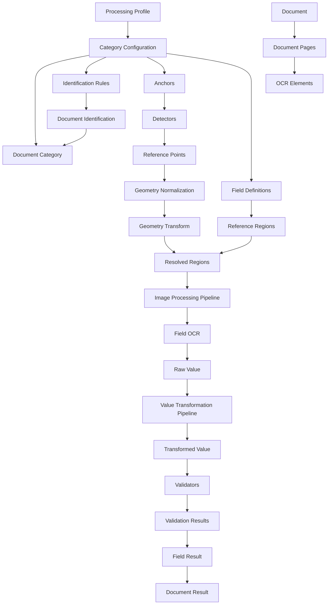

# Słownik domenowy systemu OCR

| Pole         | Wartość                        |
| ------------ | ------------------------------ |
| ID dokumentu | DOC-001                        |
| Tytuł        | Słownik domenowy               |
| Wersja       | 0.1                            |
| Status       | Draft                          |
| Typ          | Glossary / Ubiquitous Language |
| Zależności   | `01-vision.md`                 |

## 1. Cel dokumentu

Celem dokumentu jest zdefiniowanie spójnego języka domenowego używanego
w całym projekcie.

Nazwy zdefiniowane tutaj powinny być konsekwentnie stosowane w:

- dokumentacji,
- konfiguracji JSON,
- modelu domenowym,
- nazwach klas i interfejsów Java,
- API rozszerzeń,
- aplikacji JavaFX,
- aplikacji CLI,
- logach,
- komunikatach diagnostycznych,
- testach.

Jeżeli późniejszy dokument wprowadza pojęcie domenowe, które nie
występuje w tym słowniku, słownik powinien zostać odpowiednio
uzupełniony.

## 2. Konwencje nazewnicze

Dokumentacja opisowa może być prowadzona po polsku, natomiast nazwy
techniczne wykorzystywane w kodzie i konfiguracji powinny być
angielskie.

Przykład:

> **Kategoria dokumentu (Document Category)**

W dokumentacji można używać określenia „kategoria dokumentu", natomiast
w kodzie preferowana nazwa to `DocumentCategory`.

Nazwy przedstawione w sekcji **Nazwa techniczna** są rekomendowanymi
nazwami dla przyszłego modelu Java. Nie stanowią jeszcze wiążącej
specyfikacji klas.

---

# 3. Pojęcia podstawowe

## 3.1. Dokument (Document)

**Nazwa techniczna:** `Document`

Logiczna jednostka wejściowa podlegająca przetwarzaniu.

Dokument pochodzi z pojedynczego pliku wejściowego i może zawierać jedną
lub wiele stron.

Przykładowe formaty:

- PDF,
- TIFF,
- PNG,
- JPEG.

Dokument posiada co najmniej:

- źródłową nazwę pliku,
- typ/format,
- zbiór stron,
- identyfikator przetwarzania,
- wynik przetwarzania.

Dokument nie jest tym samym co pojedyncza strona ani obraz strony.

---

## 3.2. Plik źródłowy (Source File)

**Nazwa techniczna:** `SourceFile`

Fizyczny plik, z którego utworzono `Document`.

Plik źródłowy jest jednostką obsługi katalogów wejściowych i wynikowych.

Jeden plik źródłowy odpowiada jednemu dokumentowi przetwarzanemu przez
system.

---

## 3.3. Strona (Page)

**Nazwa techniczna:** `DocumentPage`

Pojedyncza strona dokumentu.

Strona posiada numer oraz reprezentację graficzną możliwą do przekazania
do OCR.

Numeracja użytkowa stron rozpoczyna się od `1`, chyba że szczegółowa
specyfikacja techniczna jawnie określi inaczej dla wewnętrznego API.

---

## 3.4. Obraz strony (Page Image)

**Nazwa techniczna:** `PageImage`

Rasteryzowana reprezentacja strony dokumentu.

Może być:

- bezpośrednio odczytana z PNG/JPEG/TIFF,
- wygenerowana przez rasteryzację strony PDF,
- wynikiem korekty orientacji,
- wynikiem dalszego przetwarzania obrazu.

`PageImage` nie zawiera semantyki OCR.

---

## 3.5. Kategoria dokumentu (Document Category)

**Nazwa techniczna:** `DocumentCategory`

Typ formularza lub dokumentu rozpoznawany przez system.

Kategoria opisuje:

- sposób identyfikacji dokumentu,
- zakres istotnych stron,
- punkty odniesienia,
- geometrię wzorcową,
- pola,
- pipeline'y pól,
- walidację,
- politykę uznania dokumentu za poprawnie przetworzony.

Przykłady:

```text
VAT_FORM
CUSTOMER_REGISTRATION
APPLICATION_X
```

Kategoria nie jest ustalana na podstawie nazwy pliku, chyba że w
przyszłości jawnie zostanie dodana taka reguła identyfikacji.

---

## 3.6. Konfiguracja kategorii (Category Configuration)

**Nazwa techniczna:** `CategoryConfiguration`

Deklaratywny opis jednej `DocumentCategory`.

Docelowo konfiguracja będzie zapisywana jako osobny plik JSON.

Konfiguracja kategorii jest danymi, a nie kodem aplikacji.

---

## 3.7. Profil przetwarzania (Processing Profile)

**Nazwa techniczna:** `ProcessingProfile`

Konfiguracja określająca zestaw kategorii i parametrów używanych podczas
konkretnego uruchomienia procesu.

Profil może określać między innymi:

- aktywne kategorie,
- lokalizację konfiguracji,
- parametry wykonania,
- ewentualne nadpisania konfiguracji.

Profil nie definiuje szczegółowo pól dokumentu. Te informacje należą do
`CategoryConfiguration`.

---

# 4. OCR i reprezentacja tekstu

## 4.1. OCR

**Nazwa techniczna:** `OcrEngine`

Proces optycznego rozpoznawania tekstu z obrazu.

Podstawowym silnikiem OCR projektu jest Tesseract.

Termin OCR może odnosić się zarówno do:

- OCR całej strony,
- OCR wybranego regionu.

---

## 4.2. OCR strony (Page OCR)

**Nazwa techniczna:** `PageOcr`

OCR wykonywany dla całej strony lub jej znaczącej części w celu
uzyskania tekstu wraz z geometrią.

Typowe zastosowania:

- identyfikacja kategorii,
- odnajdywanie kotwic tekstowych,
- budowa reprezentacji przestrzennej strony.

---

## 4.3. OCR pola (Field OCR)

**Nazwa techniczna:** `FieldOcr`

OCR wykonywany na wyizolowanym regionie pojedynczego pola.

Przed wykonaniem `FieldOcr` region może przejść dedykowany pipeline
przetwarzania obrazu.

---

## 4.4. hOCR

Format wyniku OCR zawierający tekst oraz informacje o jego położeniu na
stronie.

W systemie hOCR będzie jednym z podstawowych źródeł informacji o:

- słowach,
- liniach,
- blokach tekstu,
- bounding boxach.

---

## 4.5. Element OCR (OCR Element)

**Nazwa techniczna:** `OcrElement`

Pojedynczy element wynikający z analizy OCR posiadający tekst i
geometrię.

Może reprezentować np.:

- słowo,
- linię,
- blok.

Minimalne informacje:

```text
text
bounds
confidence
page
```

---

## 4.6. Pewność OCR (OCR Confidence)

**Nazwa techniczna:** `OcrConfidence`

Wartość określająca poziom pewności silnika OCR dla rozpoznanego
elementu, jeśli silnik udostępnia taką informację.

Nie należy utożsamiać jej z pewnością klasyfikacji dokumentu ani
wynikiem walidacji biznesowej.

---

# 5. Geometria dokumentu

## 5.1. Bounding Box

**Nazwa techniczna:** `BoundingBox`

Prostokątny obszar opisujący położenie elementu.

Typowo:

```text
x
y
width
height
```

lub równoważnie:

```text
left
top
right
bottom
```

Jedna reprezentacja zostanie wybrana w specyfikacji modelu domenowego.

---

## 5.2. Region

**Nazwa techniczna:** `Region`

Logiczny obszar strony.

Region może określać:

- miejsce wyszukiwania tekstu,
- miejsce oczekiwanego pola,
- fragment przekazywany do OCR,
- obszar wykorzystywany przez detektor.

Region jest pojęciem bardziej semantycznym niż `BoundingBox`.

---

## 5.3. Region wzorcowy (Reference Region)

**Nazwa techniczna:** `ReferenceRegion`

Region zdefiniowany w układzie współrzędnych dokumentu wzorcowego.

Przed użyciem na rzeczywistym skanie musi zostać przekształcony przez
transformację geometrii.

---

## 5.4. Region rzeczywisty (Resolved Region)

**Nazwa techniczna:** `ResolvedRegion`

Region wyliczony dla konkretnej strony konkretnego dokumentu po
zastosowaniu transformacji geometrii.

To właśnie ten region jest wycinany z obrazu i przekazywany do dalszego
przetwarzania.

---

## 5.5. Punkt odniesienia (Reference Point)

**Nazwa techniczna:** `ReferencePoint`

Rozpoznany na rzeczywistym dokumencie element o znanej roli
geometrycznej.

Może pochodzić z:

- tekstu,
- QR,
- kodu kreskowego,
- innego detektora.

Punkt odniesienia może zawierać więcej informacji niż pojedyncza
współrzędna, np.:

```text
id
type
bounds
center
rotation
confidence
detectedValue
```

---

## 5.6. Kotwica (Anchor)

**Nazwa techniczna:** `Anchor`

Semantyczny punkt odniesienia używany do lokalizacji pola lub innego
elementu dokumentu.

Przykład:

Tekst `PESEL` może być kotwicą dla pola zawierającego numer PESEL
znajdującego się 120 pikseli na prawo od napisu.

### Relacja Anchor vs Reference Point

W tym projekcie przyjmujemy rozróżnienie:

- `Anchor` -- element **zdefiniowany w konfiguracji**,
- `ReferencePoint` -- **rzeczywisty wynik wykrycia** tej kotwicy na
  konkretnym dokumencie.

Przykład:

```text
Anchor definition:
  id = "pesel-label"
  detector = TEXT
  expectedValue = "PESEL"

Detected ReferencePoint:
  anchorId = "pesel-label"
  bounds = ...
  confidence = ...
```

---

## 5.7. Geometria wzorcowa (Reference Geometry)

**Nazwa techniczna:** `ReferenceGeometry`

Układ geometryczny zapisany w konfiguracji kategorii, względem którego
definiowane są położenia kotwic i pól.

Reprezentuje oczekiwany układ formularza.

---

## 5.8. Geometria dokumentu (Document Geometry)

**Nazwa techniczna:** `DocumentGeometry`

Geometria ustalona dla konkretnego dokumentu na podstawie wykrytych
punktów odniesienia.

Opisuje relację pomiędzy dokumentem wzorcowym a rzeczywistym skanem.

---

## 5.9. Transformacja geometrii (Geometry Transform)

**Nazwa techniczna:** `GeometryTransform`

Transformacja przeliczająca współrzędne wzorcowe na współrzędne
rzeczywistego dokumentu.

Minimalnie powinna uwzględniać:

- translację,
- skalowanie,
- rotację.

Dokładny model matematyczny zostanie określony w dokumencie dotyczącym
pipeline'u i geometrii.

---

## 5.10. Normalizacja geometrii (Geometry Normalization)

**Nazwa techniczna:** `GeometryNormalization`

Etap procesu, podczas którego na podstawie punktów odniesienia
wyznaczana jest `GeometryTransform`.

Normalizacja nie oznacza koniecznie fizycznego przeskalowania całego
obrazu. Może polegać wyłącznie na wyznaczeniu transformacji
współrzędnych.

---

## 5.11. Orientacja (Orientation)

**Nazwa techniczna:** `PageOrientation`

Orientacja strony względem oczekiwanego kierunku czytania.

Podstawowe wartości:

```text
0°
90°
180°
270°
```

---

## 5.12. Deskew

Korekta niewielkiego pochylenia skanu, np. o kilka stopni.

Deskew należy odróżnić od korekty orientacji o 90°, 180° lub 270°.

---

# 6. Identyfikacja kategorii

## 6.1. Identyfikacja dokumentu (Document Identification)

**Nazwa techniczna:** `DocumentIdentification`

Etap ustalający kategorię dokumentu.

Rezultatem powinien być wynik identyfikacji, a nie bezpośrednio sama
kategoria.

---

## 6.2. Reguła identyfikacji (Identification Rule)

**Nazwa techniczna:** `IdentificationRule`

Pojedynczy warunek używany podczas identyfikacji kategorii.

Przykłady:

- tekst występuje na stronie,
- tekst występuje w regionie,
- QR posiada określoną wartość,
- wartość pasuje do wzorca.

---

## 6.3. Grupa identyfikacyjna (Identification Rule Group)

**Nazwa techniczna:** `IdentificationRuleGroup`

Grupa reguł, które muszą zostać spełnione łącznie.

Semantycznie grupa reprezentuje `AND`.

Kilka grup może stanowić alternatywy `OR`.

Przykład:

```text
(A AND B)
OR
(C AND D AND E)
```

---

## 6.4. Matcher

**Nazwa techniczna:** `Matcher`

Strategia porównania wartości rzeczywistej z oczekiwaną.

Matcher nie wyszukuje elementu samodzielnie. Określa, czy dwie wartości
należy uznać za zgodne.

---

## 6.5. Exact Match

**Nazwa techniczna:** `ExactMatcher`

Dopasowanie wymagające dokładnej zgodności.

---

## 6.6. Normalized Match

**Nazwa techniczna:** `NormalizedMatcher`

Dopasowanie wykonywane po ustalonej normalizacji tekstu, np. usunięciu
nadmiarowych białych znaków lub zmianie wielkości liter.

---

## 6.7. Fuzzy Match

**Nazwa techniczna:** `FuzzyMatcher`

Dopasowanie tolerujące błędy OCR.

Próg tolerancji jest parametrem konfiguracji.

Algorytm fuzzy matching nie jest jeszcze ustalony.

---

## 6.8. Wynik identyfikacji (Identification Result)

**Nazwa techniczna:** `IdentificationResult`

Wynik próby przypisania dokumentu do kategorii.

Powinien umożliwiać rozróżnienie co najmniej:

```text
MATCHED
NOT_MATCHED
AMBIGUOUS
ERROR
```

Powinien również zawierać informacje diagnostyczne o spełnionych i
niespełnionych regułach.

---

# 7. Detekcja elementów odniesienia

## 7.1. Detektor (Detector)

**Nazwa techniczna:** `Detector`

Komponent wyszukujący określony rodzaj elementu w obrazie lub danych
OCR.

Detektor zwraca jeden lub więcej wyników posiadających geometrię.

---

## 7.2. Detektor tekstu (Text Detector)

**Nazwa techniczna:** `TextDetector`

Detektor wykorzystujący wynik OCR/hOCR do znalezienia tekstowej kotwicy.

---

## 7.3. Detektor QR (QR Detector)

**Nazwa techniczna:** `QrDetector`

Detektor kodów QR.

Powinien, jeśli pozwala na to biblioteka bazowa, zwracać:

- zawartość,
- położenie,
- rozmiar,
- punkty charakterystyczne,
- orientację/rotację,
- confidence lub analogiczną informację, jeśli dostępna.

---

## 7.4. Detektor kodów kreskowych (Barcode Detector)

**Nazwa techniczna:** `BarcodeDetector`

Detektor kodów kreskowych.

Może służyć zarówno do identyfikacji dokumentu, jak i jako źródło punktu
odniesienia.

---

# 8. Ekstrakcja danych

## 8.1. Pole (Field)

**Nazwa techniczna:** `FieldDefinition`

Definicja wartości biznesowej, którą system ma pozyskać z dokumentu.

Przykłady:

```text
firstName
lastName
pesel
nip
regon
customerNumber
```

Pole jest definicją konfiguracyjną, a nie wynikiem ekstrakcji.

---

## 8.2. Pole wymagane (Required Field)

Pole, którego brak lub niepoprawność może -- zgodnie z polityką
kategorii -- spowodować uznanie całego dokumentu za błędnie
przetworzony.

Dokładna semantyka zostanie określona w wymaganiach funkcjonalnych.

---

## 8.3. Ekstrakcja pola (Field Extraction)

**Nazwa techniczna:** `FieldExtraction`

Proces uzyskania wartości pojedynczego pola.

Może obejmować:

```text
resolve region
→ crop image
→ image processing
→ OCR
→ text transformation
→ validation
```

---

## 8.4. Wynik pola (Field Result)

**Nazwa techniczna:** `FieldResult`

Kompletny rezultat przetwarzania jednego pola.

Powinien umożliwiać przechowywanie między innymi:

- identyfikatora pola,
- surowego wyniku OCR,
- wartości po transformacjach,
- statusu ekstrakcji,
- wyników walidacji,
- informacji diagnostycznych.

---

## 8.5. Wartość surowa (Raw Value)

**Nazwa techniczna:** `RawValue`

Tekst zwrócony bezpośrednio przez OCR pola przed wykonaniem
transformacji tekstowych.

---

## 8.6. Wartość przetworzona (Transformed Value)

**Nazwa techniczna:** `TransformedValue`

Wartość po wykonaniu pipeline'u transformacji, ale przed lub niezależnie
od wyniku walidacji.

To ona jest podstawowym kandydatem do eksportu jako wartość biznesowa.

---

# 9. Pipeline

## 9.1. Pipeline

Uporządkowana sekwencja etapów przetwarzania.

W systemie występują pipeline'y na różnych poziomach.

---

## 9.2. Pipeline dokumentu (Document Pipeline)

**Nazwa techniczna:** `DocumentPipeline`

Wysokopoziomowy przebieg przetwarzania całego dokumentu.

Przykładowo:

```text
load
→ orientation
→ page OCR
→ identification
→ reference detection
→ geometry normalization
→ field extraction
→ validation
→ result
```

Kolejność głównych faz jest kontrolowana przez system.

---

## 9.3. Pipeline obrazu pola (Image Processing Pipeline)

**Nazwa techniczna:** `ImageProcessingPipeline`

Konfigurowalna sekwencja operacji wykonywanych na obrazie regionu pola
przed OCR.

---

## 9.4. Pipeline transformacji wartości (Value Transformation Pipeline)

**Nazwa techniczna:** `ValueTransformationPipeline`

Konfigurowalna sekwencja transformacji wykonywanych na tekście zwróconym
przez OCR.

---

## 9.5. Krok pipeline'u (Pipeline Step)

**Nazwa techniczna:** `PipelineStep`

Pojedyncza operacja w konfigurowalnym pipeline.

Krok posiada:

- typ,
- parametry,
- kolejność wynikającą z pozycji na liście.

---

# 10. Przetwarzanie obrazu

## 10.1. Image Processor

**Nazwa techniczna:** `ImageProcessor`

Rozszerzenie wykonujące pojedynczą operację na obrazie.

Kontrakt koncepcyjny:

```text
input image + parameters
→ output image
```

Image Processor nie powinien znać semantyki biznesowej pola.

---

## 10.2. Usuwanie ramek (Box Removal)

Operacja usuwająca linie/kratki formularza otaczające pojedyncze znaki
lub wartości.

---

## 10.3. Kondensacja zawartości (Content Condensation)

Operacja zmniejszająca niepotrzebne odstępy pomiędzy fragmentami
zawartości po usunięciu ramek lub pustych obszarów.

Celem jest przygotowanie obrazu bardziej odpowiedniego dla OCR.

Nazwa techniczna algorytmu zostanie ustalona po jego zaprojektowaniu.

---

## 10.4. Crop

Wycięcie z obrazu regionu określonego przez `ResolvedRegion`.

---

# 11. Transformacje tekstu

## 11.1. Value Transformer

**Nazwa techniczna:** `ValueTransformer`

Rozszerzenie wykonujące pojedynczą transformację tekstu.

Koncepcyjny kontrakt:

```text
input value + parameters
→ transformed value
```

---

## 11.2. Substring Transformer

**Nazwa techniczna:** `SubstringTransformer`

Transformacja wybierająca określony fragment tekstu.

Przykład:

```text
"1234567890123"
→ substring(0, 11)
→ "12345678901"
```

---

## 11.3. Trim Transformer

**Nazwa techniczna:** `TrimTransformer`

Usuwa zbędne białe znaki na początku i końcu wartości.

---

## 11.4. Normalization Transformer

**Nazwa techniczna:** `NormalizationTransformer`

Transformacja normalizująca tekst zgodnie z określonym zestawem reguł.

Dokładny zakres normalizacji musi być jawnie konfigurowany lub określony
przez konkretną implementację transformera.

---

# 12. Walidacja

## 12.1. Validator

**Nazwa techniczna:** `Validator`

Rozszerzenie sprawdzające poprawność wartości.

Koncepcyjny kontrakt:

```text
value + parameters
→ ValidationResult
```

Validator co do zasady nie powinien modyfikować wartości.

---

## 12.2. Wynik walidacji (Validation Result)

**Nazwa techniczna:** `ValidationResult`

Rezultat pojedynczej walidacji.

Powinien zawierać co najmniej:

```text
status
validatorId
message
```

Opcjonalnie może zawierać dodatkowe dane diagnostyczne.

---

## 12.3. Status walidacji (Validation Status)

**Nazwa techniczna:** `ValidationStatus`

Minimalny zestaw stanów:

```text
VALID
INVALID
NOT_VALIDATED
ERROR
```

`INVALID` oznacza, że walidator wykonał się poprawnie, ale wartość nie
spełnia reguły.

`ERROR` oznacza problem podczas samego wykonania walidacji.

---

## 12.4. Walidator PESEL (PESEL Validator)

**Nazwa techniczna:** `PeselValidator`

Waliduje numer PESEL zgodnie z regułami określonymi w późniejszej
specyfikacji walidatorów.

---

## 12.5. Walidator NIP (NIP Validator)

**Nazwa techniczna:** `NipValidator`

Waliduje polski numer NIP.

---

## 12.6. Walidator REGON (REGON Validator)

**Nazwa techniczna:** `RegonValidator`

Waliduje numer REGON.

---

## 12.7. Walidator słownikowy (Dictionary Validator)

**Nazwa techniczna:** `DictionaryValidator`

Sprawdza, czy wartość znajduje się w określonym słowniku.

Przykładowe zastosowanie: słownik imion.

---

# 13. Rozszerzenia

## 13.1. Rozszerzenie (Extension)

**Nazwa techniczna:** `Extension`

Implementacja jednego z przewidzianych punktów rozszerzeń systemu.

Przykładowe rodziny:

- `Detector`,
- `ImageProcessor`,
- `ValueTransformer`,
- `Validator`,
- `Matcher`.

Termin „plugin" może być używany potocznie, ale `Extension` jest
preferowanym terminem domenowo-technicznym.

---

## 13.2. Extension API

**Nazwa techniczna:** `Extension API`

Zestaw stabilnych interfejsów umożliwiających implementowanie rozszerzeń
bez uzależniania ich od JavaFX lub CLI.

---

## 13.3. Standard Extension

Rozszerzenie dostarczane razem z systemem.

Przykład:

```text
PeselValidator
SubstringTransformer
TextDetector
```

---

## 13.4. Custom Extension

Rozszerzenie dostarczone dodatkowo dla konkretnego wdrożenia lub
zastosowania.

Mechanizm dynamicznego ładowania z zewnętrznych JAR-ów pozostaje decyzją
otwartą.

---

# 14. Przetwarzanie wsadowe

## 14.1. Batch

**Nazwa techniczna:** `Batch`

Zbiór dokumentów przetwarzanych w ramach jednego uruchomienia CLI.

Batch nie oznacza, że wszystkie dokumenty są ładowane jednocześnie do
pamięci.

---

## 14.2. Batch Processor

**Nazwa techniczna:** `BatchProcessor`

Komponent wysokiego poziomu odpowiedzialny za wykonanie wsadu.

Nie realizuje bezpośrednio OCR ani ekstrakcji.

---

## 14.3. Dispatcher

**Nazwa techniczna:** `DocumentDispatcher`

Komponent przydzielający dokumenty do workerów.

Odpowiada za organizację pracy, a nie za logikę domenową przetwarzania
dokumentu.

---

## 14.4. Worker

**Nazwa techniczna:** `DocumentWorker`

Jednostka wykonawcza pobierająca dokument i przekazująca go do
`DocumentProcessor`.

Liczba workerów jest konfigurowalna.

---

## 14.5. Document Processor

**Nazwa techniczna:** `DocumentProcessor`

Centralny komponent wspólnego rdzenia odpowiedzialny za przetworzenie
pojedynczego dokumentu.

Koncepcyjny kontrakt:

```text
Document + ProcessingContext
→ DocumentResult
```

Powinien być bezstanowy względem innych dokumentów.

---

## 14.6. Processing Context

**Nazwa techniczna:** `ProcessingContext`

Niemutowalny lub kontrolowany kontekst potrzebny do przetworzenia
dokumentu.

Może zawierać:

- profil,
- aktywne konfiguracje kategorii,
- dostęp do usług OCR,
- rejestr rozszerzeń,
- parametry techniczne.

Nie powinien zawierać przypadkowego współdzielonego stanu pojedynczych
dokumentów.

---

# 15. Wyniki przetwarzania

## 15.1. Document Result

**Nazwa techniczna:** `DocumentResult`

Kompletny wynik przetwarzania jednego dokumentu.

Powinien zawierać co najmniej:

- identyfikację dokumentu,
- ustaloną kategorię,
- status,
- wyniki pól,
- błędy/ostrzeżenia,
- dane diagnostyczne,
- identyfikator lub wersję użytej konfiguracji.

---

## 15.2. Processing Status

**Nazwa techniczna:** `ProcessingStatus`

Końcowy status przetwarzania dokumentu.

Wstępnie:

```text
SUCCESS
FAILED
```

Możliwe jest późniejsze rozszerzenie np. o `SUCCESS_WITH_WARNINGS`,
jeśli wymagania funkcjonalne wykażą taką potrzebę.

---

## 15.3. Processing Error

**Nazwa techniczna:** `ProcessingError`

Ustrukturyzowana informacja o problemie powstałym podczas przetwarzania.

Powinna zawierać co najmniej:

```text
code
message
stage
```

Opcjonalnie:

```text
fieldId
page
extensionId
technicalCause
```

---

## 15.4. Error Code

**Nazwa techniczna:** `ErrorCode`

Stabilny kod maszynowy reprezentujący klasę problemu.

Przykłady:

```text
CATEGORY_NOT_FOUND
CATEGORY_AMBIGUOUS
REFERENCE_POINT_NOT_FOUND
REQUIRED_FIELD_NOT_FOUND
FIELD_VALIDATION_FAILED
OCR_FAILED
INVALID_CONFIGURATION
UNSUPPORTED_DOCUMENT
```

Tekst komunikatu może się zmieniać. Kod błędu powinien pozostawać
stabilny.

---

## 15.5. Warning

**Nazwa techniczna:** `ProcessingWarning`

Problem lub nietypowa sytuacja, która nie musi powodować niepowodzenia
całego dokumentu.

Przykład:

- opcjonalne pole nie zostało znalezione,
- użyto mniej punktów odniesienia niż preferowano,
- OCR zwrócił niskie confidence.

---

# 16. Katalogi procesu

## 16.1. Input Directory

Katalog zawierający dokumenty oczekujące na przetworzenie.

---

## 16.2. Processing Directory

Opcjonalny katalog lub równoważny mechanizm oznaczający, że plik został
przejęty do przetwarzania.

Jego celem jest ograniczenie ryzyka wielokrotnego przetworzenia tego
samego pliku.

---

## 16.3. Success Directory

Katalog docelowy dla dokumentów zakończonych sukcesem.

---

## 16.4. Error Directory

Katalog docelowy dla dokumentów zakończonych błędem.

Dokumenty z tego katalogu mogą zostać ponownie przetworzone po zmianie
konfiguracji.

---

# 17. Konfiguracja i wersjonowanie

## 17.1. Configuration ID

**Nazwa techniczna:** `ConfigurationId`

Stabilny identyfikator konfiguracji kategorii.

Nie powinien zależeć wyłącznie od nazwy pliku.

---

## 17.2. Configuration Version

**Nazwa techniczna:** `ConfigurationVersion`

Jawna wersja konfiguracji kategorii.

Umożliwia ustalenie, która wersja reguł została użyta podczas
przetwarzania.

---

## 17.3. Configuration Hash

**Nazwa techniczna:** `ConfigurationHash`

Opcjonalny skrót zawartości konfiguracji pozwalający jednoznacznie
wskazać faktycznie użyty wariant konfiguracji.

Może być szczególnie użyteczny, gdy konfiguracja jest wersjonowana w
Git, ale plik został lokalnie zmodyfikowany.

---

# 18. Aplikacja konfiguracyjna

## 18.1. Configurator

**Nazwa techniczna:** `Configurator`

Aplikacja JavaFX służąca do tworzenia, edycji, testowania i zapisywania
konfiguracji kategorii.

---

## 18.2. Dokument wzorcowy (Reference Document)

**Nazwa techniczna:** `ReferenceDocument`

Przykładowy dokument używany podczas przygotowania konfiguracji
kategorii.

Nie oznacza on, że wszystkie przyszłe dokumenty muszą być pikselowo
identyczne.

Służy do zdefiniowania geometrii wzorcowej i pierwszej wersji reguł.

---

## 18.3. Test konfiguracji (Configuration Test)

**Nazwa techniczna:** `ConfigurationTest`

Interaktywne uruchomienie konfiguracji na wskazanym dokumencie bez
wykonywania pełnego produkcyjnego wsadu.

---

## 18.4. Zbiór walidacyjny konfiguracji (Configuration Validation Set)

**Nazwa techniczna:** `ConfigurationValidationSet`

Zbiór przykładowych dokumentów wykorzystywany przez analityka do
sprawdzenia, czy konfiguracja działa na więcej niż jednym
reprezentatywnym skanie.

Nie należy mylić tego terminu z walidacją wartości pola.

---

# 19. Terminy dotyczące jakości

## 19.1. Confidence

Ogólne określenie poziomu pewności zwracanego przez konkretny algorytm.

Każdy confidence musi mieć jasno określone źródło.

Przykładowo:

- `ocrConfidence`,
- `detectionConfidence`,
- w przyszłości `classificationConfidence`.

Nie należy wprowadzać jednego globalnego `confidence`, którego znaczenie
zależy od kontekstu.

---

## 19.2. Valid

Oznacza zgodność wartości z określonym walidatorem.

`VALID` nie oznacza automatycznie, że OCR odczytał wartość zgodnie z
rzeczywistym dokumentem. Oznacza jedynie, że wartość spełnia reguły
walidatora.

---

## 19.3. Successfully Processed

Dokument, który spełnił politykę sukcesu określoną przez system i
konfigurację.

Szczegółowa definicja sukcesu zostanie ustalona w wymaganiach
funkcjonalnych.

---

# 20. Rozróżnienia krytyczne

Poniższych pojęć nie należy stosować zamiennie.

| Pojęcie A         | Pojęcie B              | Różnica                                                                   |
| ----------------- | ---------------------- | ------------------------------------------------------------------------- |
| Document          | Page                   | Dokument może posiadać wiele stron.                                       |
| Document Category | Category Configuration | Pierwsze jest pojęciem domenowym, drugie jego deklaratywną konfiguracją.  |
| Anchor            | Reference Point        | Anchor jest definicją; Reference Point jest wykrytym wystąpieniem.        |
| Reference Region  | Resolved Region        | Pierwszy jest wzorcowy; drugi wyliczony dla konkretnego skanu.            |
| Orientation       | Deskew                 | Orientation dotyczy głównych obrotów strony; deskew małego pochylenia.    |
| OCR Confidence    | Validation Status      | Pierwsze pochodzi z OCR; drugie z reguł biznesowych.                      |
| Raw Value         | Transformed Value      | Pierwsza pochodzi bezpośrednio z OCR; druga po transformacjach.           |
| Transformer       | Validator              | Transformer zmienia wartość; Validator ją ocenia.                         |
| Detector          | Matcher                | Detector wyszukuje element; Matcher porównuje wartości.                   |
| Identification    | Extraction             | Identification ustala kategorię; Extraction pozyskuje pola.               |
| Batch Processor   | Document Processor     | Pierwszy organizuje wsad; drugi przetwarza pojedynczy dokument.           |
| Error             | Warning                | Error może zakończyć przetwarzanie; warning jest informacją niekrytyczną. |

---

# 21. Ubiquitous Language -- skrócona mapa



# 22. Preferowane nazewnictwo w kodzie

Poniższa lista stanowi punkt wyjścia dla przyszłego modelu:

```text
Document
DocumentPage
PageImage

DocumentCategory
CategoryConfiguration
ProcessingProfile

OcrEngine
OcrElement
OcrResult

BoundingBox
Region
ReferenceRegion
ResolvedRegion

Anchor
ReferencePoint
ReferenceGeometry
DocumentGeometry
GeometryTransform

IdentificationRule
IdentificationRuleGroup
IdentificationResult

Detector
TextDetector
QrDetector
BarcodeDetector

Matcher
ExactMatcher
NormalizedMatcher
FuzzyMatcher

FieldDefinition
FieldResult

ImageProcessor
ValueTransformer
Validator
ValidationResult

DocumentProcessor
ProcessingContext
DocumentResult

BatchProcessor
DocumentDispatcher
DocumentWorker

ProcessingError
ProcessingWarning
ErrorCode
ProcessingStatus

Extension
ExtensionRegistry
```

Nazwy te powinny zostać zweryfikowane podczas tworzenia
`05-domain-model.md`.

# 23. Terminy, których należy unikać

## Template

Termin może być niejednoznaczny: może oznaczać dokument wzorcowy,
kategorię albo konfigurację. Preferowane są bardziej precyzyjne
określenia:

- `ReferenceDocument`,
- `DocumentCategory`,
- `CategoryConfiguration`.

## Plugin

W dokumentacji domenowej preferujemy `Extension`.

`Plugin` może zostać użyty później jako termin techniczny, jeżeli
rzeczywiście zostanie wdrożone dynamiczne ładowanie modułów.

## Anchor Point

Preferujemy rozdzielenie:

- `Anchor` -- definicja,
- `ReferencePoint` -- wykrycie.

## Valid Document

Termin jest zbyt nieprecyzyjny.

Należy określić, czy chodzi o:

- poprawny format pliku,
- poprawnie rozpoznaną kategorię,
- poprawną ekstrakcję,
- poprawną walidację pól,
- końcowy `ProcessingStatus.SUCCESS`.

# 24. Otwarte kwestie terminologiczne

Do rozstrzygnięcia podczas dalszego projektowania pozostają:

1.  Czy `ReferencePoint` powinien zostać zastąpiony bardziej ogólnym
    `ReferenceFeature`, ponieważ QR i tekst mają geometrię większą niż
    pojedynczy punkt.
2.  Czy wynik klasyfikacji powinien posiadać liczbowy
    `classificationConfidence`.
3.  Czy `ProcessingStatus` powinien od początku posiadać
    `SUCCESS_WITH_WARNINGS`.
4.  Czy potrzebny jest osobny termin dla polityki określającej, które
    błędy pól powodują błąd całego dokumentu.
5.  Czy `FieldDefinition` powinno pozostać nazwą techniczną, czy
    preferowane będzie krótsze `Field`.
6.  Czy regiony powinny używać pikseli, wartości względnych czy
    abstrakcyjnego układu współrzędnych dokumentu wzorcowego.

Kwestie te nie blokują przygotowania wymagań funkcjonalnych.

# 25. Reguła utrzymania słownika

Każdy nowy istotny termin domenowy wprowadzony w późniejszych
dokumentach powinien:

1.  posiadać jednoznaczną definicję,
2.  posiadać preferowaną nazwę angielską,
3.  nie kolidować znaczeniowo z istniejącymi pojęciami,
4.  zostać dodany do niniejszego dokumentu,
5.  być konsekwentnie używany w kolejnych dokumentach i kodzie.

# 26. Następny dokument

Po zaakceptowaniu słownika rekomendowanym następnym dokumentem jest:

**`03-functional-requirements.md` -- Wymagania funkcjonalne**

Powinien on opisać wymagania systemu z identyfikatorami pozwalającymi
później powiązać:

```text
wymaganie
→ komponent architektury
→ przypadek testowy
→ implementację
```

Przykładowa konwencja:

```text
FR-DOC-001
FR-OCR-001
FR-ID-001
FR-GEO-001
FR-EXT-001
FR-VAL-001
FR-BATCH-001
FR-CFG-001
```
