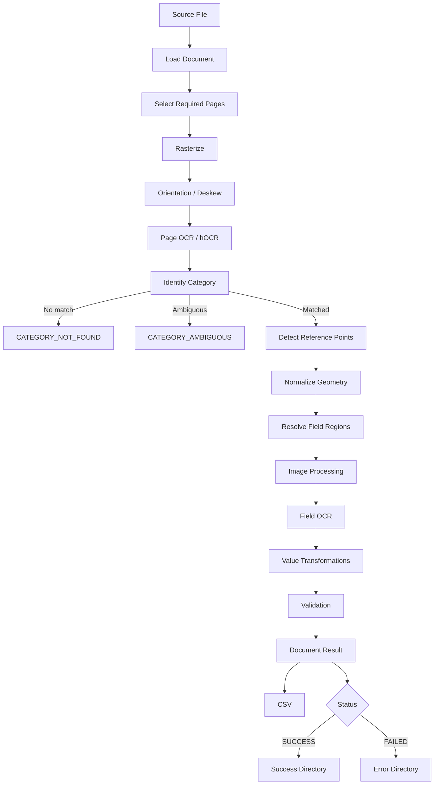
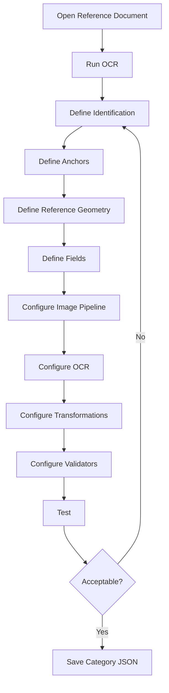

# Wymagania funkcjonalne

| Pole          | Wartość                            |
| ------------- | ---------------------------------- |
| ID dokumentu  | DOC-003                            |
| Tytuł         | Wymagania funkcjonalne             |
| Wersja        | 0.1                                |
| Status        | Draft                              |
| Typ           | Functional Requirements            |
| Źródło prawdy | Repozytorium dokumentacji projektu |
| Zależności    | `01-vision.md`, `02-glossary.md`   |

## 1. Cel dokumentu

Dokument definiuje wymagania funkcjonalne systemu OCR do konfigurowalnej
identyfikacji kategorii dokumentów oraz ekstrakcji, transformacji i
walidacji danych. Wymagania opisują **co system ma realizować**,
pozostawiając szczegóły implementacyjne dokumentom architektonicznym.

## 2. Konwencja

Identyfikatory wymagań:

- `FR-DOC-*` --- dokumenty i strony
- `FR-ORI-*` --- orientacja i przygotowanie obrazu
- `FR-OCR-*` --- OCR
- `FR-ID-*` --- identyfikacja kategorii
- `FR-REF-*` --- kotwice i punkty odniesienia
- `FR-GEO-*` --- geometria
- `FR-FLD-*` --- pola i ekstrakcja
- `FR-IMG-*` --- przetwarzanie obrazu
- `FR-TRN-*` --- transformacje wartości
- `FR-VAL-*` --- walidacja
- `FR-EXT-*` --- rozszerzenia
- `FR-CFG-*` --- konfiguracja kategorii
- `FR-PRF-*` --- profile
- `FR-GUI-*` --- Configurator JavaFX
- `FR-BATCH-*` --- batch
- `FR-CLI-*` --- CLI
- `FR-FS-*` --- operacje plikowe
- `FR-OUT-*` --- wyniki
- `FR-ERR-*` --- błędy i diagnostyka

Priorytety: **MUST** --- obowiązkowe; **SHOULD** --- istotne, ale
możliwe do odłożenia; **MAY** --- opcjonalne/przyszłościowe.

## 3. Dokumenty i strony

### FR-DOC-001 --- Obsługiwane formaty

**Priorytet:** MUST

System musi obsługiwać PDF, TIFF, PNG oraz JPEG/JPG.

### FR-DOC-002 --- Dokumenty wielostronicowe

**Priorytet:** MUST

System musi obsługiwać dokumenty jedno- i wielostronicowe.

### FR-DOC-003 --- Niezależność dokumentów

**Priorytet:** MUST

Każdy dokument musi być niezależną jednostką przetwarzania. Błąd jednego
dokumentu nie może zatrzymać całego wsadu.

### FR-DOC-004 --- Adresowanie stron

**Priorytet:** MUST

Konfiguracja musi umożliwiać jednoznaczne wskazanie stron dokumentu.

### FR-DOC-005 --- Zakres stron kategorii

**Priorytet:** MUST

Kategoria musi umożliwiać określenie pojedynczej strony, zakresu stron
lub wszystkich stron wymaganych do jej obsługi.

### FR-DOC-006 --- Minimalizacja OCR stron

**Priorytet:** MUST

Dla aktywnych kategorii system powinien przetwarzać wyłącznie strony
potencjalnie potrzebne do identyfikacji lub ekstrakcji. Nie powinien
OCR-ować stron dalszych niż maksymalny zakres wymagany przez aktywne
kategorie.

## 4. Przygotowanie i orientacja strony

### FR-ORI-001 --- Rasteryzacja PDF

**Priorytet:** MUST

System musi rasteryzować strony PDF do obrazów odpowiednich dla OCR.
Przyjętą biblioteką PDF jest **Apache PDFBox**.

### FR-ORI-002 --- Korekta orientacji

**Priorytet:** MUST

System musi obsługiwać wykrywanie i korektę orientacji 0°, 90°, 180° i
270°.

### FR-ORI-003 --- Konfigurowalność orientacji

**Priorytet:** MUST

Automatyczna detekcja/korekta orientacji musi być możliwa do włączenia
lub wyłączenia.

### FR-ORI-004 --- Diagnostyka orientacji

**Priorytet:** SHOULD

System powinien zapisywać wykrytą orientację i wykonaną korektę.

### FR-ORI-005 --- Deskew

**Priorytet:** SHOULD

System powinien umożliwiać korektę niewielkiego pochylenia skanu.

## 5. OCR

### FR-OCR-001 --- Tesseract

**Priorytet:** MUST

Podstawowym silnikiem OCR musi być Tesseract.

### FR-OCR-002 --- hOCR

**Priorytet:** MUST

System musi umożliwiać OCR dostarczający tekst wraz z geometrią;
podstawową reprezentacją będzie hOCR.

### FR-OCR-003 --- Wewnętrzny model OCR

**Priorytet:** MUST

hOCR musi być przekształcany do wewnętrznego modelu zawierającego co
najmniej tekst, bounding box, stronę i confidence, jeśli jest dostępne.

### FR-OCR-004 --- OCR strony

**Priorytet:** MUST

System musi umożliwiać OCR całej strony dla klasyfikacji i wykrywania
kotwic.

### FR-OCR-005 --- OCR regionu

**Priorytet:** MUST

System musi umożliwiać osobny OCR wybranego regionu pola.

### FR-OCR-006 --- OCR przetworzonego regionu

**Priorytet:** MUST

OCR pola musi działać na obrazie po opcjonalnym
`ImageProcessingPipeline`.

### FR-OCR-007 --- Parametry per pole

**Priorytet:** SHOULD

Pole powinno umożliwiać konfigurację parametrów Tesseracta istotnych dla
rozpoznania danej wartości.

## 6. Identyfikacja kategorii

### FR-ID-001 --- Identyfikacja przed ekstrakcją

**Priorytet:** MUST

Kategoria musi zostać ustalona przed ekstrakcją pól zależnych od
kategorii.

### FR-ID-002 --- Reguły per kategoria

**Priorytet:** MUST

Każda konfiguracja kategorii musi posiadać własne reguły identyfikacji.

### FR-ID-003 --- Tekst na stronie

**Priorytet:** MUST

Reguła musi umożliwiać sprawdzenie wystąpienia tekstu na wskazanej
stronie.

### FR-ID-004 --- Tekst w regionie

**Priorytet:** MUST

Reguła musi umożliwiać sprawdzenie wystąpienia tekstu w określonym
regionie.

### FR-ID-005 --- AND

**Priorytet:** MUST

System musi umożliwiać grupy warunków o semantyce `A AND B AND C`.

### FR-ID-006 --- OR

**Priorytet:** MUST

System musi umożliwiać alternatywne grupy: `(A AND B) OR (C AND D)`.

### FR-ID-007 --- Exact matching

**Priorytet:** MUST

Musi być dostępne dokładne dopasowanie tekstu.

### FR-ID-008 --- Normalized matching

**Priorytet:** MUST

Musi być dostępne dopasowanie po normalizacji tekstu.

### FR-ID-009 --- Fuzzy matching

**Priorytet:** MUST

Musi być dostępne dopasowanie tolerujące błędy OCR, z konfigurowalnym
progiem.

### FR-ID-010 --- QR

**Priorytet:** MUST

Zawartość QR musi móc uczestniczyć w identyfikacji kategorii.

### FR-ID-011 --- Barcode

**Priorytet:** SHOULD

Zawartość kodu kreskowego powinna móc uczestniczyć w identyfikacji.

### FR-ID-012 --- Brak kategorii

**Priorytet:** MUST

Brak dopasowania musi skutkować kontrolowanym wynikiem
`CATEGORY_NOT_FOUND`.

### FR-ID-013 --- Niejednoznaczność

**Priorytet:** MUST

Wielokrotne dopasowanie bez jednoznacznego rozstrzygnięcia musi
skutkować `CATEGORY_AMBIGUOUS`.

### FR-ID-014 --- Diagnostyka

**Priorytet:** MUST

Wynik identyfikacji musi wskazywać sprawdzone oraz
spełnione/niespełnione reguły.

## 7. Kotwice i punkty odniesienia

### FR-REF-001 --- Wiele kotwic

**Priorytet:** MUST

Kategoria musi obsługiwać wiele kotwic.

### FR-REF-002 --- Kotwica tekstowa

**Priorytet:** MUST

Kotwica może być wykrywana na podstawie OCR/hOCR.

### FR-REF-003 --- Kotwica QR

**Priorytet:** MUST

QR może być kotwicą geometryczną.

### FR-REF-004 --- Kotwica barcode

**Priorytet:** SHOULD

Kod kreskowy powinien móc być kotwicą geometryczną.

### FR-REF-005 --- Geometria detekcji

**Priorytet:** MUST

Detektor musi zwracać geometrię wystarczającą do normalizacji: zależnie
od typu m.in. bounds, center, characteristic points, rotation i size.

### FR-REF-006 --- Wartość detekcji

**Priorytet:** MUST

Detektor powinien zwracać rozpoznaną wartość, jeśli obiekt ją posiada.

### FR-REF-007 --- Kotwica wymagana/opcjonalna

**Priorytet:** MUST

Konfiguracja musi rozróżniać kotwice wymagane i opcjonalne.

### FR-REF-008 --- Brak kotwicy

**Priorytet:** MUST

Brak wymaganej kotwicy musi generować ustrukturyzowany błąd.

## 8. Normalizacja geometrii

### FR-GEO-001 --- Osobna faza

**Priorytet:** MUST

Normalizacja geometrii musi występować po identyfikacji i przed
ekstrakcją pól.

### FR-GEO-002 --- Geometria wzorcowa

**Priorytet:** MUST

Kategoria musi posiadać geometrię wzorcową dla kotwic i pól.

### FR-GEO-003 --- Transformacja

**Priorytet:** MUST

System musi wyznaczać transformację współrzędnych wzorcowych do
rzeczywistego skanu.

### FR-GEO-004 --- Translacja

**Priorytet:** MUST

Transformacja musi obsługiwać przesunięcie.

### FR-GEO-005 --- Skala

**Priorytet:** MUST

Transformacja musi obsługiwać skalowanie.

### FR-GEO-006 --- Rotacja

**Priorytet:** MUST

Transformacja musi obsługiwać rotację.

### FR-GEO-007 --- Wiele punktów

**Priorytet:** MUST

Normalizacja musi móc wykorzystać wiele punktów odniesienia.

### FR-GEO-008 --- Częściowy zestaw punktów

**Priorytet:** SHOULD

Jeżeli strategia na to pozwala, normalizacja powinna działać przy
częściowym zestawie punktów i raportować, które wykorzystano.

### FR-GEO-009 --- Brak normalizacji

**Priorytet:** MUST

Brak możliwości wiarygodnego wyznaczenia wymaganej geometrii musi
powodować kontrolowany błąd dokumentu.

## 9. Pola i ekstrakcja

### FR-FLD-001 --- Pola per kategoria

**Priorytet:** MUST

Każda kategoria może definiować własny zestaw pól.

### FR-FLD-002 --- ID pola

**Priorytet:** MUST

Pole musi posiadać stabilny, unikalny w kategorii identyfikator.

### FR-FLD-003 --- Nazwa biznesowa

**Priorytet:** SHOULD

Pole powinno posiadać nazwę prezentacyjną.

### FR-FLD-004 --- Strona pola

**Priorytet:** MUST

Pole musi określać stronę lub jednoznaczną strategię wyboru strony.

### FR-FLD-005 --- Region wzorcowy

**Priorytet:** MUST

Pole musi posiadać konfigurowalny region wzorcowy.

### FR-FLD-006 --- Region rzeczywisty

**Priorytet:** MUST

Region rzeczywisty musi być wyliczany z uwzględnieniem transformacji
geometrii.

### FR-FLD-007 --- Required/optional

**Priorytet:** MUST

Pole musi być oznaczalne jako wymagane lub opcjonalne.

### FR-FLD-008 --- Raw value

**Priorytet:** MUST

System musi zachować surowy wynik OCR pola.

### FR-FLD-009 --- Transformed value

**Priorytet:** MUST

System musi zachować wartość po transformacjach.

### FR-FLD-010 --- Diagnostyka pola

**Priorytet:** MUST

`FieldResult` musi umożliwiać analizę regionu, OCR, transformacji,
walidacji i błędów pola.

## 10. Przetwarzanie obrazu

### FR-IMG-001 --- Pipeline obrazu

**Priorytet:** MUST

Pole musi posiadać opcjonalną uporządkowaną listę operacji obrazu.

### FR-IMG-002 --- Kolejność

**Priorytet:** MUST

Operacje muszą być wykonywane zgodnie z kolejnością konfiguracji.

### FR-IMG-003 --- Parametry

**Priorytet:** MUST

Każda operacja może posiadać własne parametry.

### FR-IMG-004 --- Usuwanie ramek

**Priorytet:** MUST

Standardowe rozszerzenia muszą zawierać mechanizm usuwania ramek/kratek
formularza.

### FR-IMG-005 --- Kondensacja

**Priorytet:** MUST

Standardowe rozszerzenia muszą umożliwiać kondensację zawartości
regionu.

### FR-IMG-006 --- Puste marginesy

**Priorytet:** SHOULD

Powinna istnieć operacja ograniczania pustych marginesów.

### FR-IMG-007 --- Podgląd etapów

**Priorytet:** MUST

Configurator musi umożliwiać podgląd obrazu po kolejnych operacjach.

## 11. Transformacje wartości

### FR-TRN-001 --- Pipeline transformacji

**Priorytet:** MUST

Pole musi obsługiwać uporządkowany pipeline transformacji tekstu.

### FR-TRN-002 --- Kolejność

**Priorytet:** MUST

Transformacje wykonują się w kolejności konfiguracji.

### FR-TRN-003 --- Substring

**Priorytet:** MUST

Standardowy zestaw musi zawierać `SubstringTransformer`.

### FR-TRN-004 --- Trim

**Priorytet:** MUST

Standardowy zestaw musi zawierać `TrimTransformer`.

### FR-TRN-005 --- Białe znaki

**Priorytet:** SHOULD

Powinna być dostępna transformacja usuwania wskazanych białych znaków.

### FR-TRN-006 --- Normalizacja

**Priorytet:** SHOULD

Powinna być dostępna konfigurowalna normalizacja tekstu.

### FR-TRN-007 --- Parametry

**Priorytet:** MUST

Transformacje muszą przyjmować parametry z konfiguracji.

## 12. Walidacja

### FR-VAL-001 --- Kolejność

**Priorytet:** MUST

Walidacja następuje po transformacjach.

### FR-VAL-002 --- PESEL

**Priorytet:** MUST

Standardowy zestaw musi zawierać `PeselValidator`.

### FR-VAL-003 --- NIP

**Priorytet:** MUST

Standardowy zestaw musi zawierać `NipValidator`.

### FR-VAL-004 --- REGON

**Priorytet:** MUST

Standardowy zestaw musi zawierać `RegonValidator`.

### FR-VAL-005 --- Słownik

**Priorytet:** MUST

System musi obsługiwać walidację względem skonfigurowanego słownika.

### FR-VAL-006 --- Regex

**Priorytet:** SHOULD

Standardowy zestaw powinien zawierać walidator regex.

### FR-VAL-007 --- ValidationResult

**Priorytet:** MUST

Walidator zwraca ustrukturyzowany `ValidationResult`.

### FR-VAL-008 --- INVALID vs ERROR

**Priorytet:** MUST

System musi rozróżniać niepoprawną wartość od błędu wykonania
walidatora.

### FR-VAL-009 --- Zachowanie wartości

**Priorytet:** MUST

Wartość może zostać zachowana i wyeksportowana również przy statusie
`INVALID`.

### FR-VAL-010 --- Wpływ na dokument

**Priorytet:** MUST

Konfiguracja musi określać, czy negatywny wynik walidacji pola powoduje
błąd całego dokumentu.

## 13. Rozszerzenia

### FR-EXT-001 --- Kontrakty

**Priorytet:** MUST

Core musi definiować stabilne interfejsy rozszerzeń.

### FR-EXT-002 --- ImageProcessor

**Priorytet:** MUST

Musi istnieć kontrakt `ImageProcessor`.

### FR-EXT-003 --- ValueTransformer

**Priorytet:** MUST

Musi istnieć kontrakt `ValueTransformer`.

### FR-EXT-004 --- Validator

**Priorytet:** MUST

Musi istnieć kontrakt `Validator`.

### FR-EXT-005 --- Detector

**Priorytet:** MUST

Musi istnieć kontrakt `Detector`.

### FR-EXT-006 --- Matcher

**Priorytet:** MUST

Musi istnieć kontrakt `Matcher`.

### FR-EXT-007 --- ID rozszerzenia

**Priorytet:** MUST

Każde rozszerzenie konfigurowalne z JSON musi posiadać stabilny
identyfikator.

### FR-EXT-008 --- Registry

**Priorytet:** MUST

System musi mapować identyfikatory konfiguracji na implementacje
rozszerzeń.

### FR-EXT-009 --- Parametry

**Priorytet:** MUST

Rozszerzenia muszą przyjmować własne parametry konfiguracyjne.

### FR-EXT-010 --- Zewnętrzne JAR-y

**Priorytet:** MAY

Architektura nie powinna blokować przyszłego dynamicznego ładowania
rozszerzeń z JAR, ale nie jest to wymaganie MVP.

## 14. Konfiguracja kategorii

### FR-CFG-001 --- JSON

**Priorytet:** MUST

Konfiguracja kategorii musi być zapisywana w JSON.

### FR-CFG-002 --- Osobny plik

**Priorytet:** MUST

Każda kategoria musi mieć możliwość zapisu w osobnym pliku.

### FR-CFG-003 --- Ręczna edycja

**Priorytet:** MUST

JSON powinien być czytelny i możliwy do ręcznej edycji.

### FR-CFG-004 --- Git

**Priorytet:** MUST

Format musi być przyjazny wersjonowaniu w Git.

### FR-CFG-005 --- ID kategorii

**Priorytet:** MUST

Konfiguracja musi zawierać stabilne ID kategorii niezależne od nazwy
pliku.

### FR-CFG-006 --- Wersja

**Priorytet:** MUST

Konfiguracja musi zawierać wersję.

### FR-CFG-007 --- Walidacja konfiguracji

**Priorytet:** MUST

Konfiguracja musi zostać zweryfikowana przed użyciem.

### FR-CFG-008 --- Błędy konfiguracji

**Priorytet:** MUST

Raport błędu powinien wskazywać plik, element konfiguracji i przyczynę.

### FR-CFG-009 --- Deterministyczny zapis

**Priorytet:** SHOULD

JavaFX powinien zapisywać JSON w stabilnym formacie minimalizującym
niepotrzebne diffy Git.

## 15. Profile

### FR-PRF-001 --- JSON profilu

**Priorytet:** MUST

Profil musi być zapisywalny w JSON.

### FR-PRF-002 --- Aktywne kategorie

**Priorytet:** MUST

Profil musi wskazywać aktywne kategorie.

### FR-PRF-003 --- Wszystkie konfiguracje katalogu

**Priorytet:** SHOULD

CLI powinno opcjonalnie wykorzystywać wszystkie poprawne konfiguracje z
katalogu.

### FR-PRF-004 --- Parametry wykonania

**Priorytet:** MUST

Profil lub CLI musi umożliwiać konfigurację parametrów wykonania, w tym
liczby workerów.

## 16. Configurator JavaFX

### FR-GUI-001 --- Desktop

**Priorytet:** MUST

Configurator musi być samodzielną aplikacją JavaFX.

### FR-GUI-002 --- Otwieranie dokumentu

**Priorytet:** MUST

Użytkownik musi móc otworzyć obsługiwany dokument.

### FR-GUI-003 --- Nawigacja

**Priorytet:** MUST

Musi być możliwa nawigacja po stronach.

### FR-GUI-004 --- Widok strony

**Priorytet:** MUST

Strona musi być prezentowana graficznie.

### FR-GUI-005 --- Zoom/pan

**Priorytet:** MUST

Widok musi obsługiwać zoom i przesuwanie.

### FR-GUI-006 --- OCR

**Priorytet:** MUST

Użytkownik musi móc uruchomić OCR dokumentu testowego.

### FR-GUI-007 --- Bounding boxy

**Priorytet:** MUST

GUI musi wizualizować elementy OCR i ich bounding boxy.

### FR-GUI-008 --- Kliknięcie elementu OCR

**Priorytet:** MUST

Rozpoznany element powinien być wybieralny myszą do budowy reguł i
kotwic.

### FR-GUI-009 --- Zaznaczanie regionu

**Priorytet:** MUST

Użytkownik musi móc ręcznie zaznaczyć region strony.

### FR-GUI-010 --- Reguły identyfikacji

**Priorytet:** MUST

GUI musi umożliwiać tworzenie i edycję reguł identyfikacji.

### FR-GUI-011 --- Kotwice

**Priorytet:** MUST

GUI musi umożliwiać tworzenie i testowanie kotwic.

### FR-GUI-012 --- Pola

**Priorytet:** MUST

GUI musi umożliwiać tworzenie i edycję pól.

### FR-GUI-013 --- Pipeline obrazu

**Priorytet:** MUST

GUI musi umożliwiać dodawanie, usuwanie, konfigurację i zmianę
kolejności `ImageProcessor`.

### FR-GUI-014 --- Pipeline wartości

**Priorytet:** MUST

GUI musi umożliwiać analogiczne zarządzanie `ValueTransformer`.

### FR-GUI-015 --- Walidatory

**Priorytet:** MUST

GUI musi umożliwiać przypisanie i konfigurację walidatorów.

### FR-GUI-016 --- Test pola

**Priorytet:** MUST

Użytkownik musi móc testować pojedyncze pole.

### FR-GUI-017 --- Wyniki pośrednie

**Priorytet:** MUST

Test pola musi prezentować wyliczony region, obraz wejściowy, kolejne
obrazy pipeline'u, raw OCR, transformed value oraz walidację.

### FR-GUI-018 --- Test kategorii

**Priorytet:** MUST

Musi być możliwe uruchomienie całego pipeline'u kategorii na dokumencie
testowym.

### FR-GUI-019 --- Zapis

**Priorytet:** MUST

Konfigurację można zapisać do JSON.

### FR-GUI-020 --- Odczyt

**Priorytet:** MUST

Istniejący JSON kategorii można otworzyć i edytować.

### FR-GUI-021 --- Walidacja

**Priorytet:** MUST

GUI musi raportować niepoprawną lub niekompletną konfigurację.

## 17. Batch

### FR-BATCH-001 --- Duże wsady

**Priorytet:** MUST

System musi obsługiwać dziesiątki tysięcy dokumentów bez ładowania
całego wsadu do pamięci.

### FR-BATCH-002 --- Dispatcher

**Priorytet:** MUST

Proces musi posiadać dispatcher przydzielający dokumenty workerom.

### FR-BATCH-003 --- Liczba workerów

**Priorytet:** MUST

Liczba workerów musi być konfigurowalna.

### FR-BATCH-004 --- Work stealing / kolejny dokument

**Priorytet:** MUST

Po zakończeniu dokumentu worker pobiera kolejny dostępny dokument aż do
wyczerpania wsadu.

### FR-BATCH-005 --- Izolacja błędów

**Priorytet:** MUST

Błąd pojedynczego dokumentu nie może zatrzymać pozostałych workerów, o
ile nie wystąpił błąd globalny uniemożliwiający dalszą pracę.

### FR-BATCH-006 --- Postęp

**Priorytet:** MUST

Proces musi raportować liczbę wszystkich, zakończonych, poprawnych,
błędnych i aktualnie przetwarzanych dokumentów.

### FR-BATCH-007 --- Podsumowanie

**Priorytet:** MUST

Po zakończeniu musi powstać podsumowanie wsadu.

## 18. CLI

### FR-CLI-001 --- Samodzielne CLI

**Priorytet:** MUST

CLI musi działać bez uruchamiania JavaFX.

### FR-CLI-002 --- Wspólny Core

**Priorytet:** MUST

CLI i JavaFX muszą używać tej samej logiki domenowej i
`DocumentProcessor`.

### FR-CLI-003 --- Input

**Priorytet:** MUST

CLI musi przyjmować katalog wejściowy.

### FR-CLI-004 --- Success

**Priorytet:** MUST

CLI musi przyjmować katalog dokumentów poprawnych.

### FR-CLI-005 --- Error

**Priorytet:** MUST

CLI musi przyjmować katalog dokumentów błędnych.

### FR-CLI-006 --- Profil

**Priorytet:** MUST

CLI musi przyjmować profil przetwarzania.

### FR-CLI-007 --- Workers

**Priorytet:** MUST

Liczbę workerów można określić bez zmiany kodu.

### FR-CLI-008 --- Exit code

**Priorytet:** MUST

CLI musi zwracać kod zakończenia odpowiedni dla automatyzacji.

## 19. Operacje plikowe

### FR-FS-001 --- Input directory

**Priorytet:** MUST

Wsad pobiera dokumenty ze wskazanego katalogu wejściowego.

### FR-FS-002 --- Success directory

**Priorytet:** MUST

Poprawnie przetworzony plik jest przenoszony do `success`.

### FR-FS-003 --- Error directory

**Priorytet:** MUST

Niepoprawnie przetworzony plik jest przenoszony do `error`.

### FR-FS-004 --- Retry

**Priorytet:** MUST

Dokument z `error` może zostać ponownie przekazany do input i
przetworzony z inną/poprawioną konfiguracją.

### FR-FS-005 --- Wielokrotne przejęcie

**Priorytet:** MUST

System musi zapobiegać równoczesnemu przetwarzaniu tego samego pliku
przez wielu workerów.

### FR-FS-006 --- Kolizja nazw

**Priorytet:** MUST

Musi istnieć jednoznaczna polityka dla istniejącego już pliku o tej
samej nazwie w katalogu docelowym.

## 20. Wyniki i CSV

### FR-OUT-001 --- CSV

**Priorytet:** MUST

Podstawowym eksportem wsadowym jest CSV.

### FR-OUT-002 --- File name

**Priorytet:** MUST

Rekord zawiera nazwę pliku źródłowego.

### FR-OUT-003 --- Category

**Priorytet:** MUST

Rekord zawiera rozpoznaną kategorię, jeśli ją ustalono.

### FR-OUT-004 --- Status

**Priorytet:** MUST

Rekord zawiera końcowy status dokumentu.

### FR-OUT-005 --- Błąd

**Priorytet:** MUST

Dla niepowodzenia rekord musi umożliwiać zapis kodu i opisu błędu.

### FR-OUT-006 --- Suma pól

**Priorytet:** MUST

Kolumny CSV stanowią sumę eksportowanych pól wszystkich aktywnych
kategorii.

### FR-OUT-007 --- Pole nie dotyczy kategorii

**Priorytet:** MUST

Kolumna niedotycząca kategorii pozostaje pusta.

### FR-OUT-008 --- Wartości

**Priorytet:** MUST

CSV zapisuje końcową wartość eksportowanego pola.

### FR-OUT-009 --- Status walidacji

**Priorytet:** MUST

Dla walidowanych pól możliwy jest eksport statusu walidacji.

### FR-OUT-010 --- Kolejność kolumn

**Priorytet:** MUST

Dla tej samej konfiguracji profilu kolejność kolumn musi być
deterministyczna.

### FR-OUT-011 --- Rekord na dokument

**Priorytet:** MUST

Podstawowy model to jeden rekord CSV na dokument źródłowy. Pola
wielowartościowe/tabelaryczne pozostają poza podstawowym zakresem.

## 21. Błędy i diagnostyka

### FR-ERR-001 --- Structured errors

**Priorytet:** MUST

Błędy domenowe muszą być ustrukturyzowane.

### FR-ERR-002 --- Error codes

**Priorytet:** MUST

Istotne błędy muszą posiadać stabilne kody maszynowe.

### FR-ERR-003 --- Stage

**Priorytet:** MUST

Błąd powinien wskazywać etap pipeline'u.

### FR-ERR-004 --- Field context

**Priorytet:** MUST

Błąd pola powinien zawierać ID pola.

### FR-ERR-005 --- Page context

**Priorytet:** SHOULD

Jeśli dotyczy, diagnostyka powinna zawierać numer strony.

### FR-ERR-006 --- Warnings

**Priorytet:** MUST

System musi obsługiwać ostrzeżenia niepowodujące automatycznie błędu
dokumentu.

### FR-ERR-007 --- Nieobsłużony wyjątek

**Priorytet:** MUST

Nieobsłużony błąd techniczny dokumentu musi zostać zamieniony na
kontrolowany `DocumentResult` błędu i zapisany diagnostycznie.

## 22. Referencyjny przepływ dokumentu

## 23. Referencyjny przepływ konfiguracji

## 24. Scenariusz end-to-end MVP

Pierwsza kompletna wersja musi umożliwić:

1.  uruchomienie Configuratora JavaFX,
2.  otwarcie przykładowego PDF,
3.  rasteryzację strony,
4.  OCR/hOCR,
5.  utworzenie kategorii,
6.  zdefiniowanie reguł identyfikacji,
7.  zdefiniowanie co najmniej dwóch punktów odniesienia, np. tekst + QR,
8.  normalizację geometrii,
9.  utworzenie pola `pesel`,
10. zdefiniowanie regionu pola,
11. opcjonalne usunięcie ramek,
12. opcjonalną kondensację zawartości,
13. OCR regionu,
14. transformację wartości,
15. walidację PESEL,
16. test pola i kategorii,
17. zapis konfiguracji JSON,
18. uruchomienie CLI z profilem,
19. równoległe przetwarzanie katalogu,
20. wygenerowanie CSV,
21. przeniesienie sukcesów do `success`,
22. przeniesienie niepowodzeń do `error`,
23. diagnostykę przyczyny błędu,
24. możliwość ponownego przetworzenia dokumentów po zmianie
    konfiguracji.

## 25. Przyjęte decyzje techniczne

| Obszar       | Decyzja       |
| ------------ | ------------- |
| Java         | JDK 21        |
| Build        | Maven         |
| PDF          | Apache PDFBox |
| OCR          | Tesseract     |
| OCR geometry | hOCR          |
| GUI          | JavaFX        |
| Konfiguracja | JSON          |
| Eksport      | CSV           |

## 26. Otwarte kwestie

Do dalszego doprecyzowania pozostają:

1.  dokładna semantyka selekcji stron,
2.  algorytm fuzzy matching,
3.  detekcja orientacji i deskew,
4.  biblioteka QR/barcode,
5.  matematyczny model `GeometryTransform`,
6.  minimalna liczba punktów dla poszczególnych strategii geometrii,
7.  ewentualna strategia rozstrzygania wielu dopasowanych kategorii,
8.  szczegółowa polityka required fields i walidacji,
9.  format i lokalizacja słowników,
10. JSON Schema kategorii,
11. JSON Schema profilu,
12. mechanizm dynamicznych rozszerzeń,
13. polityka kolizji nazw plików,
14. exit codes CLI,
15. kodowanie, separator i quoting CSV,
16. zachowanie dla dokumentów częściowo uszkodzonych,
17. pola wielowartościowe/tabelaryczne.

## 27. Kryterium dojrzałości

Dokument jest gotowy do wykorzystania jako wejście do szczegółowego
projektu, gdy:

- wszystkie wymagania MUST są jednoznaczne,
- nie ma sprzeczności z `01-vision.md` i `02-glossary.md`,
- wymagania można powiązać z testami,
- decyzje wpływające na model domenowy zostaną rozstrzygnięte w
  kolejnych dokumentach.

## 28. Następny dokument

Rekomendowany następny dokument:

**`04-non-functional-requirements.md` --- Wymagania niefunkcjonalne**

Powinien objąć wydajność, współbieżność, pamięć, stabilność batcha,
odporność na błędy, logowanie, przenośność, wymagania środowiskowe,
testowalność, utrzymywalność, deterministyczność i jakość kodu.
