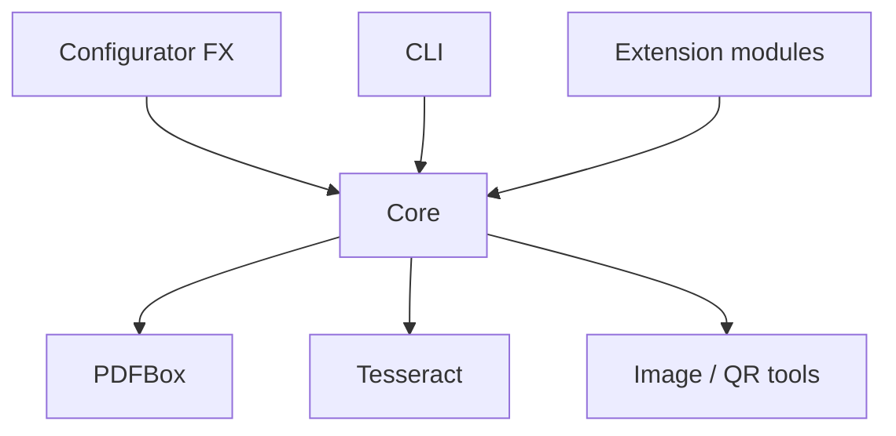

# Wymagania niefunkcjonalne

| Pole          | Wartość                                                           |
| ------------- | ----------------------------------------------------------------- |
| ID dokumentu  | DOC-004                                                           |
| Tytuł         | Wymagania niefunkcjonalne                                         |
| Wersja        | 0.1                                                               |
| Status        | Draft                                                             |
| Typ           | Non-Functional Requirements                                       |
| Źródło prawdy | Repozytorium dokumentacji projektu                                |
| Zależności    | `01-vision.md`, `02-glossary.md`, `03-functional-requirements.md` |

## 1. Cel dokumentu

Dokument definiuje wymagania niefunkcjonalne systemu OCR. Określa
oczekiwane właściwości jakościowe rozwiązania, ograniczenia
technologiczne oraz wymagania dotyczące wydajności, niezawodności,
współbieżności, wykorzystania zasobów, obserwowalności, bezpieczeństwa,
przenośności, testowalności i utrzymywalności.

Wymagania funkcjonalne opisują **co system robi**, natomiast niniejszy
dokument określa **w jaki sposób system powinien zachowywać się podczas
realizacji tych funkcji**.

Dokument stanowi wejście do:

- projektu architektury,
- projektu modułów Maven,
- projektu mechanizmu współbieżności,
- strategii obsługi błędów,
- strategii logowania i diagnostyki,
- strategii testów,
- konfiguracji środowiska uruchomieniowego,
- planu implementacji.

## 2. Konwencja identyfikatorów

Wymagania posiadają stabilne identyfikatory:

Prefiks Obszar

---

`NFR-TECH-*` Stos technologiczny
`NFR-PERF-*` Wydajność
`NFR-CONC-*` Współbieżność
`NFR-MEM-*` Pamięć i zasoby
`NFR-REL-*` Niezawodność i odporność na błędy
`NFR-DET-*` Deterministyczność i powtarzalność
`NFR-OBS-*` Logowanie, diagnostyka i obserwowalność
`NFR-SEC-*` Bezpieczeństwo
`NFR-PORT-*` Przenośność i środowisko
`NFR-CONF-*` Konfiguracja
`NFR-EXT-*` Rozszerzalność
`NFR-TEST-*` Testowalność
`NFR-MAINT-*` Utrzymywalność i jakość kodu
`NFR-UX-*` Użyteczność Configuratora
`NFR-BATCH-*` Właściwości procesu wsadowego
`NFR-DATA-*` Dane wynikowe i integralność danych
`NFR-BUILD-*` Build, zależności i dystrybucja

Priorytety:

- **MUST** --- wymaganie obowiązkowe,
- **SHOULD** --- wymaganie istotne, ale możliwe do przesunięcia poza
  pierwsze MVP,
- **MAY** --- wymaganie opcjonalne lub przyszłościowe.

## 3. Stos technologiczny

### NFR-TECH-001 --- JDK 21

**Priorytet:** MUST

Kod produkcyjny systemu musi być kompilowany i uruchamiany na **JDK
21**.

### NFR-TECH-002 --- Maven

**Priorytet:** MUST

System musi wykorzystywać **Apache Maven** jako narzędzie budowania
projektu i zarządzania zależnościami.

### NFR-TECH-003 --- Apache PDFBox

**Priorytet:** MUST

Obsługa dokumentów PDF, w szczególności ich odczyt i rasteryzacja, musi
wykorzystywać **Apache PDFBox**.

### NFR-TECH-004 --- Tesseract

**Priorytet:** MUST

Podstawowym silnikiem OCR musi być **Tesseract OCR**.

### NFR-TECH-005 --- JavaFX

**Priorytet:** MUST

Graficzna aplikacja Configurator musi wykorzystywać **JavaFX**.

### NFR-TECH-006 --- Brak zależności od płatnych usług

**Priorytet:** MUST

Podstawowe przetwarzanie dokumentów nie może wymagać korzystania z
płatnych usług OCR ani płatnych usług chmurowych.

### NFR-TECH-007 --- Przetwarzanie lokalne

**Priorytet:** MUST

System musi umożliwiać pełne przetwarzanie dokumentów lokalnie, bez
konieczności wysyłania dokumentów do zewnętrznych usług sieciowych.

## 4. Wydajność

### NFR-PERF-001 --- Duże wsady

**Priorytet:** MUST

Architektura musi być przystosowana do przetwarzania wsadów liczonych w
dziesiątkach tysięcy dokumentów.

### NFR-PERF-002 --- Przetwarzanie strumieniowe wsadu

**Priorytet:** MUST

System nie może wymagać wcześniejszego załadowania całej listy
dokumentów wraz z ich zawartością do pamięci.

Dokumenty powinny być pobierane i przetwarzane sukcesywnie.

### NFR-PERF-003 --- Unikanie zbędnego OCR

**Priorytet:** MUST

System powinien minimalizować liczbę operacji OCR poprzez:

- ograniczenie liczby analizowanych stron,
- ponowne wykorzystywanie wyników OCR strony,
- wykonywanie OCR regionu tylko wtedy, gdy jest wymagany,
- niewykonywanie ponownie tej samej kosztownej operacji bez potrzeby.

### NFR-PERF-004 --- Cache wyników pośrednich w obrębie dokumentu

**Priorytet:** SHOULD

Wyniki kosztownych operacji, takich jak rasteryzacja strony lub OCR/hOCR
całej strony, powinny być możliwe do ponownego wykorzystania w obrębie
przetwarzania tego samego dokumentu.

### NFR-PERF-005 --- Brak sztywnego SLA w pierwszej wersji

**Priorytet:** MUST

Pierwsza wersja projektu nie definiuje sztywnego wymagania typu „X
dokumentów na minutę", ponieważ czas przetwarzania zależy m.in. od:

- liczby stron,
- rozdzielczości,
- liczby aktywnych kategorii,
- liczby pól,
- konfiguracji pipeline'ów obrazu,
- kosztu OCR,
- parametrów sprzętowych.

Wydajność musi być jednak mierzalna.

### NFR-PERF-006 --- Pomiar czasu

**Priorytet:** MUST

System musi umożliwiać pomiar co najmniej:

- całkowitego czasu przetwarzania dokumentu,
- czasu OCR,
- czasu identyfikacji kategorii,
- czasu ekstrakcji pól,
- całkowitego czasu przetwarzania wsadu.

### NFR-PERF-007 --- Benchmark referencyjny

**Priorytet:** SHOULD

Projekt powinien posiadać powtarzalny benchmark pozwalający porównywać
wydajność kolejnych wersji systemu na tym samym zestawie dokumentów.

## 5. Współbieżność

### NFR-CONC-001 --- Równoległe dokumenty

**Priorytet:** MUST

System musi umożliwiać równoległe przetwarzanie wielu dokumentów.

### NFR-CONC-002 --- Konfigurowalna liczba workerów

**Priorytet:** MUST

Liczba równoległych workerów musi być konfigurowalna bez rekompilacji
aplikacji.

### NFR-CONC-003 --- Niezależność workerów

**Priorytet:** MUST

Worker przetwarzający jeden dokument nie może modyfikować stanu
przetwarzania innego dokumentu.

### NFR-CONC-004 --- Thread safety Core

**Priorytet:** MUST

Komponenty współdzielone przez workerów muszą być bezpieczne w użyciu
współbieżnym albo jednoznacznie oznaczone jako wymagające osobnej
instancji per worker.

### NFR-CONC-005 --- Brak globalnego mutable state

**Priorytet:** MUST

Core powinien unikać globalnego, modyfikowalnego stanu.

### NFR-CONC-006 --- Kontrolowane wykorzystanie zasobów

**Priorytet:** MUST

Zwiększenie liczby workerów nie może powodować niekontrolowanego
tworzenia wątków lub procesów.

### NFR-CONC-007 --- Ograniczenia Tesseract

**Priorytet:** MUST

Projekt mechanizmu współbieżności musi uwzględniać rzeczywisty model
uruchamiania Tesseracta oraz bezpieczeństwo współbieżnego wykorzystania
zastosowanego wrappera/integracji.

### NFR-CONC-008 --- Brak podwójnego przetwarzania

**Priorytet:** MUST

Ten sam plik nie może zostać jednocześnie przydzielony do więcej niż
jednego workera.

## 6. Pamięć i zasoby

### NFR-MEM-001 --- Ograniczone wykorzystanie pamięci

**Priorytet:** MUST

Zużycie pamięci powinno zależeć przede wszystkim od liczby aktywnych
workerów i rozmiaru aktualnie przetwarzanych dokumentów, a nie od
całkowitej liczby dokumentów we wsadzie.

### NFR-MEM-002 --- Zwolnienie obrazów

**Priorytet:** MUST

Obrazy stron i regionów, które nie są już potrzebne, powinny być możliwe
do zwolnienia i garbage collection po zakończeniu odpowiedniego etapu.

### NFR-MEM-003 --- Brak nieograniczonego cache

**Priorytet:** MUST

System nie może posiadać nieograniczonego cache przechowującego obrazy
lub wyniki OCR wszystkich dokumentów wsadu.

### NFR-MEM-004 --- Rozmiar kolejki

**Priorytet:** SHOULD

Jeżeli dispatcher wykorzystuje kolejkę dokumentów, jej implementacja
powinna umożliwiać ograniczenie liczby oczekujących elementów.

### NFR-MEM-005 --- Zamykanie zasobów

**Priorytet:** MUST

Pliki, dokumenty PDF, strumienie i inne zasoby systemowe muszą być
deterministycznie zamykane po zakończeniu użycia.

### NFR-MEM-006 --- Pliki tymczasowe

**Priorytet:** MUST

Jeżeli integracja z OCR lub przetwarzaniem obrazu wymaga plików
tymczasowych, system musi:

- posiadać kontrolowaną lokalizację tych plików,
- generować unikalne nazwy,
- usuwać pliki po zakończeniu,
- tolerować pozostałości po awaryjnym przerwaniu procesu.

## 7. Niezawodność i odporność na błędy

### NFR-REL-001 --- Izolacja błędu dokumentu

**Priorytet:** MUST

Błąd pojedynczego dokumentu nie może powodować przerwania całego wsadu.

### NFR-REL-002 --- Kontrolowany wynik błędu

**Priorytet:** MUST

Każdy oczekiwany błąd domenowy musi zostać zamieniony na
ustrukturyzowany wynik przetwarzania.

### NFR-REL-003 --- Nieobsłużone wyjątki

**Priorytet:** MUST

Nieobsłużony wyjątek w workerze powinien zostać przechwycony na granicy
przetwarzania dokumentu, zalogowany i zamieniony na wynik błędu
dokumentu, jeżeli proces może bezpiecznie kontynuować pracę.

### NFR-REL-004 --- Błędy globalne

**Priorytet:** MUST

System musi rozróżniać błędy dokumentu od błędów globalnych, które
uniemożliwiają dalszą bezpieczną pracę, np.:

- brak dostępu do katalogu wynikowego,
- krytycznie niepoprawna konfiguracja profilu,
- brak wymaganego komponentu OCR.

### NFR-REL-005 --- Spójne przenoszenie plików

**Priorytet:** MUST

Dokument może zostać uznany za zakończony dopiero po wykonaniu
wymaganych operacji wynikowych i ustaleniu docelowego statusu.

### NFR-REL-006 --- Możliwość retry

**Priorytet:** MUST

Dokument zakończony błędem musi nadawać się do ponownego przetworzenia
bez ręcznej modyfikacji jego zawartości.

### NFR-REL-007 --- Awaria podczas przenoszenia

**Priorytet:** MUST

Awaria operacji przeniesienia pliku nie może prowadzić do cichej utraty
dokumentu.

### NFR-REL-008 --- Fail fast dla konfiguracji

**Priorytet:** MUST

Błędy konfiguracji możliwe do wykrycia przed rozpoczęciem batcha powinny
zostać wykryte przed przetwarzaniem pierwszego dokumentu.

## 8. Deterministyczność i powtarzalność

### NFR-DET-001 --- Ta sama konfiguracja

**Priorytet:** MUST

Przy tej samej wersji aplikacji, tej samej konfiguracji, tym samym
wejściu i tym samym środowisku system powinien generować funkcjonalnie
równoważny wynik.

### NFR-DET-002 --- Kolejność pipeline'u

**Priorytet:** MUST

Kolejność operacji konfiguracyjnych musi być jednoznaczna i zachowywana
podczas wykonania.

### NFR-DET-003 --- Kolejność CSV

**Priorytet:** MUST

Kolejność kolumn CSV dla tej samej konfiguracji profilu musi być
stabilna.

### NFR-DET-004 --- Stabilny zapis JSON

**Priorytet:** SHOULD

Configurator powinien zapisywać konfigurację z deterministyczną
kolejnością elementów tam, gdzie kolejność semantycznie nie ma
znaczenia.

### NFR-DET-005 --- Brak zależności od kolejności plików systemu

**Priorytet:** MUST

Logika biznesowa nie może zależeć od przypadkowej kolejności zwracanej
przez system plików.

### NFR-DET-006 --- Rejestrowanie wersji

**Priorytet:** SHOULD

Wynik batcha powinien umożliwiać ustalenie wersji aplikacji oraz użytej
wersji konfiguracji/profilu.

## 9. Logowanie, diagnostyka i obserwowalność

### NFR-OBS-001 --- Structured logging

**Priorytet:** MUST

Logi powinny posiadać spójny format i umożliwiać identyfikację kontekstu
zdarzenia.

### NFR-OBS-002 --- Identyfikator dokumentu

**Priorytet:** MUST

Wszystkie logi dotyczące przetwarzania dokumentu powinny umożliwiać
powiązanie ich z konkretnym dokumentem.

### NFR-OBS-003 --- Worker

**Priorytet:** SHOULD

Logi batcha powinny umożliwiać ustalenie workera wykonującego operację.

### NFR-OBS-004 --- Poziomy logowania

**Priorytet:** MUST

System musi rozróżniać co najmniej poziomy:

- ERROR,
- WARN,
- INFO,
- DEBUG.

### NFR-OBS-005 --- Brak pełnych obrazów w logach

**Priorytet:** MUST

Logi tekstowe nie mogą zawierać binarnej zawartości dokumentów ani
obrazów.

### NFR-OBS-006 --- Diagnostyka etapów

**Priorytet:** MUST

W trybie diagnostycznym musi być możliwe ustalenie przebiegu dokumentu
przez główne etapy pipeline'u.

### NFR-OBS-007 --- Czasy etapów

**Priorytet:** SHOULD

Tryb diagnostyczny powinien raportować czasy kosztownych etapów.

### NFR-OBS-008 --- Artefakty diagnostyczne

**Priorytet:** SHOULD

System powinien umożliwiać opcjonalne zapisanie artefaktów
diagnostycznych dla wybranego dokumentu, np.:

- rasteryzowanej strony,
- obrazu po korekcie orientacji,
- hOCR,
- wykrytych bounding boxów,
- wyciętych regionów,
- obrazów po kolejnych `ImageProcessor`,
- wyników detektorów.

### NFR-OBS-009 --- Diagnostyka domyślnie wyłączona dla obrazów

**Priorytet:** MUST

Zapisywanie obrazów i innych dużych artefaktów diagnostycznych powinno
być domyślnie wyłączone podczas produkcyjnego batcha.

### NFR-OBS-010 --- Podsumowanie batcha

**Priorytet:** MUST

Po zakończeniu batcha musi być dostępne podsumowanie liczby dokumentów
zakończonych sukcesem i błędem oraz całkowitego czasu przetwarzania.

## 10. Bezpieczeństwo

### NFR-SEC-001 --- Brak wysyłania dokumentów poza środowisko

**Priorytet:** MUST

Core nie może wysyłać dokumentów ani rozpoznanych danych do zewnętrznych
usług bez jawnego rozszerzenia zaprojektowanego w tym celu.

### NFR-SEC-002 --- Dane wrażliwe w logach

**Priorytet:** MUST

Logi na poziomie INFO i wyższym nie powinny domyślnie zawierać pełnych
wartości pól mogących zawierać dane osobowe, takich jak PESEL.

### NFR-SEC-003 --- Diagnostyka danych wrażliwych

**Priorytet:** MUST

Jeżeli tryb DEBUG pozwala na zapis wartości lub obrazów zawierających
dane dokumentu, funkcja ta musi być jawnie włączona i udokumentowana.

### NFR-SEC-004 --- Ścieżki plików

**Priorytet:** MUST

Ścieżki wynikające z konfiguracji nie mogą pozwalać rozszerzeniom na
niekontrolowany zapis poza dozwolonymi lokalizacjami procesu, jeżeli
rozszerzenie korzysta z infrastruktury plikowej Core.

### NFR-SEC-005 --- Konfiguracja jako dane

**Priorytet:** MUST

JSON konfiguracji nie może umożliwiać wykonywania arbitralnego kodu
poprzez interpretowanie wartości konfiguracyjnych jako kodu lub skryptu.

### NFR-SEC-006 --- Zewnętrzne pluginy

**Priorytet:** SHOULD

Jeżeli w przyszłości zostanie wprowadzone dynamiczne ładowanie
zewnętrznych JAR-ów, dokumentacja musi jasno określać, że plugin jest
kodem wykonywanym z uprawnieniami procesu aplikacji.

## 11. Przenośność i środowisko

### NFR-PORT-001 --- System operacyjny

**Priorytet:** SHOULD

Core i CLI powinny być możliwe do uruchomienia co najmniej na
współczesnych systemach Windows i Linux obsługujących JDK 21 i
Tesseract.

### NFR-PORT-002 --- Brak zależności od separatora ścieżki

**Priorytet:** MUST

Kod Java nie może zakładać konkretnego separatora ścieżek systemu
operacyjnego.

### NFR-PORT-003 --- Kodowanie tekstu

**Priorytet:** MUST

Pliki tekstowe tworzone przez system muszą używać jawnie zdefiniowanego
kodowania.

Domyślnym kodowaniem projektu powinno być UTF-8.

### NFR-PORT-004 --- Lokalizacja Tesseract

**Priorytet:** MUST

Sposób odnalezienia executable/bibliotek/danych językowych Tesseracta
musi być konfigurowalny.

### NFR-PORT-005 --- Dane językowe OCR

**Priorytet:** MUST

Konfiguracja środowiska musi umożliwiać wskazanie zestawu języków
Tesseract używanych podczas OCR.

### NFR-PORT-006 --- JavaFX Runtime

**Priorytet:** MUST

Dystrybucja Configuratora musi jednoznacznie definiować sposób
dostarczenia wymaganych modułów JavaFX.

## 12. Konfiguracja

### NFR-CONF-001 --- Czytelność JSON

**Priorytet:** MUST

Pliki JSON kategorii i profili muszą pozostawać czytelne dla człowieka.

### NFR-CONF-002 --- Przyjazność dla Git

**Priorytet:** MUST

Zmiana pojedynczej właściwości konfiguracji nie powinna powodować
niepotrzebnego przepisania całego pliku lub losowej zmiany kolejności
elementów.

### NFR-CONF-003 --- Walidacja przed wykonaniem

**Priorytet:** MUST

Konfiguracja musi być walidowana przed użyciem w batchu.

### NFR-CONF-004 --- Czytelne błędy

**Priorytet:** MUST

Komunikat błędu konfiguracji musi wskazywać możliwie dokładną
lokalizację problemu.

### NFR-CONF-005 --- Wersjonowanie formatu

**Priorytet:** MUST

Format konfiguracji musi posiadać wersję umożliwiającą przyszłą ewolucję
schematu.

### NFR-CONF-006 --- Kompatybilność

**Priorytet:** SHOULD

Zmiana formatu konfiguracji powinna być projektowana tak, aby możliwa
była kontrolowana migracja konfiguracji ze starszych wersji.

### NFR-CONF-007 --- JSON Schema

**Priorytet:** SHOULD

Docelowo konfiguracje kategorii i profili powinny posiadać formalne JSON
Schema wykorzystywane przez testy i narzędzia.

## 13. Rozszerzalność

### NFR-EXT-001 --- Open/Closed

**Priorytet:** MUST

Dodanie nowego `Validator`, `ValueTransformer`, `ImageProcessor`,
`Detector` lub `Matcher` nie powinno wymagać modyfikacji logiki
domenowej przetwarzania dokumentu.

### NFR-EXT-002 --- Stabilne SPI

**Priorytet:** MUST

Interfejsy rozszerzeń powinny być małe, jednoznaczne i możliwie
niezależne od GUI i CLI.

### NFR-EXT-003 --- Brak zależności Core od JavaFX

**Priorytet:** MUST

Core nie może posiadać zależności od JavaFX.

### NFR-EXT-004 --- Brak zależności Core od CLI

**Priorytet:** MUST

Core nie może zależeć od implementacji CLI.

### NFR-EXT-005 --- Rozszerzenia konfigurowalne

**Priorytet:** MUST

Parametry rozszerzenia powinny pochodzić z konfiguracji i nie wymagać
zmian kodu dla każdej kategorii dokumentu.

### NFR-EXT-006 --- Dynamiczne pluginy

**Priorytet:** MAY

Architektura powinna pozostawiać możliwość przyszłego ładowania pluginów
z zewnętrznych JAR-ów.

## 14. Testowalność

### NFR-TEST-001 --- Core bez GUI

**Priorytet:** MUST

Cały pipeline przetwarzania dokumentu musi być testowalny bez
uruchamiania JavaFX.

### NFR-TEST-002 --- Testy jednostkowe

**Priorytet:** MUST

Logika domenowa, matchery, transformery, walidatory i algorytmy
geometrii muszą nadawać się do testowania jednostkowego.

### NFR-TEST-003 --- Testy integracyjne OCR

**Priorytet:** MUST

Projekt musi posiadać możliwość uruchamiania testów integracyjnych
wykorzystujących rzeczywisty Tesseract.

### NFR-TEST-004 --- Testy PDF

**Priorytet:** MUST

Rasteryzacja PDFBox musi być objęta testami integracyjnymi na
kontrolowanym zestawie dokumentów.

### NFR-TEST-005 --- Dokumenty referencyjne

**Priorytet:** MUST

Projekt powinien posiadać zestaw niewrażliwych dokumentów referencyjnych
przeznaczonych do testów automatycznych.

### NFR-TEST-006 --- Golden files

**Priorytet:** SHOULD

Dla stabilnych scenariuszy warto stosować golden files zawierające
oczekiwane wyniki OCR/ekstrakcji lub wyniki końcowe.

### NFR-TEST-007 --- Testy konfiguracji

**Priorytet:** MUST

Każdy przykładowy plik konfiguracji przechowywany w repozytorium
powinien być automatycznie walidowany podczas builda.

### NFR-TEST-008 --- Testy współbieżności

**Priorytet:** MUST

Mechanizm batch/dispatcher/workers musi posiadać testy obejmujące
równoległe przetwarzanie, błędy workerów i brak podwójnego przydziału
pliku.

### NFR-TEST-009 --- Testy regresji

**Priorytet:** SHOULD

Naprawienie błędu rozpoznawania konkretnego typu dokumentu powinno
skutkować dodaniem przypadku regresyjnego, o ile możliwe jest
wykorzystanie zanonimizowanego lub syntetycznego dokumentu.

### NFR-TEST-010 --- Mockowanie granic

**Priorytet:** MUST

Architektura powinna umożliwiać zastąpienie w testach komponentów
zewnętrznych, w szczególności OCR i systemu plików tam, gdzie jest to
uzasadnione.

## 15. Utrzymywalność i jakość kodu

### NFR-MAINT-001 --- Modularność

**Priorytet:** MUST

Kod powinien być podzielony na moduły o jednoznacznej odpowiedzialności.

### NFR-MAINT-002 --- Wspólny Core

**Priorytet:** MUST

Logika domenowa nie może być duplikowana pomiędzy CLI i Configuratorem.

### NFR-MAINT-003 --- Kierunek zależności

**Priorytet:** MUST

Warstwy wejściowe, takie jak CLI i JavaFX, powinny zależeć od Core, a
Core nie powinien zależeć od tych warstw.

### NFR-MAINT-004 --- Brak logiki biznesowej w kontrolerach GUI

**Priorytet:** MUST

Kontrolery JavaFX nie powinny implementować logiki OCR, klasyfikacji,
geometrii, transformacji ani walidacji.

### NFR-MAINT-005 --- Brak logiki biznesowej w parserze CLI

**Priorytet:** MUST

Kod obsługujący argumenty CLI nie powinien implementować właściwego
pipeline'u dokumentu.

### NFR-MAINT-006 --- Czytelne nazewnictwo domenowe

**Priorytet:** MUST

Nazwy klas i interfejsów powinny być zgodne z terminologią z
`02-glossary.md`.

### NFR-MAINT-007 --- Brak magicznych wartości

**Priorytet:** MUST

Progi, tolerancje i parametry mające znaczenie dla rozpoznawania
dokumentów nie powinny być zaszywane w kodzie, jeżeli różnią się
pomiędzy kategoriami.

### NFR-MAINT-008 --- Dokumentacja publicznych kontraktów

**Priorytet:** SHOULD

Publiczne SPI oraz nietrywialne kontrakty domenowe powinny posiadać
dokumentację wyjaśniającą semantykę, ograniczenia i obsługę błędów.

### NFR-MAINT-009 --- Ostrzeżenia kompilatora

**Priorytet:** SHOULD

Build powinien ujawniać istotne ostrzeżenia kompilatora i nie powinien
systematycznie ignorować nowych ostrzeżeń.

### NFR-MAINT-010 --- Analiza statyczna

**Priorytet:** SHOULD

Projekt powinien wykorzystywać automatyczną analizę statyczną kodu w
buildzie lub CI.

## 16. Użyteczność Configuratora

### NFR-UX-001 --- Responsywność GUI

**Priorytet:** MUST

Długotrwałe operacje, w szczególności OCR i przetwarzanie obrazu, nie
mogą blokować JavaFX Application Thread w sposób powodujący zamrożenie
interfejsu.

### NFR-UX-002 --- Informacja o pracy

**Priorytet:** MUST

Podczas długotrwałej operacji GUI musi informować użytkownika, że
operacja jest wykonywana.

### NFR-UX-003 --- Czytelne błędy

**Priorytet:** MUST

Błąd konfiguracji lub testowego przetwarzania powinien być prezentowany
w sposób pozwalający użytkownikowi ustalić problem bez analizy stack
trace.

### NFR-UX-004 --- Stack trace

**Priorytet:** SHOULD

W trybie diagnostycznym użytkownik techniczny powinien mieć możliwość
uzyskania szczegółowych informacji o błędzie.

### NFR-UX-005 --- Skalowanie widoku

**Priorytet:** MUST

Zoom i przeliczanie współrzędnych GUI nie mogą zmieniać semantycznych
współrzędnych zapisanych w konfiguracji.

### NFR-UX-006 --- Bezpieczna edycja

**Priorytet:** SHOULD

Configurator powinien ostrzegać przed zamknięciem lub otwarciem innej
konfiguracji, jeżeli bieżące zmiany nie zostały zapisane.

### NFR-UX-007 --- Techniczny charakter narzędzia

**Priorytet:** MUST

Configurator jest narzędziem dla użytkownika technicznego/analityka
konfigurującego dokumenty. Pierwsza wersja nie wymaga interfejsu
upraszczającego wszystkie pojęcia domenowe dla użytkownika
nietechnicznego.

## 17. Właściwości procesu wsadowego

### NFR-BATCH-001 --- Brak interakcji użytkownika

**Priorytet:** MUST

Po poprawnym uruchomieniu CLI batch powinien móc zakończyć pracę bez
interakcji użytkownika.

### NFR-BATCH-002 --- Automatyzacja

**Priorytet:** MUST

CLI musi nadawać się do uruchamiania z zewnętrznych skryptów,
schedulerów i systemów automatyzacji.

### NFR-BATCH-003 --- Exit code

**Priorytet:** MUST

Proces musi zwracać deterministyczny kod zakończenia zgodny ze
zdefiniowaną semantyką CLI.

### NFR-BATCH-004 --- Postęp

**Priorytet:** MUST

Postęp batcha musi być możliwy do obserwowania bez zatrzymywania
procesu.

### NFR-BATCH-005 --- Brak zależności od GUI

**Priorytet:** MUST

Batch nie może wymagać środowiska graficznego.

### NFR-BATCH-006 --- Stabilność długotrwałego procesu

**Priorytet:** MUST

Projekt musi zakładać możliwość wielogodzinnej pracy procesu
przetwarzającego duży wsad bez narastającego, nieograniczonego zużycia
pamięci lub zasobów systemowych.

### NFR-BATCH-007 --- Częściowy sukces wsadu

**Priorytet:** MUST

Batch może zawierać jednocześnie dokumenty zakończone sukcesem i błędem.
Błędy pojedynczych dokumentów nie oznaczają automatycznie technicznej
awarii całego procesu.

## 18. Integralność danych i wyników

### NFR-DATA-001 --- Brak modyfikacji źródłowego dokumentu

**Priorytet:** MUST

Pipeline OCR nie może modyfikować zawartości źródłowego dokumentu.

### NFR-DATA-002 --- Przeniesienie zamiast modyfikacji

**Priorytet:** MUST

Zmiana stanu pliku po przetworzeniu powinna polegać na jego
kontrolowanym przeniesieniu do odpowiedniego katalogu, a nie na
modyfikowaniu dokumentu.

### NFR-DATA-003 --- Spójność wyniku

**Priorytet:** MUST

Rekord wynikowy musi jednoznacznie odpowiadać dokumentowi, którego
dotyczy.

### NFR-DATA-004 --- Kodowanie CSV

**Priorytet:** MUST

Kodowanie CSV musi być jawnie określone. Domyślnie należy przyjąć UTF-8.

### NFR-DATA-005 --- Escaping CSV

**Priorytet:** MUST

Generator CSV musi poprawnie obsługiwać wartości zawierające separator,
cudzysłowy oraz znaki nowej linii.

### NFR-DATA-006 --- Brak częściowego rekordu

**Priorytet:** MUST

Awaria podczas przetwarzania dokumentu nie może powodować powstania
rekordu, który wygląda jak poprawny wynik, ale zawiera przypadkowo
częściowe dane bez odpowiedniego statusu błędu.

### NFR-DATA-007 --- Diagnostyka walidacji

**Priorytet:** MUST

Jeżeli wartość została odczytana, ale nie przeszła walidacji, wynik musi
umożliwiać rozróżnienie tego przypadku od braku odczytu wartości.

## 19. Build, zależności i dystrybucja

### NFR-BUILD-001 --- Reprodukowalny build

**Priorytet:** MUST

Projekt musi być możliwy do zbudowania standardowym poleceniem Maven na
poprawnie przygotowanym środowisku.

### NFR-BUILD-002 --- Maven multi-module

**Priorytet:** SHOULD

Projekt powinien wykorzystywać strukturę Maven multi-module oddzielającą
co najmniej Core, CLI i Configurator.

Dokładny podział modułów zostanie określony w dokumencie architektury.

### NFR-BUILD-003 --- Jawne wersje zależności

**Priorytet:** MUST

Wersje istotnych zależności muszą być kontrolowane przez konfigurację
Maven.

### NFR-BUILD-004 --- Brak SNAPSHOT w wydaniu

**Priorytet:** SHOULD

Wersja przeznaczona do stabilnego użycia nie powinna zależeć od
zewnętrznych artefaktów `SNAPSHOT`.

### NFR-BUILD-005 --- Testy w buildzie

**Priorytet:** MUST

Standardowy build musi uruchamiać testy jednostkowe.

### NFR-BUILD-006 --- Testy integracyjne

**Priorytet:** SHOULD

Maven powinien posiadać jednoznaczny profil/fazę umożliwiającą
uruchomienie testów integracyjnych wymagających Tesseracta lub
dodatkowych komponentów środowiskowych.

### NFR-BUILD-007 --- Artefakt CLI

**Priorytet:** MUST

Build musi generować samodzielnie uruchamialny artefakt aplikacji CLI
wraz z jednoznaczną instrukcją uruchomienia.

### NFR-BUILD-008 --- Artefakt Configuratora

**Priorytet:** MUST

Build musi generować dystrybucję Configuratora JavaFX wraz z wymaganymi
zależnościami lub jednoznacznym mechanizmem ich dostarczenia.

### NFR-BUILD-009 --- Informacja o wersji

**Priorytet:** SHOULD

CLI i Configurator powinny umożliwiać wyświetlenie wersji aplikacji.

## 20. Wstępne cele jakościowe

Na obecnym etapie przyjmuje się następujące cele jakościowe. Nie
wszystkie są jeszcze formalnymi SLA.

| Obszar                      | Cel początkowy                                           |
| --------------------------- | -------------------------------------------------------- |
| Wielkość wsadu              | Dziesiątki tysięcy dokumentów                            |
| Model wykonania             | Równoległe przetwarzanie dokumentów                      |
| Liczba workerów             | Konfigurowalna                                           |
| Pamięć                      | Ograniczona liczbą workerów, nie wielkością całego wsadu |
| Odporność na błąd dokumentu | Błąd dokumentu nie zatrzymuje wsadu                      |
| OCR                         | Lokalny Tesseract                                        |
| PDF                         | Apache PDFBox                                            |
| Java                        | JDK 21                                                   |
| Build                       | Maven                                                    |
| GUI                         | JavaFX                                                   |
| Kodowanie tekstu            | UTF-8                                                    |
| Konfiguracja                | JSON, czytelny i wersjonowalny w Git                     |
| Przetwarzanie bez sieci     | W pełni możliwe                                          |
| Powtarzalność               | Ten sam input + konfiguracja + wersja → równoważny wynik |
| Diagnostyka                 | Per dokument, etap i pole                                |
| Długotrwała praca           | Brak nieograniczonego wzrostu pamięci i zasobów          |

## 21. Wymagania jakościowe dla architektury

Architektura wynikająca z wymagań funkcjonalnych i niefunkcjonalnych
powinna zachowywać następujący kierunek zależności:

Core powinien zawierać model domenowy i pipeline dokumentu. CLI i JavaFX
powinny być adapterami wykorzystującymi Core, a integracje
technologiczne powinny być możliwie izolowane za jednoznacznymi
kontraktami.

## 22. Kryteria akceptacyjne jakości

Przed uznaniem pierwszej kompletnej wersji za gotową powinno być możliwe
potwierdzenie co najmniej następujących właściwości:

1.  Projekt buduje się na JDK 21 za pomocą Maven.
2.  CLI działa bez JavaFX.
3.  Configurator korzysta z tego samego Core co CLI.
4.  PDF jest obsługiwany przez PDFBox.
5.  OCR jest wykonywany lokalnie przez Tesseract.
6.  Batch może przetwarzać dokumenty równolegle.
7.  Liczba workerów jest konfigurowalna.
8.  Błąd pojedynczego dokumentu nie zatrzymuje batcha.
9.  Dokument zakończony błędem trafia do kontrolowanego wyniku i
    katalogu `error`.
10. Dokument może zostać ponownie przetworzony.
11. System nie ładuje całego wsadu dokumentów do pamięci.
12. Długotrwały batch nie wykazuje nieograniczonego wzrostu zużycia
    pamięci.
13. Logi pozwalają odnaleźć przebieg konkretnego dokumentu.
14. Dane wrażliwe nie są domyślnie wypisywane w logach INFO.
15. Konfiguracje JSON są czytelne i stabilne w Git.
16. Główna logika domenowa jest objęta testami automatycznymi.
17. Istnieją testy integracyjne OCR i PDF.
18. GUI nie blokuje JavaFX Application Thread podczas OCR.
19. Wynik CSV jest poprawnie kodowany i escapowany.
20. Dla tej samej konfiguracji struktura wyniku jest deterministyczna.

## 23. Otwarte kwestie

Poniższe kwestie powinny zostać rozstrzygnięte podczas projektu
architektury lub szczegółowych specyfikacji:

1.  Dokładny wrapper/sposób integracji Javy z Tesseractem.
2.  Model procesów/wątków dla równoległego OCR.
3.  Domyślna liczba workerów i sposób jej wyliczania.
4.  Limity pamięci i ewentualne mechanizmy backpressure.
5.  Docelowa biblioteka logowania i format logów.
6.  Format artefaktów diagnostycznych.
7.  Dokładna strategia atomowego/bezpiecznego przenoszenia plików.
8.  Zachowanie przy pracy pomiędzy różnymi filesystemami.
9.  Biblioteka do CSV.
10. Biblioteka do JSON i JSON Schema.
11. Biblioteka do QR/barcode.
12. Docelowy mechanizm dystrybucji JavaFX.
13. Zakres wspieranych systemów operacyjnych w pierwszym wydaniu.
14. Strategia pakowania Tesseracta i danych językowych.
15. Docelowe benchmarki wydajnościowe.
16. Retencja logów i artefaktów diagnostycznych.
17. Strategia migracji konfiguracji pomiędzy wersjami.
18. Narzędzia analizy statycznej i quality gates.
19. Szczegółowa polityka wersjonowania aplikacji i konfiguracji.

## 24. Przyjęte decyzje techniczne

Obszar Decyzja

---

Java JDK 21
Build Maven
PDF Apache PDFBox
OCR Tesseract
OCR geometry hOCR
GUI JavaFX
Konfiguracja JSON
Eksport CSV

## 25. Następny krok

Po zdefiniowaniu wymagań funkcjonalnych i niefunkcjonalnych kolejnym
krokiem powinno być opisanie architektury rozwiązania.

Rekomendowany następny dokument:

**`05-architecture.md` --- Architektura systemu**

Powinien określić między innymi:

- strukturę modułów Maven,
- granice Core / CLI / Configurator,
- model domenowy wysokiego poziomu,
- pipeline przetwarzania dokumentu,
- porty i adaptery dla PDFBox, Tesseracta oraz detektorów,
- model rozszerzeń,
- mechanizm registry/pluginów,
- model współbieżności dispatcher/workers,
- cykl życia dokumentu,
- model błędów,
- sposób zarządzania zasobami,
- zależności pomiędzy modułami,
- proponowaną strukturę pakietów,
- strategię testowania poszczególnych warstw.
