# Architektura systemu

| Pole          | Wartość                                                                                                |
| ------------- | ------------------------------------------------------------------------------------------------------ |
| ID dokumentu  | DOC-005                                                                                                |
| Tytuł         | Architektura systemu                                                                                   |
| Wersja        | 0.1                                                                                                    |
| Status        | Draft                                                                                                  |
| Typ           | Architecture                                                                                           |
| Źródło prawdy | Repozytorium dokumentacji projektu                                                                     |
| Zależności    | `01-vision.md`, `02-glossary.md`, `03-functional-requirements.md`, `04-non-functional-requirements.md` |

## 1. Cel dokumentu

Celem dokumentu jest zdefiniowanie architektury systemu OCR na poziomie wystarczającym do rozpoczęcia szczegółowego projektu modułów, modelu domenowego, API rozszerzeń oraz implementacji.

Dokument określa:

- podział systemu na moduły Maven,
- kierunek zależności pomiędzy modułami,
- granice wspólnego Core,
- sposób integracji z PDFBox i Tesseractem,
- model przetwarzania pojedynczego dokumentu,
- model identyfikacji kategorii,
- model normalizacji geometrii,
- model ekstrakcji pól,
- model rozszerzeń,
- model batch/dispatcher/workers,
- model błędów i wyników,
- odpowiedzialność Configuratora JavaFX i CLI,
- podstawowe zasady zarządzania zasobami i współbieżnością.

## 2. Decyzje bazowe

| Obszar       | Decyzja       |
| ------------ | ------------- |
| Java         | JDK 21        |
| Build        | Maven         |
| PDF          | Apache PDFBox |
| OCR          | Tesseract     |
| OCR geometry | hOCR          |
| GUI          | JavaFX        |
| Konfiguracja | JSON          |
| Eksport      | CSV           |

## 3. Cele architektoniczne

Architektura powinna realizować następujące cele:

1. Wspólny Core dla JavaFX i CLI.
2. Brak logiki biznesowej w warstwie UI i parserze CLI.
3. Możliwość testowania pipeline'u bez GUI.
4. Możliwość równoległego przetwarzania wielu dokumentów.
5. Izolacja integracji z PDFBox, Tesseractem i bibliotekami QR/barcode.
6. Rozszerzalność przez stabilne kontrakty.
7. Konfiguracja kategorii poza kodem aplikacji.
8. Możliwość wersjonowania konfiguracji w Git.
9. Brak zależności Core od JavaFX.
10. Brak zależności Core od sposobu uruchomienia batcha.
11. Kontrolowane wykorzystanie pamięci i zasobów.
12. Diagnostyka każdego etapu pipeline'u.
13. Możliwość późniejszego rozszerzenia o dynamiczne pluginy bez przebudowy modelu domenowego.

## 4. Styl architektoniczny

Preferowanym stylem jest architektura modularna z elementami Hexagonal Architecture / Ports and Adapters.

Core definiuje model domenowy, przypadki użycia, porty oraz kontrakty rozszerzeń. Technologie zewnętrzne są implementowane jako adaptery.

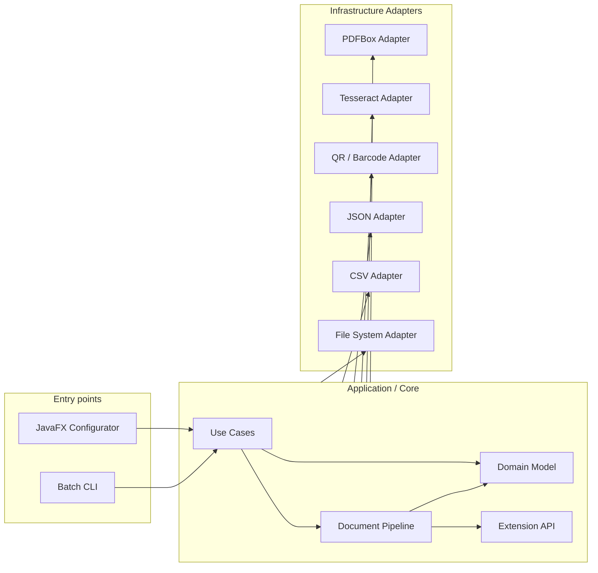

## 5. Proponowana struktura Maven

Projekt powinien być Maven multi-module.

```text
platform/
├── pom.xml
├── domain/
├── application/
├── extension-api/
├── extensions-standard/
├── adapter-pdfbox/
├── adapter-tesseract/
├── adapter-barcode/
├── adapter-json/
├── adapter-csv/
├── batch/
├── cli/
└── configurator-javafx/
```

### 5.1. Odpowiedzialności modułów

| Moduł                     | Odpowiedzialność                                                                                |
| ------------------------- | ----------------------------------------------------------------------------------------------- |
| `domain`              | Czysty model domenowy, value objects, wyniki, statusy i błędy domenowe                          |
| `application`         | Use case'y, orkiestracja pipeline'u, `DocumentProcessor`, identyfikacja, geometria i ekstrakcja |
| `extension-api`       | Stabilne SPI: Detector, Matcher, ImageProcessor, ValueTransformer, Validator                    |
| `extensions-standard` | Standardowe implementacje rozszerzeń                                                            |
| `adapter-pdfbox`      | Odczyt i rasteryzacja PDF przez PDFBox                                                          |
| `adapter-tesseract`   | Integracja z Tesseractem i parser hOCR                                                          |
| `adapter-barcode`     | QR/barcode detection                                                                            |
| `adapter-json`        | Wczytywanie, zapis i walidacja konfiguracji JSON                                                |
| `adapter-csv`         | Eksport wyników do CSV                                                                          |
| `batch`               | Dispatcher, worker pool, batch orchestration                                                    |
| `cli`                 | Argumenty CLI i bootstrap aplikacji wsadowej                                                    |
| `configurator-javafx` | JavaFX UI, wizualna konfiguracja i testowanie                                                   |

## 6. Zależności Maven pomiędzy modułami

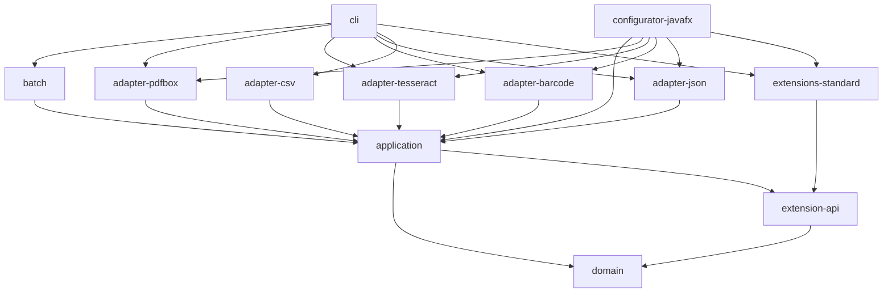

Adapter może implementować port zdefiniowany w `application`, dlatego zależność adaptera do application jest poprawna. Application nie może zależeć od konkretnego adaptera.

## 7. Główne warstwy logiczne

### 7.1. Domain

Domain zawiera pojęcia niezależne od technologii:

- `Document`,
- `DocumentPage`,
- `DocumentCategory`,
- `Anchor`,
- `ReferencePoint` lub `ReferenceFeature`,
- `ReferenceGeometry`,
- `GeometryTransform`,
- `FieldDefinition`,
- `FieldResult`,
- `ValidationResult`,
- `DocumentResult`,
- `ProcessingError`,
- `ProcessingWarning`.

Domain nie zna PDFBox, Tesseracta, JavaFX, parsera JSON ani filesystemowego batcha.

### 7.2. Application

Application realizuje przypadki użycia i orkiestruje Domain.

Przykładowe komponenty:

```text
DocumentProcessor
CategoryIdentificationService
ReferenceDetectionService
GeometryNormalizationService
FieldExtractionService
ConfigurationValidationService
DocumentInspectionService
```

### 7.3. Infrastructure

Infrastructure zawiera integracje technologiczne:

- PDFBox,
- Tesseract,
- QR/barcode,
- JSON,
- CSV,
- filesystem.

### 7.4. Entry Points

Entry Points inicjują przypadki użycia:

- JavaFX,
- CLI.

## 8. Centralny komponent: DocumentProcessor

Koncepcyjny kontrakt:

```java
DocumentResult process(DocumentSource source, ProcessingContext context);
```

`DocumentProcessor` nie powinien:

- parsować argumentów CLI,
- przenosić plików do `success` lub `error`,
- odwoływać się do kontrolek JavaFX,
- zarządzać pulą workerów.

Jego odpowiedzialnością jest uzyskanie `DocumentResult`.

## 9. Pipeline dokumentu

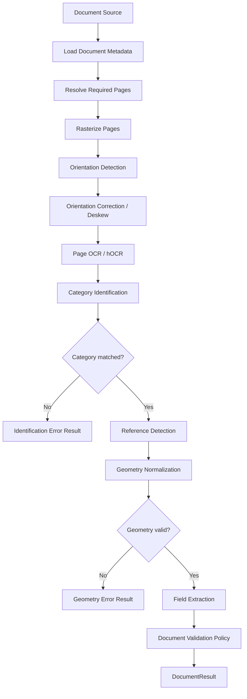

Pipeline wysokiego poziomu jest kontrolowany przez system. Konfigurowalne są pipeline'y wewnątrz ekstrakcji pola.

## 10. DocumentLoader

Core nie powinien zależeć bezpośrednio od PDFBox.

```text
DocumentLoader
- supports(source)
- inspect(source)
- renderPage(source, pageNumber, renderOptions)
```

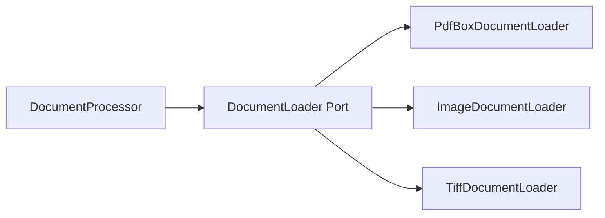

## 11. Adapter PDFBox

`adapter-pdfbox` odpowiada za:

- otwarcie PDF,
- odczyt liczby stron,
- rasteryzację wskazanej strony,
- kontrolę DPI/render scale,
- zamykanie `PDDocument`,
- mapowanie błędów technicznych.

Rasteryzacja powinna dotyczyć tylko stron wymaganych w bieżącym procesie.

## 12. Port OCR

Application zależy od abstrakcji OCR.

```java
interface OcrEngine {
    PageOcrResult recognizePage(PageImage image, OcrOptions options);
    FieldOcrResult recognizeRegion(PageImage image, OcrOptions options);
}
```

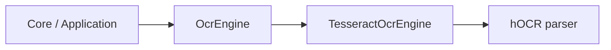

## 13. Adapter Tesseract

Adapter Tesseracta odpowiada za:

- uruchomienie Tesseracta,
- przekazanie obrazu,
- ustawienie parametrów OCR,
- wybór języka,
- uzyskanie hOCR,
- parsowanie wyniku,
- mapowanie błędów technicznych.

Nie zawiera reguł biznesowych.

## 14. Reprezentacja OCR

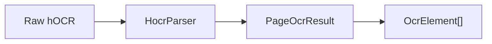

Dalsze komponenty pracują na modelu `PageOcrResult`, a nie na surowym hOCR.

## 15. Identyfikacja kategorii

Za identyfikację odpowiada `CategoryIdentificationService`.

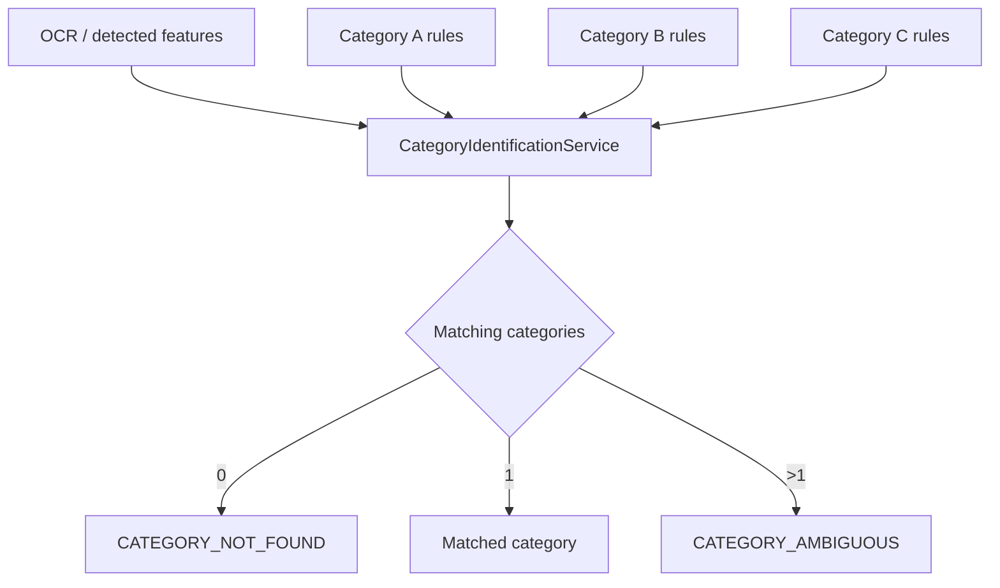

## 16. Reguły identyfikacji

Konfiguracja jest reprezentowana jako lista alternatywnych grup.

```text
(A AND B AND C) OR (D AND E)
```

Warunki powinny wykorzystywać `Matcher` i `Detector`, zamiast rozbudowanych instrukcji `switch`.

## 17. Matcher

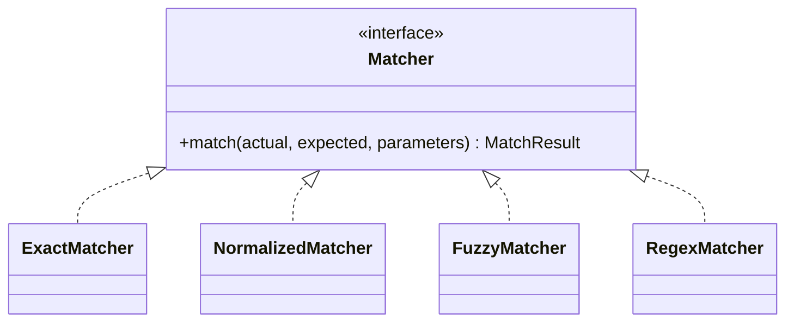

## 18. Detektory

Koncepcyjny kontrakt:

```text
Detector
  detect(DetectionInput, DetectorConfiguration)
    -> DetectionResult[]
```

Typowe implementacje:

- `TextDetector`,
- `QrDetector`,
- `BarcodeDetector`.

## 19. Anchor i ReferenceFeature

`Anchor` jest definicją konfiguracyjną. Wykryty obiekt na konkretnym dokumencie powinien być reprezentowany przez `ReferenceFeature`.

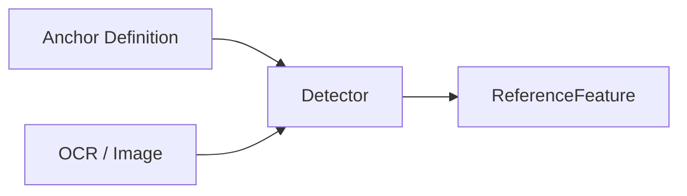

Proponowany model:

```text
ReferenceFeature
- anchorId
- bounds
- characteristicPoints
- rotation
- detectedValue
- confidence
```

Termin `ReferenceFeature` jest preferowany względem `ReferencePoint`, ponieważ QR, barcode i fragment tekstu posiadają geometrię większą niż pojedynczy punkt.

## 20. Normalizacja geometrii

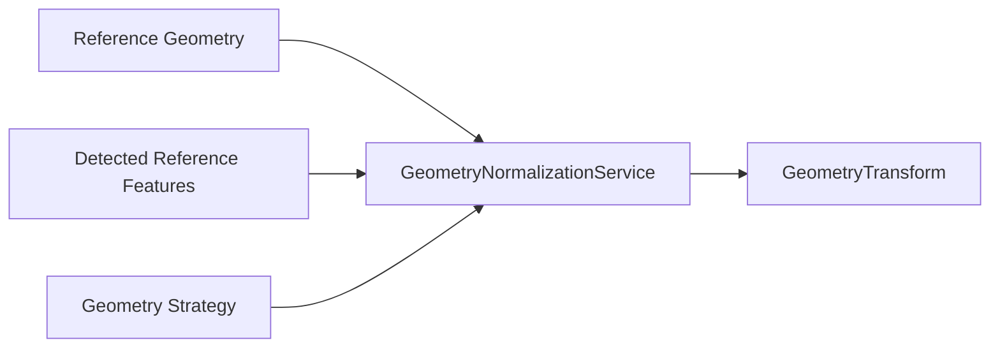

`GeometryTransform` jest centralnym obiektem transformacji współrzędnych.

Minimalnie obsługuje:

- translację,
- skalowanie,
- rotację.

Powinien umożliwiać:

```text
transform(point)
transform(region)
```

## 21. Strategie normalizacji

Możliwe implementacje:

```text
SingleReferenceStrategy
TwoReferenceSimilarityStrategy
MultiReferenceLeastSquaresStrategy
```

Nazwy są robocze. Dokładny model matematyczny zostanie opisany osobno.

## 22. Ekstrakcja pola

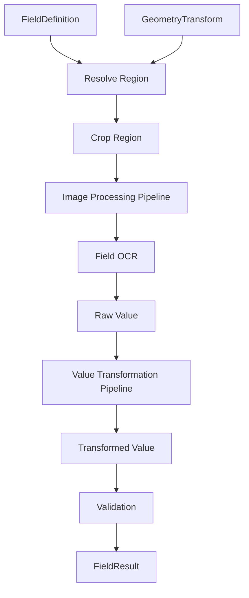

## 23. Region pola

```text
ReferenceRegion
    + GeometryTransform
    = ResolvedRegion
```

Region musi zostać zweryfikowany pod kątem granic obrazu przed cropem.

## 24. Image Processing Pipeline

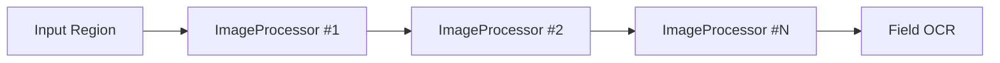

## 25. Value Transformation Pipeline

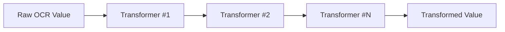

## 26. Walidacja

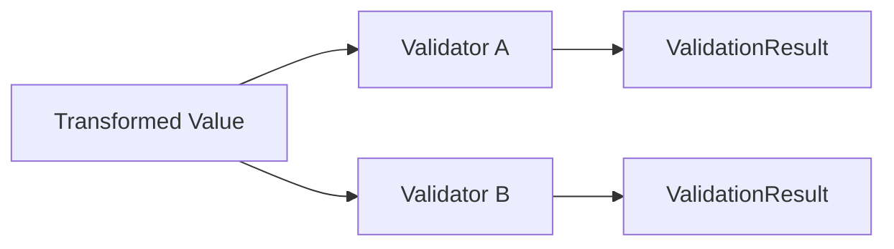

Walidator nie powinien modyfikować wartości.

## 27. Extension API

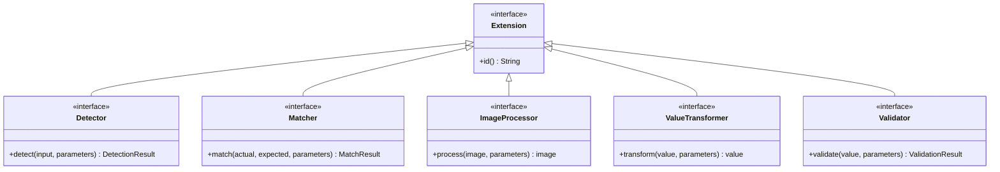

## 28. Extension Registry

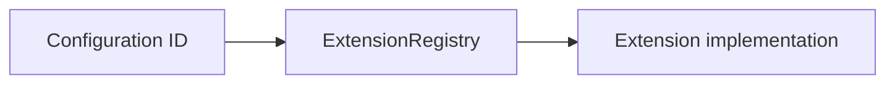

Registry powinien:

- wykrywać duplikaty ID,
- wykrywać brak rozszerzenia przed startem batcha,
- pozwalać GUI pobrać listę dostępnych rozszerzeń,
- docelowo udostępniać metadane parametrów.

## 29. Rejestracja rozszerzeń

Pierwsza wersja może wykorzystywać:

1. jawny bootstrap,
2. Java `ServiceLoader`,
3. ewentualnie lekki DI w przyszłości.

Preferowany jest brak zależności Core od ciężkiego frameworka DI.

## 30. Standard Extensions

| Rodzina          | Implementacje początkowe                           |
| ---------------- | -------------------------------------------------- |
| Matcher          | Exact, Normalized, Fuzzy, Regex                    |
| Detector         | Text Detector                                      |
| ImageProcessor   | Remove Boxes, Condense Content, Crop Empty Margins |
| ValueTransformer | Trim, Remove Whitespace, Substring, Normalize      |
| Validator        | PESEL, NIP, REGON, Dictionary, Regex               |

QR/barcode implementują `Detector`, ale mogą znajdować się w osobnym adapterze.

## 31. Konfiguracja kategorii

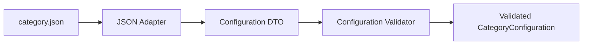

Po walidacji Core powinien pracować na zwalidowanym modelu, nie na `JsonNode` lub `Map<String,Object>`.

## 32. DTO konfiguracji vs model domenowy

Należy rozdzielić:

- DTO odpowiadające JSON,
- zwalidowany model konfiguracji używany przez Core.

Pozwala to rozwijać schema JSON bez bezpośredniego wiązania Domain z serializacją.

## 33. ProcessingProfile

Profil określa kontekst batcha i może zawierać:

- aktywne kategorie,
- ścieżki konfiguracji,
- parametry OCR,
- ustawienia orientacji,
- liczbę workerów lub możliwość override,
- ustawienia diagnostyczne,
- ustawienia eksportu.

## 34. ProcessingContext

```text
ProcessingContext
- ProcessingProfile
- List<ValidatedCategoryConfiguration>
- ExtensionRegistry
- OcrEngine
- DocumentLoaderRegistry
- DiagnosticOptions
```

Powinien być możliwie niemutowalny.

## 35. Batch Architecture

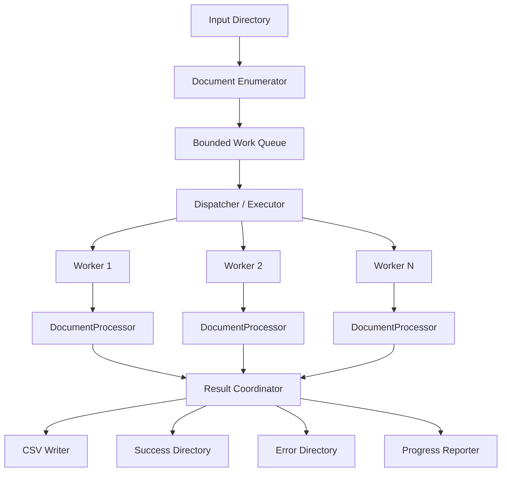

## 36. Dispatcher i Executor

Pierwszym kandydatem jest `ExecutorService`.

Do rozważenia:

- fixed thread pool,
- virtual threads,
- hybryda z ograniczeniem liczby równoległych instancji OCR.

Virtual threads nie zastępują limitu CPU/Tesseract, dlatego liczba jednoczesnych OCR musi być jawnie kontrolowana.

## 37. Bounded Queue i backpressure

Do kolejki powinny trafiać lekkie deskryptory:

```text
DocumentJob
- sourcePath
- jobId
```

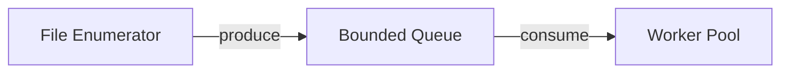

## 38. Worker

Worker wykonuje:

```text
take job
→ call DocumentProcessor
→ catch unexpected document-level failure
→ submit DocumentResult
```

Nie implementuje pipeline'u OCR.

## 39. Result Coordinator

Odpowiada za:

- odbiór `DocumentResult`,
- zapis CSV,
- przeniesienie do `success` lub `error`,
- aktualizację statystyk,
- raportowanie postępu.

Preferowany jest pojedynczy kontrolowany writer CSV.

## 40. Kolejność wyników

Równoległe wykonanie nie gwarantuje kolejności rekordów zgodnej z wejściem.

Nie jest wymagane zachowanie kolejności wejściowej, chyba że późniejsza specyfikacja to wymusi. Wymagana jest natomiast stabilna kolejność kolumn CSV.

## 41. Stany dokumentu w batchu

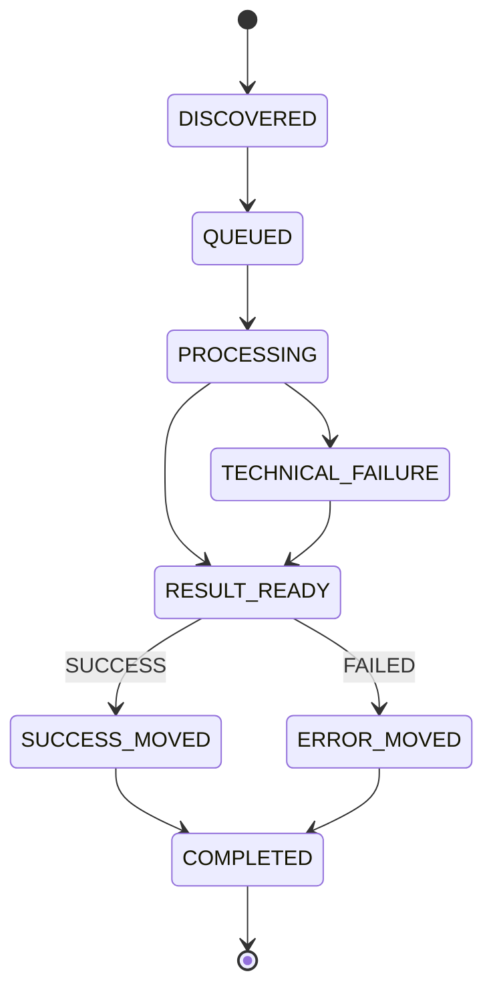

## 42. Przenoszenie plików

Operacje plikowe należą do batch/infrastructure, nie do `DocumentProcessor`.

Preferowany model:

1. plik znajduje się w input,
2. zostaje przypisany do joba,
3. processor odczytuje go bez modyfikacji,
4. wynik zostaje zapisany,
5. plik zostaje przeniesiony do success/error.

Opcjonalnie można wprowadzić katalog `processing`.

## 43. Atomic move

Adapter filesystem powinien próbować użyć atomic move, jeżeli filesystem je wspiera. Przy przenoszeniu między filesystemami może być potrzebny model:

```text
copy
→ verify
→ delete source
```

## 44. Model wyników

```text
DocumentResult
- documentId
- sourceName
- processingStatus
- categoryResult
- fieldResults[]
- errors[]
- warnings[]
- diagnostics
- configurationIdentity
```

## 45. FieldResult

```text
FieldResult
- fieldId
- extractionStatus
- rawValue
- transformedValue
- validationResults[]
- resolvedRegion
- errors[]
- warnings[]
```

Bogatszy model wynikowy jest potrzebny dla GUI i diagnostyki, nawet jeśli CSV eksportuje tylko część danych.

## 46. Model błędów

```text
ProcessingError
- code
- stage
- message
- fieldId?
- pageNumber?
- extensionId?
- technicalCause?
```

| Rodzina        | Przykłady                                  |
| -------------- | ------------------------------------------ |
| Configuration  | INVALID_CONFIGURATION                      |
| Input          | UNSUPPORTED_DOCUMENT, DOCUMENT_READ_FAILED |
| OCR            | OCR_FAILED                                 |
| Identification | CATEGORY_NOT_FOUND, CATEGORY_AMBIGUOUS     |
| Reference      | REFERENCE_NOT_FOUND                        |
| Geometry       | GEOMETRY_NORMALIZATION_FAILED              |
| Field          | REQUIRED_FIELD_NOT_FOUND                   |
| Validation     | FIELD_VALIDATION_FAILED                    |
| Output/File    | OUTPUT_WRITE_FAILED, FILE_MOVE_FAILED      |

## 47. Wyjątki vs wyniki błędów

Reguła:

- przewidywalny wynik biznesowy → obiekt wyniku,
- nieoczekiwany problem techniczny → wyjątek,
- granica przypadku użycia zamienia wyjątek na kontrolowany wynik, jeśli dalsza praca jest bezpieczna.

## 48. Walidacja konfiguracji

```mermaid
flowchart TD
    P["Processing Profile"] --> L["Load Configurations"]
    L --> S["Schema Validation"]
    S --> D["Domain Validation"]
    D --> E["Extension Resolution"]
    E --> R{"Valid?"}
    R -->|No| F["Fail Fast"]
    R -->|Yes| C["Create ProcessingContext"]
```

Przed batch'em należy zweryfikować m.in.:

- JSON,
- wersję schema,
- category ID,
- field ID,
- istnienie extensions,
- parametry,
- strony,
- regiony,
- konfigurację geometrii.

## 49. JavaFX Configurator

```mermaid
flowchart LR
    VIEW["JavaFX View"] --> VM["ViewModel / Controller"]
    VM --> UC["Application Use Cases"]
    UC --> CORE["Domain / Processing Core"]
```

UI nie powinien bezpośrednio wykonywać OCR, parsować hOCR, wyliczać geometrii ani walidować danych biznesowych.

## 50. Przypadki użycia Configuratora

```text
OpenReferenceDocumentUseCase
RunPageOcrUseCase
DetectAnchorUseCase
PreviewFieldUseCase
TestCategoryUseCase
SaveCategoryConfigurationUseCase
LoadCategoryConfigurationUseCase
ValidateConfigurationUseCase
```

## 51. Asynchroniczność JavaFX

```mermaid
sequenceDiagram
    participant UI as JavaFX UI
    participant BG as Background Executor
    participant UC as Use Case
    participant OCR as Tesseract

    UI->>BG: submit OCR task
    BG->>UC: execute
    UC->>OCR: recognize
    OCR-->>UC: result
    UC-->>BG: result
    BG-->>UI: update state on FX thread
```

Długie operacje nie mogą blokować JavaFX Application Thread.

## 52. Współrzędne GUI

```mermaid
flowchart LR
    SCREEN["Screen Coordinates"] <--> IMAGE["Image Coordinates"]
    IMAGE <--> REF["Reference Coordinates"]
```

Konwersje powinny być realizowane przez dedykowane komponenty.

## 53. CLI

```mermaid
flowchart TD
    A["CLI Arguments"] --> P["Argument Parser"]
    P --> B["Application Bootstrap"]
    B --> C["Configuration Validation"]
    C --> D["BatchProcessor"]
    D --> R["BatchResult"]
    R --> E["Exit Code"]
```

CLI ma minimalną odpowiedzialność: parse, bootstrap, start batch, output summary, exit code.

## 54. Bootstrap

Bootstrap odpowiada za:

- utworzenie adapterów,
- rejestrację extensions,
- utworzenie usług Core,
- zbudowanie `ProcessingContext`.

Nie powinien zawierać logiki biznesowej.

## 55. Dependency Injection

Nie ma potrzeby używania Spring Boot.

Preferowane są:

- constructor injection,
- jawny bootstrap,
- małe factory/buildery.

## 56. Zarządzanie zasobami

Preferowane mechanizmy:

```text
AutoCloseable
try-with-resources
ExecutorService lifecycle
```

Własność zasobów musi być jednoznaczna.

## 57. Cache

Dopuszczalny jest cache per dokument:

```text
DocumentProcessingState
- renderedPages
- pageOcrResults
- detectedFeatures
```

Globalny cache pełnych obrazów dokumentów nie jest przewidziany.

## 58. Thread safety

```mermaid
flowchart LR
    CONFIG["Immutable Config"] --> W1["Worker 1"]
    CONFIG --> W2["Worker 2"]
    CONFIG --> WN["Worker N"]

    W1 --> S1["Local Document State"]
    W2 --> S2["Local Document State"]
    WN --> SN["Local Document State"]
```

Preferowane są immutable configuration, stateless services i lokalny per-document state.

## 59. Logowanie i correlation ID

Każdy job powinien posiadać:

```text
batchId
documentJobId
sourceFileName
```

Dodatkowy kontekst:

```text
categoryId
fieldId
stage
workerId
```

Pełne dane osobowe nie powinny być domyślnie logowane.

## 60. Diagnostyka

`DiagnosticReport` może przechowywać:

- czasy etapów,
- użyte kotwice,
- wynik identyfikacji,
- wykorzystane punkty geometrii,
- confidence,
- statusy pipeline'u.

Artefakty binarne są opcjonalne i zapisywane tylko w trybie diagnostycznym.

## 61. Eksport CSV

```mermaid
flowchart LR
    R["DocumentResult"] --> MAP["ResultRowMapper"]
    MAP --> ROW["CSV Row"]
    ROW --> WR["CsvWriter"]
```

Core generuje `DocumentResult`; CSV jest adapterem wynikowym.

## 62. Dynamiczne rozszerzenia

```mermaid
flowchart LR
    J1["standard-extensions.jar"] --> SL["ServiceLoader / Plugin Loader"]
    J2["customer-extension.jar"] --> SL
    J3["other-extension.jar"] --> SL
    SL --> REG["ExtensionRegistry"]
```

Pierwsza wersja nie musi obsługiwać dynamicznych JAR-ów, ale Core powinien od początku korzystać z Registry/SPI.

## 63. Proponowana struktura pakietów

```text
pl.example.ocr.domain.document
pl.example.ocr.domain.geometry
pl.example.ocr.domain.field
pl.example.ocr.domain.validation
pl.example.ocr.domain.result

pl.example.ocr.application.processing
pl.example.ocr.application.identification
pl.example.ocr.application.geometry
pl.example.ocr.application.extraction
pl.example.ocr.application.configuration

pl.example.ocr.extension.api
pl.example.ocr.extension.standard

pl.example.ocr.adapter.pdfbox
pl.example.ocr.adapter.tesseract
pl.example.ocr.adapter.barcode
pl.example.ocr.adapter.json
pl.example.ocr.adapter.csv

pl.example.ocr.batch
pl.example.ocr.cli
pl.example.ocr.configurator
```

Root package zostanie ustalony wraz z nazwą projektu.

## 64. Architektura testów

| Poziom              | Zakres                                               |
| ------------------- | ---------------------------------------------------- |
| Unit                | Domain, geometry, matchers, validators, transformers |
| Application         | DocumentProcessor z mockowanymi portami              |
| Adapter integration | PDFBox, Tesseract, QR/barcode, JSON, CSV             |
| Batch integration   | Dispatcher, worker pool, filesystem                  |
| End-to-end          | Dokument → OCR → ekstrakcja → CSV                    |
| JavaFX component    | ViewModel/controller, praca poza FX thread           |
| Regression          | Referencyjne dokumenty                               |

## 65. Testowanie DocumentProcessor

```mermaid
flowchart LR
    TEST["Test"] --> DP["DocumentProcessor"]
    DP --> FAKEOCR["Fake OcrEngine"]
    DP --> FAKEDOC["Fake DocumentLoader"]
    DP --> EXTS["Real/Fake Extensions"]
    DP --> RESULT["DocumentResult"]
```

## 66. Testy integracyjne Tesseract

Powinny weryfikować:

- uruchomienie Tesseracta,
- generowanie hOCR,
- parser hOCR,
- OCR regionu,
- obsługę błędów.

Mogą być uruchamiane w osobnym profilu Maven.

## 67. Testy architektoniczne

Warto rozważyć ArchUnit.

Przykładowe reguły:

- domain nie zależy od adapterów,
- application nie zależy od JavaFX,
- CLI nie jest importowane przez Core,
- JavaFX nie korzysta z wewnętrznych klas adaptera Tesseract.

## 68. Sequence: produkcyjne przetwarzanie dokumentu

```mermaid
sequenceDiagram
    participant B as Batch Worker
    participant DP as DocumentProcessor
    participant DL as DocumentLoader
    participant OCR as OcrEngine
    participant ID as CategoryIdentificationService
    participant RD as ReferenceDetectionService
    participant GEO as GeometryNormalizationService
    participant FE as FieldExtractionService

    B->>DP: process(job)
    DP->>DL: inspect / render required pages
    DL-->>DP: PageImage(s)
    DP->>OCR: page OCR / hOCR
    OCR-->>DP: PageOcrResult(s)
    DP->>ID: identify
    ID-->>DP: IdentificationResult
    DP->>RD: detect anchors
    RD-->>DP: ReferenceFeatures
    DP->>GEO: normalize
    GEO-->>DP: GeometryTransform
    loop each configured field
        DP->>FE: extract field
        FE-->>DP: FieldResult
    end
    DP-->>B: DocumentResult
```

## 69. Sequence: test pola w JavaFX

```mermaid
sequenceDiagram
    participant U as User
    participant UI as JavaFX
    participant UC as PreviewFieldUseCase
    participant GEO as Geometry Service
    participant IMG as ImageProcessors
    participant OCR as OcrEngine
    participant TR as Transformers
    participant VAL as Validators

    U->>UI: Test field
    UI->>UC: preview(field, document)
    UC->>GEO: resolve region
    GEO-->>UC: ResolvedRegion
    UC->>IMG: process region
    IMG-->>UC: processed image
    UC->>OCR: recognize region
    OCR-->>UC: raw value
    UC->>TR: transform
    TR-->>UC: transformed value
    UC->>VAL: validate
    VAL-->>UC: validation result
    UC-->>UI: FieldPreviewResult
    UI-->>U: show all stages
```

## 70. Komponenty i odpowiedzialności

| Komponent                       | Odpowiedzialność                             |
| ------------------------------- | -------------------------------------------- |
| `DocumentProcessor`             | Orkiestracja przetwarzania jednego dokumentu |
| `DocumentLoader`                | Dostarczenie stron/obrazów dokumentu         |
| `OcrEngine`                     | OCR strony lub regionu                       |
| `HocrParser`                    | hOCR → wewnętrzny model OCR                  |
| `CategoryIdentificationService` | Wybór kategorii                              |
| `ReferenceDetectionService`     | Wykrywanie kotwic/reference features         |
| `GeometryNormalizationService`  | Wyznaczanie `GeometryTransform`              |
| `FieldExtractionService`        | Pipeline pojedynczego pola                   |
| `ExtensionRegistry`             | Rozwiązywanie extension ID                   |
| `ConfigurationLoader`           | Wczytywanie konfiguracji                     |
| `ConfigurationValidator`        | Walidacja przed użyciem                      |
| `BatchProcessor`                | Orkiestracja wsadu                           |
| `DocumentDispatcher`            | Przydzielanie jobów                          |
| `ResultCoordinator`             | Wyniki, CSV, przenoszenie plików             |
| `ProgressReporter`              | Statystyki i postęp                          |
| `Configurator Use Cases`        | Operacje interaktywnej konfiguracji          |

## 71. Zakazane zależności

```text
domain -> JavaFX
domain -> PDFBox
domain -> Tesseract
domain -> konkretna biblioteka JSON
application -> JavaFX
application -> parser CLI
application -> concrete PdfBoxDocumentLoader
application -> concrete Tesseract implementation
configurator-javafx -> internal classes Tesseract adaptera
```

## 72. Kandydaci na ADR

| ADR     | Temat                            |
| ------- | -------------------------------- |
| ADR-001 | JDK 21                           |
| ADR-002 | Maven multi-module               |
| ADR-003 | JavaFX zamiast web UI            |
| ADR-004 | Tesseract jako OCR               |
| ADR-005 | PDFBox do PDF                    |
| ADR-006 | Ports and Adapters dla Core      |
| ADR-007 | JSON jako konfiguracja kategorii |
| ADR-008 | Extension Registry i SPI         |
| ADR-009 | Model współbieżności batcha      |
| ADR-010 | Model `GeometryTransform`        |
| ADR-011 | Biblioteka QR/barcode            |
| ADR-012 | Integracja Java ↔ Tesseract      |

## 73. Otwarte decyzje architektoniczne

1. Nazwa projektu i root package.
2. Dokładne wersje zależności Maven.
3. Biblioteka JSON.
4. Biblioteka CSV.
5. Sposób integracji Java z Tesseractem.
6. Biblioteka QR/barcode.
7. Obsługa TIFF.
8. Algorytm detekcji orientacji.
9. Algorytm deskew.
10. Matematyczny model `GeometryTransform`.
11. Finalna semantyka `ReferenceFeature`.
12. Mechanizm rejestracji extensions.
13. Czy pierwsza wersja użyje `ServiceLoader`.
14. Model `ExecutorService`.
15. Czy używać virtual threads.
16. Limitowanie równoległego Tesseracta.
17. Katalog `processing`.
18. Polityka kolizji nazw plików.
19. Biblioteka logowania.
20. Format structured logging.
21. Pakowanie JavaFX.
22. Dostarczanie Tesseracta i danych językowych.

## 74. Kolejność implementacji

### Etap 1 — Skeleton

```text
parent pom
domain
application
extension-api
cli
configurator-javafx
```

### Etap 2 — Document I/O

```text
PDFBox
image input
page rasterization
```

### Etap 3 — OCR

```text
OcrEngine
Tesseract adapter
hOCR parser
```

### Etap 4 — Configuration

```text
JSON DTO
validation
CategoryConfiguration
ProcessingProfile
```

### Etap 5 — Identification

```text
rules
matchers
TextDetector
IdentificationResult
```

### Etap 6 — Geometry

```text
Anchor
ReferenceFeature
GeometryTransform
normalization strategy
```

### Etap 7 — Field extraction

```text
regions
image processors
field OCR
transformers
validators
```

### Etap 8 — Configurator MVP

```text
document viewer
hOCR overlay
anchor selection
field region
preview field
save JSON
```

### Etap 9 — Batch

```text
dispatcher
worker pool
result coordinator
success/error
CSV
progress
```

### Etap 10 — QR / barcode

```text
adapter
detector
classification
reference geometry
```

### Etap 11 — Hardening

```text
diagnostics
benchmarks
regression tests
memory tests
long-running batch tests
```

## 75. Architektura docelowa

```mermaid
flowchart TB
    subgraph USER["User-facing applications"]
        FX["JavaFX Configurator"]
        CLI["CLI"]
    end

    subgraph BATCH["Batch Layer"]
        BP["BatchProcessor"]
        DISP["DocumentDispatcher"]
        RC["ResultCoordinator"]
        PR["ProgressReporter"]
    end

    subgraph APPLICATION["Application Core"]
        DP["DocumentProcessor"]
        CID["CategoryIdentificationService"]
        RDS["ReferenceDetectionService"]
        GNS["GeometryNormalizationService"]
        FES["FieldExtractionService"]
        CVS["ConfigurationValidationService"]
    end

    subgraph DOMAIN["Domain"]
        DOC["Document Model"]
        CAT["Category Configuration"]
        GEO["Geometry Model"]
        FIELD["Field Model"]
        RESULT["Result / Error Model"]
    end

    subgraph EXT["Extension API / Registry"]
        REG["ExtensionRegistry"]
        DET["Detector"]
        MAT["Matcher"]
        IMG["ImageProcessor"]
        TR["ValueTransformer"]
        VAL["Validator"]
    end

    subgraph INFRA["Infrastructure"]
        PDF["PDFBox"]
        OCR["Tesseract + hOCR"]
        BAR["QR / Barcode"]
        JSON["JSON"]
        CSV["CSV"]
        FS["Filesystem"]
    end

    FX --> APPLICATION
    CLI --> BATCH
    BATCH --> DP
    BATCH --> CSV
    BATCH --> FS

    DP --> CID
    DP --> RDS
    DP --> GNS
    DP --> FES
    DP --> DOMAIN

    CID --> REG
    RDS --> REG
    FES --> REG

    REG --> DET
    REG --> MAT
    REG --> IMG
    REG --> TR
    REG --> VAL

    APPLICATION --> PDF
    APPLICATION --> OCR
    APPLICATION --> BAR
    APPLICATION --> JSON
```

## 76. Kryteria akceptacji architektury

Architektura jest zaakceptowana, jeśli:

1. Domain nie zależy od infrastruktury.
2. JavaFX i CLI korzystają ze wspólnego Core.
3. `DocumentProcessor` jest niezależny od batcha i GUI.
4. PDFBox i Tesseract są adapterami.
5. OCR jest dostępny przez port `OcrEngine`.
6. Reguły rozszerzalne są implementowane przez Extension API.
7. Kategorie są ładowane z JSON i walidowane przed wykonaniem.
8. Geometria jest osobną fazą pipeline'u.
9. `GeometryTransform` jest centralnym obiektem transformacji.
10. Field pipeline składa się z niezależnych etapów.
11. Batch kontroluje współbieżność i zasoby.
12. Worker nie zawiera logiki OCR.
13. Wyniki są reprezentowane przez `DocumentResult`.
14. CSV i operacje plikowe są poza domeną.
15. System można testować bez Tesseracta.
16. GUI nie blokuje FX Application Thread.
17. Rozszerzenia standardowe nie są zaszyte w `DocumentProcessor`.
18. Architektura nie wymaga Spring Boot.

## 77. Następny dokument

Rekomendowany następny dokument:

**`06-domain-model.md` — Model domenowy**

Powinien szczegółowo zdefiniować:

- klasy i value objects,
- relacje pomiędzy `Document`, `DocumentPage`, `DocumentCategory`,
- `Anchor` i `ReferenceFeature`,
- `BoundingBox`, `Region`, `GeometryTransform`,
- `FieldDefinition`,
- `FieldResult`,
- `ValidationResult`,
- `DocumentResult`,
- `ProcessingError`,
- modele konfiguracji,
- niezmienniki domenowe,
- zasady nullability,
- enumy i statusy,
- diagramy klas Mermaid.

Następne dokumenty:

- `07-processing-pipeline.md`,
- `08-category-configuration.md`,
- `09-profile-configuration.md`,
- `10-extension-api.md`.
