# Model domenowy

| Pole          | Wartość                                                        |
| ------------- | -------------------------------------------------------------- |
| ID dokumentu  | DOC-006                                                        |
| Tytuł         | Model domenowy                                                 |
| Wersja        | 0.1                                                            |
| Status        | Draft                                                          |
| Typ           | Domain Model                                                   |
| Źródło prawdy | Repozytorium dokumentacji projektu                             |
| Zależności    | `01-vision.md`, `02-glossary.md`, `03-functional-requirements.md`, `04-non-functional-requirements.md`, `05-architecture.md` |

## 1. Cel dokumentu

Celem dokumentu jest zdefiniowanie modelu domenowego systemu OCR na poziomie wystarczającym do rozpoczęcia implementacji klas domenowych i kontraktów aplikacyjnych.

Dokument określa:

- główne agregaty i encje,
- value objects,
- relacje pomiędzy obiektami,
- statusy i enumy,
- model konfiguracji,
- model geometrii,
- model OCR,
- model ekstrakcji pól,
- model walidacji,
- model wyników,
- model błędów,
- model trace/debug dla Configuratora,
- podstawowe niezmienniki domenowe,
- zasady nullability i immutability.

## 2. Decyzje techniczne mające wpływ na model

| Obszar                 | Decyzja |
| ---------------------- | ------- |
| Root package           | `pl.sk.ocr` |
| Java                   | JDK 21 |
| Build                  | Maven |
| Boilerplate            | Lombok również w modelu domenowym |
| OCR                    | Tess4J / `org.sourceforge.tess4j:tess4j` |
| QR/barcode             | ZXing |
| Extension loading      | `ServiceLoader` |
| Logging                | SLF4J + Logback, Lombok `@Slf4j` |
| Tesseract datapath     | Domyślna instalacja systemowa, opcjonalny override w konfiguracji |
| Domyślny język OCR     | `pol` |
| Diagnostyka UI         | `ProcessingTrace` / `StageResult` |
| Zapis obrazów trace    | Funkcja diagnostyczna poza Domain |

## 3. Zasady modelu domenowego

Model domenowy powinien być:

- możliwie niemutowalny,
- niezależny od JavaFX,
- niezależny od Tess4J,
- niezależny od ZXing,
- niezależny od parsera JSON,
- niezależny od CSV,
- niezależny od filesystemu,
- możliwy do utworzenia w testach bez infrastruktury.

Preferowane adnotacje Lombok:

```java
@Value
@Builder
@With
```

`@Data` powinno być stosowane ostrożnie, ponieważ automatyczne settery mogą naruszać niezmienniki domenowe.

## 4. Widok wysokopoziomowy

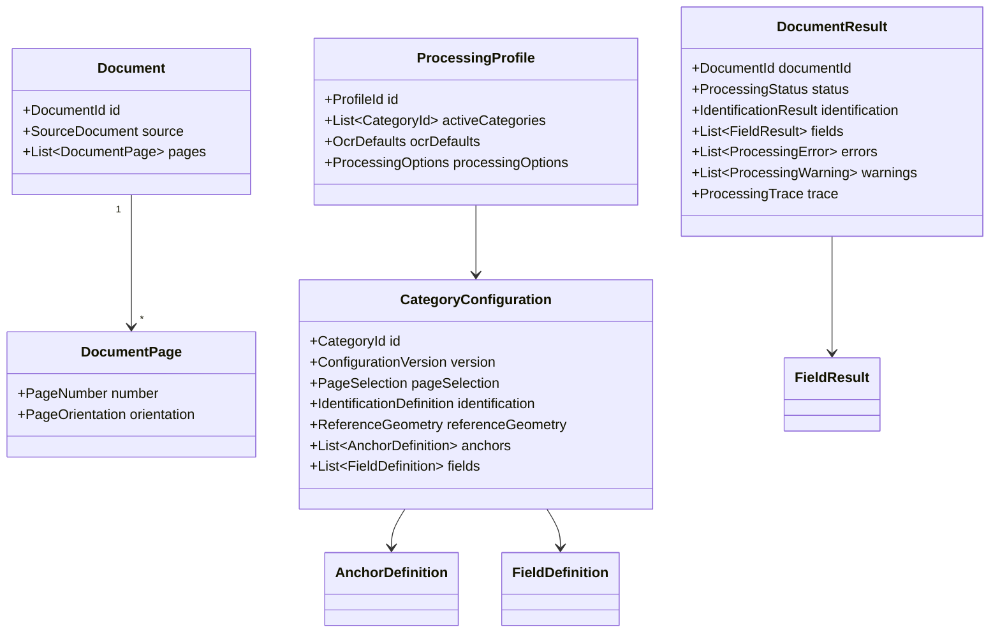

## 5. Document

`Document` reprezentuje logiczny dokument przetwarzany przez system.

```java
@Value
@Builder
public class Document {
    DocumentId id;
    SourceDocument source;
    List<DocumentPage> pages;
}
```

### Niezmienniki

- `id` nie może być null.
- `source` nie może być null.
- `pages` nie może być null.
- lista stron nie powinna zawierać null.
- numeracja stron musi być unikalna.

## 6. DocumentId

```java
@Value
public class DocumentId {
    String value;
}
```

Nie powinien być utożsamiany z nazwą pliku.

## 7. SourceDocument

```java
@Value
@Builder
public class SourceDocument {
    String sourceName;
    DocumentFormat format;
    long size;
}
```

Fizyczna ścieżka pliku należy do warstwy aplikacyjnej/infrastrukturalnej.

## 8. DocumentFormat

```java
public enum DocumentFormat {
    PDF,
    TIFF,
    PNG,
    JPEG
}
```

## 9. DocumentPage

```java
@Value
@Builder
public class DocumentPage {
    PageNumber number;
    PageOrientation orientation;
}
```

Ciężkie obrazy powinny być utrzymywane w stanie runtime, a nie bezwarunkowo w Domain.

## 10. PageNumber

```java
@Value
public class PageNumber {
    int value;
}
```

Niezmiennik:

```text
value >= 1
```

## 11. CategoryConfiguration

```java
@Value
@Builder
public class CategoryConfiguration {
    CategoryId id;
    ConfigurationVersion version;
    String displayName;
    PageSelection pageSelection;
    IdentificationDefinition identification;
    ReferenceGeometry referenceGeometry;
    List<AnchorDefinition> anchors;
    List<FieldDefinition> fields;
    DocumentValidationPolicy validationPolicy;
}
```

## 12. CategoryId

```java
@Value
public class CategoryId {
    String value;
}
```

## 13. ConfigurationVersion

```java
@Value
public class ConfigurationVersion {
    String value;
}
```

## 14. PageSelection

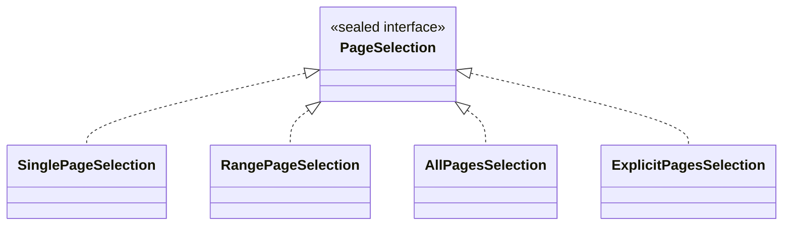

## 15. ProcessingProfile

```java
@Value
@Builder
public class ProcessingProfile {
    ProfileId id;
    List<CategoryId> activeCategories;
    OcrDefaults ocrDefaults;
    ProcessingOptions processingOptions;
    OutputOptions outputOptions;
}
```

## 16. OcrDefaults

```java
@Value
@Builder
public class OcrDefaults {
    @Builder.Default
    String language = "pol";

    String datapath;
    Integer dpi;
}
```

Reguły:

- domyślny język to `pol`,
- `datapath` może być pominięty,
- konfiguracja kategorii lub pola może nadpisać język.

## 17. OcrOptions

```java
@Value
@Builder
public class OcrOptions {
    String language;
    String datapath;
    Integer pageSegMode;
    Integer ocrEngineMode;
    Integer dpi;
    Map<String, String> variables;
}
```

## 18. IdentificationDefinition

```java
@Value
@Builder
public class IdentificationDefinition {
    List<IdentificationRuleGroup> groups;
}
```

Semantyka:

```text
group1 OR group2 OR group3
```

## 19. IdentificationRuleGroup

```java
@Value
@Builder
public class IdentificationRuleGroup {
    List<IdentificationCondition> conditions;
}
```

Semantyka:

```text
condition1 AND condition2 AND condition3
```

## 20. IdentificationCondition

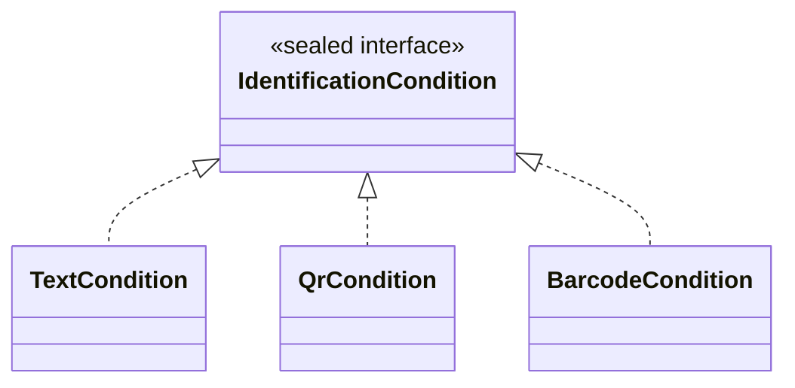

## 21. TextCondition

```java
@Value
@Builder
public class TextCondition implements IdentificationCondition {
    PageNumber page;
    ReferenceRegion searchRegion;
    String expectedText;
    ExtensionId matcherId;
    ExtensionParameters matcherParameters;
}
```

Brak `searchRegion` oznacza wyszukiwanie na całej stronie.

## 22. QrCondition

```java
@Value
@Builder
public class QrCondition implements IdentificationCondition {
    PageNumber page;
    ReferenceRegion searchRegion;
    String expectedValue;
    ExtensionId matcherId;
    ExtensionParameters matcherParameters;
}
```

## 23. IdentificationResult

```java
@Value
@Builder
public class IdentificationResult {
    IdentificationStatus status;
    CategoryId categoryId;
    List<CategoryMatchResult> categoryMatches;
}
```

## 24. IdentificationStatus

```java
public enum IdentificationStatus {
    MATCHED,
    NOT_MATCHED,
    AMBIGUOUS,
    ERROR
}
```

## 25. CategoryMatchResult

```java
@Value
@Builder
public class CategoryMatchResult {
    CategoryId categoryId;
    boolean matched;
    List<ConditionMatchResult> conditions;
}
```

## 26. MatchResult

```java
@Value
@Builder
public class MatchResult {
    boolean matched;
    Double score;
    String actual;
    String expected;
}
```

`score` może być null dla matcherów bez wyniku liczbowego.

## 27. ExtensionId

```java
@Value
public class ExtensionId {
    String value;
}
```

Przykłady:

```text
exact
fuzzy
text
qr
remove-boxes
substring
pesel
```

## 28. ExtensionParameters

```java
@Value
public class ExtensionParameters {
    Map<String, Object> values;
}
```

To kontrolowana granica dla dynamicznych parametrów rozszerzeń.

## 29. AnchorDefinition

```java
@Value
@Builder
public class AnchorDefinition {
    AnchorId id;
    PageNumber page;
    ExtensionId detectorId;
    ReferenceRegion searchRegion;
    ExtensionParameters detectorParameters;
    boolean required;
    ReferenceFeatureDefinition referenceFeature;
}
```

## 30. AnchorId

```java
@Value
public class AnchorId {
    String value;
}
```

## 31. ReferenceFeatureDefinition

```java
@Value
@Builder
public class ReferenceFeatureDefinition {
    BoundingBox expectedBounds;
    Point2D expectedCenter;
    Double expectedRotation;
}
```

## 32. ReferenceFeature

```java
@Value
@Builder
public class ReferenceFeature {
    AnchorId anchorId;
    BoundingBox bounds;
    Point2D center;
    List<Point2D> characteristicPoints;
    Double rotation;
    String detectedValue;
    Double confidence;
}
```

`ReferenceFeature` jest preferowaną nazwą względem `ReferencePoint`, ponieważ QR i inne obiekty mają własną geometrię.

## 33. BoundingBox

```java
@Value
@Builder
public class BoundingBox {
    double x;
    double y;
    double width;
    double height;
}
```

Niezmienniki:

```text
width >= 0
height >= 0
```

## 34. Point2D

Nie należy wykorzystywać `javafx.geometry.Point2D` w Domain.

```java
@Value
public class Point2D {
    double x;
    double y;
}
```

## 35. ReferenceRegion

```java
@Value
@Builder
public class ReferenceRegion {
    BoundingBox bounds;
}
```

## 36. ResolvedRegion

```java
@Value
@Builder
public class ResolvedRegion {
    BoundingBox bounds;
    PageNumber page;
}
```

## 37. ReferenceGeometry

```java
@Value
@Builder
public class ReferenceGeometry {
    double referenceWidth;
    double referenceHeight;
    GeometryNormalizationDefinition normalization;
}
```

## 38. GeometryNormalizationDefinition

```java
@Value
@Builder
public class GeometryNormalizationDefinition {
    GeometryStrategy strategy;
    List<AnchorId> anchorIds;
    ExtensionParameters parameters;
}
```

## 39. GeometryStrategy

```java
public enum GeometryStrategy {
    SINGLE_REFERENCE,
    TWO_REFERENCE_SIMILARITY,
    MULTI_REFERENCE
}
```

## 40. GeometryTransform

```java
@Value
@Builder
public class GeometryTransform {
    double m00;
    double m01;
    double m02;
    double m10;
    double m11;
    double m12;
}
```

Transformacja:

```text
x' = m00*x + m01*y + m02
y' = m10*x + m11*y + m12
```

Minimalnie reprezentuje translację, skalę i rotację.

## 41. GeometryNormalizationResult

```java
@Value
@Builder
public class GeometryNormalizationResult {
    GeometryStatus status;
    GeometryTransform transform;
    List<AnchorId> usedAnchors;
    List<ProcessingWarning> warnings;
}
```

## 42. GeometryStatus

```java
public enum GeometryStatus {
    SUCCESS,
    DEGRADED,
    FAILED
}
```

## 43. FieldDefinition

```java
@Value
@Builder
public class FieldDefinition {
    FieldId id;
    String displayName;
    PageNumber page;
    ReferenceRegion region;
    boolean required;
    OcrOptions ocrOptions;
    ImageProcessingPipeline imageProcessing;
    ValueTransformationPipeline transformations;
    List<ValidatorDefinition> validators;
    FieldValidationPolicy validationPolicy;
    FieldOutputDefinition output;
}
```

## 44. FieldId

```java
@Value
public class FieldId {
    String value;
}
```

## 45. ImageProcessingPipeline

```java
@Value
@Builder
public class ImageProcessingPipeline {
    List<ImageProcessingStep> steps;
}
```

## 46. ImageProcessingStep

```java
@Value
@Builder
public class ImageProcessingStep {
    ExtensionId processorId;
    ExtensionParameters parameters;
}
```

## 47. ValueTransformationPipeline

```java
@Value
@Builder
public class ValueTransformationPipeline {
    List<ValueTransformationStep> steps;
}
```

## 48. ValueTransformationStep

```java
@Value
@Builder
public class ValueTransformationStep {
    ExtensionId transformerId;
    ExtensionParameters parameters;
}
```

## 49. ValidatorDefinition

```java
@Value
@Builder
public class ValidatorDefinition {
    ExtensionId validatorId;
    ExtensionParameters parameters;
}
```

## 50. FieldValidationPolicy

```java
@Value
@Builder
public class FieldValidationPolicy {
    boolean failDocumentOnInvalid;
    boolean failDocumentOnError;
}
```

## 51. DocumentValidationPolicy

```java
@Value
@Builder
public class DocumentValidationPolicy {
    boolean failOnMissingRequiredField;
    boolean failOnRequiredAnchorMissing;
}
```

## 52. FieldOutputDefinition

```java
@Value
@Builder
public class FieldOutputDefinition {
    boolean exported;
    String columnName;
    boolean exportValidationStatus;
}
```

## 53. FieldResult

```java
@Value
@Builder
public class FieldResult {
    FieldId fieldId;
    FieldExtractionStatus extractionStatus;
    ResolvedRegion resolvedRegion;
    String rawValue;
    String transformedValue;
    List<ValidationResult> validationResults;
    List<ProcessingError> errors;
    List<ProcessingWarning> warnings;
    List<StageResult> stages;
}
```

## 54. FieldExtractionStatus

```java
public enum FieldExtractionStatus {
    SUCCESS,
    SUCCESS_WITH_WARNINGS,
    NOT_FOUND,
    OCR_FAILED,
    TRANSFORMATION_FAILED,
    VALIDATION_FAILED,
    ERROR
}
```

## 55. ValidationResult

```java
@Value
@Builder
public class ValidationResult {
    ExtensionId validatorId;
    ValidationStatus status;
    String message;
}
```

## 56. ValidationStatus

```java
public enum ValidationStatus {
    VALID,
    INVALID,
    NOT_VALIDATED,
    ERROR
}
```

## 57. DocumentResult

```java
@Value
@Builder
public class DocumentResult {
    DocumentId documentId;
    String sourceName;
    ProcessingStatus status;
    IdentificationResult identification;
    GeometryNormalizationResult geometry;
    List<FieldResult> fields;
    List<ProcessingError> errors;
    List<ProcessingWarning> warnings;
    ConfigurationIdentity configurationIdentity;
    ProcessingTrace trace;
}
```

## 58. ProcessingStatus

```java
public enum ProcessingStatus {
    SUCCESS,
    SUCCESS_WITH_WARNINGS,
    FAILED
}
```

## 59. ConfigurationIdentity

```java
@Value
@Builder
public class ConfigurationIdentity {
    ProfileId profileId;
    CategoryId categoryId;
    ConfigurationVersion version;
    String configurationHash;
}
```

## 60. ProcessingError

```java
@Value
@Builder
public class ProcessingError {
    ErrorCode code;
    ProcessingStage stage;
    String message;
    PageNumber page;
    FieldId fieldId;
    AnchorId anchorId;
    ExtensionId extensionId;
}
```

Domain nie powinien przechowywać `Throwable`.

## 61. ProcessingWarning

```java
@Value
@Builder
public class ProcessingWarning {
    WarningCode code;
    ProcessingStage stage;
    String message;
    PageNumber page;
    FieldId fieldId;
    AnchorId anchorId;
}
```

## 62. ErrorCode

```java
public enum ErrorCode {
    INVALID_CONFIGURATION,
    UNSUPPORTED_DOCUMENT,
    DOCUMENT_READ_FAILED,
    PAGE_RENDER_FAILED,
    OCR_FAILED,
    CATEGORY_NOT_FOUND,
    CATEGORY_AMBIGUOUS,
    REFERENCE_NOT_FOUND,
    GEOMETRY_NORMALIZATION_FAILED,
    FIELD_REGION_INVALID,
    REQUIRED_FIELD_NOT_FOUND,
    IMAGE_PROCESSING_FAILED,
    VALUE_TRANSFORMATION_FAILED,
    FIELD_VALIDATION_FAILED,
    OUTPUT_WRITE_FAILED,
    FILE_MOVE_FAILED,
    INTERNAL_ERROR
}
```

## 63. WarningCode

```java
public enum WarningCode {
    LOW_OCR_CONFIDENCE,
    OPTIONAL_REFERENCE_NOT_FOUND,
    OPTIONAL_FIELD_NOT_FOUND,
    DEGRADED_GEOMETRY,
    FIELD_INVALID_BUT_ACCEPTED,
    PARTIAL_DIAGNOSTIC_DATA
}
```

## 64. ProcessingStage

```java
public enum ProcessingStage {
    DOCUMENT_LOAD,
    PAGE_RENDER,
    ORIENTATION,
    PAGE_OCR,
    IDENTIFICATION,
    REFERENCE_DETECTION,
    GEOMETRY_NORMALIZATION,
    FIELD_REGION_RESOLUTION,
    IMAGE_PROCESSING,
    FIELD_OCR,
    VALUE_TRANSFORMATION,
    VALIDATION,
    RESULT_BUILDING,
    OUTPUT
}
```

## 65. ProcessingTrace

```java
@Value
@Builder
public class ProcessingTrace {
    TraceMode mode;
    List<StageResult> stages;
}
```

Trace służy przede wszystkim Configuratorowi i diagnostyce.

## 66. TraceMode

```java
public enum TraceMode {
    OFF,
    BASIC,
    FULL
}
```

Rekomendacja:

- CLI: `OFF` albo `BASIC`,
- Configurator: `FULL`.

## 67. StageResult

```java
@Value
@Builder
public class StageResult {
    StageId id;
    ProcessingStage stage;
    String operation;
    StageStatus status;
    PageNumber page;
    FieldId fieldId;
    AnchorId anchorId;
    ImageSnapshotRef inputImage;
    ImageSnapshotRef outputImage;
    ResolvedRegion region;
    String recognizedText;
    Map<String, String> context;
    java.time.Duration duration;
    List<ProcessingError> errors;
    List<ProcessingWarning> warnings;
}
```

## 68. StageStatus

```java
public enum StageStatus {
    SUCCESS,
    SUCCESS_WITH_WARNINGS,
    SKIPPED,
    FAILED
}
```

## 69. StageId

```java
@Value
public class StageId {
    String value;
}
```

## 70. ImageSnapshotRef

```java
@Value
@Builder
public class ImageSnapshotRef {
    String id;
    int width;
    int height;
}
```

Domain przechowuje referencję, nie ciężki obraz.

## 71. TraceImageStore

To kontrakt application, a nie element Domain.

```java
interface TraceImageStore {
    ImageSnapshotRef put(ProcessingImage image);
    Optional<ProcessingImage> get(ImageSnapshotRef ref);
}
```

Configurator może trzymać obrazy w pamięci.

## 72. Diagnostyczny eksport obrazów

Zapis na dysk pozostaje funkcją diagnostyczną poza Domain.

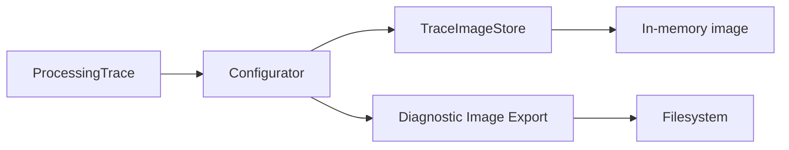

## 73. Trace etapów graficznych

Każda operacja graficzna powinna móc dostarczyć:

- obraz wejściowy,
- obraz wynikowy,
- parametry,
- region,
- czas,
- ostrzeżenia i błędy.

Dotyczy to m.in.:

- ekstrakcji/crop regionu,
- usuwania ramek,
- kondensacji,
- usuwania pustych marginesów,
- innych przyszłych `ImageProcessor`.

## 74. Trace OCR

Dla OCR StageResult powinien móc zawierać:

```text
inputImage
recognizedText
confidence
resolved OcrOptions
duration
```

## 75. Trace transformacji

Dla transformacji tekstowych `context` może zawierać:

```text
inputValue
outputValue
transformerId
parameters
```

## 76. Trace walidacji

```text
inputValue
validatorId
validationStatus
message
```

## 77. Przykład trace pola

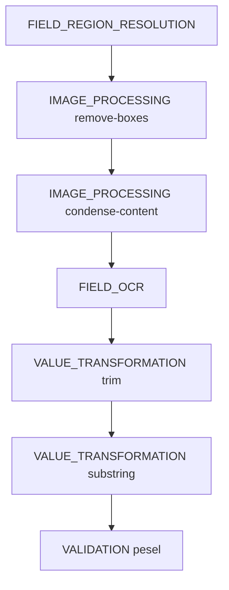

Każdy etap odpowiada odrębnemu `StageResult`, który Configurator może prezentować użytkownikowi.

## 78. ProcessingImage

Obiekt runtime nie powinien należeć do czystego Domain.

Koncepcyjny port:

```java
public interface ProcessingImage {
    int width();
    int height();
}
```

## 79. Extension metadata

```java
@Value
@Builder
public class ExtensionDescriptor {
    ExtensionId id;
    ExtensionType type;
    String displayName;
    String description;
    List<ExtensionParameterDescriptor> parameters;
}
```

## 80. ExtensionType

```java
public enum ExtensionType {
    DETECTOR,
    MATCHER,
    IMAGE_PROCESSOR,
    VALUE_TRANSFORMER,
    VALIDATOR
}
```

## 81. ExtensionParameterDescriptor

```java
@Value
@Builder
public class ExtensionParameterDescriptor {
    String name;
    ParameterType type;
    boolean required;
    String description;
    String defaultValue;
}
```

## 82. ParameterType

```java
public enum ParameterType {
    STRING,
    INTEGER,
    DECIMAL,
    BOOLEAN,
    ENUM,
    REGEX,
    FILE,
    DIRECTORY
}
```

## 83. Extension Registry

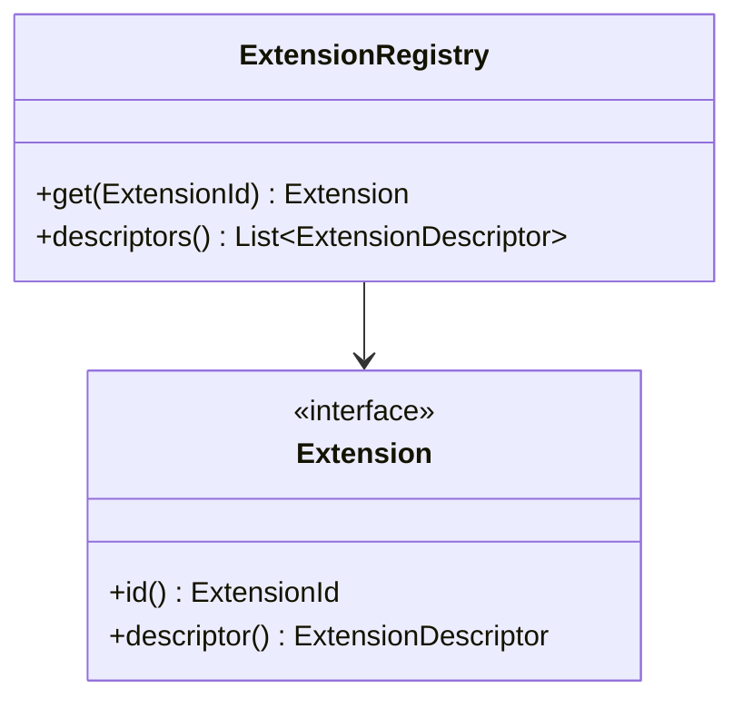

## 84. ServiceLoader

Rozszerzenia są wykrywane przez `ServiceLoader` poza Domain.

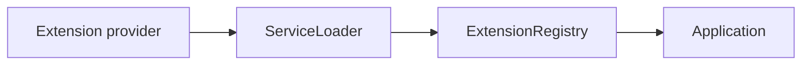

## 85. Standardowe rozszerzenia

| Typ              | ID robocze |
| ---------------- | ---------- |
| Matcher          | `exact` |
| Matcher          | `normalized` |
| Matcher          | `fuzzy` |
| Matcher          | `regex` |
| Detector         | `text` |
| Detector         | `qr` |
| Detector         | `barcode` |
| ImageProcessor   | `remove-boxes` |
| ImageProcessor   | `condense-content` |
| ImageProcessor   | `crop-empty-margins` |
| ValueTransformer | `trim` |
| ValueTransformer | `remove-whitespace` |
| ValueTransformer | `substring` |
| ValueTransformer | `normalize` |
| Validator        | `pesel` |
| Validator        | `nip` |
| Validator        | `regon` |
| Validator        | `dictionary` |
| Validator        | `regex` |

## 86. ZXing a model domenowy


Typy ZXing nie powinny przenikać do Domain.

## 87. Tess4J a model domenowy

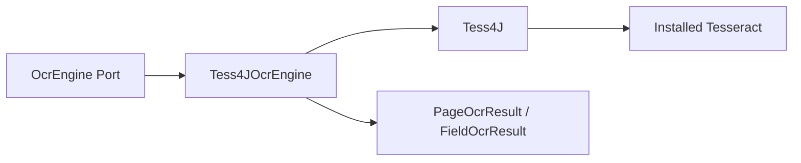

Typy Tess4J nie powinny przenikać do Domain.

## 88. PageOcrResult

```java
@Value
@Builder
public class PageOcrResult {
    PageNumber page;
    List<OcrElement> elements;
    String plainText;
    Double meanConfidence;
}
```

## 89. OcrElement

```java
@Value
@Builder
public class OcrElement {
    OcrElementType type;
    String text;
    BoundingBox bounds;
    Double confidence;
}
```

## 90. OcrElementType

```java
public enum OcrElementType {
    WORD,
    LINE,
    BLOCK
}
```

## 91. FieldOcrResult

```java
@Value
@Builder
public class FieldOcrResult {
    String text;
    Double confidence;
}
```

## 92. DictionaryReference

```java
@Value
@Builder
public class DictionaryReference {
    String id;
    String location;
}
```

Duże słowniki nie powinny być kopiowane bezpośrednio do każdej definicji pola.

## 93. Nullability

Zasady:

- dane wymagane → non-null,
- kolekcje → nigdy null,
- pola opcjonalne → jawnie opcjonalne/nullable tam, gdzie ma to znaczenie,
- nie należy używać `Optional` masowo jako pól value objects.

## 94. Collections

Listy i mapy w modelu niemutowalnym powinny być kopiowane defensywnie lub konwertowane do immutable collections.

`@Value` nie gwarantuje niemutowalności zawartości `List` i `Map`.

## 95. Map<String, Object>

Jest dopuszczalna wyłącznie jako wewnętrzna reprezentacja `ExtensionParameters`.

Nie może zastępować jawnych klas domenowych.

## 96. Niezmienniki konfiguracji kategorii

Przed utworzeniem zwalidowanego modelu należy sprawdzić:

1. poprawność `CategoryId`,
2. unikalność `FieldId`,
3. unikalność `AnchorId`,
4. poprawność referencji do Anchor,
5. dostępność wszystkich `ExtensionId`,
6. poprawność stron,
7. geometrię regionów,
8. kompletność wymaganych pól,
9. brak null w pipeline'ach,
10. zgodność strategii geometrii z wymaganymi kotwicami.

## 97. Niezmienniki FieldDefinition

- `FieldId` niepuste,
- `page >= 1`,
- poprawny region,
- pipeline'y i lista validatorów nigdy null,
- `required` wpływa na politykę dokumentu, a nie sam mechanizm OCR.

## 98. Niezmienniki GeometryTransform

Współczynniki nie mogą zawierać `NaN` ani `Infinity`.

Niepoprawna transformacja skutkuje `GeometryNormalizationResult.FAILED`.

## 99. Niezmienniki ProcessingTrace

- etapy są uporządkowane chronologicznie,
- `StageId` jest unikalne,
- trace nie wpływa na wynik biznesowy,
- tryb `OFF` i `FULL` muszą dawać ten sam rezultat domenowy.

## 100. Relacja wyniku i trace

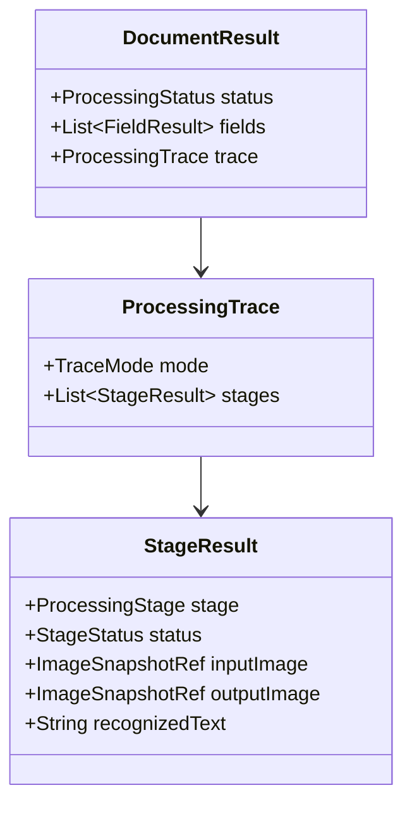

## 101. Pełny model kategorii

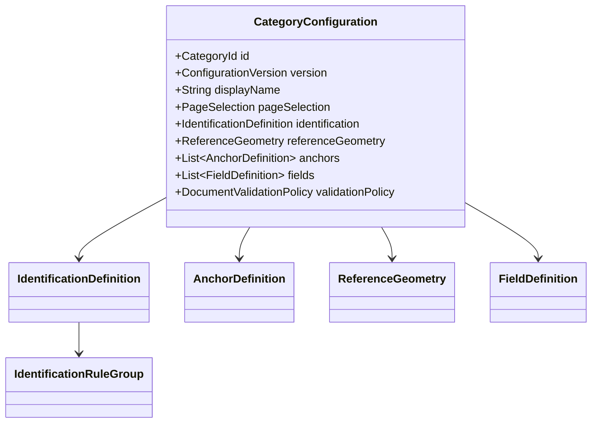

## 102. Pełny model pola

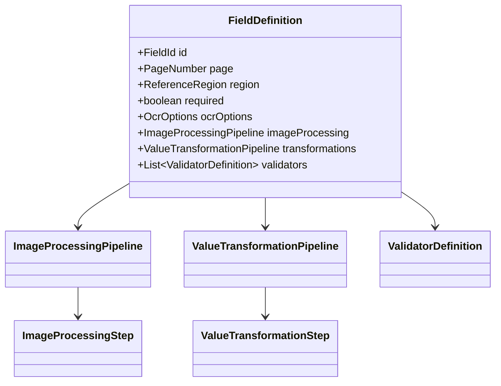

## 103. Model geometryczny

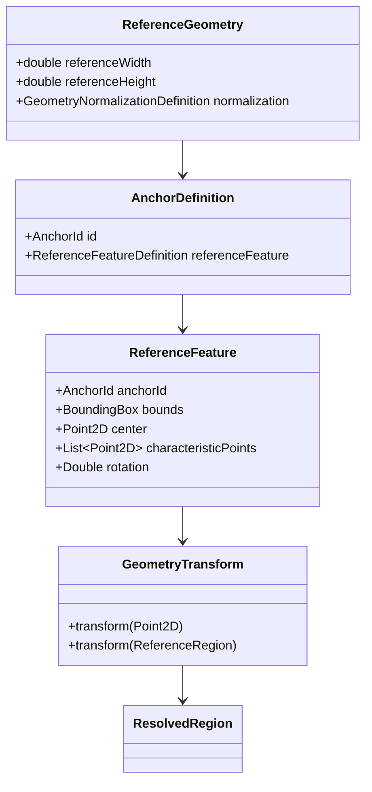

## 104. Model wyniku

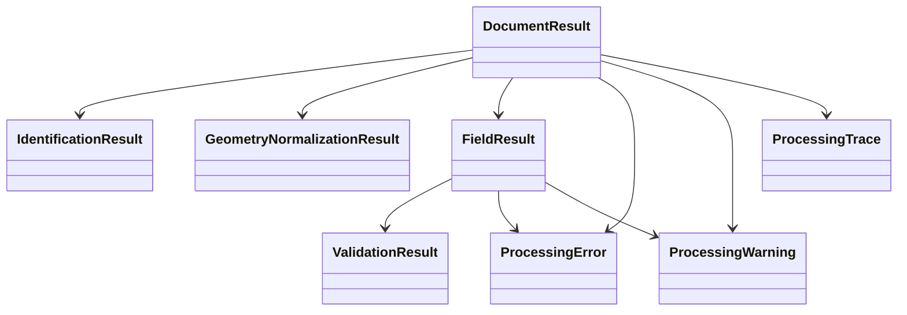

## 105. Pakiety domenowe

```text
pl.sk.ocr.domain.document
pl.sk.ocr.domain.category
pl.sk.ocr.domain.identification
pl.sk.ocr.domain.ocr
pl.sk.ocr.domain.geometry
pl.sk.ocr.domain.anchor
pl.sk.ocr.domain.field
pl.sk.ocr.domain.validation
pl.sk.ocr.domain.result
pl.sk.ocr.domain.error
pl.sk.ocr.domain.trace
pl.sk.ocr.domain.extension
pl.sk.ocr.domain.profile
```

## 106. Pakiety application

```text
pl.sk.ocr.application.processing
pl.sk.ocr.application.identification
pl.sk.ocr.application.reference
pl.sk.ocr.application.geometry
pl.sk.ocr.application.extraction
pl.sk.ocr.application.configuration
pl.sk.ocr.application.trace
pl.sk.ocr.application.port
```

## 107. Lombok — zasady użycia

Rekomendowane:

```java
@Value
@Builder
@With
@RequiredArgsConstructor
@Slf4j
```

`@Data` jest niepreferowane w Domain, jeżeli generuje publiczne settery.

## 108. equals/hashCode

Value objects powinny posiadać semantykę wartości. `@Value` jest odpowiednie dla ID, geometrii i innych niemutowalnych typów.

## 109. Builder

Builder jest zalecany dla większych obiektów. Dla prostych value objects preferowany jest konstruktor.

## 110. Domain services vs application services

Do Domain mogą należeć czyste algorytmy, np.:

```text
GeometryTransformCalculator
PeselChecksum
```

Orkiestracja z wykorzystaniem infrastruktury należy do Application.

## 111. TraceCollector

Pipeline powinien zapisywać trace przez opcjonalny sink.

```java
interface TraceCollector {
    void record(StageResult stage);
}
```

Implementacje:

```text
NoOpTraceCollector
BasicTraceCollector
FullTraceCollector
```

## 112. TraceCollector i obrazy

```text
processor input
→ TraceImageStore.put(image)
→ ImageSnapshotRef
→ StageResult
```

## 113. BatchId i DocumentJobId

Są elementami Application/Batch, nie czystego `Document`.

## 114. ProcessingContext

```text
ProcessingContext
- ProcessingProfile
- Validated categories
- ExtensionRegistry
- OcrEngine
- Document loaders
- TraceCollector
```

## 115. DTO JSON

DTO serializacyjne należą do:

```text
pl.sk.ocr.adapter.json.dto
```


## 116. Domain a JavaFX


Domain nie posiada JavaFX properties ani screen coordinates.

## 117. Domain a CSV


Nie należy dodawać do Domain metod `toCsv()`.

## 118. Domyślne opcje OCR

Zasada nadpisywania:

```text
Application defaults
    ↓
ProcessingProfile defaults
    ↓
Category overrides
    ↓
Field overrides
```

Najbardziej szczegółowa konfiguracja wygrywa.

Domyślny język:

```text
pol
```

## 119. OcrOptionsResolver

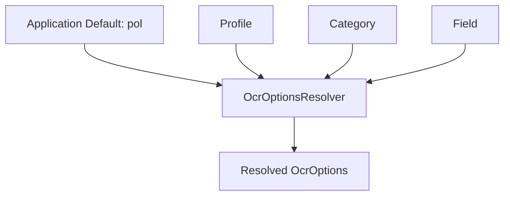

## 120. BatchItemResult

Model aplikacyjny:

```java
@Value
@Builder
public class BatchItemResult {
    DocumentJobId jobId;
    DocumentResult documentResult;
    FileDispositionStatus fileDispositionStatus;
}
```

## 121. FileDispositionStatus

```java
public enum FileDispositionStatus {
    NOT_MOVED,
    MOVED_TO_SUCCESS,
    MOVED_TO_ERROR,
    MOVE_FAILED
}
```

## 122. Brak katalogu processing

Model nie przewiduje katalogu `processing`.

Przydział pliku do jednego workera zabezpiecza dispatcher i kolejka.

## 123. Brak kolizji nazw

Założenie projektowe: nazwy plików nie kolidują.

Niespodziewana kolizja jest błędem operacji plikowej, a nie przypadkiem do automatycznego rename.

## 124. DictionaryProvider

```java
interface DictionaryProvider {
    DictionaryData load(DictionaryReference reference);
}
```

Storage słowników pozostaje poza Domain.

## 125. Validator a korekta wartości

Validator nie zmienia wartości.

Korekta typu:

```text
O -> 0
I -> 1
```

jest `ValueTransformer`.

## 126. Confidence

Nie tworzymy jednego globalnego confidence.

Rozróżniamy m.in.:

```text
ocrConfidence
detectorConfidence
matchScore
```

## 127. Model statusów

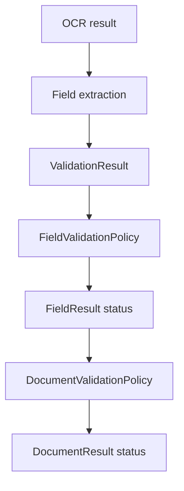

## 128. Przykład pola PESEL

```text
FieldDefinition
  id = "pesel"
  page = 1
  region = ...
  required = true

  imageProcessing:
    - remove-boxes
    - condense-content

  transformations:
    - trim
    - remove-whitespace
    - substring(start=0, length=11)

  validators:
    - pesel

  validationPolicy:
    failDocumentOnInvalid = true

  output:
    exported = true
    columnName = "pesel"
    exportValidationStatus = true
```

## 129. Przykład trace PESEL

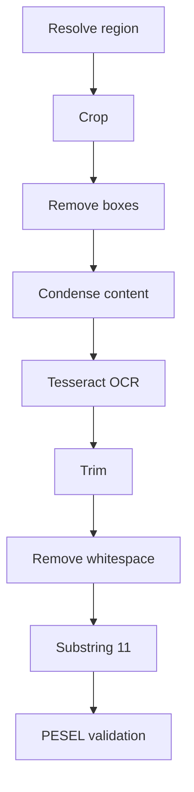

Configurator powinien umożliwiać wybór każdego etapu i prezentować odpowiedni `StageResult`, w tym obraz i tekst, jeżeli są dostępne.

## 130. Kryteria kompletności modelu

Model jest wystarczający do rozpoczęcia implementacji, jeżeli:

1. `CategoryConfiguration` nie zależy od JSON.
2. `DocumentResult` nie zależy od CSV.
3. Domain nie zależy od JavaFX/AWT.
4. `ReferenceFeature` reprezentuje tekst i QR.
5. `GeometryTransform` jest osobnym value object.
6. `FieldDefinition` posiada pipeline obrazu, transformacji i walidacji.
7. `ProcessingTrace` opisuje wszystkie etapy podglądu.
8. Trace nie zmienia semantyki pipeline'u.
9. Extensions są identyfikowane przez `ExtensionId`.
10. Tess4J i ZXing pozostają w adapterach.
11. model jest kompatybilny z Lombok.
12. język `pol` jest domyślny i może zostać nadpisany.
13. `ServiceLoader` nie przenika do Domain.
14. błędy i ostrzeżenia są jawnie modelowane.
15. brak katalogu `processing` jest uwzględniony.
16. brak kolizji nazw jest jawnie przyjętym założeniem.

## 131. Następny dokument

Rekomendowany następny dokument:

**`07-processing-pipeline.md` — Szczegółowy pipeline przetwarzania**

Powinien określić:

- kolejność etapów,
- wejścia i wyjścia każdego etapu,
- cache per dokument,
- emitowanie `StageResult`,
- propagację błędów,
- skipowanie etapów,
- OCR strony vs OCR regionu,
- lifecycle obrazów,
- integrację orientacji i geometrii,
- diagramy sekwencji,
- pseudokod `DocumentProcessor`,
- pseudokod `FieldExtractionService`.

Następnie:

- `08-category-configuration.md`,
- `09-profile-configuration.md`,
- `10-extension-api.md`.
