# Pipeline przetwarzania

| Pole          | Wartość                                                        |
| ------------- | -------------------------------------------------------------- |
| ID dokumentu  | DOC-007                                                        |
| Tytuł         | Szczegółowy pipeline przetwarzania                             |
| Wersja        | 0.1                                                            |
| Status        | Draft                                                          |
| Typ           | Processing Pipeline                                            |
| Źródło prawdy | Repozytorium dokumentacji projektu                             |
| Zależności    | `01-vision.md`, `02-glossary.md`, `03-functional-requirements.md`, `04-non-functional-requirements.md`, `05-architecture.md`, `06-domain-model.md` |

## 1. Cel dokumentu

Celem dokumentu jest zdefiniowanie szczegółowego przebiegu przetwarzania dokumentu i pojedynczego pola.

Dokument określa:

- kolejność etapów pipeline'u dokumentu,
- wejścia i wyjścia etapów,
- warunki wykonania i pomijania etapów,
- zasady cache per dokument,
- lifecycle obrazów,
- sposób generowania `ProcessingTrace` i `StageResult`,
- zasady propagacji błędów,
- zasady budowania `DocumentResult`,
- pseudokod `DocumentProcessor`,
- pseudokod `FieldExtractionService`,
- interakcję z Tess4J, PDFBox, ZXing i rozszerzeniami,
- zachowanie w Configuratorze i w CLI.

## 2. Zasada nadrzędna

Pipeline wysokiego poziomu jest kontrolowany przez system.

Konfiguracja kategorii nie może dowolnie zmieniać kolejności głównych faz:

```text
document load
→ page preparation
→ page OCR
→ category identification
→ reference detection
→ geometry normalization
→ field extraction
→ document validation
→ result
```

Konfigurowalne są natomiast pipeline'y wewnątrz pola:

```text
resolve region
→ image processors[]
→ field OCR
→ value transformers[]
→ validators[]
```

## 3. Główny pipeline dokumentu

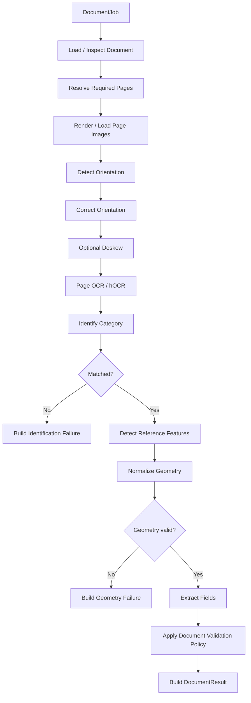

## 4. Etapy pipeline'u dokumentu

| Etap | Wejście | Wyjście | Może zostać pominięty |
| ---- | ------- | ------- | --------------------- |
| Load / Inspect | `DocumentJob` | `DocumentDescriptor` | Nie |
| Resolve Required Pages | profil + kategorie | `RequiredPagesPlan` | Nie |
| Render / Load | źródło + page plan | `ProcessingImage` | Nie |
| Orientation Detection | image | orientation result | Tak |
| Orientation Correction | image + orientation | corrected image | Tak |
| Deskew | image | corrected image | Tak |
| Page OCR | image + OCR options | `PageOcrResult` | Warunkowo |
| Identification | OCR/features | `IdentificationResult` | Nie |
| Reference Detection | category + OCR/image | `ReferenceFeature[]` | Nie, jeśli kategoria wymaga geometrii |
| Geometry Normalization | references | `GeometryNormalizationResult` | Warunkowo |
| Field Extraction | category + geometry | `FieldResult[]` | Nie |
| Document Validation | field results | final status | Nie |
| Result Build | accumulated state | `DocumentResult` | Nie |

## 5. DocumentJob

`DocumentJob` jest wejściem aplikacyjnym, nie elementem Domain.

Przykład:

```java
@Value
@Builder
public class DocumentJob {
    DocumentJobId id;
    Path sourcePath;
}
```

Batch przekazuje `DocumentJob` do workera, a worker wywołuje `DocumentProcessor`.

## 6. DocumentProcessingState

W trakcie przetwarzania potrzebny jest lokalny stan pojedynczego dokumentu.

Nie powinien być częścią finalnego `DocumentResult`.

Przykład:

```java
class DocumentProcessingState {
    DocumentJob job;
    DocumentDescriptor document;
    Map<PageNumber, ProcessingImage> renderedPages;
    Map<PageNumber, PageOcrResult> pageOcrResults;
    IdentificationResult identification;
    CategoryConfiguration category;
    Map<AnchorId, ReferenceFeature> referenceFeatures;
    GeometryNormalizationResult geometry;
    List<FieldResult> fieldResults;
    List<ProcessingError> errors;
    List<ProcessingWarning> warnings;
}
```

Stan jest lokalny dla jednego przetwarzania.

## 7. Scope stanu

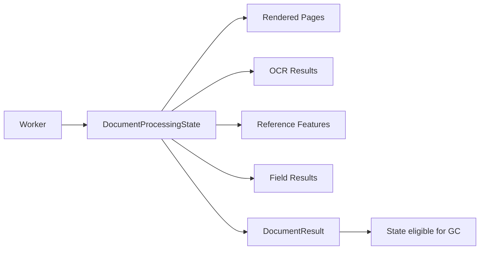

Po zbudowaniu wyniku ciężki stan dokumentu powinien przestać być referencjonowany.

## 8. Resolve Required Pages

Celem etapu jest ograniczenie kosztownego renderowania i OCR.

Przed identyfikacją system zna aktywne kategorie, ale nie zna jeszcze kategorii konkretnego dokumentu.

Należy wyznaczyć:

```text
identification pages = suma stron wymaganych przez reguły identyfikacji aktywnych kategorii
```

Po identyfikacji:

```text
processing pages = strony wymagane przez rozpoznaną kategorię
```

## 9. Dwufazowe planowanie stron

Rekomendowany model:

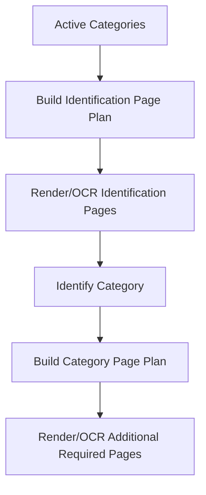

Dzięki temu nie trzeba od razu OCR-ować maksymalnego zakresu stron wszystkich kategorii, jeśli można ograniczyć koszt przez identyfikację na mniejszym zbiorze.

Jeżeli konfiguracje będą prostsze, pierwsza implementacja może używać maksymalnego wspólnego zakresu, ale model powinien umożliwiać optymalizację.

## 10. Renderowanie stron

Dla PDF:

```text
PDFBox
→ render page
→ ProcessingImage
```

Dla PNG/JPEG:

```text
image file
→ ProcessingImage
```

Dla TIFF:

```text
TIFF reader
→ page image
→ ProcessingImage
```

## 11. RenderOptions

```java
@Value
@Builder
public class RenderOptions {
    int dpi;
}
```

Pierwsza wersja może mieć jeden DPI globalny/profilowy.

## 12. Cache rasteryzacji

Strona nie powinna być renderowana drugi raz w obrębie jednego dokumentu, jeśli parametry renderowania są identyczne.

Klucz cache:

```text
PageNumber + RenderOptions
```

## 13. Orientation Detection

Etap może być wyłączony.

Wejście:

```text
ProcessingImage
```

Wyjście:

```java
@Value
@Builder
public class OrientationResult {
    PageOrientation orientation;
    Double confidence;
}
```

## 14. Orientation Correction

Jeśli wykryto:

```text
0°   → SKIPPED
90°  → rotate -90/+270
180° → rotate 180
270° → rotate +90/-270
```

Dokładna konwencja rotacji powinna zostać ujednolicona w kodzie.

## 15. Deskew

Deskew jest niezależny od orientacji 90/180/270.

Pipeline:


## 16. Cache przygotowanej strony

Po orientacji/deskew warto przechowywać przygotowaną wersję strony.

Przykład klucza:

```text
PageNumber
```

`PreparedPageImage` staje się bazą dla:

- page OCR,
- reference detection,
- field region extraction.

## 17. Page OCR

Page OCR wykonuje Tess4J w trybie zwracającym hOCR lub równoważny wynik umożliwiający odtworzenie geometrii.


## 18. Cache PageOcrResult

`PageOcrResult` powinien być cache'owany per dokument.

Klucz:

```text
PageNumber + ResolvedOcrOptions
```

Jeżeli ten sam zestaw parametrów jest wykorzystywany przez identyfikację i późniejszą ekstrakcję kotwic, nie należy ponawiać OCR.

## 19. OcrOptions resolution

Przed każdym OCR należy rozwiązać efektywne opcje.

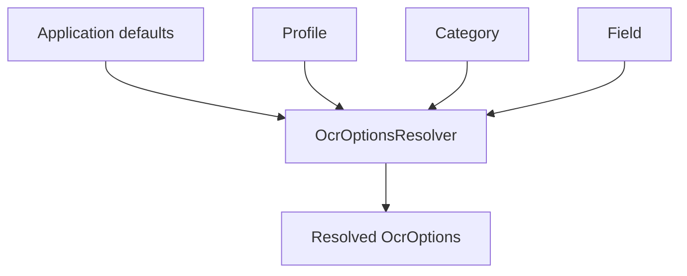

Dla page OCR przed identyfikacją:

```text
application defaults
→ profile defaults
```

Po identyfikacji mogą dojść category overrides.

Dla field OCR:

```text
application
→ profile
→ category
→ field
```

## 20. Domyślny język OCR

Jeżeli żadna konfiguracja nie ustawi języka:

```text
language = "pol"
```

## 21. Datapath

Jeżeli `datapath` nie jest ustawiony:

- Tess4J korzysta z domyślnej konfiguracji środowiska.

Jeżeli ustawiony:

- adapter przekazuje wartość do Tess4J.

## 22. Identification

`CategoryIdentificationService` ocenia wszystkie aktywne kategorie.

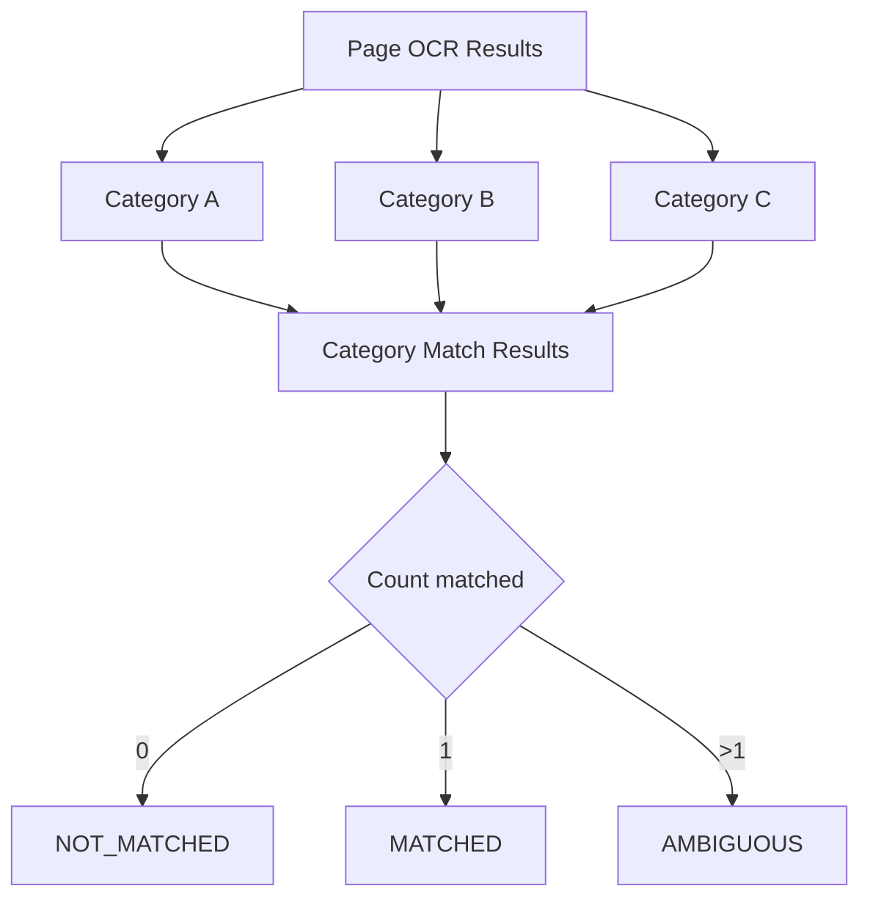

## 23. Ocena grup reguł

Dla kategorii:

```text
(group A AND B)
OR
(group C AND D)
```

Algorytm:

```text
for group:
    groupMatched = all conditions matched
categoryMatched = any groupMatched
```

## 24. Short-circuit

Można stosować short-circuit wewnątrz grupy:

```text
A == false
→ nie trzeba sprawdzać B, C
```

Należy jednak rozważyć `TraceMode.FULL`.

W FULL trace Configurator może oczekiwać pełnych wyników wszystkich reguł.

Rekomendacja:

| Tryb | Zachowanie |
| ---- | ---------- |
| OFF | short-circuit dozwolony |
| BASIC | short-circuit dozwolony |
| FULL | opcjonalnie sprawdź wszystkie reguły dla pełnej diagnostyki |

## 25. Detector execution cache

Detekcje takie jak QR mogą być wykorzystywane zarówno przez identyfikację, jak i późniejsze Anchor.

Dlatego należy umożliwić cache:

```text
DetectorId + PageNumber + Region + Parameters
→ DetectionResult
```

## 26. QR / barcode detection

ZXing powinien działać przez adapter.


Jeżeli QR został wykryty podczas identyfikacji i dokładnie ta sama konfiguracja detektora jest później użyta jako Anchor, wynik powinien zostać ponownie wykorzystany.

## 27. Po identyfikacji kategorii

Po `MATCHED` system:

1. zapisuje CategoryId,
2. pobiera `CategoryConfiguration`,
3. ustala dodatkowe wymagane strony,
4. renderuje brakujące strony,
5. wykonuje brakujące przygotowanie/OCR,
6. przechodzi do Anchor detection.

## 28. Reference Detection

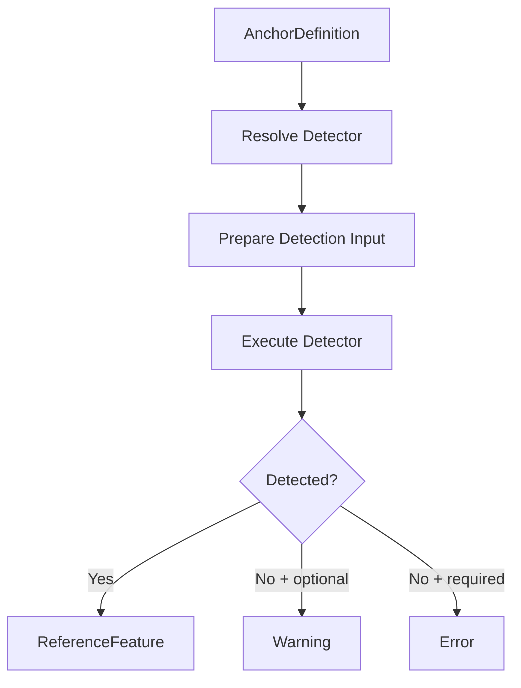

## 29. Required vs optional Anchor

| Anchor | Brak wyniku |
| ------ | ----------- |
| Required | `REFERENCE_NOT_FOUND` |
| Optional | warning |

Dokument może kontynuować po braku optional anchor, jeśli geometria nadal może zostać wyliczona.

## 30. Geometry Normalization

Wejście:

- `ReferenceGeometry`,
- wykryte `ReferenceFeature`,
- `GeometryNormalizationDefinition`.

Wyjście:

```text
GeometryNormalizationResult
```

## 31. Geometry strategy selection

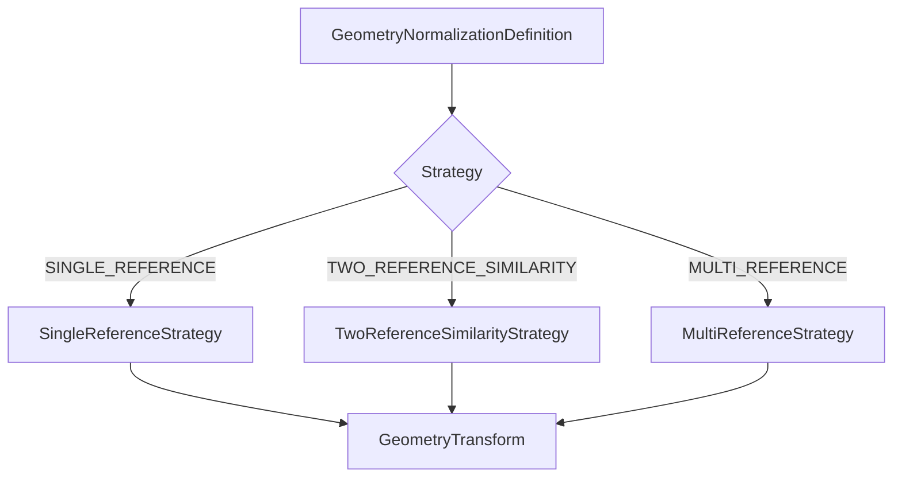

## 32. Geometry degraded mode

Jeśli preferowane są np. trzy kotwice, ale dostępne są dwie i strategia nadal może działać:

```text
status = DEGRADED
warning = DEGRADED_GEOMETRY
```

Jeżeli transformacji nie można wyliczyć:

```text
status = FAILED
error = GEOMETRY_NORMALIZATION_FAILED
```

## 33. Validation of transform

Po obliczeniu transformacji należy sprawdzić:

- brak NaN,
- brak Infinity,
- dodatnią/rozsądną skalę,
- transformowalne regiony,
- ewentualne granice tolerancji.

## 34. Field Extraction loop

Po poprawnej geometrii:

```text
for each FieldDefinition:
    FieldExtractionService.extract(...)
```

Domyślnie pola jednego dokumentu mogą być wykonywane sekwencyjnie.

Nie ma potrzeby równoległości per pole w pierwszej wersji, ponieważ równoległość odbywa się na poziomie dokumentów.

## 35. Pipeline pojedynczego pola

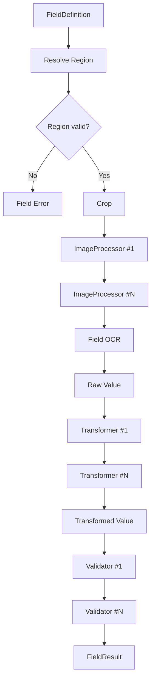

## 36. Resolve Region

Algorytm:

```text
ReferenceRegion
→ GeometryTransform.transform(...)
→ ResolvedRegion
→ clamp/validate against image bounds
```

## 37. Region poza obrazem

Dopuszczalne przypadki:

1. całkowicie poza obrazem → błąd,
2. częściowo poza obrazem → zależnie od polityki:
   - clamp + warning,
   - albo błąd.

Rekomendacja pierwszej wersji:

```text
partially outside
→ clamp
→ warning
```

Pod warunkiem, że wynikowy region ma dodatni rozmiar.

## 38. Crop

Crop jest pierwszym graficznym etapem pola.

W `TraceMode.FULL` należy zarejestrować:

- source page,
- ResolvedRegion,
- output image.

## 39. ImageProcessingPipeline

Dla każdego kroku:

```text
resolve extension
→ validate parameters
→ process image
→ produce StageResult
→ output becomes input for next step
```

## 40. ImageProcessor failure

Jeśli processor rzuci nieoczekiwany wyjątek:

```text
IMAGE_PROCESSING_FAILED
```

Pole może zakończyć się:

```text
FieldExtractionStatus.ERROR
```

Wpływ na cały dokument zależy od `required` i polityki.

## 41. Lifecycle obrazów pola

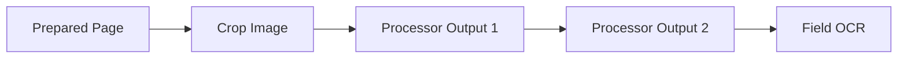

W trybie produkcyjnym poprzednie obrazy mogą być zwalniane natychmiast.

W `TraceMode.FULL` obrazy są rejestrowane w `TraceImageStore` i mogą pozostać dostępne do zakończenia sesji Configuratora.

## 42. Trace a pamięć

`TraceMode.FULL` ma wyższy koszt pamięci.

Dlatego:

- CLI nie powinno domyślnie używać FULL,
- Configurator może używać FULL dla pojedynczego dokumentu,
- zapis dużych artefaktów jest opcjonalny.

## 43. Field OCR

Po przetworzeniu obrazu:

```text
Resolved OcrOptions
→ Tess4JOcrEngine.recognizeRegion(...)
→ FieldOcrResult
```

`rawValue` jest tekstem zwróconym przez OCR przed transformacjami.

## 44. OCR failure

Jeżeli Tesseract nie wykona OCR:

```text
FieldExtractionStatus.OCR_FAILED
ProcessingError.OCR_FAILED
```

Jeżeli pole jest wymagane, może to doprowadzić do FAILED dokumentu.

## 45. ValueTransformationPipeline

Każdy transformer otrzymuje wynik poprzedniego:

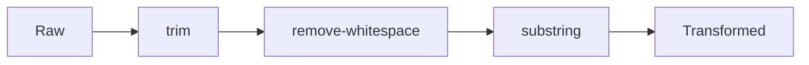

## 46. Transformer failure

Nieoczekiwany problem:

```text
VALUE_TRANSFORMATION_FAILED
```

Nie należy wykonywać kolejnych transformerów ani validatorów.

## 47. Validation Pipeline

Validatorzy nie modyfikują wartości.

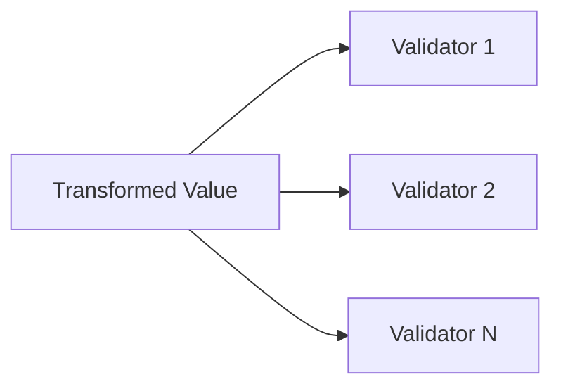

Walidatory mogą być logicznie wykonywane niezależnie.

Pierwsza wersja może wykonywać je sekwencyjnie.

## 48. Czy zatrzymywać walidatory po INVALID

Rekomendacja:

- nie zatrzymywać,
- wykonać wszystkie walidatory,
- zebrać pełną diagnostykę.

Pozwala to Configuratorowi pokazać wszystkie problemy.

## 49. Walidacja pola

Po otrzymaniu `ValidationResult[]`, `FieldValidationPolicy` określa wpływ na status pola i dokumentu.

Przykład:

```text
INVALID + failDocumentOnInvalid = false
→ FieldResult SUCCESS_WITH_WARNINGS

INVALID + failDocumentOnInvalid = true
→ FieldResult VALIDATION_FAILED
```

## 50. Pole required

Brak lub awaria pola wymaganego może powodować FAILED dokumentu.

Pole optional może generować warning bez błędu całego dokumentu.

## 51. Budowa FieldResult

`FieldResult` powinien powstać zawsze, jeśli rozpoczęto próbę przetwarzania pola.

Nawet przy błędzie powinien zawierać dostępny kontekst:

- region,
- raw value,
- transformed value,
- walidacje,
- errors,
- warnings,
- stage trace.

## 52. Field trace ownership

Możliwe są dwa modele:

1. `FieldResult.stages`,
2. wszystkie StageResult tylko w `DocumentResult.trace`.

Rekomendacja:

```text
DocumentResult.trace = pełna chronologia
FieldResult.stages = opcjonalny widok/referencje stage ID
```

Aby nie duplikować ciężkich danych, docelowo `FieldResult` może przechowywać `StageId[]` zamiast kopii `StageResult`.

## 53. Document validation

Po wszystkich polach system stosuje `DocumentValidationPolicy`.

Uwzględnia:

- błędy required Anchor,
- missing required fields,
- FieldValidationPolicy,
- błędy techniczne pól,
- warnings.

## 54. Wyznaczanie ProcessingStatus

Przykładowa semantyka:

```text
fatal error
→ FAILED

required field failure
→ FAILED

field INVALID with failDocumentOnInvalid
→ FAILED

no errors + warnings
→ SUCCESS_WITH_WARNINGS

no errors + no warnings
→ SUCCESS
```

## 55. Błędy kategorii

Jeżeli identyfikacja kończy się:

```text
NOT_MATCHED
→ CATEGORY_NOT_FOUND
→ FAILED

AMBIGUOUS
→ CATEGORY_AMBIGUOUS
→ FAILED
```

Nie wykonuje się geometrii ani ekstrakcji pól.

## 56. Błąd geometrii

Jeżeli geometry result = FAILED:

- pola zależne od geometrii nie są przetwarzane,
- powstaje `DocumentResult.FAILED`.

## 57. Fail-fast vs accumulate errors

Pipeline dokumentu używa dwóch trybów:

### Fail-fast na etapie krytycznym

Przykłady:

- dokument nieczytelny,
- brak kategorii,
- niepoprawna geometria.

### Accumulate errors

Przykłady:

- kilka niezależnych pól,
- kilka validatorów.

Dzięki temu jedno błędne pole nie blokuje diagnostyki pozostałych pól, jeśli przetwarzanie jest nadal bezpieczne.

## 58. Error boundary

`DocumentProcessor` jest granicą bezpieczeństwa dla nieoczekiwanych wyjątków domenowo-technicznych.

Pseudokod:

```text
try:
    execute pipeline
catch KnownProcessingException:
    map to ProcessingError
catch Exception:
    log
    INTERNAL_ERROR
return DocumentResult
```

## 59. Worker boundary

Worker posiada dodatkową granicę bezpieczeństwa.

```text
try:
    result = documentProcessor.process(job)
catch Throwable fatalForJob:
    result = emergencyInternalErrorResult(job)
```

Nie należy łapać `Error` bezrefleksyjnie w głębi Core. Granica workera ma chronić batch, ale awarie JVM typu `OutOfMemoryError` mogą wymagać zakończenia procesu.

## 60. TraceCollector

Każdy etap może emitować trace:

```java
traceCollector.record(stageResult);
```

Implementacje:

```text
NoOpTraceCollector
BasicTraceCollector
FullTraceCollector
```

## 61. Basic trace

BASIC może rejestrować:

- stage,
- status,
- duration,
- page/field/anchor,
- errors/warnings.

Bez obrazów i dużych payloadów.

## 62. Full trace

FULL dodatkowo:

- input image ref,
- output image ref,
- recognized text,
- wartości pośrednie,
- parametry,
- regiony,
- confidence.

## 63. StageResult creation

Rekomendowany helper:

```text
StageExecution
- start timer
- execute
- capture output
- build StageResult
```

Pozwoli uniknąć duplikacji kodu pomiaru czasu i błędów.

## 64. Trace nie wpływa na wynik

Krytyczny niezmiennik:

```text
process(document, TraceMode.OFF)
==
process(document, TraceMode.FULL)
```

w zakresie wyniku domenowego.

Różnić może się tylko `ProcessingTrace` i zużycie zasobów.

## 65. Trace i tekst wrażliwy

Configurator może prezentować pełne wartości lokalnie.

Logowanie nadal powinno maskować dane wrażliwe.

Trace nie jest tożsamy z logiem.

## 66. ProcessingTrace w Configuratorze

UI powinno prezentować listę etapów.

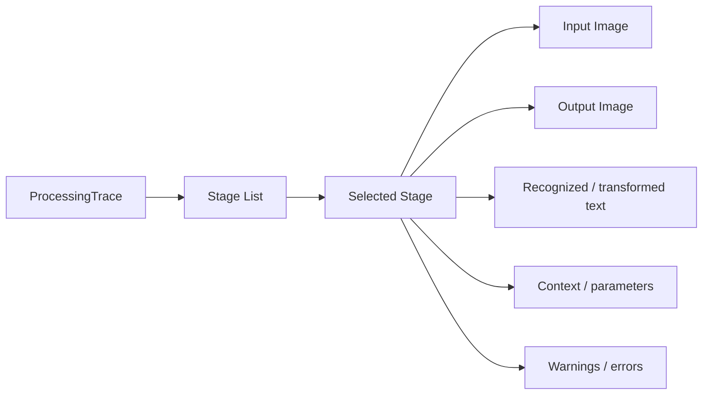

## 67. Podgląd etapów

Dla każdego etapu UI powinno, jeśli dane są dostępne, pokazywać:

- nazwę etapu,
- typ operacji,
- status,
- stronę,
- pole/kotwicę,
- czas,
- obraz wejściowy,
- obraz wyjściowy,
- region,
- rozpoznany tekst,
- input/output value,
- parametry,
- warnings/errors.

## 68. Diagnostyczny zapis obrazu

Z poziomu UI użytkownik może:

```text
select StageResult
→ resolve ImageSnapshotRef
→ export image
```

Jest to funkcja infrastrukturalna Configuratora.

## 69. Pseudokod DocumentProcessor

```java
DocumentResult process(DocumentJob job, ProcessingContext context) {
    var state = new DocumentProcessingState(job);
    var trace = context.traceCollector();

    try {
        state.document = documentLoader.inspect(job);

        var identificationPlan =
            pagePlanner.planIdentificationPages(
                context.activeCategories(),
                state.document);

        preparePages(state, identificationPlan, context);

        state.identification =
            categoryIdentificationService.identify(
                state,
                context.activeCategories(),
                context);

        if (state.identification.status() != MATCHED) {
            return resultFactory.fromIdentificationFailure(state);
        }

        state.category =
            context.category(state.identification.categoryId());

        var categoryPlan =
            pagePlanner.planCategoryPages(
                state.category,
                state.document);

        prepareMissingPages(state, categoryPlan, context);

        state.referenceFeatures =
            referenceDetectionService.detect(
                state.category,
                state,
                context);

        state.geometry =
            geometryNormalizationService.normalize(
                state.category.referenceGeometry(),
                state.referenceFeatures);

        if (state.geometry.status() == FAILED) {
            return resultFactory.fromGeometryFailure(state);
        }

        for (var field : state.category.fields()) {
            var fieldResult =
                fieldExtractionService.extract(
                    field,
                    state,
                    context);

            state.fieldResults.add(fieldResult);
        }

        return resultFactory.buildFinal(state);

    } catch (ProcessingException e) {
        return resultFactory.fromProcessingException(state, e);
    } catch (Exception e) {
        log.error("Unexpected document processing error", e);
        return resultFactory.fromInternalError(state, e);
    }
}
```

## 70. Pseudokod preparePages

```java
void preparePages(
    DocumentProcessingState state,
    RequiredPagesPlan plan,
    ProcessingContext context
) {
    for (var page : plan.pages()) {
        if (!state.hasPreparedPage(page)) {
            var raw = documentLoader.renderPage(
                state.job(),
                page,
                plan.renderOptions());

            var oriented =
                orientationPipeline.prepare(
                    raw,
                    context.orientationOptions());

            state.putPreparedPage(page, oriented);
        }

        if (plan.requiresPageOcr(page)
            && !state.hasPageOcr(page, plan.ocrOptions(page))) {

            var result = ocrEngine.recognizePage(
                state.preparedPage(page),
                plan.ocrOptions(page));

            state.putPageOcr(page, result);
        }
    }
}
```

## 71. Pseudokod FieldExtractionService

```java
FieldResult extract(
    FieldDefinition field,
    DocumentProcessingState state,
    ProcessingContext context
) {
    var builder = FieldResultBuilder.forField(field.id());

    try {
        var resolvedRegion =
            regionResolver.resolve(
                field.region(),
                field.page(),
                state.geometry().transform());

        builder.resolvedRegion(resolvedRegion);

        var image =
            imageCropper.crop(
                state.preparedPage(field.page()),
                resolvedRegion);

        context.trace().recordCrop(field, image, resolvedRegion);

        for (var step : field.imageProcessing().steps()) {
            var processor =
                context.extensions()
                    .imageProcessor(step.processorId());

            image =
                processor.process(
                    image,
                    step.parameters());

            context.trace()
                .recordImageProcessingStep(
                    field,
                    step,
                    image);
        }

        var ocrOptions =
            ocrOptionsResolver.resolve(
                context,
                state.category(),
                field);

        var ocr =
            ocrEngine.recognizeRegion(
                image,
                ocrOptions);

        builder.rawValue(ocr.text());

        var value = ocr.text();

        for (var step : field.transformations().steps()) {
            var transformer =
                context.extensions()
                    .valueTransformer(step.transformerId());

            value =
                transformer.transform(
                    value,
                    step.parameters());

            context.trace()
                .recordTransformation(
                    field,
                    step,
                    value);
        }

        builder.transformedValue(value);

        for (var validatorDef : field.validators()) {
            var validator =
                context.extensions()
                    .validator(validatorDef.validatorId());

            var validation =
                validator.validate(
                    value,
                    validatorDef.parameters());

            builder.validation(validation);

            context.trace()
                .recordValidation(
                    field,
                    validatorDef,
                    validation);
        }

        return fieldResultPolicy.finish(field, builder);

    } catch (FieldProcessingException e) {
        return fieldResultPolicy.failure(field, builder, e);
    }
}
```

## 72. Pseudokod ImageProcessor trace

```java
var inputRef = trace.captureImage(input);

var output = processor.process(input, parameters);

var outputRef = trace.captureImage(output);

trace.record(
    StageResult.builder()
        .stage(IMAGE_PROCESSING)
        .operation(processor.id().value())
        .fieldId(field.id())
        .inputImage(inputRef)
        .outputImage(outputRef)
        .status(SUCCESS)
        .duration(duration)
        .build()
);
```

W `TraceMode.OFF` `captureImage()` powinno być no-op.

## 73. Pseudokod CategoryIdentificationService

```java
IdentificationResult identify(...) {
    var results = new ArrayList<CategoryMatchResult>();

    for (var category : activeCategories) {
        boolean categoryMatched = false;

        for (var group : category.identification().groups()) {
            boolean groupMatched = true;

            for (var condition : group.conditions()) {
                var result = evaluate(condition);

                record(result);

                if (!result.matched()) {
                    groupMatched = false;

                    if (!trace.requiresFullEvaluation()) {
                        break;
                    }
                }
            }

            if (groupMatched) {
                categoryMatched = true;

                if (!trace.requiresFullEvaluation()) {
                    break;
                }
            }
        }

        results.add(...);
    }

    return resolveFinalIdentification(results);
}
```

## 74. Cache per dokument

Rekomendowane cache:

| Cache | Klucz | Wartość |
| ----- | ----- | ------- |
| Rendered page | page + render options | raw image |
| Prepared page | page + orientation options | processed image |
| Page OCR | page + OCR options | `PageOcrResult` |
| Detector | detector + page + region + params | detection result |
| Reference feature | AnchorId | `ReferenceFeature` |

Cache powinien istnieć tylko przez czas życia dokumentu.

## 75. Nie cache'ować globalnie

Nie należy globalnie cache'ować:

- pełnych obrazów dokumentów,
- `PageOcrResult` wszystkich dokumentów,
- field crops.

Możliwe globalne cache'e lekkich danych:

- zwalidowane konfiguracje,
- słowniki,
- metadata extensions.

## 76. Cache słowników

Słowniki typu lista imion mogą być współdzielone pomiędzy dokumentami.

Powinny być:

- immutable,
- thread-safe,
- lazy-loaded lub załadowane przy bootstrapie.

## 77. Extension instances

ServiceLoader może zwracać singleton-like instances providerów.

Extension musi jawnie deklarować/realizować bezstanowość lub thread-safety.

Preferowane:

```text
stateless extension
```

Jeżeli extension wymaga stanu per wykonanie, powinien tworzyć lokalny obiekt wewnątrz metody.

## 78. Tess4J lifecycle

Szczegółowy lifecycle zależy od zachowania Tess4J.

Adapter powinien ukrywać decyzję, czy:

- tworzyć `Tesseract` per call,
- per worker,
- używać puli instancji.

Core widzi tylko `OcrEngine`.

## 79. Równoległość

Pipeline pojedynczego dokumentu jest domyślnie sekwencyjny.

Równoległość:

```text
Document A ─┐
Document B ─┼→ worker pool
Document C ─┘
```

Nie:

```text
fields of same document → uncontrolled parallelism
```

## 80. Virtual threads

Jeżeli zostaną zastosowane, nie mogą powodować nieograniczonej liczby jednoczesnych OCR.

Należy stosować osobny limiter/semaphore dla kosztownego OCR, jeśli będzie to potrzebne.

## 81. Timeout OCR

Warto przewidzieć konfigurowalny timeout operacji OCR.

Jeżeli Tess4J/integracja umożliwia kontrolowane przerwanie:

```text
timeout
→ OCR_FAILED / OCR_TIMEOUT
```

Kod błędu może zostać dodany po technicznym rozpoznaniu integracji.

## 82. Pipeline Configuratora

Configurator używa tego samego pipeline'u, ale zwykle na jednym dokumencie i z `TraceMode.FULL`.

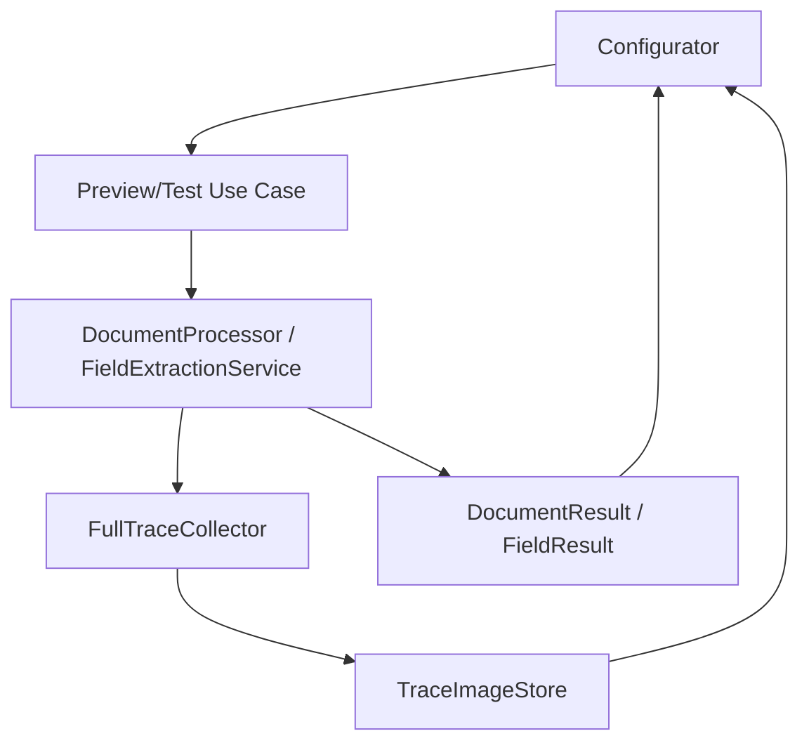

## 83. Test pojedynczego pola w Configuratorze

Configurator nie musi za każdym razem uruchamiać całego dokumentu od zera.

Może posiadać sesję dokumentu testowego:

```text
ConfigurationSession
```

z cache:

- rendered pages,
- prepared pages,
- page OCR,
- detected anchors,
- geometry.

Po zmianie konfiguracji należy unieważnić tylko zależne cache'e.

## 84. Cache invalidation w Configuratorze

Przykładowo:

| Zmiana | Unieważnij |
| ------ | ---------- |
| OCR language | Page OCR, detectors tekstowe, downstream |
| Anchor | reference detection, geometry, fields |
| Geometry settings | geometry, fields |
| Field region | konkretne pole |
| Image processor | pole od tego processor step |
| Transformer | wartości/validation pola |
| Validator | tylko validation pola |

To pozwala uzyskać szybki interaktywny podgląd.

## 85. ConfigurationSession

To model aplikacyjny.

```text
ConfigurationSession
- current document
- draft category configuration
- document processing cache
- latest trace
- dirty state
```

Nie należy umieszczać go w Domain.

## 86. Trace snapshot dla zmienionej konfiguracji

Każde uruchomienie preview powinno generować nowy logical trace run ID.

Dzięki temu UI nie pomiesza obrazów z różnych wersji konfiguracji.

## 87. TraceRunId

Model application:

```java
@Value
public class TraceRunId {
    String value;
}
```

## 88. Obsługa anulowania w UI

Długie testowe OCR powinno być możliwe do anulowania, jeśli technicznie da się bezpiecznie przerwać zadanie.

Minimum:

- UI może przestać oczekiwać wyniku starego runu,
- rezultat starego runu nie może nadpisać nowszego.

Rekomendowany mechanizm:

```text
TraceRunId / requestId
```

## 89. Race condition w Configuratorze

Scenariusz:

1. użytkownik uruchamia preview A,
2. zmienia konfigurację,
3. uruchamia preview B,
4. A kończy się później.

UI musi zignorować A, jeśli B jest już aktualnym runem.

## 90. Logging pipeline'u

Logi INFO:

- start/finish dokumentu,
- category,
- status,
- duration,
- errors.

DEBUG:

- etapy,
- metadata,
- bez pełnych danych wrażliwych domyślnie.

Trace FULL służy do szczegółowej diagnostyki lokalnej.

## 91. Metrics

Pierwsza wersja nie wymaga systemu metrics, ale wewnętrzne duration mogą umożliwić późniejsze liczniki:

```text
document.processing.duration
ocr.page.duration
ocr.field.duration
field.extraction.duration
```

## 92. Zarządzanie błędami obrazu

ImageProcessor powinien walidować wynik:

- image != null,
- width > 0,
- height > 0.

Niepoprawny wynik extension jest błędem `IMAGE_PROCESSING_FAILED`.

## 93. Zarządzanie błędami transformera

Transformer nie powinien zwracać null bez jawnej semantyki.

Rekomendacja:

- brak wartości reprezentować jako pusty String lub specjalny result,
- null traktować jako błąd extension.

## 94. Brak odczytanej wartości

Jeśli OCR zwróci pusty tekst:

```text
rawValue = ""
```

Dalsze zachowanie może zależeć od pola:

- required → potencjalnie `REQUIRED_FIELD_NOT_FOUND`,
- optional → warning.

## 95. Pole znalezione vs wartość pusta

Należy rozróżnić:

```text
region not resolved
```

od:

```text
region resolved, OCR returned empty
```

To różne przypadki diagnostyczne.

## 96. FieldExtractionStatus — rekomendacja doprecyzowania

Możliwe statusy:

```java
public enum FieldExtractionStatus {
    SUCCESS,
    SUCCESS_WITH_WARNINGS,
    REGION_NOT_FOUND,
    EMPTY_VALUE,
    OCR_FAILED,
    IMAGE_PROCESSING_FAILED,
    TRANSFORMATION_FAILED,
    VALIDATION_FAILED,
    ERROR
}
```

Warto zaktualizować `06-domain-model.md` przy następnej rewizji.

## 97. Budowa finalnego DocumentResult

ResultFactory powinien:

1. zebrać errors,
2. zebrać warnings,
3. ocenić required fields,
4. zastosować validation policy,
5. ustalić ProcessingStatus,
6. dołączyć ConfigurationIdentity,
7. zamknąć ProcessingTrace.

## 98. ConfigurationIdentity

Wynik powinien zapamiętać co najmniej:

```text
categoryId
configurationVersion
configurationHash
profileId
```

## 99. Cleanup

Po zakończeniu dokumentu:

```text
close document resources
release large images
release temp data
finalize trace
```

TraceImageStore w Configuratorze może zachować obrazy po zakończeniu pipeline'u.

## 100. Cleanup w CLI

W CLI:

- FULL trace domyślnie wyłączony,
- obrazy powinny być zwalniane po dokumencie,
- artefakty diagnostyczne zapisane na dysk nie powinny pozostawać w pamięci.

## 101. Sequence diagram — pełne przetwarzanie

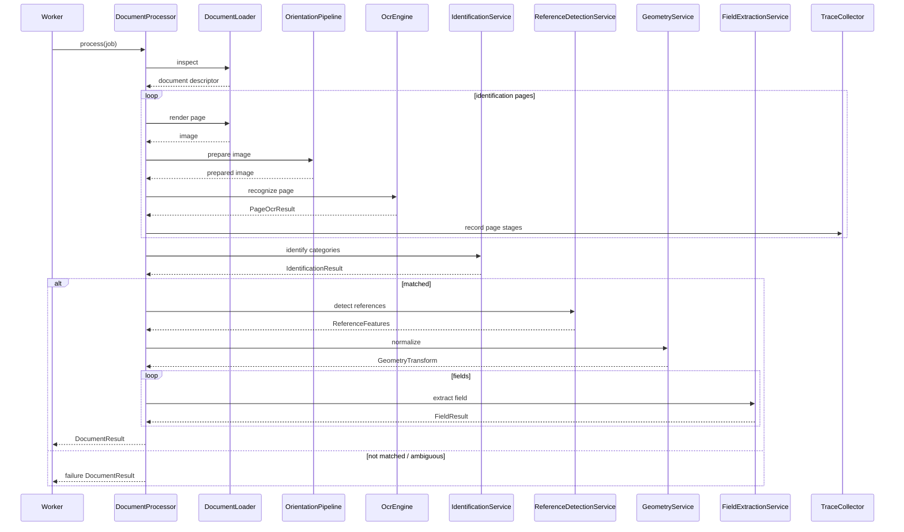

## 102. Sequence diagram — pole

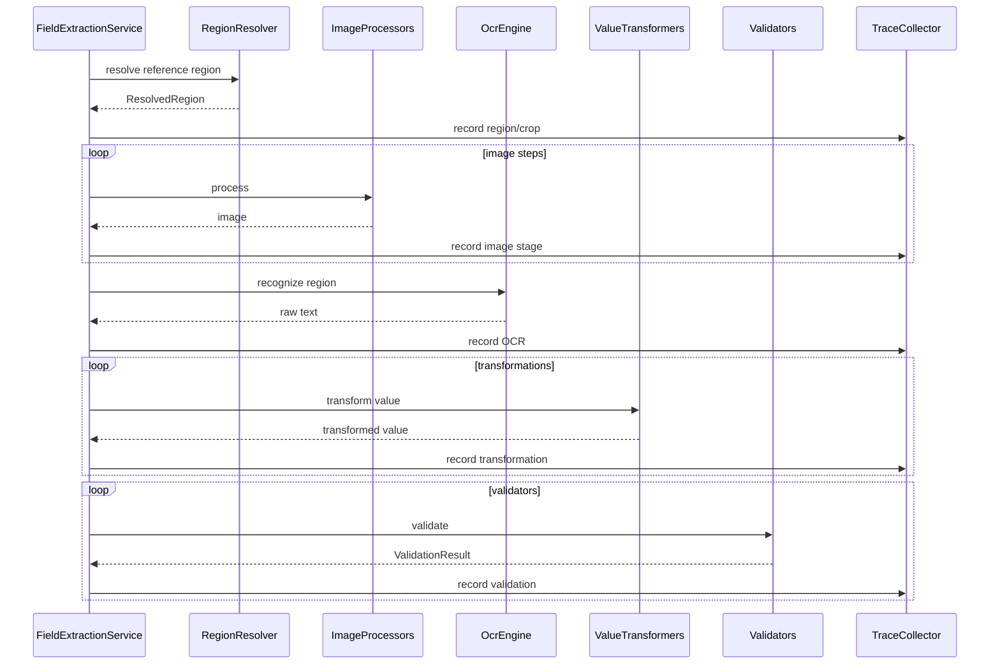

## 103. Warunki akceptacji pipeline'u

Pipeline może zostać uznany za właściwie zaimplementowany, jeśli:

1. `DocumentProcessor` nie zna CLI ani JavaFX.
2. page OCR nie jest bez potrzeby powtarzany.
3. wykrycie QR może być współdzielone pomiędzy identyfikacją i Anchor.
4. geometria jest wykonywana po identyfikacji.
5. każde pole korzysta z `GeometryTransform`.
6. ImageProcessor działa przed field OCR.
7. transformers działają po OCR.
8. validators działają po transformers.
9. validator nie zmienia wartości.
10. błędne pole nie zatrzymuje innych pól, jeśli jest to bezpieczne.
11. błąd kategorii zatrzymuje dalszy pipeline.
12. błąd geometrii zatrzymuje ekstrakcję pól.
13. trace FULL pokazuje każdy istotny etap.
14. trace OFF daje ten sam wynik biznesowy.
15. obrazy trace nie są przechowywane w Domain.
16. Configurator może pokazać input/output obrazu dla każdego ImageProcessor.
17. Configurator może pokazać tekst i wartości pośrednie.
18. pipeline działa na pojedynczym dokumencie bez batcha.
19. równoległość jest realizowana przede wszystkim pomiędzy dokumentami.
20. cache dokumentu jest zwalniany po zakończeniu pracy.

## 104. Otwarte decyzje

Do dalszego doprecyzowania pozostają:

1. dokładny algorytm orientation detection,
2. algorytm deskew,
3. docelowy model TIFF,
4. dokładny DPI rasteryzacji,
5. lifecycle instancji Tess4J per worker/call,
6. timeout OCR,
7. finalny algorytm fuzzy matching,
8. dokładne strategie geometrii,
9. tolerancje geometrii,
10. semantyka clampowania regionu,
11. szczegółowy model cache invalidation w Configuratorze,
12. czy `FieldResult` przechowuje StageResult czy StageId,
13. finalna semantyka `EMPTY_VALUE`,
14. czy FULL identification trace wykonuje wszystkie warunki mimo short-circuit,
15. format zapisu artefaktów diagnostycznych.

## 105. Następny dokument

Rekomendowany następny dokument:

**`08-category-configuration.md` — Format konfiguracji kategorii**

Powinien określić:

- strukturę JSON,
- `schemaVersion`,
- metadata kategorii,
- page selection,
- OCR overrides,
- identification groups,
- Anchor definitions,
- geometry,
- FieldDefinition,
- ImageProcessingPipeline,
- ValueTransformationPipeline,
- Validators,
- output mapping,
- przykładowe pełne JSON-y,
- zasady walidacji,
- mapping JSON DTO → Domain.

Następnie:

- `09-profile-configuration.md`,
- `10-extension-api.md`.
