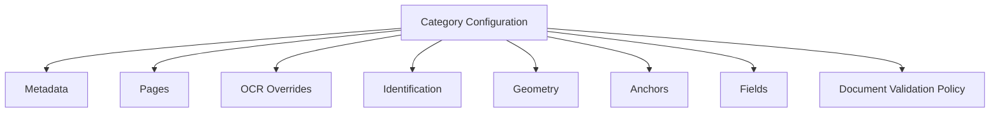
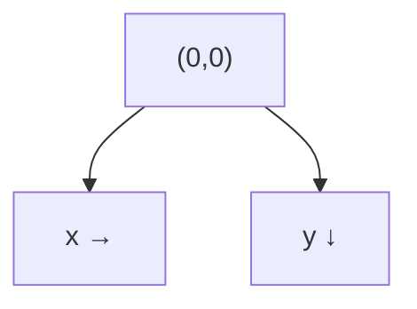
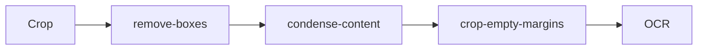
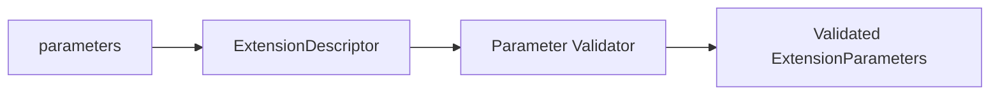
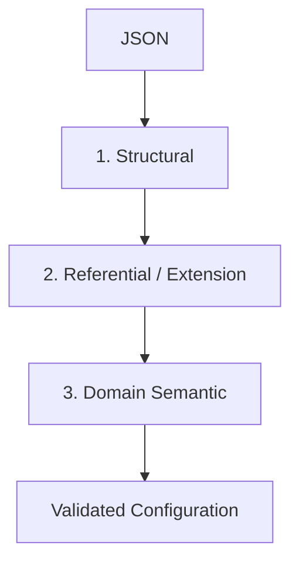
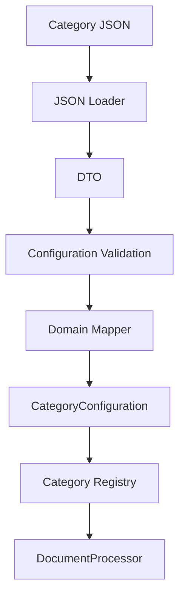

# Konfiguracja kategorii dokumentu

| Pole          | Wartość                                                        |
| ------------- | -------------------------------------------------------------- |
| ID dokumentu  | DOC-008                                                        |
| Tytuł         | Format konfiguracji kategorii dokumentu                        |
| Wersja        | 0.1                                                            |
| Status        | Draft                                                          |
| Typ           | Configuration Specification                                    |
| Źródło prawdy | Repozytorium dokumentacji projektu                             |
| Zależności    | `01-vision.md`, `02-glossary.md`, `03-functional-requirements.md`, `04-non-functional-requirements.md`, `05-architecture.md`, `06-domain-model.md`, `07-processing-pipeline.md` |

## 1. Cel dokumentu

Celem dokumentu jest zdefiniowanie formatu pliku JSON opisującego pojedynczą kategorię dokumentu.

Konfiguracja kategorii określa:

- metadane kategorii,
- zakres stron używanych przez kategorię,
- nadpisania ustawień OCR,
- reguły identyfikacji kategorii,
- kotwice (`anchors`),
- geometrię dokumentu referencyjnego,
- sposób normalizacji geometrii,
- definicje pól,
- regiony ekstrakcji,
- pipeline przetwarzania obrazu,
- pipeline transformacji wartości,
- walidatory,
- politykę walidacji dokumentu,
- mapowanie wyniku do eksportu,
- parametry rozszerzeń ładowanych przez `ServiceLoader`.

Dokument definiuje również:

- zasady walidacji konfiguracji,
- mapping JSON → DTO → Domain,
- wersjonowanie schematu,
- zasady kompatybilności.

## 2. Podstawowe założenie

Jedna kategoria dokumentu jest definiowana przez jeden plik JSON.

Przykładowa struktura repozytorium:

```text
config/
├── profiles/
│   └── default.json
└── categories/
    ├── faktura-a.json
    ├── deklaracja-b.json
    └── formularz-c.json
```

Nazwa pliku nie jest identyfikatorem kategorii.

Identyfikatorem jest:

```json
{
  "id": "faktura-a"
}
```

## 3. Przykład minimalny

```json
{
  "schemaVersion": "1.0",
  "id": "faktura-a",
  "version": "1.0",
  "displayName": "Faktura A",

  "pages": {
    "type": "SINGLE",
    "page": 1
  },

  "identification": {
    "groups": [
      {
        "conditions": [
          {
            "type": "TEXT",
            "page": 1,
            "expectedText": "FAKTURA",
            "matcher": {
              "id": "normalized"
            }
          }
        ]
      }
    ]
  },

  "geometry": {
    "referenceWidth": 2480,
    "referenceHeight": 3508,
    "strategy": {
      "type": "SINGLE_REFERENCE",
      "anchors": [
        "title"
      ]
    }
  },

  "anchors": [
    {
      "id": "title",
      "page": 1,
      "detector": {
        "id": "text",
        "parameters": {
          "text": "FAKTURA"
        }
      },
      "required": true,
      "referenceFeature": {
        "bounds": {
          "x": 100,
          "y": 100,
          "width": 400,
          "height": 80
        }
      }
    }
  ],

  "fields": [
    {
      "id": "document-number",
      "displayName": "Numer dokumentu",
      "page": 1,
      "region": {
        "x": 1600,
        "y": 100,
        "width": 600,
        "height": 100
      },
      "required": true,
      "output": {
        "exported": true,
        "columnName": "document_number"
      }
    }
  ]
}
```

## 4. Główna struktura



## 5. Pola główne

| Pole | Typ | Wymagane | Znaczenie |
| ---- | --- | -------- | --------- |
| `schemaVersion` | string | Tak | Wersja formatu konfiguracji |
| `id` | string | Tak | Stabilny identyfikator kategorii |
| `version` | string | Tak | Wersja konkretnej konfiguracji kategorii |
| `displayName` | string | Tak | Nazwa prezentowana użytkownikowi |
| `description` | string | Nie | Opis kategorii |
| `pages` | object | Tak | Zakres stron kategorii |
| `ocr` | object | Nie | Nadpisania ustawień OCR |
| `identification` | object | Tak | Reguły rozpoznawania kategorii |
| `geometry` | object | Tak | Geometria referencyjna |
| `anchors` | array | Tak | Definicje kotwic |
| `fields` | array | Tak | Definicje pól |
| `validationPolicy` | object | Nie | Polityka walidacji dokumentu |

## 6. schemaVersion

`schemaVersion` wersjonuje format pliku, a nie kategorię.

Przykład:

```json
{
  "schemaVersion": "1.0"
}
```

Zmiana schematu może wymagać migracji plików.

## 7. version

`version` oznacza wersję biznesowo-konfiguracyjną danej kategorii.

Przykład:

```json
{
  "id": "faktura-a",
  "version": "2.3"
}
```

`schemaVersion` i `version` mają różne znaczenie.

## 8. CategoryId

Rekomendowany format:

```text
[a-z0-9][a-z0-9-]*
```

Przykłady:

```text
faktura-a
pit-11
formularz-zus-zua
wniosek-abc-2026
```

ID powinno być stabilne i nie zależeć od nazwy wyświetlanej.

## 9. Page selection

Konfiguracja kategorii musi określać strony potencjalnie potrzebne podczas jej przetwarzania.

### SINGLE

```json
{
  "pages": {
    "type": "SINGLE",
    "page": 1
  }
}
```

### RANGE

```json
{
  "pages": {
    "type": "RANGE",
    "from": 1,
    "to": 5
  }
}
```

### EXPLICIT

```json
{
  "pages": {
    "type": "EXPLICIT",
    "pages": [1, 3, 5]
  }
}
```

### ALL

```json
{
  "pages": {
    "type": "ALL"
  }
}
```

## 10. Page selection — walidacja

| Typ | Reguła |
| --- | ------ |
| `SINGLE` | `page >= 1` |
| `RANGE` | `from >= 1`, `to >= from` |
| `EXPLICIT` | lista niepusta, wartości >= 1, bez duplikatów |
| `ALL` | brak dodatkowych parametrów |

## 11. OCR overrides kategorii

Przykład:

```json
{
  "ocr": {
    "language": "pol",
    "datapath": "/opt/tesseract/tessdata",
    "dpi": 300,
    "pageSegMode": 6,
    "ocrEngineMode": 1,
    "variables": {
      "preserve_interword_spaces": "1"
    }
  }
}
```

Wszystkie pola są opcjonalne.

## 12. Rozwiązywanie ustawień OCR

```text
application defaults
    ↓
profile defaults
    ↓
category.ocr
    ↓
field.ocr
```

Najbardziej szczegółowa wartość wygrywa.

Domyślny język aplikacji:

```text
pol
```

## 13. identification

Identyfikacja kategorii używa struktury:

```text
OR pomiędzy groups
AND pomiędzy conditions w group
```

Przykład:

```json
{
  "identification": {
    "groups": [
      {
        "conditions": [
          {
            "type": "TEXT",
            "page": 1,
            "expectedText": "FAKTURA",
            "matcher": {
              "id": "normalized"
            }
          },
          {
            "type": "TEXT",
            "page": 1,
            "expectedText": "NUMER",
            "matcher": {
              "id": "normalized"
            }
          }
        ]
      },
      {
        "conditions": [
          {
            "type": "QR",
            "page": 1,
            "matcher": {
              "id": "regex",
              "parameters": {
                "pattern": "^FV-[0-9]+"
              }
            }
          }
        ]
      }
    ]
  }
}
```

Semantyka:

```text
(TEXT "FAKTURA" AND TEXT "NUMER")
OR
(QR matches "^FV-[0-9]+")
```

## 14. Identification group

```json
{
  "conditions": [
    ...
  ]
}
```

Lista `conditions`:

- musi być niepusta,
- wszystkie warunki muszą zostać spełnione, aby grupa pasowała.

## 15. Wspólne pola condition

| Pole | Typ | Wymagane | Znaczenie |
| ---- | --- | -------- | --------- |
| `type` | enum | Tak | `TEXT`, `QR`, `BARCODE` |
| `page` | integer | Tak | Numer strony |
| `searchRegion` | object | Nie | Ograniczenie obszaru wyszukiwania |
| `matcher` | object | Zależnie od typu | Matcher wartości |

## 16. TEXT condition

Przykład:

```json
{
  "type": "TEXT",
  "page": 1,
  "searchRegion": {
    "x": 100,
    "y": 100,
    "width": 1000,
    "height": 300
  },
  "expectedText": "DEKLARACJA",
  "matcher": {
    "id": "fuzzy",
    "parameters": {
      "threshold": 0.85
    }
  }
}
```

Brak `searchRegion` oznacza całą stronę.

## 17. Matchery tekstowe

Pierwsza wersja powinna przewidywać co najmniej:

| ID | Znaczenie |
| -- | --------- |
| `exact` | dokładne dopasowanie |
| `normalized` | dopasowanie po normalizacji |
| `fuzzy` | dopasowanie z tolerancją błędów OCR |
| `regex` | dopasowanie wyrażeniem regularnym |

## 18. Fuzzy threshold

Przykład:

```json
{
  "matcher": {
    "id": "fuzzy",
    "parameters": {
      "threshold": 0.85
    }
  }
}
```

Semantyka:

```text
score >= threshold
→ MATCH
```

Zakres:

```text
0.0 <= threshold <= 1.0
```

Dokładny algorytm podobieństwa jest odpowiedzialnością rozszerzenia `fuzzy`.

## 19. QR condition

```json
{
  "type": "QR",
  "page": 1,
  "searchRegion": {
    "x": 1800,
    "y": 100,
    "width": 500,
    "height": 500
  },
  "matcher": {
    "id": "regex",
    "parameters": {
      "pattern": "^DOC:ABC:"
    }
  }
}
```

QR jest wykrywany przez adapter ZXing.

## 20. QR bez sprawdzania wartości

Możliwy przypadek:

```json
{
  "type": "QR",
  "page": 1
}
```

Semantyka:

```text
QR istnieje
→ condition matched
```

## 21. BARCODE condition

Format analogiczny:

```json
{
  "type": "BARCODE",
  "page": 1,
  "matcher": {
    "id": "regex",
    "parameters": {
      "pattern": "^[0-9]{12}$"
    }
  }
}
```

Pierwsza implementacja może używać ZXing również dla kodów kreskowych.

## 22. searchRegion

Region jest zapisany w układzie współrzędnych dokumentu referencyjnego.

```json
{
  "x": 100,
  "y": 200,
  "width": 500,
  "height": 100
}
```

Jednostką jest piksel referencyjny.

## 23. Układ współrzędnych

Przyjmujemy:

```text
(0,0) = lewy górny róg
x rośnie w prawo
y rośnie w dół
```



## 24. Reference dimensions

Każda konfiguracja definiuje rozmiar obrazu referencyjnego.

```json
{
  "geometry": {
    "referenceWidth": 2480,
    "referenceHeight": 3508
  }
}
```

Wszystkie współrzędne w konfiguracji odnoszą się do tego układu.

## 25. geometry

Przykład:

```json
{
  "geometry": {
    "referenceWidth": 2480,
    "referenceHeight": 3508,
    "strategy": {
      "type": "TWO_REFERENCE_SIMILARITY",
      "anchors": [
        "header-title",
        "qr-code"
      ]
    }
  }
}
```

## 26. Geometry strategy

Obsługiwane wartości:

```text
SINGLE_REFERENCE
TWO_REFERENCE_SIMILARITY
MULTI_REFERENCE
```

## 27. SINGLE_REFERENCE

```json
{
  "strategy": {
    "type": "SINGLE_REFERENCE",
    "anchors": ["header-title"]
  }
}
```

Może zapewniać translację i ewentualną skalę wynikającą z rozmiaru cechy.

Zakres możliwości zależy od implementacji strategii.

## 28. TWO_REFERENCE_SIMILARITY

```json
{
  "strategy": {
    "type": "TWO_REFERENCE_SIMILARITY",
    "anchors": [
      "header-title",
      "qr-code"
    ]
  }
}
```

Strategia powinna umożliwić wyznaczenie co najmniej:

- translacji,
- skali,
- rotacji.

## 29. MULTI_REFERENCE

```json
{
  "strategy": {
    "type": "MULTI_REFERENCE",
    "anchors": [
      "header-title",
      "qr-code",
      "footer-label"
    ],
    "parameters": {
      "minimumAnchors": 2
    }
  }
}
```

Pozwala w przyszłości użyć bardziej odpornego dopasowania.

## 30. anchors

Kotwica opisuje cechę dokumentu, której rzeczywista lokalizacja zostanie wykryta podczas przetwarzania.

```json
{
  "anchors": [
    {
      "id": "header-title",
      "page": 1,
      "detector": {
        "id": "text",
        "parameters": {
          "text": "FAKTURA"
        }
      },
      "searchRegion": {
        "x": 0,
        "y": 0,
        "width": 1200,
        "height": 500
      },
      "required": true,
      "referenceFeature": {
        "bounds": {
          "x": 100,
          "y": 100,
          "width": 400,
          "height": 80
        },
        "center": {
          "x": 300,
          "y": 140
        }
      }
    }
  ]
}
```

## 31. Anchor fields

| Pole | Typ | Wymagane | Znaczenie |
| ---- | --- | -------- | --------- |
| `id` | string | Tak | Identyfikator kotwicy |
| `page` | integer | Tak | Strona |
| `detector` | object | Tak | Detektor cechy |
| `searchRegion` | object | Nie | Obszar poszukiwania |
| `required` | boolean | Tak | Czy brak kotwicy jest błędem |
| `referenceFeature` | object | Tak | Oczekiwana geometria |

## 32. Text anchor

```json
{
  "id": "pesel-label",
  "page": 1,
  "detector": {
    "id": "text",
    "parameters": {
      "text": "PESEL",
      "matcher": "fuzzy",
      "threshold": 0.85
    }
  },
  "required": true,
  "referenceFeature": {
    "bounds": {
      "x": 200,
      "y": 800,
      "width": 180,
      "height": 60
    }
  }
}
```

## 33. QR anchor

```json
{
  "id": "document-qr",
  "page": 1,
  "detector": {
    "id": "qr"
  },
  "searchRegion": {
    "x": 1800,
    "y": 100,
    "width": 500,
    "height": 500
  },
  "required": true,
  "referenceFeature": {
    "bounds": {
      "x": 1950,
      "y": 150,
      "width": 300,
      "height": 300
    },
    "center": {
      "x": 2100,
      "y": 300
    },
    "rotation": 0.0
  }
}
```

ZXing adapter powinien zwrócić geometrię wykrytego kodu, nie tylko jego wartość.

## 34. Barcode anchor

Analogicznie:

```json
{
  "id": "document-barcode",
  "page": 1,
  "detector": {
    "id": "barcode"
  },
  "required": false,
  "referenceFeature": {
    "bounds": {
      "x": 100,
      "y": 3200,
      "width": 900,
      "height": 150
    }
  }
}
```

## 35. Detector

Ogólna struktura:

```json
{
  "detector": {
    "id": "text",
    "parameters": {
      "...": "..."
    }
  }
}
```

`id` odpowiada `ExtensionId`.

Parametry są interpretowane przez konkretne rozszerzenie.

## 36. referenceFeature

Może zawierać:

```json
{
  "referenceFeature": {
    "bounds": {
      "x": 100,
      "y": 100,
      "width": 400,
      "height": 80
    },
    "center": {
      "x": 300,
      "y": 140
    },
    "rotation": 0.0
  }
}
```

`center` może być wyliczony z `bounds`, jeśli nie został zapisany.

## 37. Pola dokumentu

`fields` jest listą danych biznesowych odczytywanych z dokumentu.

Przykład:

```json
{
  "fields": [
    {
      "id": "pesel",
      "displayName": "PESEL",
      "page": 1,
      "region": {
        "x": 500,
        "y": 800,
        "width": 700,
        "height": 100
      },
      "required": true
    }
  ]
}
```

## 38. FieldDefinition — pola

| Pole | Typ | Wymagane | Znaczenie |
| ---- | --- | -------- | --------- |
| `id` | string | Tak | Stabilny identyfikator pola |
| `displayName` | string | Tak | Nazwa w Configuratorze |
| `description` | string | Nie | Opis pola |
| `page` | integer | Tak | Strona |
| `region` | object | Tak | Region referencyjny |
| `required` | boolean | Tak | Czy pole jest wymagane |
| `ocr` | object | Nie | Nadpisania OCR |
| `imageProcessing` | array | Nie | Pipeline obrazu |
| `transformations` | array | Nie | Pipeline wartości |
| `validators` | array | Nie | Walidatory |
| `validationPolicy` | object | Nie | Polityka błędów pola |
| `output` | object | Nie | Eksport |

## 39. Region pola

```json
{
  "region": {
    "x": 500,
    "y": 800,
    "width": 700,
    "height": 100
  }
}
```

Region jest definiowany względem obrazu referencyjnego.

Podczas przetwarzania:

```text
ReferenceRegion
→ GeometryTransform
→ ResolvedRegion
```

## 40. Field OCR override

```json
{
  "ocr": {
    "language": "eng",
    "pageSegMode": 7,
    "variables": {
      "tessedit_char_whitelist": "0123456789"
    }
  }
}
```

Przydatne dla pól numerycznych.

## 41. imageProcessing

Pipeline obrazu jest wykonywany w kolejności zapisanej w JSON.

```json
{
  "imageProcessing": [
    {
      "id": "remove-boxes",
      "parameters": {
        "minimumLineLength": 20
      }
    },
    {
      "id": "condense-content"
    },
    {
      "id": "crop-empty-margins",
      "parameters": {
        "padding": 5
      }
    }
  ]
}
```

## 42. Semantyka imageProcessing



Każdy element listy odpowiada `ImageProcessingStep`.

## 43. ImageProcessingStep

| Pole | Typ | Wymagane |
| ---- | --- | -------- |
| `id` | string | Tak |
| `parameters` | object | Nie |

`id` odpowiada rozszerzeniu typu `IMAGE_PROCESSOR`.

## 44. transformations

```json
{
  "transformations": [
    {
      "id": "trim"
    },
    {
      "id": "remove-whitespace"
    },
    {
      "id": "substring",
      "parameters": {
        "start": 0,
        "length": 11
      }
    }
  ]
}
```

Kolejność jest istotna.

## 45. Value transformation semantics

```text
OCR raw value
→ trim
→ remove-whitespace
→ substring
→ transformed value
```

## 46. Validator

```json
{
  "validators": [
    {
      "id": "pesel"
    }
  ]
}
```

Lub:

```json
{
  "validators": [
    {
      "id": "regex",
      "parameters": {
        "pattern": "^[0-9]{11}$"
      }
    },
    {
      "id": "pesel"
    }
  ]
}
```

## 47. Walidator słownikowy

```json
{
  "id": "dictionary",
  "parameters": {
    "dictionary": "polish-first-names",
    "ignoreCase": true
  }
}
```

Słownik powinien być rozwiązywany przez `DictionaryProvider`.

## 48. validationPolicy pola

```json
{
  "validationPolicy": {
    "failDocumentOnInvalid": true,
    "failDocumentOnError": true
  }
}
```

Wartości domyślne powinny zostać ustalone centralnie i opisane w schemacie.

## 49. output

```json
{
  "output": {
    "exported": true,
    "columnName": "pesel",
    "exportValidationStatus": true
  }
}
```

## 50. Pole niewyeksportowane

Możliwe są pola pomocnicze:

```json
{
  "output": {
    "exported": false
  }
}
```

Pole nadal może:

- uczestniczyć w diagnostyce,
- być walidowane,
- wpływać na status dokumentu.

## 51. Document validation policy

```json
{
  "validationPolicy": {
    "failOnMissingRequiredField": true,
    "failOnRequiredAnchorMissing": true
  }
}
```

## 52. Extension parameters

Parametry rozszerzeń są otwarte:

```json
{
  "id": "custom-transformer",
  "parameters": {
    "mode": "ABC",
    "limit": 10,
    "enabled": true
  }
}
```

W DTO:

```text
Map<String, Object>
```

W Domain:

```text
ExtensionParameters
```

## 53. Walidacja parametrów extension

Każde rozszerzenie dostarcza `ExtensionDescriptor`.

Przykład:

```text
substring
- start: INTEGER, required
- length: INTEGER, optional
```

Podczas ładowania konfiguracji:



Błędna konfiguracja powinna zostać odrzucona przed rozpoczęciem batcha.

## 54. Nieznane ExtensionId

Przykład:

```json
{
  "id": "does-not-exist"
}
```

Jeśli rozszerzenie nie istnieje:

```text
configuration validation error
```

Nie należy odkładać błędu do czasu przetwarzania dokumentu.

## 55. Nieznane pola JSON

Rekomendacja dla wersji 1:

```text
unknown property
→ configuration validation error
```

Pozwala wykrywać literówki.

Przykład:

```json
{
  "requred": true
}
```

powinien zostać odrzucony zamiast cicho zignorowany.

## 56. Brakujące kolekcje

W JSON można dopuścić brak:

```text
imageProcessing
transformations
validators
```

Mapper normalizuje je do pustych list.

W Domain kolekcje nie są null.

## 57. Null

Jawne `null` dla pól konfiguracyjnych powinno być co do zasady niedozwolone.

Preferowane:

```text
property absent
```

zamiast:

```json
{
  "ocr": null
}
```

## 58. Współrzędne

Wartości:

```text
x >= 0
y >= 0
width > 0
height > 0
```

Dla regionów referencyjnych należy również sprawdzić:

```text
x + width <= referenceWidth
y + height <= referenceHeight
```

chyba że przyszły przypadek użycia uzasadni jawne zezwolenie na wyjście poza referencję.

## 59. Strony

Każde:

```text
condition.page
anchor.page
field.page
```

musi należeć do zakresu dozwolonego przez `pages`.

## 60. Unikalność ID

W ramach kategorii:

- `AnchorId` musi być unikalne,
- `FieldId` musi być unikalne.

Anchor i Field mogą technicznie posiadać ten sam tekst ID, ponieważ są w różnych przestrzeniach nazw, ale nie należy na tym polegać w UI.

## 61. Referencje Anchor

Każde ID użyte przez:

```json
{
  "geometry": {
    "strategy": {
      "anchors": ["a", "b"]
    }
  }
}
```

musi istnieć w `anchors`.

## 62. Wymagana liczba Anchor

Walidacja zależy od strategii:

| Strategia | Minimum |
| --------- | ------- |
| `SINGLE_REFERENCE` | 1 |
| `TWO_REFERENCE_SIMILARITY` | 2 |
| `MULTI_REFERENCE` | Zależne od parametrów, domyślnie >= 2 |

## 63. Required Anchor a geometry

Anchor używany jako jedyny niezbędny element strategii geometrii powinien być `required: true`.

Configurator powinien ostrzec lub zablokować niespójną konfigurację.

## 64. Przykład pola PESEL

```json
{
  "id": "pesel",
  "displayName": "PESEL",
  "page": 1,
  "region": {
    "x": 500,
    "y": 800,
    "width": 700,
    "height": 120
  },
  "required": true,

  "ocr": {
    "pageSegMode": 7,
    "variables": {
      "tessedit_char_whitelist": "0123456789"
    }
  },

  "imageProcessing": [
    {
      "id": "remove-boxes"
    },
    {
      "id": "condense-content"
    }
  ],

  "transformations": [
    {
      "id": "trim"
    },
    {
      "id": "remove-whitespace"
    },
    {
      "id": "substring",
      "parameters": {
        "start": 0,
        "length": 11
      }
    }
  ],

  "validators": [
    {
      "id": "regex",
      "parameters": {
        "pattern": "^[0-9]{11}$"
      }
    },
    {
      "id": "pesel"
    }
  ],

  "validationPolicy": {
    "failDocumentOnInvalid": true,
    "failDocumentOnError": true
  },

  "output": {
    "exported": true,
    "columnName": "pesel",
    "exportValidationStatus": true
  }
}
```

## 65. Przykład pola imię

```json
{
  "id": "first-name",
  "displayName": "Imię",
  "page": 1,
  "region": {
    "x": 500,
    "y": 1000,
    "width": 800,
    "height": 120
  },
  "required": true,

  "imageProcessing": [
    {
      "id": "remove-boxes"
    }
  ],

  "transformations": [
    {
      "id": "trim"
    },
    {
      "id": "normalize"
    }
  ],

  "validators": [
    {
      "id": "dictionary",
      "parameters": {
        "dictionary": "polish-first-names",
        "ignoreCase": true
      }
    }
  ],

  "output": {
    "exported": true,
    "columnName": "first_name"
  }
}
```

## 66. Przykład identyfikacji przez tekst i QR

```json
{
  "identification": {
    "groups": [
      {
        "conditions": [
          {
            "type": "TEXT",
            "page": 1,
            "searchRegion": {
              "x": 0,
              "y": 0,
              "width": 1200,
              "height": 500
            },
            "expectedText": "FORMULARZ ABC",
            "matcher": {
              "id": "fuzzy",
              "parameters": {
                "threshold": 0.85
              }
            }
          },
          {
            "type": "QR",
            "page": 1,
            "matcher": {
              "id": "regex",
              "parameters": {
                "pattern": "^ABC:"
              }
            }
          }
        ]
      }
    ]
  }
}
```

Semantyka:

```text
TEXT matches
AND
QR matches
```

## 67. Przykład alternatywnych identyfikacji

```json
{
  "identification": {
    "groups": [
      {
        "conditions": [
          {
            "type": "TEXT",
            "page": 1,
            "expectedText": "FORMULARZ ABC",
            "matcher": {
              "id": "fuzzy",
              "parameters": {
                "threshold": 0.85
              }
            }
          }
        ]
      },
      {
        "conditions": [
          {
            "type": "QR",
            "page": 1,
            "matcher": {
              "id": "regex",
              "parameters": {
                "pattern": "^ABC:"
              }
            }
          }
        ]
      }
    ]
  }
}
```

Semantyka:

```text
TEXT matches
OR
QR matches
```

## 68. Pełny przykład kategorii

```json
{
  "schemaVersion": "1.0",
  "id": "formularz-abc",
  "version": "1.2",
  "displayName": "Formularz ABC",
  "description": "Przykładowa kategoria dokumentu",

  "pages": {
    "type": "RANGE",
    "from": 1,
    "to": 2
  },

  "ocr": {
    "language": "pol",
    "dpi": 300
  },

  "identification": {
    "groups": [
      {
        "conditions": [
          {
            "type": "TEXT",
            "page": 1,
            "searchRegion": {
              "x": 100,
              "y": 80,
              "width": 1200,
              "height": 300
            },
            "expectedText": "FORMULARZ ABC",
            "matcher": {
              "id": "fuzzy",
              "parameters": {
                "threshold": 0.85
              }
            }
          },
          {
            "type": "QR",
            "page": 1,
            "searchRegion": {
              "x": 1800,
              "y": 80,
              "width": 500,
              "height": 500
            },
            "matcher": {
              "id": "regex",
              "parameters": {
                "pattern": "^ABC:"
              }
            }
          }
        ]
      },
      {
        "conditions": [
          {
            "type": "TEXT",
            "page": 1,
            "expectedText": "ABC-2026",
            "matcher": {
              "id": "exact"
            }
          }
        ]
      }
    ]
  },

  "geometry": {
    "referenceWidth": 2480,
    "referenceHeight": 3508,
    "strategy": {
      "type": "TWO_REFERENCE_SIMILARITY",
      "anchors": [
        "header-title",
        "document-qr"
      ]
    }
  },

  "anchors": [
    {
      "id": "header-title",
      "page": 1,
      "detector": {
        "id": "text",
        "parameters": {
          "text": "FORMULARZ ABC",
          "matcher": "fuzzy",
          "threshold": 0.85
        }
      },
      "searchRegion": {
        "x": 100,
        "y": 80,
        "width": 1200,
        "height": 300
      },
      "required": true,
      "referenceFeature": {
        "bounds": {
          "x": 180,
          "y": 120,
          "width": 650,
          "height": 90
        },
        "center": {
          "x": 505,
          "y": 165
        }
      }
    },
    {
      "id": "document-qr",
      "page": 1,
      "detector": {
        "id": "qr"
      },
      "searchRegion": {
        "x": 1800,
        "y": 80,
        "width": 500,
        "height": 500
      },
      "required": true,
      "referenceFeature": {
        "bounds": {
          "x": 1950,
          "y": 150,
          "width": 300,
          "height": 300
        },
        "center": {
          "x": 2100,
          "y": 300
        },
        "rotation": 0.0
      }
    }
  ],

  "fields": [
    {
      "id": "pesel",
      "displayName": "PESEL",
      "page": 1,
      "region": {
        "x": 500,
        "y": 800,
        "width": 700,
        "height": 120
      },
      "required": true,

      "ocr": {
        "pageSegMode": 7,
        "variables": {
          "tessedit_char_whitelist": "0123456789"
        }
      },

      "imageProcessing": [
        {
          "id": "remove-boxes"
        },
        {
          "id": "condense-content"
        }
      ],

      "transformations": [
        {
          "id": "trim"
        },
        {
          "id": "remove-whitespace"
        },
        {
          "id": "substring",
          "parameters": {
            "start": 0,
            "length": 11
          }
        }
      ],

      "validators": [
        {
          "id": "regex",
          "parameters": {
            "pattern": "^[0-9]{11}$"
          }
        },
        {
          "id": "pesel"
        }
      ],

      "validationPolicy": {
        "failDocumentOnInvalid": true,
        "failDocumentOnError": true
      },

      "output": {
        "exported": true,
        "columnName": "pesel",
        "exportValidationStatus": true
      }
    },

    {
      "id": "first-name",
      "displayName": "Imię",
      "page": 1,
      "region": {
        "x": 500,
        "y": 1000,
        "width": 800,
        "height": 120
      },
      "required": true,

      "imageProcessing": [
        {
          "id": "remove-boxes"
        }
      ],

      "transformations": [
        {
          "id": "trim"
        },
        {
          "id": "normalize"
        }
      ],

      "validators": [
        {
          "id": "dictionary",
          "parameters": {
            "dictionary": "polish-first-names",
            "ignoreCase": true
          }
        }
      ],

      "output": {
        "exported": true,
        "columnName": "first_name"
      }
    }
  ],

  "validationPolicy": {
    "failOnMissingRequiredField": true,
    "failOnRequiredAnchorMissing": true
  }
}
```

## 69. JSON DTO

DTO powinny być oddzielone od Domain.

Przykładowy package:

```text
pl.sk.ocr.adapter.json.dto.category
```

Przykładowe klasy:

```text
CategoryConfigurationDto
PageSelectionDto
OcrOptionsDto
IdentificationDto
IdentificationGroupDto
IdentificationConditionDto
GeometryDto
GeometryStrategyDto
AnchorDto
ReferenceFeatureDto
FieldDto
ExtensionStepDto
ValidatorDto
ValidationPolicyDto
OutputDto
RegionDto
```

## 70. Mapping JSON → Domain

```mermaid
flowchart LR
    FILE["category.json"] --> JACKSON["Jackson"]
    JACKSON --> DTO["CategoryConfigurationDto"]
    DTO --> SV["Structural Validation"]
    SV --> EXT["Extension Validation"]
    EXT --> MAP["CategoryConfigurationMapper"]
    MAP --> DOM["CategoryConfiguration"]
    DOM --> DV["Domain Validation"]
    DV --> READY["Validated Category"]
```



## 71. Jackson

Rekomendowana biblioteka:

```text
com.fasterxml.jackson.core:jackson-databind
```

Konfiguracja parsera powinna:

- odrzucać nieznane właściwości,
- odrzucać niepoprawne enumy,
- dostarczać czytelne informacje o ścieżce błędu.

## 72. Sealed DTO dla typów polimorficznych

Dla `pages` i `conditions` można zastosować Jackson polymorphic mapping.

Przykład koncepcyjny:

```java
@JsonTypeInfo(
    use = JsonTypeInfo.Id.NAME,
    property = "type"
)
@JsonSubTypes({
    @JsonSubTypes.Type(value = SinglePageSelectionDto.class, name = "SINGLE"),
    @JsonSubTypes.Type(value = RangePageSelectionDto.class, name = "RANGE"),
    @JsonSubTypes.Type(value = ExplicitPageSelectionDto.class, name = "EXPLICIT"),
    @JsonSubTypes.Type(value = AllPagesSelectionDto.class, name = "ALL")
})
public sealed interface PageSelectionDto {
}
```

## 73. Lombok w DTO

Można stosować Lombok.

Preferowane:

```java
@Data
@NoArgsConstructor
```

dla DTO Jacksona, jeżeli uprości to serializację.

Domain pozostaje bardziej restrykcyjny:

```java
@Value
@Builder
```

## 74. Configuration loader

Proponowany kontrakt:

```java
public interface CategoryConfigurationLoader {
    CategoryConfiguration load(Path path);
}
```

Adapter JSON:

```text
JsonCategoryConfigurationLoader
```

## 75. Walidacja konfiguracji

Walidacja powinna mieć co najmniej trzy warstwy.



## 76. Structural validation

Sprawdza:

- wymagane pola,
- typy,
- enumy,
- zakresy liczb,
- poprawność podstawowej struktury.

## 77. Referential / extension validation

Sprawdza:

- istnienie AnchorId,
- istnienie ExtensionId,
- typ extension,
- parametry extension,
- referencje do słowników.

## 78. Domain semantic validation

Sprawdza:

- spójność pages,
- spójność geometrii,
- wystarczającą liczbę Anchor,
- regiony względem referencyjnego obrazu,
- required fields,
- sensowność pipeline'ów.

## 79. ConfigurationValidationResult

Rekomendowany model aplikacyjny:

```java
@Value
@Builder
public class ConfigurationValidationResult {
    boolean valid;
    List<ConfigurationProblem> problems;
}
```

## 80. ConfigurationProblem

```java
@Value
@Builder
public class ConfigurationProblem {
    ConfigurationProblemSeverity severity;
    String path;
    String code;
    String message;
}
```

Przykład:

```text
path = fields[0].validators[1].parameters.pattern
code = INVALID_REGEX
message = Invalid regular expression
```

## 81. Severity

```java
public enum ConfigurationProblemSeverity {
    ERROR,
    WARNING
}
```

Konfiguracja z `ERROR` nie może zostać użyta do batch processing.

## 82. Czytelność błędów

Błąd:

```text
Invalid configuration
```

jest niewystarczający.

Preferowane:

```text
fields[2].imageProcessing[1].id:
Unknown IMAGE_PROCESSOR extension 'remove-border'
```

## 83. Walidacja przy starcie CLI

CLI powinno:

1. wczytać profil,
2. wczytać wskazane kategorie,
3. załadować extensions,
4. zwalidować wszystkie konfiguracje,
5. dopiero potem rozpocząć batch.

Nie należy odkrywać błędnej konfiguracji po przetworzeniu tysięcy dokumentów.

## 84. Walidacja w Configuratorze

Configurator powinien walidować draft konfiguracji na bieżąco.

UI może prezentować:

- errors,
- warnings,
- JSON path,
- element formularza powiązany z problemem.

## 85. Configurator jako główny edytor

Plik JSON pozostaje źródłem prawdy i może być edytowany ręcznie.

Configurator jest wygodnym narzędziem do:

- zaznaczania regionów,
- tworzenia Anchor,
- ustawiania pipeline'ów,
- testowania etapów,
- walidacji,
- zapisu JSON.

## 86. Stabilny zapis JSON

Configurator powinien generować deterministyczny i czytelny JSON.

Rekomendacje:

- 2 spacje wcięcia,
- stabilna kolejność pól,
- jeden element listy na logiczny blok,
- UTF-8,
- końcowy newline,
- bez automatycznego przepisywania wartości bez potrzeby.

Ma to znaczenie dla Git diff.

## 87. Komentarze

Standardowy JSON nie obsługuje komentarzy.

Nie należy przechodzić na JSON5 w pierwszej wersji.

Do opisu służą:

```text
displayName
description
```

## 88. Deterministyczność

Ta sama konfiguracja domenowa powinna generować semantycznie ten sam JSON.

Przy zapisie przez Configurator należy minimalizować niepotrzebne zmiany kolejności.

## 89. configurationHash

Hash konfiguracji powinien być liczony na podstawie kanonicznej reprezentacji konfiguracji lub surowego pliku według jednej ustalonej reguły.

Rekomendacja:

```text
SHA-256 normalized JSON
```

Normalizacja powinna zostać zdefiniowana przed implementacją hasha.

## 90. Hash a whitespace

Jeśli używany jest normalized JSON:

- whitespace nie wpływa na hash,
- kolejność właściwości nie wpływa na hash,
- kolejność elementów tablic wpływa na hash.

To jest pożądane, ponieważ kolejność pipeline'ów ma znaczenie.

## 91. Compatibility policy

Dla `schemaVersion`:

```text
major.minor
```

Przykład:

```text
1.0
```

Zasada:

- zmiana `minor` może być kompatybilna wstecz,
- zmiana `major` może wymagać migracji.

## 92. Nieobsługiwana schemaVersion

CLI:

```text
configuration load fails before batch
```

Configurator:

```text
open read-only or reject with migration message
```

Pierwsza wersja może po prostu odrzucać nieobsługiwane wersje.

## 93. Migracje konfiguracji

Nie są wymagane w pierwszej wersji.

Architektura powinna jednak pozwalać później na:

```text
schema 1.x
→ migrator
→ schema 2.x DTO
```

## 94. Współdzielenie fragmentów konfiguracji

W wersji 1 konfiguracja kategorii jest samodzielna.

Nie wprowadzamy:

- `$ref`,
- include,
- inheritance,
- templates między kategoriami.

Powód:

- prostota,
- czytelność,
- łatwe wersjonowanie,
- łatwiejszy input dla Codex,
- mniejsza liczba zależności między plikami.

## 95. Wartości domyślne

Domyślne wartości powinny być nakładane przez mapper/resolver, a nie przypadkowo w wielu miejscach.

Przykłady:

```text
language = pol
required = jawne, bez defaultu
imageProcessing = []
transformations = []
validators = []
```

## 96. Explicit over implicit

Dla ustawień wpływających na semantykę dokumentu preferowane są jawne wartości.

Przykład:

```json
{
  "required": true
}
```

zamiast domyślnego `true`.

## 97. Rozszerzalność

Dodanie nowego ImageProcessor nie powinno wymagać zmiany schematu głównego.

Przykład:

```json
{
  "imageProcessing": [
    {
      "id": "my-new-processor",
      "parameters": {
        "foo": "bar"
      }
    }
  ]
}
```

Wystarczy:

- JAR rozszerzenia,
- wpis ServiceLoader,
- `ExtensionDescriptor`.

## 98. Rozszerzalność condition types

`TEXT`, `QR`, `BARCODE` są obecnie typami systemowymi.

W przyszłości można rozważyć generyczny:

```json
{
  "type": "EXTENSION",
  "detector": {
    "id": "custom-document-marker"
  }
}
```

Nie jest to wymagane dla wersji 1.

## 99. Przepływ konfiguracji w runtime



## 100. Category Registry

Po walidacji aktywne kategorie powinny być dostępne przez registry.

Przykład:

```java
public interface CategoryRegistry {
    CategoryConfiguration get(CategoryId id);
    Collection<CategoryConfiguration> all();
}
```

Registry powinno być immutable podczas pojedynczego batch runu.

## 101. Reload konfiguracji

CLI nie wymaga hot reload.

Nowy batch może wczytać nowy zestaw plików.

Configurator pracuje na draft configuration i jawnie zapisuje plik.

## 102. Atomiczny zapis Configuratora

Przy zapisie JSON zalecane:

```text
write temporary file
→ fsync/close
→ atomic move if supported
```

Zmniejsza to ryzyko uszkodzenia konfiguracji.

## 103. Backup konfiguracji

Automatyczne backupy nie są wymaganiem Domain.

Można je później dodać jako funkcję Configuratora.

Podstawowym mechanizmem historii jest Git.

## 104. Nazewnictwo JSON

Rekomendowane:

```text
camelCase
```

Przykłady:

```text
schemaVersion
displayName
searchRegion
referenceWidth
imageProcessing
validationPolicy
```

## 105. Enumy w JSON

Rekomendowane:

```text
UPPER_SNAKE_CASE
```

Przykłady:

```text
SINGLE
TWO_REFERENCE_SIMILARITY
```

Extension IDs pozostają:

```text
kebab-case
```

Przykłady:

```text
remove-boxes
crop-empty-margins
```

## 106. ID pól i kotwic

Rekomendowane:

```text
kebab-case
```

Przykłady:

```text
first-name
document-number
header-title
document-qr
```

## 107. Parametry extension

Nazewnictwo parametrów:

```text
camelCase
```

Przykład:

```json
{
  "parameters": {
    "minimumLineLength": 20,
    "ignoreCase": true
  }
}
```

## 108. Bezpieczeństwo ścieżek

Category JSON nie powinien dowolnie definiować ścieżek output/input.

Foldery:

- source,
- success,
- error,

należą do profilu/konfiguracji uruchomienia, nie kategorii.

Wyjątkiem są referencje do kontrolowanych zasobów, np. słowników, jeśli model profilu je dopuszcza.

## 109. Tesseract datapath

`datapath` może być skonfigurowany globalnie/profilowo.

Dopuszczenie go na poziomie kategorii jest technicznie możliwe, ale rekomendowane jest traktowanie go jako ustawienia środowiskowego.

Docelowo preferowana hierarchia:

```text
application/profile datapath
category/field language and OCR behavior
```

## 110. Separacja konfiguracji środowiska

Do kategorii nie powinny trafiać:

- liczba workerów,
- source folder,
- success folder,
- error folder,
- poziom logowania,
- trace mode batcha,
- globalny Tesseract datapath, jeśli nie jest cechą dokumentu.

Te elementy należą do `09-profile-configuration.md`.

## 111. JSON Schema

Warto w projekcie dostarczyć formalny JSON Schema, np.:

```text
schema/category-configuration.schema.json
```

Korzyści:

- walidacja IDE,
- autocompletion,
- dokumentacja,
- szybkie wykrywanie błędów,
- wsparcie ręcznej edycji.

## 112. JSON Schema a walidacja domenowa

JSON Schema nie zastępuje walidacji domenowej.

Schema dobrze sprawdzi:

- typy,
- required,
- enum,
- minimum,
- pattern.

Kod Java nadal musi sprawdzić:

- istnienie AnchorId,
- istnienie ExtensionId,
- zgodność typu extension,
- semantykę geometrii,
- parametry rozszerzeń,
- zależności między polami.

## 113. Lokalizacja JSON Schema

Proponowana struktura:

```text
configuration/
├── schema/
│   ├── category-configuration.schema.json
│   └── profile.schema.json
├── categories/
└── profiles/
```

## 114. Configurator i JSON Schema

Configurator może korzystać z tego samego modelu walidacji, ale nie powinien implementować osobnej semantyki konfiguracji.

Preferowany przepływ:

```text
UI edits draft
→ serialize/DTO
→ shared configuration validator
→ preview
```

## 115. Testy konfiguracji

Należy posiadać fixture'y:

```text
valid-minimal-category.json
valid-full-category.json
invalid-missing-id.json
invalid-anchor-reference.json
invalid-extension.json
invalid-region.json
invalid-page.json
invalid-geometry.json
```

## 116. Golden files

Pełne przykłady JSON powinny być używane jako golden files w testach:

```text
load
→ map
→ serialize
→ compare normalized representation
```

## 117. Test kompatybilności

Dla każdej obsługiwanej `schemaVersion` powinien istnieć test ładowania przykładowej konfiguracji.

## 118. Kryteria akceptacji

Format konfiguracji kategorii jest gotowy do implementacji, jeśli:

1. jedna kategoria odpowiada jednemu JSON,
2. `schemaVersion` jest oddzielone od `version`,
3. strony są jawnie konfigurowalne,
4. identyfikacja obsługuje OR grup i AND warunków,
5. tekst może być wyszukiwany na całej stronie lub w regionie,
6. matcher może być rozszerzeniem,
7. fuzzy matcher ma konfigurowalny threshold,
8. QR może służyć do identyfikacji,
9. QR może służyć jako Anchor,
10. Anchor posiada geometrię referencyjną,
11. geometria wskazuje Anchor używane do transformacji,
12. pola posiadają region referencyjny,
13. pole może nadpisać OCR,
14. pipeline obrazu jest uporządkowany,
15. pipeline transformacji jest uporządkowany,
16. walidatory są konfigurowalne,
17. output mapping jest jawny,
18. ExtensionId jest walidowany przed batch processing,
19. unknown JSON properties są odrzucane,
20. kolekcje są normalizowane do pustych list,
21. Domain nie zależy od Jacksona,
22. DTO nie jest modelem domenowym,
23. Configurator zapisuje deterministyczny JSON,
24. konfiguracja jest wygodna do wersjonowania w Git,
25. format umożliwia ręczną edycję,
26. konfiguracja nie zawiera folderów batcha,
27. wszystkie współrzędne odnoszą się do referencyjnego obrazu,
28. konfiguracja może zostać formalnie opisana JSON Schema.

## 119. Otwarte decyzje

Do dalszego doprecyzowania pozostają:

1. dokładny zestaw pól `OcrOptions`,
2. czy `datapath` może być nadpisywany przez kategorię,
3. dokładny kontrakt text detectora,
4. dokładny kontrakt fuzzy matcher,
5. czy `referenceFeature.center` zapisywać, czy zawsze wyliczać,
6. reprezentacja charakterystycznych punktów QR,
7. dokładne parametry strategii `MULTI_REFERENCE`,
8. dopuszczalne tolerancje geometrii,
9. polityka regionów częściowo poza stroną,
10. czy `output.columnName` musi być globalnie unikalne w kategorii,
11. finalny format `configurationHash`,
12. czy pierwszy release będzie zawierał JSON Schema od razu,
13. dokładne domyślne wartości `validationPolicy`.

## 120. Następny dokument

Rekomendowany następny dokument:

**`09-profile-configuration.md` — Konfiguracja profilu uruchomieniowego**

Powinien określić:

- listę aktywnych kategorii,
- folder kategorii,
- source folder,
- success folder,
- error folder,
- liczbę workerów,
- ustawienia OCR,
- Tesseract datapath,
- domyślny język `pol`,
- DPI,
- ustawienia renderowania PDFBox,
- trace mode,
- ustawienia diagnostyczne,
- output CSV,
- zachowanie CLI,
- przykładowy pełny JSON profilu,
- walidację profilu,
- relację profile → category configurations.

Następnie:

- `10-extension-api.md`,
- ADR-y decyzji technicznych.
