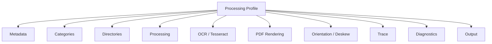
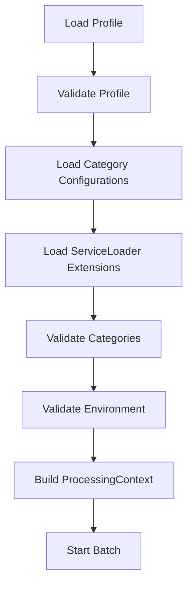
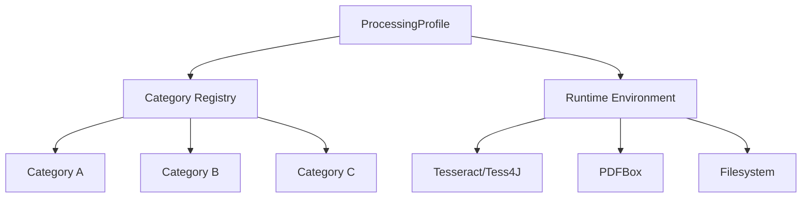

# Konfiguracja profilu uruchomieniowego

| Pole          | Wartość                                                        |
| ------------- | -------------------------------------------------------------- |
| ID dokumentu  | DOC-009                                                        |
| Tytuł         | Konfiguracja profilu uruchomieniowego                          |
| Wersja        | 0.1                                                            |
| Status        | Draft                                                          |
| Typ           | Configuration Specification                                    |
| Źródło prawdy | Repozytorium dokumentacji projektu                             |
| Zależności    | `01-vision.md`, `02-glossary.md`, `03-functional-requirements.md`, `04-non-functional-requirements.md`, `05-architecture.md`, `06-domain-model.md`, `07-processing-pipeline.md`, `08-category-configuration.md` |

## 1. Cel dokumentu

Celem dokumentu jest zdefiniowanie formatu profilu uruchomieniowego używanego przez aplikację CLI oraz, w ograniczonym zakresie, przez Configurator.

Profil opisuje parametry środowiskowe i wykonawcze niezależne od konkretnej kategorii dokumentu.

Profil określa między innymi:

- listę aktywnych kategorii,
- lokalizację plików kategorii,
- katalog wejściowy,
- katalog sukcesów,
- katalog błędów,
- liczbę workerów,
- domyślne parametry OCR,
- konfigurację Tesseracta,
- ustawienia rasteryzacji PDFBox,
- ustawienia orientacji i deskew,
- tryb trace,
- ustawienia diagnostyczne,
- parametry eksportu CSV,
- zachowanie batcha,
- podstawowe parametry CLI.

## 2. Podstawowe założenie

Profil jest osobnym plikiem JSON.

Przykład:

```text
config/
├── profiles/
│   ├── default.json
│   ├── production.json
│   └── test.json
└── categories/
    ├── formularz-abc.json
    └── faktura-a.json
```

Profil nie zawiera definicji pól ani kotwic kategorii.

## 3. Przykład minimalny

```json
{
  "schemaVersion": "1.0",
  "id": "default",
  "version": "1.0",

  "categories": {
    "directory": "../categories",
    "active": [
      "formularz-abc",
      "faktura-a"
    ]
  },

  "directories": {
    "input": "./input",
    "success": "./success",
    "error": "./error"
  },

  "processing": {
    "workers": 4
  },

  "ocr": {
    "language": "pol"
  },

  "output": {
    "csv": {
      "file": "./result.csv"
    }
  }
}
```

## 4. Główna struktura profilu



## 5. Pola główne

| Pole | Typ | Wymagane | Znaczenie |
| ---- | --- | -------- | --------- |
| `schemaVersion` | string | Tak | Wersja formatu profilu |
| `id` | string | Tak | Stabilny identyfikator profilu |
| `version` | string | Tak | Wersja profilu |
| `displayName` | string | Nie | Nazwa prezentacyjna |
| `description` | string | Nie | Opis profilu |
| `categories` | object | Tak | Aktywne kategorie |
| `directories` | object | Tak | Katalogi batcha |
| `processing` | object | Tak | Parametry wykonania |
| `ocr` | object | Nie | Domyślne OCR/Tesseract |
| `pdf` | object | Nie | Rasteryzacja PDF |
| `orientation` | object | Nie | Orientacja i deskew |
| `trace` | object | Nie | Trace pipeline'u |
| `diagnostics` | object | Nie | Artefakty diagnostyczne |
| `output` | object | Tak | Wyniki procesu |

## 6. schemaVersion

Wersjonuje format profilu.

```json
{
  "schemaVersion": "1.0"
}
```

Nie należy mylić z `version`.

## 7. version

Wersja konkretnej konfiguracji profilu.

```json
{
  "id": "production",
  "version": "2.1"
}
```

## 8. ProfileId

Rekomendowany format:

```text
[a-z0-9][a-z0-9-]*
```

Przykłady:

```text
default
production
test-batch
customer-a-prod
```

## 9. categories

Sekcja wskazuje skąd pobierać konfiguracje kategorii i które z nich aktywować.

```json
{
  "categories": {
    "directory": "../categories",
    "active": [
      "formularz-abc",
      "faktura-a"
    ],
    "files": [
      "../categories/formularz-abc.json",
      "../shared-categories/faktura-a.json"
    ]
  }
}
```

Pole `files` jest opcjonalne. Jeśli jest podane, profil wskazuje konkretne pliki kategorii i aplikacja ładuje je bez skanowania całego katalogu `directory`. Ścieżki w `files` mogą być bezwzględne albo względne względem pliku profilu.

Pole `directory` pozostaje wymagane ze względu na zgodność wsteczną i tryb `ALL`; dla profili tworzonych w UI rekomendowane jest używanie `files`, ponieważ kategorie mogą znajdować się poza jednym katalogiem i mogą być współdzielone przez wiele profili.

## 10. categories.directory

Wskazuje katalog zawierający pliki kategorii.

Ścieżka może być:

- bezwzględna,
- względna względem pliku profilu.

Rekomendacja:

```text
ścieżki względne są rozwiązywane względem katalogu profilu
```

## 11. categories.active

Lista `CategoryId`.

Każda wartość musi odpowiadać dokładnie jednej poprawnej konfiguracji kategorii.

Jeśli `categories.files` jest podane, wartości `active` są filtrowane względem kategorii załadowanych z tych plików.

## 12. categories.files

Opcjonalna lista ścieżek do plików kategorii.

Rekomendowana struktura repozytorium:

```text
profiles/
  default.json
  customer-a.json
categories/
  invoice.json
  voucher.json
```

Przykład profilu:

```json
{
  "categories": {
    "directory": "../categories",
    "mode": "EXPLICIT",
    "active": ["invoice", "voucher"],
    "files": [
      "../categories/invoice.json",
      "../categories/voucher.json"
    ]
  }
}
```

## 13. Aktywacja wszystkich kategorii

Opcjonalny wariant:

```json
{
  "categories": {
    "directory": "../categories",
    "mode": "ALL"
  }
}
```

Alternatywnie:

```json
{
  "categories": {
    "directory": "../categories",
    "active": ["*"]
  }
}
```

Rekomendacja:

- preferować jawne `mode`.

## 14. Categories mode

Proponowane wartości:

```text
EXPLICIT
ALL
```

Przykład:

```json
{
  "categories": {
    "directory": "../categories",
    "mode": "EXPLICIT",
    "active": [
      "formularz-abc",
      "faktura-a"
    ]
  }
}
```

## 14. Walidacja kategorii

Dla `EXPLICIT`:

- lista `active` nie może być pusta,
- każda kategoria musi istnieć,
- ID nie mogą się powtarzać.

Dla `ALL`:

- `active` powinno być pominięte.

## 15. directories

```json
{
  "directories": {
    "input": "./input",
    "success": "./success",
    "error": "./error"
  }
}
```

## 16. Katalog input

Zawiera dokumenty do przetworzenia.

Nie zakładamy katalogu `processing`.

## 17. Katalog success

Dokument poprawnie przetworzony trafia do `success`.

## 18. Katalog error

Dokument zakończony błędem trafia do `error`.

## 19. Brak katalogu processing

Architektura nie wykorzystuje osobnego katalogu `processing`.

Jednoznaczne przydzielenie pliku realizuje:

```text
DocumentEnumerator
→ Dispatcher
→ Work Queue
→ Worker
```

## 20. Walidacja katalogów

Przed startem batcha należy sprawdzić:

- `input` istnieje i jest katalogiem,
- `input` jest czytelny,
- `success` istnieje lub może zostać utworzony,
- `error` istnieje lub może zostać utworzony,
- katalogi wynikowe są zapisywalne.

## 21. Tworzenie katalogów wynikowych

Rekomendacja:

```text
success/error brakują
→ utwórz podczas bootstrapu
```

Jeżeli utworzenie się nie powiedzie:

```text
fail fast
```

## 22. Kolizje nazw

Przyjmujemy założenie, że nazwy plików nie będą kolidować.

Jeżeli mimo to plik docelowy istnieje:

```text
FILE_MOVE_FAILED
```

Nie wykonujemy automatycznego rename.

## 23. processing

```json
{
  "processing": {
    "workers": 4,
    "queueCapacity": 16
  }
}
```

## 24. workers

Liczba dokumentów mogących być przetwarzanych równolegle.

Reguła:

```text
workers >= 1
```

## 25. Domyślna liczba workerów

Jeżeli `workers` nie zostanie podane, aplikacja może użyć wartości domyślnej.

Rekomendacja początkowa:

```text
max(1, availableProcessors - 1)
```

ale nie więcej niż zdefiniowany limit bezpieczeństwa.

Dokładny default powinien zostać potwierdzony testami z Tess4J.

## 26. queueCapacity

Opcjonalny limit lekkich `DocumentJob`.

```text
queueCapacity >= workers
```

Przykład:

```json
{
  "processing": {
    "workers": 4,
    "queueCapacity": 16
  }
}
```

## 27. Brak queueCapacity

Jeżeli wartość nie została podana:

```text
queueCapacity = workers * 4
```

Może zostać zmienione po benchmarkach.

## 28. stopOnGlobalError

Opcjonalny parametr:

```json
{
  "processing": {
    "stopOnGlobalError": true
  }
}
```

Błędy pojedynczego dokumentu nie są błędami globalnymi.

## 29. Błąd globalny

Przykłady:

- brak możliwości zapisu CSV,
- brak dostępu do success/error,
- uszkodzony profil,
- brak aktywnych kategorii,
- brak wymaganej integracji OCR.

## 30. OCR

Domyślna konfiguracja:

```json
{
  "ocr": {
    "language": "pol"
  }
}
```

## 31. Pełna konfiguracja OCR

```json
{
  "ocr": {
    "language": "pol",
    "datapath": "/usr/share/tesseract-ocr/5/tessdata",
    "pageSegMode": 3,
    "ocrEngineMode": 1,
    "dpi": 300,
    "variables": {
      "preserve_interword_spaces": "1"
    }
  }
}
```

## 32. language

Domyślnie:

```text
pol
```

Możliwe:

```text
pol
eng
pol+eng
```

Konfiguracja kategorii i pola może nadpisać język.

## 33. datapath

Tesseract jest założony jako zainstalowany w środowisku.

`datapath` jest opcjonalny.

Jeżeli pominięty:

```text
Tess4J/Tesseract używa domyślnej lokalizacji danych językowych
```

Jeżeli podany:

```text
adapter Tess4J ustawia datapath
```

## 34. Tesseract executable

Profil nie musi wskazywać executable Tesseracta, ponieważ integracja jest realizowana przez Tess4J.

Jeśli przyszła implementacja będzie tego wymagała, można dodać osobny parametr środowiskowy.

## 35. OCR override

Hierarchia:

```text
application defaults
→ profile.ocr
→ category.ocr
→ field.ocr
```

## 36. pdf

```json
{
  "pdf": {
    "dpi": 300
  }
}
```

## 37. PDFBox rendering DPI

Przyjęty domyślny kandydat:

```text
300 DPI
```

Powinien zostać zweryfikowany pod kątem:

- jakości OCR,
- pamięci,
- czasu rasteryzacji.

## 38. PDF options

Pierwsza wersja może ograniczyć się do:

```json
{
  "pdf": {
    "dpi": 300
  }
}
```

Nie należy dodawać parametrów PDFBox bez realnej potrzeby.

## 39. orientation

```json
{
  "orientation": {
    "enabled": true,
    "deskewEnabled": true
  }
}
```

## 40. enabled

Steruje wykrywaniem/korektą orientacji:

```text
0 / 90 / 180 / 270
```

## 41. deskewEnabled

Steruje korektą niewielkiego przechylenia.

Może zostać ustawione na false, jeśli algorytm nie jest potrzebny lub pogarsza jakość konkretnego procesu.

## 42. orientation confidence threshold

Opcjonalnie:

```json
{
  "orientation": {
    "enabled": true,
    "confidenceThreshold": 0.75
  }
}
```

Dokładna semantyka zależy od wybranego algorytmu orientacji.

## 43. trace

```json
{
  "trace": {
    "mode": "BASIC"
  }
}
```

Obsługiwane wartości:

```text
OFF
BASIC
FULL
```

## 44. Rekomendowane użycie trace

| Środowisko | Tryb |
| ---------- | ---- |
| Batch produkcyjny | `OFF` lub `BASIC` |
| Batch diagnostyczny | `BASIC` lub `FULL` |
| Configurator | `FULL` |

## 45. FULL trace

`FULL` może zawierać:

- obrazy etapów,
- regiony,
- tekst OCR,
- wartości pośrednie,
- parametry extension,
- wyniki walidacji.

Jest kosztowny pamięciowo.

## 46. diagnostics

```json
{
  "diagnostics": {
    "enabled": false,
    "directory": "./diagnostics",
    "saveImages": false,
    "saveHocr": false
  }
}
```

## 47. diagnostics.enabled

Włącza dodatkowe artefakty diagnostyczne.

Nie wpływa na wynik domenowy.

## 48. diagnostics.directory

Lokalizacja artefaktów diagnostycznych.

Jeżeli diagnostics są wyłączone, katalog nie musi istnieć.

## 49. saveImages

Pozwala zapisać obrazy etapów trace.

Domyślnie:

```text
false
```

## 50. saveHocr

Pozwala zapisać surowy hOCR.

Przydatne przy analizie błędów OCR.

## 51. saveFailedOnly

Rekomendowany parametr:

```json
{
  "diagnostics": {
    "enabled": true,
    "saveFailedOnly": true
  }
}
```

Ogranicza ilość danych diagnostycznych.

## 52. Struktura katalogu diagnostycznego

Przykład:

```text
diagnostics/
└── batch-20260808-001/
    └── document-123/
        ├── page-1-rendered.png
        ├── page-1-prepared.png
        ├── page-1.hocr
        ├── field-pesel-01-crop.png
        ├── field-pesel-02-remove-boxes.png
        └── trace.json
```

Format nie jest częścią Domain.

## 53. output

Sekcja output opisuje wynik batcha.

```json
{
  "output": {
    "csv": {
      "file": "./result.csv"
    }
  }
}
```

## 54. CSV configuration

Pełniejszy przykład:

```json
{
  "output": {
    "csv": {
      "file": "./result.csv",
      "charset": "UTF-8",
      "delimiter": ";",
      "quote": "\"",
      "includeHeader": true
    }
  }
}
```

## 55. charset

Domyślnie:

```text
UTF-8
```

## 56. delimiter

Dla polskiego środowiska można preferować:

```text
;
```

ze względu na częste użycie przecinka jako separatora dziesiętnego.

Domyślną wartość należy ustalić jawnie.

Rekomendacja:

```text
;
```

## 57. quote

Domyślnie:

```text
"
```

CSV writer musi poprawnie escapować:

- delimiter,
- quote,
- newline.

## 58. includeHeader

Domyślnie:

```text
true
```

## 59. append

Pierwsza wersja powinna preferować:

```text
append = false
```

i tworzyć nowy wynik dla batcha.

Jeżeli plik istnieje:

```text
fail fast
```

lub jawna polityka override.

Rekomendacja:

```text
overwrite = false
```

## 60. output.csv.overwrite

Przykład:

```json
{
  "output": {
    "csv": {
      "file": "./result.csv",
      "overwrite": false
    }
  }
}
```

Jeżeli istnieje i `overwrite=false`:

```text
bootstrap failure
```

## 61. CSV row order

Równoległe przetwarzanie dokumentów nie gwarantuje kolejności wierszy odpowiadającej kolejności wejścia.

Profil nie powinien domyślnie wymuszać sortowania.

## 62. deterministicRows

Opcjonalna przyszła funkcja:

```json
{
  "output": {
    "csv": {
      "deterministicRows": false
    }
  }
}
```

Nie jest wymagana w wersji 1.

## 63. CSV columns

Kolumny są budowane na podstawie:

```text
technical columns
+
sumy output fields aktywnych kategorii
```

Profil nie definiuje pól biznesowych.

## 64. Technical columns

Minimalnie:

```text
fileName
category
processingStatus
errorCode
errorMessage
```

Dokładny format będzie przedmiotem osobnego dokumentu output.

## 65. logging

Można dopuścić prostą konfigurację poziomu logowania:

```json
{
  "logging": {
    "level": "INFO"
  }
}
```

## 66. Logging stack

Przyjęto:

```text
SLF4J
+
Logback
+
Lombok @Slf4j
```

## 67. logging.level

Obsługiwane:

```text
ERROR
WARN
INFO
DEBUG
TRACE
```

Rekomendacja produkcyjna:

```text
INFO
```

## 68. Logback configuration file

Zaawansowana konfiguracja loggerów może pozostać w:

```text
logback.xml
```

Profil nie musi duplikować całej konfiguracji Logback.

## 69. Sensitive data logging

Profil nie powinien mieć prostego parametru typu:

```text
logSensitiveData=true
```

w produkcji.

Jeżeli funkcja diagnostyczna będzie potrzebna, powinna być wyraźnie odseparowana i domyślnie wyłączona.

## 70. CLI override

Parametry CLI mogą nadpisywać wybrane wartości profilu.

Przykłady:

```text
--profile config/profiles/default.json
--workers 8
--input /data/in
--success /data/success
--error /data/error
--output /data/result.csv
--trace BASIC
```

## 71. Hierarchia override

```text
application defaults
→ profile
→ CLI arguments
```

CLI ma najwyższy priorytet dla ustawień wykonawczych.

Nie powinno nadpisywać definicji pól kategorii.

## 72. Parametry możliwe do override przez CLI

Rekomendowane:

| Parametr | Override |
| -------- | -------- |
| `directories.input` | Tak |
| `directories.success` | Tak |
| `directories.error` | Tak |
| `processing.workers` | Tak |
| `trace.mode` | Tak |
| `output.csv.file` | Tak |
| `logging.level` | Tak |
| `ocr.datapath` | Tak |
| `ocr.language` | Opcjonalnie |

## 73. Parametry nieprzeznaczone do CLI override

Nie rekomenduje się override:

- `schemaVersion`,
- `id`,
- listy kategorii, jeśli proces ma być audytowalny,
- skomplikowanych zmiennych OCR.

Mogą jednak istnieć osobne flagi administracyjne.

## 74. Full example

```json
{
  "schemaVersion": "1.0",
  "id": "production",
  "version": "1.3",
  "displayName": "Production OCR",
  "description": "Profil produkcyjnego przetwarzania dokumentów",

  "categories": {
    "directory": "../categories",
    "mode": "EXPLICIT",
    "active": [
      "formularz-abc",
      "faktura-a",
      "deklaracja-b"
    ]
  },

  "directories": {
    "input": "/data/ocr/input",
    "success": "/data/ocr/success",
    "error": "/data/ocr/error"
  },

  "processing": {
    "workers": 6,
    "queueCapacity": 24,
    "stopOnGlobalError": true
  },

  "ocr": {
    "language": "pol",
    "datapath": "/usr/share/tesseract-ocr/5/tessdata",
    "pageSegMode": 3,
    "ocrEngineMode": 1,
    "dpi": 300,
    "variables": {
      "preserve_interword_spaces": "1"
    }
  },

  "pdf": {
    "dpi": 300
  },

  "orientation": {
    "enabled": true,
    "deskewEnabled": true
  },

  "trace": {
    "mode": "BASIC"
  },

  "diagnostics": {
    "enabled": true,
    "directory": "/data/ocr/diagnostics",
    "saveFailedOnly": true,
    "saveImages": true,
    "saveHocr": true
  },

  "output": {
    "csv": {
      "file": "/data/ocr/result.csv",
      "charset": "UTF-8",
      "delimiter": ";",
      "quote": "\"",
      "includeHeader": true,
      "overwrite": false
    }
  },

  "logging": {
    "level": "INFO"
  }
}
```

## 75. Configurator profile

Configurator może używać uproszczonego profilu.

Przykład:

```json
{
  "schemaVersion": "1.0",
  "id": "configurator",
  "version": "1.0",

  "categories": {
    "directory": "../categories",
    "mode": "ALL"
  },

  "directories": {
    "input": ".",
    "success": ".",
    "error": "."
  },

  "processing": {
    "workers": 1
  },

  "ocr": {
    "language": "pol"
  },

  "pdf": {
    "dpi": 300
  },

  "orientation": {
    "enabled": true,
    "deskewEnabled": true
  },

  "trace": {
    "mode": "FULL"
  },

  "diagnostics": {
    "enabled": false
  },

  "output": {
    "csv": {
      "file": "./preview.csv",
      "overwrite": true
    }
  }
}
```

W praktyce Configurator może mieć osobną konfigurację aplikacyjną i używać tylko wspólnej części profilu.

## 76. DTO profilu

Proponowany package:

```text
pl.sk.ocr.adapter.json.dto.profile
```

Przykładowe klasy:

```text
ProcessingProfileDto
CategoriesDto
DirectoriesDto
ProcessingOptionsDto
OcrOptionsDto
PdfOptionsDto
OrientationOptionsDto
TraceOptionsDto
DiagnosticsOptionsDto
OutputOptionsDto
CsvOutputOptionsDto
LoggingOptionsDto
```

## 77. Mapping JSON → Domain/Application


## 78. Jackson

Rekomendacja pozostaje zgodna z konfiguracją kategorii:

```text
com.fasterxml.jackson.core:jackson-databind
```

Parser powinien odrzucać nieznane właściwości.

## 79. ProfileValidationResult

```java
@Value
@Builder
public class ProfileValidationResult {
    boolean valid;
    List<ConfigurationProblem> problems;
}
```

Można współdzielić `ConfigurationProblem` z walidacją kategorii.

## 80. Walidacja profilu

Walidacja obejmuje:

1. schemaVersion,
2. ProfileId,
3. categories directory,
4. active category IDs,
5. katalogi batcha,
6. workers,
7. queue capacity,
8. OCR,
9. datapath, jeśli wskazany,
10. PDF DPI,
11. trace mode,
12. diagnostics directory,
13. CSV path,
14. charset,
15. delimiter/quote,
16. output collision policy.

## 81. Fail fast

CLI powinno odrzucić profil przed startem batcha, jeśli:

- katalog input nie istnieje,
- success/error są niedostępne,
- nie można utworzyć result.csv,
- aktywne kategorie są błędne,
- profile/category schema są nieobsługiwane,
- brak rozszerzenia wymaganego przez kategorię.

## 82. Validation order bootstrap



## 83. Environment validation

Sprawdza m.in.:

- datapath Tesseracta, jeśli wskazany,
- write permissions,
- PDF configuration,
- dostępność extension providers.

## 84. ServiceLoader

Profil nie definiuje listy klas pluginów.

Extension są wykrywane automatycznie przez:

```text
ServiceLoader
```

Kategorie używają jedynie `ExtensionId`.

## 85. Tesseract language validation

Jeżeli technicznie możliwe, bootstrap powinien sprawdzić dostępność wymaganych danych językowych.

Przykład:

```text
pol.traineddata
```

Jeśli język wymagany przez kategorię nie jest dostępny:

```text
fail fast
```

## 86. Category-specific languages

Walidacja środowiska powinna zebrać języki wymagane przez:

```text
profile
+
all active categories
+
field overrides
```

i sprawdzić ich dostępność.

## 87. Profile registry

Nie jest konieczny dla CLI, które używa jednego profilu na run.

Configurator może prezentować listę profili, ale jest to funkcja UI/infrastruktury.

## 88. Hot reload

Batch nie obsługuje hot reload profilu.

Zmiana pliku w trakcie batcha nie wpływa na bieżący `ProcessingContext`.

To zapewnia powtarzalność.

## 89. Immutable snapshot

Po bootstrapie profil powinien zostać zmapowany do niemutowalnego obiektu.

```text
profile JSON
→ immutable ProcessingProfile
→ immutable ProcessingContext
```

## 90. Profile hash

Warto rozważyć analogiczny hash jak dla kategorii:

```text
SHA-256 normalized JSON
```

Może zostać zapisany w podsumowaniu batcha.

## 91. Batch metadata

Rekomendowany wynik batcha może zawierać:

```text
profileId
profileVersion
profileHash
applicationVersion
startTime
endTime
documentCount
successCount
errorCount
```

## 92. CLI output

Na standard output:

```text
Profile: production
Categories: 3
Workers: 6
Input: /data/ocr/input
Documents: 12450

Processed: 12450
Success: 12298
Failed: 152
Duration: ...
```

## 93. Standard error

Błędy bootstrap/globalne powinny trafiać do stderr.

Błędy pojedynczych dokumentów są raportowane w wyniku/logach i nie muszą generować osobnego stderr per dokument.

## 94. Exit codes

Wstępna propozycja:

| Kod | Znaczenie |
| --- | --------- |
| `0` | Batch uruchomiony i zakończony technicznie poprawnie |
| `1` | Niepoprawne argumenty CLI |
| `2` | Niepoprawny profil/konfiguracja |
| `3` | Błąd środowiska |
| `4` | Globalny błąd wykonania batcha |

Obecność dokumentów w `error` nie musi oznaczać exit code != 0.

To ważne dla dużych wsadów.

## 95. Dokumenty błędne a exit code

Rekomendowana semantyka:

```text
batch completed
+
some documents failed
→ exit code 0
```

O liczbie błędów informuje `BatchResult`.

Jeżeli proces technicznie nie mógł dokończyć batcha:

```text
exit code != 0
```

## 96. profile schemaVersion

Tak samo jak dla kategorii:

```text
major.minor
```

## 97. Nieznane pola JSON

Powinny być odrzucane.

Chroni to przed literówkami.

## 98. Null handling

Jawne null powinno być co do zasady niedozwolone.

Opcjonalne sekcje mogą być pominięte.

## 99. Defaults

Proponowane wartości początkowe:

| Parametr | Default |
| -------- | ------- |
| `ocr.language` | `pol` |
| `pdf.dpi` | `300` |
| `orientation.enabled` | `true` |
| `orientation.deskewEnabled` | `false` lub `true` po benchmarkach |
| `trace.mode` | `OFF` dla CLI |
| `diagnostics.enabled` | `false` |
| `diagnostics.saveImages` | `false` |
| `diagnostics.saveHocr` | `false` |
| `output.csv.charset` | `UTF-8` |
| `output.csv.delimiter` | `;` |
| `output.csv.quote` | `"` |
| `output.csv.includeHeader` | `true` |
| `output.csv.overwrite` | `false` |
| `logging.level` | `INFO` |

## 100. Explicit vs default

Wartości wpływające na środowisko mogą mieć default.

Parametry krytyczne dla lokalizacji plików powinny być jawne:

```text
directories.input
directories.success
directories.error
output.csv.file
```

## 101. Deterministyczny zapis profilu

Configurator/edytor profili powinien:

- używać UTF-8,
- zachowywać stabilną kolejność pól,
- używać 2 spacji,
- dodawać newline na końcu,
- nie generować losowej kolejności map.

## 102. JSON Schema

Profil powinien posiadać własne schema:

```text
schema/profile.schema.json
```

## 103. Przykładowa struktura schematów

```text
config/
├── schema/
│   ├── category-configuration.schema.json
│   └── profile.schema.json
├── profiles/
└── categories/
```

## 104. JSON Schema nie zastępuje walidacji runtime

Schema nie sprawdzi np.:

- czy katalog istnieje,
- czy CategoryId istnieje,
- czy Tesseract posiada język,
- czy extension istnieje.

To robi walidacja aplikacyjna.

## 105. Profile a category configuration



Profil opisuje runtime; kategoria opisuje semantykę dokumentu.

## 106. Granica odpowiedzialności

Do profilu należą:

- środowisko,
- concurrency,
- katalogi,
- globalne OCR,
- rendering,
- diagnostics,
- output.

Do kategorii należą:

- identyfikacja,
- anchors,
- geometry,
- fields,
- field OCR overrides,
- transformations,
- validation.

## 107. Przykład dwóch profili z tymi samymi kategoriami

### production

```json
{
  "processing": {
    "workers": 8
  },
  "trace": {
    "mode": "OFF"
  }
}
```

### diagnostic

```json
{
  "processing": {
    "workers": 1
  },
  "trace": {
    "mode": "FULL"
  },
  "diagnostics": {
    "enabled": true,
    "saveImages": true,
    "saveHocr": true
  }
}
```

Kategorie pozostają te same.

## 108. Portability

Ścieżki względne powinny być wspierane.

Pozwala to przechowywać cały zestaw:

```text
config/
categories/
profiles/
```

w Git i przenosić między środowiskami.

## 109. Separatory ścieżek

Kod powinien używać:

```text
java.nio.file.Path
```

i nie zakładać `/` ani `\`.

## 110. Environment variables

W wersji 1 nie jest wymagane interpolowanie:

```text
${HOME}
${OCR_DATA}
```

w JSON.

Może zostać dodane później.

## 111. Sekrety

Profil nie powinien zawierać sekretów.

System nie korzysta obecnie z usług sieciowych wymagających credentiali.

## 112. Testy profilu

Fixture'y:

```text
valid-minimal-profile.json
valid-full-profile.json
invalid-workers.json
invalid-input-directory.json
invalid-category.json
invalid-charset.json
invalid-trace-mode.json
invalid-schema-version.json
```

## 113. Test bootstrapu

Test integracyjny powinien potwierdzić:

```text
profile
→ categories
→ extensions
→ environment
→ ProcessingContext
```

bez uruchamiania pełnego batcha.

## 114. Kryteria akceptacji

Format profilu jest gotowy do implementacji, jeśli:

1. profil jest osobnym JSON,
2. posiada `schemaVersion`, `id`, `version`,
3. wskazuje katalog kategorii,
4. pozwala wybrać aktywne kategorie,
5. posiada input/success/error,
6. nie posiada katalogu processing,
7. workers są konfigurowalne,
8. batch korzysta z bounded queue,
9. domyślny język to `pol`,
10. datapath jest opcjonalny,
11. Tesseract jest założony jako zainstalowany,
12. PDFBox DPI jest konfigurowalne,
13. orientation może być włączona/wyłączona,
14. deskew może być konfigurowany,
15. trace obsługuje OFF/BASIC/FULL,
16. diagnostics jest oddzielone od Domain,
17. artefakty graficzne mogą być zapisywane opcjonalnie,
18. CSV posiada jawne charset/delimiter/quote,
19. CLI może nadpisywać ustawienia wykonawcze,
20. profil jest walidowany przed batch'em,
21. kategorie są walidowane przed batch'em,
22. extensions są ładowane przez `ServiceLoader`,
23. zmiana pliku profilu podczas batcha nie wpływa na runtime,
24. profil jest mapowany do immutable ProcessingProfile,
25. format nadaje się do Git,
26. nieznane pola JSON są błędem.

## 115. Otwarte decyzje

Do dalszego doprecyzowania pozostają:

1. finalny default `workers`,
2. finalny default `queueCapacity`,
3. czy używać virtual threads,
4. lifecycle Tess4J per worker/call,
5. finalny default `deskewEnabled`,
6. dokładny model orientation confidence,
7. timeout OCR,
8. finalny default CSV delimiter,
9. szczegółowa semantyka overwrite output,
10. szczegółowe exit codes,
11. format BatchResult,
12. format pliku `trace.json`,
13. sposób sprawdzania dostępności traineddata,
14. czy CLI pozwala nadpisywać listę aktywnych kategorii,
15. czy profile hash trafia do CSV czy tylko batch summary.

## 116. Następny dokument

Rekomendowany następny dokument:

**`10-extension-api.md` — API rozszerzeń**

Powinien zdefiniować:

- bazowy interfejs `Extension`,
- `ExtensionDescriptor`,
- `ExtensionParameterDescriptor`,
- `Detector`,
- `Matcher`,
- `ImageProcessor`,
- `ValueTransformer`,
- `Validator`,
- `ServiceLoader`,
- provider contracts,
- thread-safety,
- lifecycle,
- validation parameters,
- standardowe ExtensionId,
- błędy rozszerzeń,
- przykładową implementację pluginu,
- konfigurację `META-INF/services`,
- wymagania dotyczące trace dla rozszerzeń.
