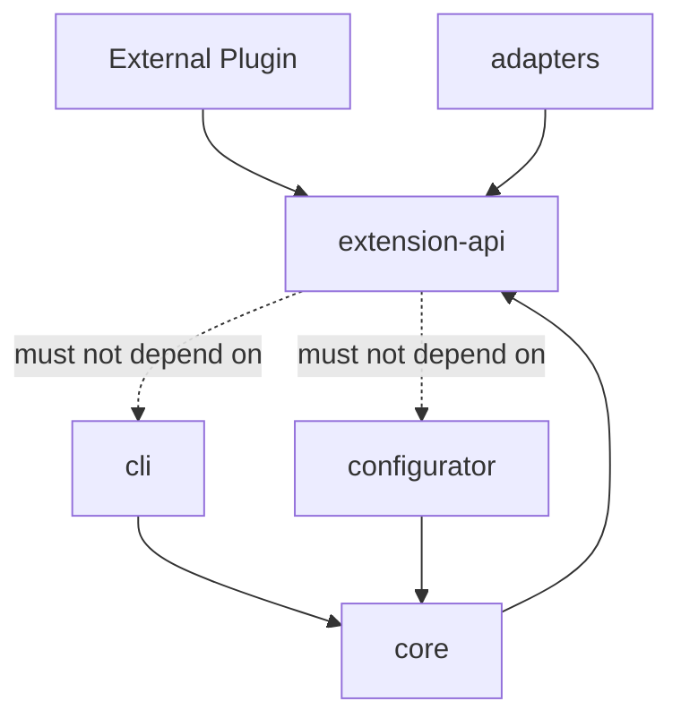
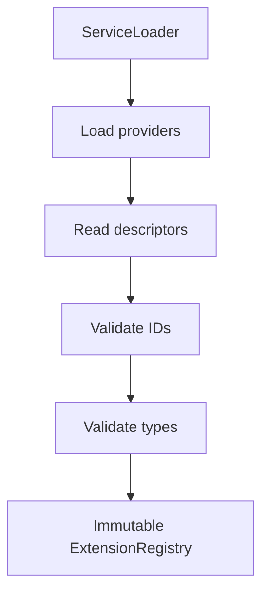
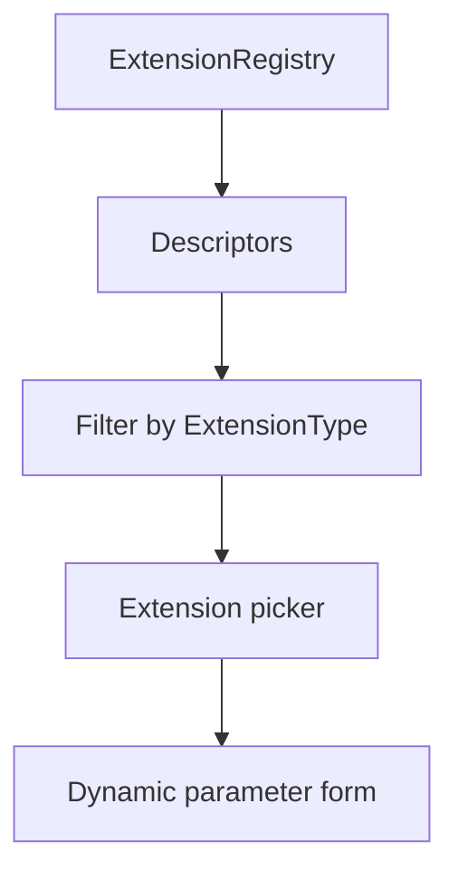
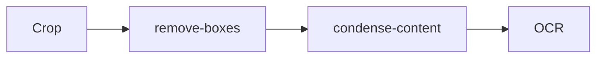
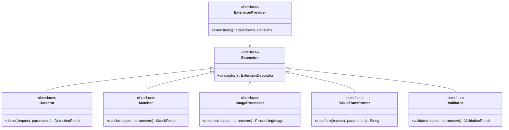
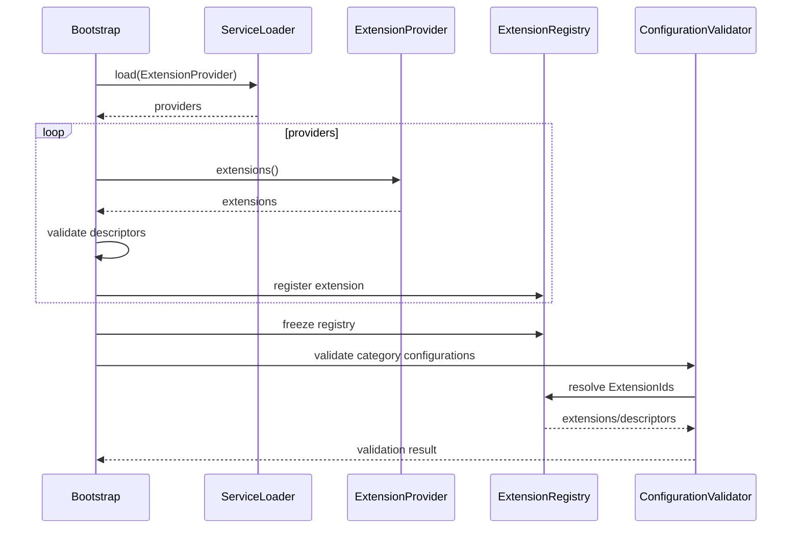
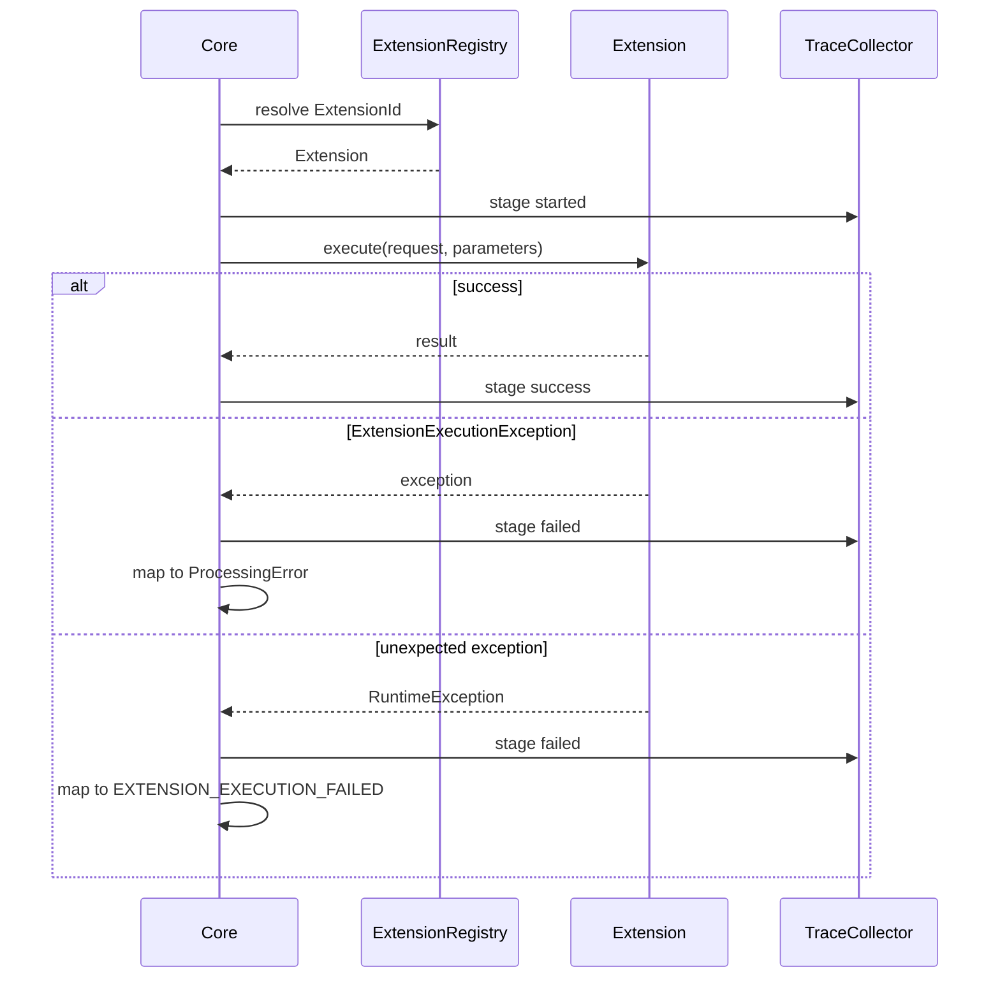
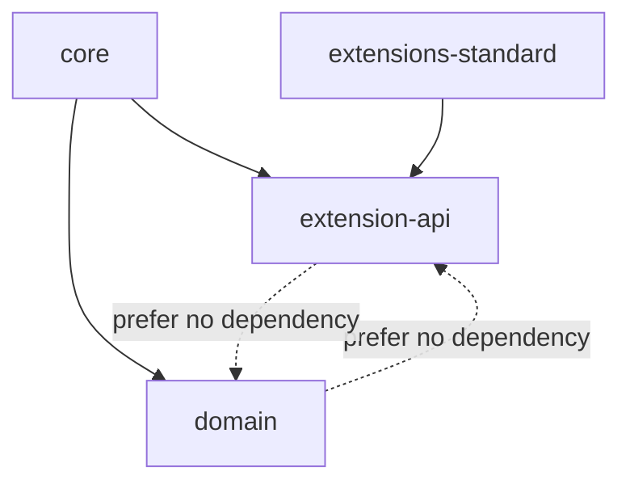

# API rozszerzeń

| Pole          | Wartość                                                        |
| ------------- | -------------------------------------------------------------- |
| ID dokumentu  | DOC-010                                                        |
| Tytuł         | API rozszerzeń i mechanizm pluginów                            |
| Wersja        | 0.1                                                            |
| Status        | Draft                                                          |
| Typ           | Technical Specification                                        |
| Źródło prawdy | Repozytorium dokumentacji projektu                             |
| Zależności    | `01-vision.md`, `02-glossary.md`, `03-functional-requirements.md`, `04-non-functional-requirements.md`, `05-architecture.md`, `06-domain-model.md`, `07-processing-pipeline.md`, `08-category-configuration.md`, `09-profile-configuration.md` |

## 1. Cel dokumentu

Celem dokumentu jest zdefiniowanie publicznego API rozszerzeń aplikacji OCR.

Mechanizm rozszerzeń ma umożliwiać dodawanie nowych operacji bez modyfikowania kodu Core, przede wszystkim:

- detektorów cech dokumentu,
- matcherów tekstu i wartości,
- processorów obrazu,
- transformerów wartości,
- validatorów.

Rozszerzenia są wykrywane przez standardowy mechanizm Java:

```text
java.util.ServiceLoader
```

Rozszerzenie jest dostarczane jako JAR dostępny na classpath/module path aplikacji.

## 2. Założenia architektoniczne

API rozszerzeń musi spełniać następujące założenia:

1. Core nie zależy od implementacji pluginów.
2. Plugin zależy od stabilnego modułu `extension-api`.
3. Konfiguracja odwołuje się do pluginu przez stabilny `ExtensionId`.
4. Pluginy są wykrywane przez `ServiceLoader`.
5. Plugin powinien być bezstanowy lub thread-safe.
6. Parametry pluginu są walidowane przed uruchomieniem batcha.
7. Błąd pojedynczego pluginu nie może niekontrolowanie przerwać całego batcha.
8. Plugin nie zna JavaFX ani CLI.
9. Plugin nie zapisuje samodzielnie trace na dysk.
10. Plugin nie powinien logować danych wrażliwych.
11. API powinno być możliwie małe i stabilne.
12. Lombok może być wykorzystywany również w modelach API.

## 3. Moduły

Rekomendowany podział Maven:

```text
parent
├── extension-api
├── domain
├── core
├── adapters
├── cli
└── configurator
```

Plugin zewnętrzny:

```text
my-plugin
└── depends on extension-api
```

## 4. Zależności



`extension-api` powinien mieć minimalną liczbę zależności.

## 5. Root package

Przyjęta nazwa root package:

```text
pl.sk.ocr
```

API rozszerzeń:

```text
pl.sk.ocr.extension.api
```

Przykładowe podpakiety:

```text
pl.sk.ocr.extension.api
pl.sk.ocr.extension.api.detector
pl.sk.ocr.extension.api.matcher
pl.sk.ocr.extension.api.image
pl.sk.ocr.extension.api.transform
pl.sk.ocr.extension.api.validation
pl.sk.ocr.extension.api.parameter
pl.sk.ocr.extension.api.context
pl.sk.ocr.extension.api.exception
```

## 6. Typy rozszerzeń

Pierwsza wersja obsługuje:

```java
public enum ExtensionType {
    DETECTOR,
    MATCHER,
    IMAGE_PROCESSOR,
    VALUE_TRANSFORMER,
    VALIDATOR
}
```

## 7. ExtensionId

Każde rozszerzenie posiada stabilny identyfikator.

```java
@Value
public class ExtensionId {
    String value;
}
```

Rekomendowany format:

```text
[a-z0-9][a-z0-9-]*
```

Przykłady:

```text
text
qr
barcode
fuzzy
remove-boxes
condense-content
trim
substring
regex
pesel
dictionary
```

## 8. Extension

Bazowy kontrakt:

```java
public interface Extension {

    ExtensionDescriptor descriptor();
}
```

Nie powinien zawierać metod wykonawczych wspólnych dla wszystkich typów.

## 9. ExtensionDescriptor

Descriptor opisuje rozszerzenie i jego parametry.

```java
@Value
@Builder
public class ExtensionDescriptor {

    ExtensionId id;
    ExtensionType type;
    String displayName;
    String description;
    String version;

    @Singular
    List<ExtensionParameterDescriptor> parameters;
}
```

## 10. Znaczenie descriptor

Descriptor służy do:

- walidacji JSON,
- budowania formularza w Configuratorze,
- prezentowania dostępnych rozszerzeń,
- wykrywania brakujących parametrów,
- walidacji typów parametrów,
- generowania diagnostyki.

## 11. ExtensionParameterDescriptor

```java
@Value
@Builder
public class ExtensionParameterDescriptor {

    String name;
    String displayName;
    String description;

    ExtensionParameterType type;

    boolean required;

    Object defaultValue;

    ParameterConstraints constraints;
}
```

## 12. ExtensionParameterType

Pierwsza wersja:

```java
public enum ExtensionParameterType {
    STRING,
    INTEGER,
    LONG,
    DECIMAL,
    BOOLEAN,
    ENUM,
    REGEX,
    STRING_LIST,
    INTEGER_LIST
}
```

Nie należy od razu tworzyć dowolnego systemu typów.

## 13. ParameterConstraints

```java
@Value
@Builder
public class ParameterConstraints {

    BigDecimal minimum;
    BigDecimal maximum;

    Integer minLength;
    Integer maxLength;

    @Singular
    List<String> allowedValues;
}
```

Pola nieużywane dla danego typu pozostają puste.

## 14. ExtensionParameters

Runtime powinien udostępniać parametry przez kontrolowany wrapper, a nie surowe `Map<String, Object>`.

```java
public interface ExtensionParameters {

    boolean contains(String name);

    String getString(String name);

    int getInt(String name);

    long getLong(String name);

    BigDecimal getDecimal(String name);

    boolean getBoolean(String name);

    List<String> getStringList(String name);

    Optional<String> findString(String name);

    Optional<Integer> findInt(String name);
}
```

## 15. Dlaczego wrapper

Zapewnia:

- spójną konwersję typów,
- czytelne błędy,
- brak zależności pluginu od Jacksona,
- stabilniejsze API.

Plugin nie powinien otrzymywać `JsonNode`.

## 16. Walidacja parametrów


Walidacja następuje przed rozpoczęciem batcha.

## 17. Custom parameter validation

Descriptor wystarcza do podstawowej walidacji.

Plugin może opcjonalnie implementować:

```java
public interface ExtensionConfigurationValidator {

    List<ExtensionConfigurationProblem> validate(
        ExtensionParameters parameters
    );
}
```

Przydatne dla zależności pomiędzy parametrami.

## 18. ExtensionConfigurationProblem

```java
@Value
@Builder
public class ExtensionConfigurationProblem {

    ConfigurationProblemSeverity severity;
    String parameter;
    String code;
    String message;
}
```

## 19. Registry

Core powinien posiadać registry:

```java
public interface ExtensionRegistry {

    Detector detector(ExtensionId id);

    Matcher matcher(ExtensionId id);

    ImageProcessor imageProcessor(ExtensionId id);

    ValueTransformer valueTransformer(ExtensionId id);

    Validator validator(ExtensionId id);
}
```

## 20. Bootstrap registry



## 21. Duplikat ExtensionId

Dwa rozszerzenia tego samego typu nie mogą posiadać tego samego ID.

Przykład:

```text
IMAGE_PROCESSOR/remove-boxes
```

zarejestrowany dwa razy:

```text
bootstrap failure
```

Nie wybieramy implementacji na podstawie kolejności classpath.

## 22. Namespace ID

W wersji 1 ID są unikalne w ramach typu.

Może istnieć:

```text
MATCHER/regex
VALIDATOR/regex
```

Nie powoduje to konfliktu.

## 23. Detector

Detector wykrywa cechę na obrazie.

```java
public interface Detector extends Extension {

    DetectionResult detect(
        DetectionRequest request,
        ExtensionParameters parameters
    );
}
```

## 24. DetectionRequest

```java
@Value
@Builder
public class DetectionRequest {

    ProcessingImage image;

    Integer pageNumber;

    Region searchRegion;

    DetectorContext context;
}
```

`searchRegion` może być null/optional, jeśli detector pracuje na całym obrazie.

Preferowane API może używać `Optional<Region>`.

## 25. DetectorContext

Kontekst zawiera tylko usługi dopuszczone dla detectora.

Przykład:

```java
public interface DetectorContext {

    Optional<PageText> pageText();

    Optional<PageOcrResultView> pageOcr();

    TraceSink trace();
}
```

Nie należy przekazywać całego `ProcessingContext`.

## 26. DetectionResult

```java
@Value
@Builder
public class DetectionResult {

    DetectionStatus status;

    String value;

    Double confidence;

    DetectedGeometry geometry;

    @Singular
    List<ExtensionWarning> warnings;
}
```

## 27. DetectionStatus

```java
public enum DetectionStatus {
    DETECTED,
    NOT_DETECTED
}
```

Błędy techniczne powinny być wyjątkami kontrolowanymi, a nie kolejnym statusem.

## 28. DetectedGeometry

```java
@Value
@Builder
public class DetectedGeometry {

    Region bounds;

    Point center;

    Double rotation;

    @Singular
    List<Point> points;
}
```

`points` umożliwia np. zachowanie narożników QR.

## 29. QR detector

Standardowy detector:

```text
id = qr
type = DETECTOR
```

Implementacja:

```text
ZXing
```

Powinien zwracać:

- payload QR,
- bounds,
- center,
- punkty detekcji,
- jeśli możliwe: rotację.

## 30. Barcode detector

Standardowy detector:

```text
id = barcode
```

Pierwsza implementacja również może korzystać z ZXing.

## 31. Text detector

Standardowy detector:

```text
id = text
```

Nie powinien ponownie wykonywać OCR strony, jeśli `PageOcrResult` jest dostępny.

Powinien pracować na geometrycznym wyniku OCR/hOCR.

## 32. Detector a cache

Detector nie zarządza cache.

Cache jest odpowiedzialnością Core.

Core buduje klucz:

```text
ExtensionId
+ page
+ searchRegion
+ parameters
+ relevant input identity
```

## 33. Matcher

Matcher porównuje wartości.

```java
public interface Matcher extends Extension {

    MatchResult match(
        MatchRequest request,
        ExtensionParameters parameters
    );
}
```

## 34. MatchRequest

```java
@Value
@Builder
public class MatchRequest {

    String actual;
    String expected;
}
```

## 35. MatchResult

```java
@Value
@Builder
public class MatchResult {

    boolean matched;

    Double score;

    String normalizedActual;

    String normalizedExpected;
}
```

## 36. Standardowe matchery

Pierwszy zestaw:

```text
exact
normalized
fuzzy
regex
```

## 37. exact

Semantyka:

```text
actual.equals(expected)
```

Bez niejawnej normalizacji.

## 38. normalized

Semantyka powinna być jawnie zdefiniowana.

Przykładowa pierwsza wersja:

```text
trim
→ collapse whitespace
→ uppercase using Locale.ROOT
```

Nie należy automatycznie usuwać znaków diakrytycznych bez decyzji architektonicznej.

## 39. fuzzy

Przykładowy descriptor:

```java
ExtensionDescriptor.builder()
    .id(new ExtensionId("fuzzy"))
    .type(ExtensionType.MATCHER)
    .displayName("Fuzzy text matcher")
    .parameter(
        ExtensionParameterDescriptor.builder()
            .name("threshold")
            .type(ExtensionParameterType.DECIMAL)
            .required(false)
            .defaultValue(new BigDecimal("0.85"))
            .constraints(
                ParameterConstraints.builder()
                    .minimum(BigDecimal.ZERO)
                    .maximum(BigDecimal.ONE)
                    .build()
            )
            .build()
    )
    .build();
```

## 40. Fuzzy score

Kontrakt:

```text
0.0 <= score <= 1.0
```

```text
matched = score >= threshold
```

Algorytm podobieństwa jest implementacją pluginu.

## 41. regex matcher

Dla matcher `regex`:

```text
actual matches configured pattern
```

W takim przypadku `expected` może nie być używany.

Alternatywnie regex można traktować jako osobny kontrakt. Pierwsza wersja może zachować go jako Matcher z parametrem `pattern`.

## 42. ImageProcessor

```java
public interface ImageProcessor extends Extension {

    ProcessingImage process(
        ImageProcessingRequest request,
        ExtensionParameters parameters
    );
}
```

## 43. ImageProcessingRequest

```java
@Value
@Builder
public class ImageProcessingRequest {

    ProcessingImage image;

    ImageProcessingContext context;
}
```

## 44. ImageProcessingContext

```java
public interface ImageProcessingContext {

    Optional<FieldIdView> fieldId();

    TraceSink trace();
}
```

Kontekst powinien pozostać mały.

## 45. Kontrakt ImageProcessor

Processor:

- otrzymuje poprawny obraz,
- zwraca nowy logiczny obraz,
- nie może zwrócić null,
- nie zapisuje pliku na dysk jako część działania domenowego,
- nie powinien modyfikować współdzielonego obrazu in-place, jeśli może to wpłynąć na inne etapy.

## 46. Standardowe ImageProcessor

Planowany zestaw początkowy:

```text
remove-boxes
condense-content
crop-empty-margins
```

Możliwe przyszłe:

```text
grayscale
threshold
invert
denoise
resize
sharpen
```

## 47. remove-boxes

Cel:

- usunięcie linii/ramek formularza utrudniających OCR.

Parametry mogą obejmować:

```text
minimumLineLength
maximumLineThickness
horizontal
vertical
```

Dokładny algorytm zostanie ustalony podczas implementacji.

## 48. condense-content

Cel:

- usunięcie pustych przestrzeni pomiędzy istotnymi fragmentami obrazu,
- zmniejszenie regionu przed OCR.

Processor musi zachować czytelność znaków.

## 49. crop-empty-margins

Cel:

- usunięcie pustych marginesów.

Przykładowe parametry:

```text
padding
backgroundThreshold
```

## 50. ValueTransformer

```java
public interface ValueTransformer extends Extension {

    String transform(
        ValueTransformationRequest request,
        ExtensionParameters parameters
    );
}
```

## 51. ValueTransformationRequest

```java
@Value
@Builder
public class ValueTransformationRequest {

    String value;

    ValueTransformationContext context;
}
```

## 52. Standardowe ValueTransformer

Pierwsza wersja:

```text
trim
remove-whitespace
normalize
substring
uppercase
lowercase
regex-replace
```

Nie wszystkie muszą być zaimplementowane w pierwszym commicie, ale API powinno je obsłużyć.

## 53. substring

Przykładowa konfiguracja:

```json
{
  "id": "substring",
  "parameters": {
    "start": 0,
    "length": 11
  }
}
```

Semantyka błędnego zakresu musi być jawna.

Rekomendacja:

```text
invalid range
→ controlled ExtensionExecutionException
```

Nie należy cicho skracać bez konfiguracji.

## 54. trim

Bez parametrów:

```json
{
  "id": "trim"
}
```

## 55. remove-whitespace

Semantyka powinna być określona jako:

```text
remove all Unicode whitespace
```

albo dokładnie ograniczona do konkretnego zestawu.

Należy to pokryć testami.

## 56. normalize

Nazwa `normalize` jest potencjalnie zbyt ogólna.

Jeżeli pozostanie, jej semantyka musi być stabilna.

Alternatywnie warto mieć bardziej precyzyjne transformery.

## 57. Validator

```java
public interface Validator extends Extension {

    ValidationResult validate(
        ValidationRequest request,
        ExtensionParameters parameters
    );
}
```

## 58. ValidationRequest

```java
@Value
@Builder
public class ValidationRequest {

    String value;

    ValidationContext context;
}
```

## 59. ValidationResult

```java
@Value
@Builder
public class ValidationResult {

    ValidationStatus status;

    String code;

    String message;

    @Singular
    List<ValidationDetail> details;
}
```

## 60. ValidationStatus

```java
public enum ValidationStatus {
    VALID,
    INVALID
}
```

Błąd techniczny validatora jest wyjątkiem, nie `INVALID`.

To ważne rozróżnienie:

```text
INVALID
= wartość biznesowo niepoprawna

exception
= validator nie był w stanie wykonać walidacji
```

## 61. Standardowe validators

Pierwszy zestaw:

```text
regex
pesel
dictionary
not-empty
length
```

## 62. PESEL validator

`pesel` powinien sprawdzać co najmniej:

- dokładnie 11 cyfr,
- sumę kontrolną.

Opcjonalnie może sprawdzać semantykę daty.

Jeżeli zostanie to dodane, powinno być jawnie udokumentowane.

## 63. Dictionary validator

Konfiguracja:

```json
{
  "id": "dictionary",
  "parameters": {
    "dictionary": "polish-first-names",
    "ignoreCase": true
  }
}
```

## 64. DictionaryProvider

Słowniki są osobnym zasobem.

Rekomendowany kontrakt infrastrukturalny/API:

```java
public interface DictionaryProvider {

    Optional<Dictionary> find(String id);
}
```

Nie musi być osobnym `ExtensionType` w pierwszej wersji.

## 65. Dictionary access in ValidationContext

```java
public interface ValidationContext {

    DictionaryProvider dictionaries();

    TraceSink trace();
}
```

Validator nie powinien sam czytać dowolnego pliku z filesystemu.

## 66. ExtensionContext

Nie należy tworzyć jednego wielkiego:

```text
ExtensionContext
```

zawierającego wszystkie usługi systemu.

Preferowane są wyspecjalizowane konteksty:

```text
DetectorContext
ImageProcessingContext
ValueTransformationContext
ValidationContext
```

Zmniejsza to coupling.

## 67. TraceSink

Plugin może przekazać dodatkowe dane diagnostyczne do trace.

```java
public interface TraceSink {

    void attribute(String name, String value);

    void metric(String name, double value);

    void text(String name, String value);

    void image(String name, ProcessingImage image);
}
```

## 68. TraceSink i tryb OFF

W trybie OFF implementacja jest no-op.

Plugin nie musi sprawdzać trybu trace.

## 69. TraceSink a dane wrażliwe

Plugin powinien dodawać tylko dane rzeczywiście potrzebne diagnostycznie.

Core/Configurator może później zastosować politykę prezentacji.

Logowanie nie może być substytutem trace.

## 70. Automatyczny trace Core

Core sam rejestruje:

- start/koniec extension,
- ExtensionId,
- typ,
- duration,
- input/output głównego etapu,
- wyjątek.

Plugin używa `TraceSink` tylko dla dodatkowego kontekstu.

## 71. ImageProcessor trace

Core może automatycznie zarejestrować:

```text
input image
→ processor
→ output image
```

Plugin nie musi ręcznie dodawać obu obrazów.

Może natomiast dodać obrazy pomocnicze.

Przykład `remove-boxes`:

```text
detected-lines-mask
```

## 72. Exception model

Bazowy wyjątek:

```java
public class ExtensionException extends RuntimeException {

    private final String code;
}
```

Preferowane podtypy:

```text
ExtensionConfigurationException
ExtensionExecutionException
```

## 73. Configuration vs execution

`ExtensionConfigurationException`:

- błąd parametrów,
- powinien zostać wykryty przed batch'em.

`ExtensionExecutionException`:

- problem podczas działania na konkretnym dokumencie/polu.

## 74. Nieoczekiwany RuntimeException

Core musi opakować nieoczekiwany wyjątek:

```text
RuntimeException
→ EXTENSION_EXECUTION_FAILED
```

i zalogować stack trace.

Nie należy pozwolić na przerwanie workera bez utworzenia wyniku dokumentu, o ile stan JVM na to pozwala.

## 75. Error code

Kod extension powinien być stabilny i techniczny.

Przykłady:

```text
INVALID_SUBSTRING_RANGE
QR_DETECTION_FAILED
INVALID_REGEX
DICTIONARY_NOT_FOUND
IMAGE_PROCESSING_FAILED
```

## 76. Error message

Message jest dla człowieka.

Nie należy parsować `message` programowo.

Logika powinna opierać się na `code`.

## 77. Thread-safety

Extension ładowane przez ServiceLoader mogą być współdzielone przez wielu workerów.

Dlatego domyślny kontrakt:

```text
Extension implementation MUST be thread-safe
```

Najprostszy model:

```text
stateless singleton
```

## 78. Niedozwolony stan per dokument

Nie należy przechowywać w polach instancji:

```text
currentDocument
currentField
currentImage
lastResult
```

Stan wykonania ma być lokalny w metodzie.

## 79. Dozwolony immutable state

Dozwolone:

```text
compiled immutable helper
constant lookup table
immutable configuration unrelated to request
```

ale konfiguracja konkretnego użycia extension powinna pochodzić z `ExtensionParameters`.

## 80. Cache w extension

Plugin nie powinien cache'ować danych dokumentów globalnie.

Może cache'ować bezpieczne dane wspólne, np.:

- skompilowane wzorce,
- immutable dictionary metadata,

pod warunkiem thread-safety i ograniczonego wzrostu pamięci.

## 81. Regex cache

Jeżeli regex validator/matcher kompiluje Pattern, można użyć ograniczonego cache.

Alternatywnie parametry mogą być kompilowane podczas walidacji konfiguracji do prepared runtime definition.

To jest preferowane dla często używanych rozszerzeń.

## 82. Prepared extension configuration

W przyszłości można dodać:

```java
public interface PreparedExtension<P> extends Extension {

    P prepare(ExtensionParameters parameters);
}
```

i wykonywać:

```text
JSON parameters
→ validate
→ prepare once
→ execute many times
```

Nie jest to wymagane w pierwszej wersji API, ale warto pozostawić możliwość ewolucji.

## 83. ServiceLoader provider

Najprostszy wariant:

```java
ServiceLoader.load(Extension.class)
```

Jednak ze względu na różne interfejsy wykonawcze lepiej ładować provider agregujący.

## 84. ExtensionProvider

Rekomendowany kontrakt:

```java
public interface ExtensionProvider {

    Collection<? extends Extension> extensions();
}
```

## 85. Dlaczego provider

Pozwala jednemu JAR-owi dostarczyć wiele rozszerzeń.

Przykład:

```text
standard-extension-provider
├── trim
├── substring
├── regex
├── pesel
└── remove-whitespace
```

## 86. ServiceLoader

Core:

```java
ServiceLoader<ExtensionProvider> loader =
    ServiceLoader.load(ExtensionProvider.class);
```

Następnie:

```text
provider
→ extensions()
→ registry
```

## 87. META-INF/services

Dla classpath:

```text
META-INF/services/pl.sk.ocr.extension.api.ExtensionProvider
```

Zawartość:

```text
com.example.ocr.MyExtensionProvider
```

## 88. Przykładowy provider

```java
public final class StandardExtensionProvider
        implements ExtensionProvider {

    @Override
    public Collection<? extends Extension> extensions() {
        return List.of(
            new ExactMatcher(),
            new FuzzyMatcher(),
            new TrimTransformer(),
            new SubstringTransformer(),
            new RegexValidator(),
            new PeselValidator()
        );
    }
}
```

## 89. Java module-info

Jeżeli projekt będzie używał JPMS:

Plugin:

```java
module my.ocr.plugin {
    requires pl.sk.ocr.extension.api;

    provides pl.sk.ocr.extension.api.ExtensionProvider
        with com.example.ocr.MyExtensionProvider;
}
```

Core:

```java
uses pl.sk.ocr.extension.api.ExtensionProvider;
```

JPMS nie musi być obowiązkowy w pierwszej wersji.

## 90. Maven dependency pluginu

Przykład:

```xml
<dependency>
    <groupId>pl.sk.ocr</groupId>
    <artifactId>extension-api</artifactId>
    <version>${ocr.version}</version>
    <scope>provided</scope>
</dependency>
```

Jeżeli dystrybucja wymaga inaczej, scope może zostać dostosowany.

## 91. Lombok

Plugin może korzystać z Lombok.

API może używać:

```text
@Value
@Builder
@Singular
@Slf4j
```

Należy jednak pamiętać, że publiczne API binarne nie powinno zależeć od Lombok w runtime.

Lombok jest narzędziem kompilacji.

## 92. SLF4J

Plugin może używać:

```java
@Slf4j
```

i SLF4J API.

Nie powinien dostarczać własnego bindingu Logback.

Binding dostarcza aplikacja.

## 93. Logowanie pluginu

Dozwolone:

```text
DEBUG: algorytm, parametry techniczne
WARN: recoverable anomaly
ERROR: unexpected technical failure
```

Nie logować pełnych:

- PESEL,
- imion/nazwisk,
- treści dokumentu,

bez jawnej polityki diagnostycznej.

## 94. ExtensionDescriptor — przykład substring

```java
private static final ExtensionDescriptor DESCRIPTOR =
    ExtensionDescriptor.builder()
        .id(new ExtensionId("substring"))
        .type(ExtensionType.VALUE_TRANSFORMER)
        .displayName("Substring")
        .description("Extracts a substring from a value")
        .version("1.0")
        .parameter(
            ExtensionParameterDescriptor.builder()
                .name("start")
                .displayName("Start")
                .type(ExtensionParameterType.INTEGER)
                .required(true)
                .constraints(
                    ParameterConstraints.builder()
                        .minimum(BigDecimal.ZERO)
                        .build()
                )
                .build()
        )
        .parameter(
            ExtensionParameterDescriptor.builder()
                .name("length")
                .displayName("Length")
                .type(ExtensionParameterType.INTEGER)
                .required(false)
                .constraints(
                    ParameterConstraints.builder()
                        .minimum(BigDecimal.ONE)
                        .build()
                )
                .build()
        )
        .build();
```

## 95. SubstringTransformer — przykład

```java
public final class SubstringTransformer
        implements ValueTransformer {

    @Override
    public ExtensionDescriptor descriptor() {
        return DESCRIPTOR;
    }

    @Override
    public String transform(
        ValueTransformationRequest request,
        ExtensionParameters parameters
    ) {
        var value = request.getValue();
        var start = parameters.getInt("start");
        var length = parameters.findInt("length");

        if (start > value.length()) {
            throw new ExtensionExecutionException(
                "INVALID_SUBSTRING_RANGE",
                "Substring start is outside the value"
            );
        }

        if (length.isEmpty()) {
            return value.substring(start);
        }

        var end = start + length.get();

        if (end > value.length()) {
            throw new ExtensionExecutionException(
                "INVALID_SUBSTRING_RANGE",
                "Substring end is outside the value"
            );
        }

        return value.substring(start, end);
    }
}
```

## 96. Validator — przykład

```java
public final class RegexValidator implements Validator {

    @Override
    public ExtensionDescriptor descriptor() {
        return DESCRIPTOR;
    }

    @Override
    public ValidationResult validate(
        ValidationRequest request,
        ExtensionParameters parameters
    ) {
        var pattern =
            Pattern.compile(
                parameters.getString("pattern")
            );

        var valid =
            pattern.matcher(request.getValue()).matches();

        return ValidationResult.builder()
            .status(valid ? VALID : INVALID)
            .code(valid ? "REGEX_VALID" : "REGEX_INVALID")
            .message(
                valid
                    ? "Value matches the expected pattern"
                    : "Value does not match the expected pattern"
            )
            .build();
    }
}
```

## 97. ImageProcessor — przykład

```java
public final class CropEmptyMarginsProcessor
        implements ImageProcessor {

    @Override
    public ExtensionDescriptor descriptor() {
        return DESCRIPTOR;
    }

    @Override
    public ProcessingImage process(
        ImageProcessingRequest request,
        ExtensionParameters parameters
    ) {
        var padding =
            parameters.findInt("padding").orElse(0);

        var result =
            cropper.cropEmptyMargins(
                request.getImage(),
                padding
            );

        request.getContext()
            .trace()
            .metric(
                "removedAreaRatio",
                result.removedAreaRatio()
            );

        return result.image();
    }
}
```

## 98. QR detector — adapter boundary

ZXing nie powinien przeciekać do Core ani konfiguracji.


Typy ZXing pozostają wewnątrz implementacji adaptera/pluginu.

## 99. Tess4J a extension API

OCR engine nie jest pluginem pierwszej wersji.

Przyjęta integracja:

```text
Tess4J
```

jest adapterem infrastrukturalnym implementującym `OcrEngine`.

Nie ma potrzeby rozszerzać `ExtensionType` o OCR engine, dopóki nie pojawi się realny przypadek użycia.

## 100. PDFBox a extension API

PDFBox również nie jest pluginem.

Renderowanie PDF jest adapterem infrastrukturalnym.

## 101. Built-in extensions

Standardowe rozszerzenia mogą być dostarczone przez moduł:

```text
extensions-standard
```

lub przez `adapters`.

Preferowany osobny moduł:

```text
extensions-standard
```

Dzięki temu korzysta z tego samego publicznego API co pluginy zewnętrzne.

## 102. Korzyść dogfooding

Jeżeli standardowe rozszerzenia korzystają z `extension-api`, API jest stale testowane w realnym użyciu.

Zmniejsza to ryzyko stworzenia API, którego nie da się praktycznie używać.

## 103. Proponowany Maven layout

```text
parent
├── extension-api
├── domain
├── core
├── adapters
├── extensions-standard
├── cli
└── configurator
```

## 104. StandardExtensionProvider

```text
extensions-standard
└── StandardExtensionProvider
```

Może dostarczać:

### Detectors

```text
text
qr
barcode
```

### Matchers

```text
exact
normalized
fuzzy
regex
```

### Image processors

```text
remove-boxes
condense-content
crop-empty-margins
```

### Transformers

```text
trim
remove-whitespace
substring
uppercase
lowercase
regex-replace
```

### Validators

```text
regex
pesel
dictionary
not-empty
length
```

## 105. Configurator — discovery

Configurator pobiera descriptor z registry.



## 106. Dynamiczny formularz parametrów

Dla:

```text
substring
```

descriptor:

```text
start: INTEGER required
length: INTEGER optional
```

Configurator może automatycznie wygenerować:

```text
Start:  [ 0  ]
Length: [ 11 ]
```

## 107. Enum parameter

Descriptor:

```text
type = ENUM
allowedValues = ["A", "B", "C"]
```

Configurator prezentuje ComboBox.

## 108. Boolean parameter

Configurator prezentuje CheckBox.

## 109. Regex parameter

Configurator może:

- prezentować TextField,
- walidować kompilowalność regex na bieżąco.

## 110. Extension version

Descriptor posiada:

```text
version
```

Jest to wersja implementacji extension, nie wersja API.

Może być pokazywana diagnostycznie.

## 111. API version compatibility

`extension-api` powinno przestrzegać semantycznego wersjonowania.

Przykład:

```text
1.x
```

Plugin skompilowany dla kompatybilnej wersji 1.x powinien działać bez rekompilacji, jeśli zmiany są binarnie kompatybilne.

## 112. Breaking changes

Zmiana sygnatur publicznych interfejsów oznacza potencjalny major version bump.

Dlatego API powinno być możliwie małe.

## 113. Default methods

Nowe opcjonalne zachowania można wprowadzać przez:

```java
default
```

jeśli nie łamie to semantyki istniejących pluginów.

## 114. Nie eksponować klas implementacyjnych

Publiczne API nie powinno wymagać:

- Jackson,
- Tess4J,
- ZXing,
- PDFBox,
- JavaFX,
- Logback.

SLF4J może być opcjonalnym API loggingowym pluginów, ale nie powinien być częścią sygnatur metod.

## 115. ProcessingImage

`ProcessingImage` jest istotnym typem granicznym.

Nie powinien bezpośrednio eksponować implementacji JavaFX.

Rekomendowany kontrakt:

```java
public interface ProcessingImage {

    int width();

    int height();

    BufferedImage asBufferedImage();
}
```

Alternatywnie można unikać `BufferedImage` w API, ale dla pluginów Java przetwarzających obraz może to niepotrzebnie komplikować implementację.

## 116. BufferedImage

Dopuszczenie `java.awt.image.BufferedImage` jest pragmatyczne:

- jest częścią JDK,
- nie wiąże pluginów z JavaFX,
- dobrze integruje się z bibliotekami obrazu.

Decyzja powinna zostać formalnie zapisana w ADR.

## 117. Immutable image semantics

Mimo że `BufferedImage` jest mutable, kontrakt powinien traktować `ProcessingImage` jako logicznie niemutowalny.

Plugin nie powinien modyfikować współdzielonego obrazu wejściowego.

## 118. Region i Point

Typy geometryczne API powinny być lekkie i niezależne.

```java
@Value
@Builder
public class Region {
    double x;
    double y;
    double width;
    double height;
}
```

```java
@Value
public class Point {
    double x;
    double y;
}
```

## 119. Współrzędne detectora

Detector pracujący na aktualnym obrazie zwraca współrzędne obrazu runtime.

Core odpowiada za powiązanie ich z geometrią dokumentu.

## 120. Cancellation

W przyszłości kontekst może udostępnić:

```java
boolean isCancelled();
```

Plugin wykonujący kosztowną operację powinien móc przerwać pracę.

Nie jest to obowiązkowe w pierwszej wersji API.

## 121. Timeout

Timeout jest kontrolowany przez Core.

Plugin nie powinien sam tworzyć schedulerów tylko po to, aby implementować timeout.

## 122. Executors

Plugin nie powinien tworzyć własnych nieograniczonych executorów.

Równoległość jest kontrolowana przez aplikację.

## 123. I/O w pluginach

Domyślnie rozszerzenia powinny być obliczeniowe.

Jeżeli plugin wymaga I/O:

- musi być jawnie udokumentowany,
- powinien używać kontrolowanej usługi z Context,
- nie powinien dowolnie odczytywać/zapisywać filesystemu.

## 124. Deterministyczność

Dla tych samych:

```text
input
parameters
context data
```

extension powinno zwrócić ten sam wynik, o ile algorytm nie jest jawnie niedeterministyczny.

Jest to ważne dla debugowania konfiguracji.

## 125. Idempotencja

Nie każdy ImageProcessor musi być matematycznie idempotentny.

Nie jest to wymaganie API.

Pipeline gwarantuje jednak, że krok zostanie wykonany dokładnie raz na dane wykonanie, chyba że cały preview zostanie uruchomiony ponownie.

## 126. Performance

Extension nie powinno:

- kopiować obrazu wielokrotnie bez potrzeby,
- tworzyć dużych obiektów globalnych per request,
- wykonywać OCR, jeśli nie jest to jego odpowiedzialność,
- wykonywać blokującego I/O bez potrzeby.

## 127. Resource lifecycle

Jeżeli plugin tworzy zasób wymagający zamknięcia, preferowany jest scope pojedynczego wywołania:

```java
try (...) {
}
```

ServiceLoader extension nie ma gwarantowanego lifecycle `close()` w pierwszej wersji.

## 128. AutoCloseable extensions

Nie wprowadzamy `AutoCloseable` w pierwszej wersji.

Jeżeli pojawi się plugin z długowiecznym zasobem, API może zostać rozszerzone o jawny lifecycle.

## 129. Testy kontraktowe

`extension-api` powinien dostarczyć test utilities lub osobny moduł:

```text
extension-testkit
```

Nie jest wymagany w pierwszej iteracji, ale jest rekomendowany.

## 130. Extension testkit

Może testować:

- descriptor,
- unikalność parametrów,
- required/default consistency,
- null handling,
- thread-safety smoke test,
- deterministic execution,
- invalid parameters.

## 131. Test standardowego pluginu

Każde standardowe extension powinno mieć:

- test descriptor,
- happy path,
- edge cases,
- invalid configuration,
- invalid runtime input,
- concurrency test, jeśli ma stan.

## 132. QR tests

Testy QR powinny obejmować:

- kod prosty,
- przesunięty,
- przeskalowany,
- obrócony,
- brak kodu,
- kilka kodów,
- ograniczony searchRegion.

## 133. Text detector tests

Powinny używać przygotowanego `PageOcrResult`, nie uruchamiać Tesseracta w unit testach.

## 134. ImageProcessor golden tests

Dla processorów obrazu warto posiadać obrazy wejściowe i oczekiwane właściwości wyniku.

Nie zawsze wymagane jest pixel-perfect comparison.

Można sprawdzać:

- dimensions,
- histogram/statystyki,
- wykryte linie,
- OCR quality na integration test.

## 135. Plugin packaging

Przykładowy JAR:

```text
my-plugin-1.0.jar
```

zawiera:

```text
classes
META-INF/services/pl.sk.ocr.extension.api.ExtensionProvider
```

## 136. Plugin discovery path

Pierwsza wersja może wymagać, aby JAR pluginu znajdował się na classpath przy uruchomieniu.

Przykład:

```text
java -cp "cli.jar:plugins/*" pl.sk.ocr.cli.Main ...
```

Dokładny sposób pakowania aplikacji zależy od dystrybucji.

## 137. Dynamic plugin directory

Automatyczne dynamiczne ładowanie JAR z katalogu podczas runtime nie jest wymagane w pierwszej wersji.

ServiceLoader na classpath jest wystarczający.

## 138. Hot reload pluginów

Nie jest wspierany.

Zmiana pluginów wymaga restartu aplikacji.

## 139. Security

Plugin jest kodem JVM uruchamianym z uprawnieniami procesu.

Nie jest sandboxowany.

Dlatego pluginy muszą być traktowane jako zaufany kod.

## 140. Plugin provenance

Aplikacja może w przyszłości prezentować:

- provider class,
- JAR,
- version,
- implementation vendor.

Nie jest to wymagane w pierwszej wersji.

## 141. Descriptor consistency

Bootstrap powinien sprawdzić:

- id != null,
- type != null,
- displayName != blank,
- parameter names unique,
- required parameter nie ma sprzecznego defaultu,
- constraints są poprawne.

## 142. Type consistency

Registry powinien sprawdzić zgodność:

```text
instanceof ImageProcessor
→ descriptor.type == IMAGE_PROCESSOR
```

Niespójność:

```text
bootstrap failure
```

## 143. Provider failure

Jeżeli `ExtensionProvider` rzuci wyjątek podczas bootstrapu:

```text
global bootstrap failure
```

Nie uruchamiamy batcha z częściowo załadowanym zestawem pluginów.

## 144. Missing plugin

Jeżeli kategoria odwołuje się do:

```text
remove-boxes
```

a extension nie istnieje:

```text
configuration validation error
```

z dokładną ścieżką JSON.

## 145. Trace — przykład diagnostyczny

Dla:

```text
remove-boxes
```

StageResult może zawierać:

```text
extensionId = remove-boxes
duration = 12 ms
inputImage = trace://...
outputImage = trace://...
attributes:
  linesDetected = 18
  linesRemoved = 17
```

## 146. Configurator — preview pluginu

Configurator powinien pozwolić:

1. wybrać extension,
2. ustawić parametry,
3. uruchomić tylko ten krok na aktualnym obrazie,
4. zobaczyć input,
5. zobaczyć output,
6. zobaczyć trace attributes,
7. zaakceptować konfigurację.

## 147. Preview chain

Dla pola:



Użytkownik może kliknąć dowolny etap i zobaczyć jego rezultat.

## 148. Configurator a descriptor

UI nie powinno znać parametrów `substring`, `fuzzy` czy `remove-boxes` na sztywno.

Powinno budować podstawowy formularz z `ExtensionDescriptor`.

Dla bardziej złożonych extension można w przyszłości dodać specjalizowane edytory.

## 149. API — diagram klas



## 150. Bootstrap — sequence



## 151. Execution — sequence



## 152. Standard extensions — minimalny zakres MVP

Minimalny zestaw umożliwiający realną konfigurację:

| Typ | ExtensionId |
| --- | ----------- |
| Detector | `text` |
| Detector | `qr` |
| Matcher | `exact` |
| Matcher | `normalized` |
| Matcher | `fuzzy` |
| Matcher | `regex` |
| ImageProcessor | `remove-boxes` |
| ImageProcessor | `condense-content` |
| ValueTransformer | `trim` |
| ValueTransformer | `remove-whitespace` |
| ValueTransformer | `substring` |
| Validator | `regex` |
| Validator | `pesel` |
| Validator | `dictionary` |

## 153. Barcode

`barcode` może zostać dodany razem z QR, ponieważ ZXing obsługuje oba przypadki.

Nie jest jednak konieczny do pierwszego vertical slice, jeśli nie występuje w pierwszym realnym dokumencie.

## 154. Extension API a Domain

API rozszerzeń nie powinno bez potrzeby importować całego Domain.

Wspólne lekkie typy mogą znajdować się:

- w `extension-api`,
- albo w małym `model-api`.

Pierwsza wersja powinna preferować prostszy wariant i ograniczać cykliczne zależności Maven.

## 155. Rekomendowana zależność modułów



Typy wymagane przez oba moduły należy świadomie umieścić w API lub wydzielić później.

## 156. Kryteria akceptacji

Extension API jest gotowe do implementacji, jeśli:

1. plugin może być dostarczony jako osobny JAR,
2. plugin zależy tylko od publicznego API,
3. pluginy są ładowane przez `ServiceLoader`,
4. jeden provider może dostarczać wiele extension,
5. każde extension posiada `ExtensionDescriptor`,
6. każde extension posiada stabilne `ExtensionId`,
7. parametry są typowane,
8. parametry są walidowane przed batch'em,
9. Configurator może zbudować formularz z descriptor,
10. nieznane ExtensionId blokuje start batcha,
11. duplikat ID blokuje bootstrap,
12. detector może zwrócić geometrię,
13. QR detector może zwrócić punkty ZXing po mapowaniu,
14. matcher może zwrócić score,
15. ImageProcessor zwraca obraz,
16. transformer zwraca wartość,
17. validator odróżnia INVALID od błędu technicznego,
18. plugin może dodać diagnostykę przez `TraceSink`,
19. Core automatycznie mierzy duration extension,
20. plugin nie zapisuje trace na dysk,
21. extension są thread-safe,
22. extension nie przechowują stanu dokumentu,
23. plugin nie zależy od JavaFX,
24. plugin nie zależy od Jacksona,
25. plugin nie zależy od Tess4J ani PDFBox, chyba że jego własna implementacja tego wymaga,
26. typy ZXing nie przeciekają przez publiczne API,
27. standardowe rozszerzenia korzystają z tego samego API,
28. błędy pluginu są mapowane do kontrolowanych błędów pipeline'u,
29. pluginy są traktowane jako zaufany kod,
30. hot reload nie jest wymagany.

## 157. Otwarte decyzje

Do dalszego doprecyzowania pozostają:

1. czy `ProcessingImage` eksponuje bezpośrednio `BufferedImage`,
2. czy wydzielić `model-api`,
3. finalna lista `ExtensionParameterType`,
4. finalna semantyka `normalized`,
5. wybór algorytmu `fuzzy`,
6. szczegóły `remove-boxes`,
7. szczegóły `condense-content`,
8. lifecycle dużych obrazów przekazywanych przez `TraceSink`,
9. czy przygotowane parametry (`prepare`) trafią do API 1.0,
10. czy `DictionaryProvider` jest częścią `extension-api`,
11. czy API 1.0 wspiera cancellation,
12. czy projekt używa JPMS,
13. sposób pakowania plugin directory dla dystrybucji CLI/UI,
14. dokładna polityka kompatybilności pluginów,
15. czy standardowe extension mają osobny moduł `extensions-standard`.

## 158. Następne dokumenty

Po zdefiniowaniu API rozszerzeń warto przejść do ADR-ów utrwalających decyzje techniczne.

Rekomendowany zestaw:

```text
adr/
├── ADR-001-java-21-and-maven.md
├── ADR-002-javafx-configurator.md
├── ADR-003-tesseract-via-tess4j.md
├── ADR-004-pdfbox-for-pdf-rendering.md
├── ADR-005-zxing-for-qr-and-barcode.md
├── ADR-006-serviceloader-extension-mechanism.md
├── ADR-007-json-configuration.md
├── ADR-008-processing-trace.md
├── ADR-009-concurrency-model.md
├── ADR-010-slf4j-logback-and-lombok.md
└── ADR-011-plugin-image-model.md
```

Po ADR-ach kolejnym dokumentem implementacyjnym powinien być:

**`11-implementation-plan.md`**

zawierający:

- kolejność modułów Maven,
- vertical slices,
- etapy implementacji,
- zależności pomiędzy etapami,
- kryteria ukończenia,
- strategię testów,
- plan dojścia od pustego repozytorium do działającego CLI i Configuratora.
