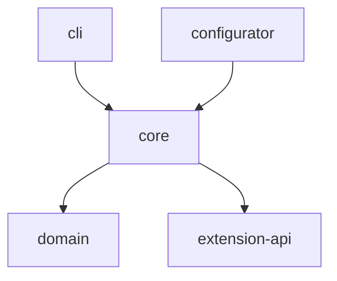
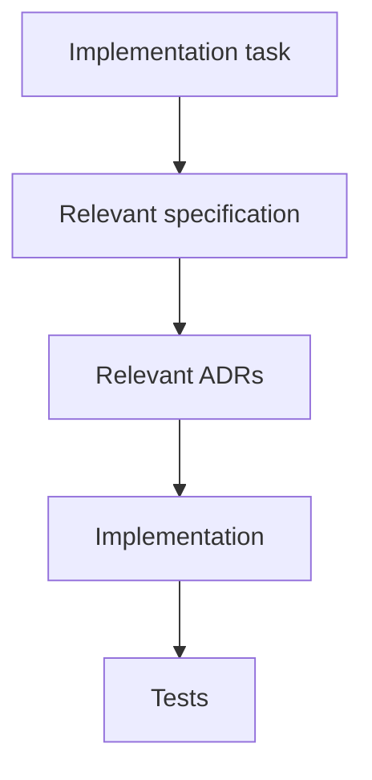

# Architecture Decision Records

| Pole          | Wartość                                                        |
| ------------- | -------------------------------------------------------------- |
| ID dokumentu  | DOC-011                                                        |
| Tytuł         | Architecture Decision Records                                  |
| Wersja        | 0.1                                                            |
| Status        | Draft                                                          |
| Typ           | Architecture Decision Record Collection                        |
| Źródło prawdy | Repozytorium dokumentacji projektu                             |
| Zależności    | `01-vision.md`, `02-glossary.md`, `03-functional-requirements.md`, `04-non-functional-requirements.md`, `05-architecture.md`, `06-domain-model.md`, `07-processing-pipeline.md`, `08-category-configuration.md`, `09-profile-configuration.md`, `10-extension-api.md` |

## 1. Cel dokumentu

Dokument utrwala najważniejsze decyzje architektoniczne projektu `pl.sk.ocr`.

ADR-y nie zastępują dokumentacji architektury. Ich zadaniem jest zapisanie:

- decyzji,
- kontekstu decyzji,
- przyjętego rozwiązania,
- najważniejszych konsekwencji,
- odrzuconych lub alternatywnych wariantów.

Decyzje zawarte w tym dokumencie są wiążące dla implementacji, dopóki nie zostaną zastąpione przez nowszy ADR.

## 2. Statusy ADR

| Status | Znaczenie |
| ------ | --------- |
| `Proposed` | Decyzja proponowana, jeszcze niezatwierdzona |
| `Accepted` | Decyzja obowiązująca |
| `Superseded` | Decyzja zastąpiona przez nowszy ADR |
| `Deprecated` | Decyzja nadal istnieje historycznie, ale nie powinna być używana |
| `Rejected` | Rozważona decyzja, która nie została przyjęta |

## 3. Zasada zmiany decyzji

Przyjętego ADR nie należy przepisywać w sposób zmieniający jego sens.

Zmiana decyzji architektonicznej powinna skutkować:

1. utworzeniem nowego ADR,
2. ustawieniem starego ADR jako `Superseded`,
3. wskazaniem ADR zastępującego,
4. aktualizacją dokumentów zależnych.

## 4. Rejestr decyzji

| ADR | Decyzja | Status |
| --- | ------- | ------ |
| ADR-001 | Java 21 jako wersja platformy | Accepted |
| ADR-002 | Maven jako system budowania | Accepted |
| ADR-003 | Root package `pl.sk.ocr` | Accepted |
| ADR-004 | JavaFX dla Configuratora | Accepted |
| ADR-005 | Tesseract przez Tess4J | Accepted |
| ADR-006 | Apache PDFBox do obsługi PDF | Accepted |
| ADR-007 | ZXing do QR/barcode | Accepted |
| ADR-008 | JSON jako format konfiguracji | Accepted |
| ADR-009 | ServiceLoader jako mechanizm rozszerzeń | Accepted |
| ADR-010 | Lombok również w modelu domenowym | Accepted |
| ADR-011 | SLF4J + Logback jako logging stack | Accepted |
| ADR-012 | Wspólny Core dla CLI i JavaFX | Accepted |
| ADR-013 | Brak katalogu `processing` | Accepted |
| ADR-014 | Wielowątkowe przetwarzanie przez dispatcher/workers | Accepted |
| ADR-015 | Tesseract instalowany poza aplikacją | Accepted |
| ADR-016 | Domyślny język OCR `pol` | Accepted |
| ADR-017 | Trace pipeline'u OFF/BASIC/FULL | Accepted |
| ADR-018 | Diagnostyczny zapis trace poza Domain | Accepted |
| ADR-019 | Standardowe rozszerzenia korzystają z Extension API | Accepted |
| ADR-020 | `BufferedImage` jako graniczny model obrazu pluginów | Accepted |
| ADR-021 | Konfiguracja ładowana jako immutable snapshot | Accepted |
| ADR-022 | Fail-fast dla błędów konfiguracji i środowiska | Accepted |
| ADR-023 | Błędy dokumentu nie zatrzymują batcha | Accepted |
| ADR-024 | PDF rasteryzowany przed OCR | Accepted |
| ADR-025 | Brak hot reload konfiguracji i pluginów podczas batcha | Accepted |

---

# ADR-001 — Java 21 jako wersja platformy

| Pole | Wartość |
| ---- | ------- |
| Status | Accepted |
| Decyzja | JDK 21 |
| Data | 2026-08-08 |

## Kontekst

Projekt jest nową aplikacją desktopową/batchową bez wymogu kompatybilności ze starszym runtime Java.

Potrzebna jest stabilna wersja LTS.

## Decyzja

Projekt wykorzystuje:

```text
Java 21
```

jako minimalną i docelową wersję JDK.

## Konsekwencje

Można korzystać z funkcji dostępnych w Java 21.

Kod nie musi zachowywać kompatybilności ze starszymi JDK.

Biblioteki muszą wspierać Java 21.

---

# ADR-002 — Maven jako system budowania

| Pole | Wartość |
| ---- | ------- |
| Status | Accepted |
| Decyzja | Maven |
| Data | 2026-08-08 |

## Kontekst

Projekt składa się z kilku modułów Java i wymaga spójnego zarządzania zależnościami oraz buildem.

## Decyzja

System budowania:

```text
Apache Maven
```

Projekt będzie wielomodułowy.

## Konsekwencje

Root projektu zawiera parent `pom.xml`.

Moduły dziedziczą:

- wersje bibliotek,
- konfigurację compiler plugin,
- test plugins,
- quality plugins.

---

# ADR-003 — Root package `pl.sk.ocr`

| Pole | Wartość |
| ---- | ------- |
| Status | Accepted |
| Decyzja | `pl.sk.ocr` |
| Data | 2026-08-08 |

## Decyzja

Root package projektu:

```text
pl.sk.ocr
```

Przykłady:

```text
pl.sk.ocr.domain
pl.sk.ocr.core
pl.sk.ocr.extension.api
pl.sk.ocr.adapter
pl.sk.ocr.cli
pl.sk.ocr.configurator
```

---

# ADR-004 — JavaFX dla Configuratora

| Pole | Wartość |
| ---- | ------- |
| Status | Accepted |
| Decyzja | JavaFX |
| Data | 2026-08-08 |

## Kontekst

Configurator ma być aplikacją desktopową działającą lokalnie.

Nie ma wymagania serwera aplikacyjnego ani dostępu przez przeglądarkę.

## Decyzja

UI Configuratora zostanie wykonane w:

```text
JavaFX
```

## Konsekwencje

Nie tworzymy webowego frontendu.

Configurator może bezpośrednio korzystać z lokalnych:

- PDF,
- obrazów,
- konfiguracji JSON,
- bibliotek Core.

Warstwa JavaFX pozostaje poza Core.

---

# ADR-005 — Tesseract przez Tess4J

| Pole | Wartość |
| ---- | ------- |
| Status | Accepted |
| Decyzja | `org.sourceforge.tess4j:tess4j` |
| Data | 2026-08-08 |

## Kontekst

System wymaga lokalnego, open-source'owego OCR.

Nie przewiduje się korzystania z płatnych usług OCR.

## Decyzja

Silnik OCR:

```text
Tesseract
```

Integracja Java:

```text
org.sourceforge.tess4j:tess4j
```

## Konsekwencje

Core komunikuje się z OCR przez własny port, np.:

```java
public interface OcrEngine {
    OcrResult recognize(OcrRequest request);
}
```

Tess4J jest szczegółem adaptera infrastrukturalnego.

Typy Tess4J nie mogą przeciekać do Domain ani konfiguracji.

---

# ADR-006 — Apache PDFBox do obsługi PDF

| Pole | Wartość |
| ---- | ------- |
| Status | Accepted |
| Decyzja | Apache PDFBox |
| Data | 2026-08-08 |

## Kontekst

Dokumenty PDF muszą zostać odczytane i rasteryzowane przed przetwarzaniem obrazu i OCR.

## Decyzja

Do obsługi PDF wykorzystujemy:

```text
Apache PDFBox
```

## Konsekwencje

PDFBox odpowiada przede wszystkim za:

- otwarcie PDF,
- ustalenie liczby stron,
- rasteryzację wybranych stron.

Nie zakładamy używania tekstowej warstwy PDF jako głównego źródła ekstrakcji.

---

# ADR-007 — ZXing do QR/barcode

| Pole | Wartość |
| ---- | ------- |
| Status | Accepted |
| Decyzja | ZXing |
| Data | 2026-08-08 |

## Kontekst

QR może pełnić funkcję:

- identyfikatora kategorii,
- kotwicy geometrycznej,
- źródła wartości.

Potrzebna jest nie tylko wartość QR, ale również jego położenie.

## Decyzja

Pierwszą biblioteką QR/barcode będzie:

```text
ZXing
```

BoofCV pozostaje możliwą alternatywą, jeśli ZXing okaże się niewystarczający w zakresie geometrii lub jakości detekcji.

## Konsekwencje

Typy ZXing są mapowane na neutralny:

```text
DetectionResult
DetectedGeometry
```

i nie przeciekają do Core.

---

# ADR-008 — JSON jako format konfiguracji

| Pole | Wartość |
| ---- | ------- |
| Status | Accepted |
| Decyzja | JSON |
| Data | 2026-08-08 |

## Kontekst

Konfiguracja musi być:

- czytelna,
- ręcznie edytowalna,
- łatwa do wersjonowania w Git,
- generowana przez Configurator.

## Decyzja

Profile i kategorie wykorzystują:

```text
JSON
```

Każda kategoria posiada osobny plik.

Profil uruchomieniowy również jest osobnym plikiem JSON.

## Konsekwencje

Formaty posiadają:

```text
schemaVersion
```

Nieznane właściwości powinny być odrzucane.

Docelowo powstaną JSON Schema.

---

# ADR-009 — ServiceLoader jako mechanizm rozszerzeń

| Pole | Wartość |
| ---- | ------- |
| Status | Accepted |
| Decyzja | `java.util.ServiceLoader` |
| Data | 2026-08-08 |

## Kontekst

System musi umożliwiać dodawanie nowych:

- detectorów,
- matcherów,
- image processorów,
- transformerów,
- validatorów.

## Decyzja

Pluginy są wykrywane przez:

```text
java.util.ServiceLoader
```

Podstawowym SPI jest:

```java
public interface ExtensionProvider {
    Collection<? extends Extension> extensions();
}
```

## Konsekwencje

Plugin może być dostarczony jako osobny JAR.

Nie budujemy własnego frameworka pluginów.

Hot reload nie jest wymagany.

---

# ADR-010 — Lombok również w modelu domenowym

| Pole | Wartość |
| ---- | ------- |
| Status | Accepted |
| Decyzja | Lombok |
| Data | 2026-08-08 |

## Kontekst

Projekt zawiera wiele:

- immutable value objects,
- DTO,
- builderów,
- struktur wynikowych.

## Decyzja

Lombok może być używany wszędzie tam, gdzie ogranicza boilerplate, również w Domain.

Preferowane adnotacje:

```text
@Value
@Builder
@Singular
@RequiredArgsConstructor
@Slf4j
```

## Konsekwencje

Nie wymagamy ręcznego generowania getterów, konstruktorów i builderów, jeśli Lombok zapewnia czytelniejszy kod.

Nie należy jednak używać Lombok w sposób ukrywający istotną logikę domenową.

---

# ADR-011 — SLF4J + Logback

| Pole | Wartość |
| ---- | ------- |
| Status | Accepted |
| Decyzja | SLF4J + Logback |
| Data | 2026-08-08 |

## Decyzja

API logowania:

```text
SLF4J
```

Implementacja:

```text
Logback
```

Preferowane użycie:

```java
@Slf4j
public class Example {
}
```

## Konsekwencje

Pluginy mogą zależeć od SLF4J API.

Pluginy nie powinny dostarczać własnego bindingu SLF4J.

---

# ADR-012 — Wspólny Core dla CLI i JavaFX

| Pole | Wartość |
| ---- | ------- |
| Status | Accepted |
| Decyzja | Shared Core |
| Data | 2026-08-08 |

## Kontekst

Powstaną dwie aplikacje:

- batch CLI,
- JavaFX Configurator.

Obie muszą wykonywać ten sam pipeline.

## Decyzja

CLI i Configurator korzystają z tego samego Core.



## Konsekwencje

Nie implementujemy osobnego pipeline'u preview.

Preview używa tego samego mechanizmu wykonawczego co batch, z innym trybem trace i zakresem wykonania.

---

# ADR-013 — Brak katalogu `processing`

| Pole | Wartość |
| ---- | ------- |
| Status | Accepted |
| Decyzja | Brak folderu processing |
| Data | 2026-08-08 |

## Decyzja

Batch używa trzech podstawowych katalogów:

```text
input
success
error
```

Nie istnieje obowiązkowy:

```text
processing
```

## Konsekwencje

Przydzielenie dokumentu workerowi jest kontrolowane wewnątrz procesu przez dispatcher/work queue.

Po zakończeniu dokument jest przenoszony do `success` albo `error`.

Zakładamy brak kolizji nazw plików.

---

# ADR-014 — Dispatcher i worker pool

| Pole | Wartość |
| ---- | ------- |
| Status | Accepted |
| Decyzja | Konfigurowalny worker pool |
| Data | 2026-08-08 |

## Kontekst

Wsady mogą zawierać dziesiątki tysięcy dokumentów.

## Decyzja

Batch korzysta z:

```text
DocumentEnumerator
→ Dispatcher
→ bounded work queue
→ Worker Pool
```

Liczba workerów jest konfigurowalna.

## Konsekwencje

Dokumenty mogą być przetwarzane równolegle.

Nie zakładamy deterministycznej kolejności zakończenia.

Pluginy muszą być thread-safe.

Szczegółowy model executorów zostanie potwierdzony benchmarkami.

---

# ADR-015 — Tesseract instalowany poza aplikacją

| Pole | Wartość |
| ---- | ------- |
| Status | Accepted |
| Decyzja | External Tesseract installation |
| Data | 2026-08-08 |

## Kontekst

Nie chcemy pakować binariów Tesseracta i wszystkich traineddata do aplikacji.

## Decyzja

Zakładamy, że Tesseract oraz wymagane dane językowe są już zainstalowane w środowisku.

Profil może podać:

```json
{
  "ocr": {
    "datapath": "/path/to/tessdata"
  }
}
```

## Konsekwencje

Bootstrap powinien wykrywać brak wymaganych danych OCR możliwie wcześnie.

Dystrybucja aplikacji nie odpowiada za instalację Tesseracta.

---

# ADR-016 — Domyślny język OCR `pol`

| Pole | Wartość |
| ---- | ------- |
| Status | Accepted |
| Decyzja | `pol` |
| Data | 2026-08-08 |

## Decyzja

Domyślny język OCR:

```text
pol
```

Może zostać nadpisany przez konfigurację.

Hierarchia:

```text
application default
→ profile
→ category
→ field
```

---

# ADR-017 — Trace OFF/BASIC/FULL

| Pole | Wartość |
| ---- | ------- |
| Status | Accepted |
| Decyzja | Trzystopniowy Processing Trace |
| Data | 2026-08-08 |

## Kontekst

Configurator musi prezentować wynik każdego etapu przetwarzania.

Batch produkcyjny nie powinien ponosić pełnego kosztu diagnostyki.

## Decyzja

Pipeline obsługuje:

```text
OFF
BASIC
FULL
```

## Konsekwencje

`FULL` może przechowywać:

- obrazy etapów,
- regiony,
- OCR text,
- wyniki extension,
- walidacje,
- parametry diagnostyczne.

Configurator domyślnie korzysta z `FULL`.

---

# ADR-018 — Zapis trace na dysk poza Domain

| Pole | Wartość |
| ---- | ------- |
| Status | Accepted |
| Decyzja | Diagnostic infrastructure |
| Data | 2026-08-08 |

## Kontekst

Wyniki pośrednie mogą być przydatne przy analizie błędów.

Nie są jednak częścią logiki domenowej.

## Decyzja

Zapis:

- obrazów,
- hOCR,
- trace JSON,

jest funkcją diagnostyczną infrastruktury.

Domain nie zna filesystemowego zapisu trace.

## Konsekwencje

Ten sam `ProcessingTrace` może być:

- prezentowany w JavaFX,
- ignorowany,
- zapisany przez adapter diagnostyczny.

---

# ADR-019 — Standardowe rozszerzenia używają Extension API

| Pole | Wartość |
| ---- | ------- |
| Status | Accepted |
| Decyzja | Dogfooding Extension API |
| Data | 2026-08-08 |

## Kontekst

System posiada rozszerzenia wbudowane oraz potencjalne pluginy zewnętrzne.

## Decyzja

Standardowe operacje korzystają z tego samego API co pluginy zewnętrzne.

Rekomendowany moduł:

```text
extensions-standard
```

## Konsekwencje

Nie tworzymy dwóch równoległych mechanizmów wykonywania operacji.

Extension API jest testowane przez rzeczywiste funkcje systemu.

---

# ADR-020 — `BufferedImage` jako model obrazu pluginów

| Pole | Wartość |
| ---- | ------- |
| Status | Accepted |
| Decyzja | `BufferedImage` poprzez `ProcessingImage` |
| Data | 2026-08-08 |

## Kontekst

Pluginy przetwarzające obraz potrzebują praktycznego dostępu do pikseli.

Nie chcemy uzależniać ich od JavaFX.

## Proponowana decyzja

Publiczny typ:

```java
public interface ProcessingImage {

    int width();

    int height();

    BufferedImage asBufferedImage();
}
```

## Uzasadnienie

`BufferedImage`:

- jest częścią JDK,
- jest powszechnie obsługiwany przez biblioteki Java,
- nie zależy od JavaFX,
- upraszcza implementację własnych processorów.

## Ryzyko

`BufferedImage` jest mutable.

Kontrakt musi zabraniać modyfikowania współdzielonego obrazu wejściowego.

## Alternatywa

Całkowicie własna abstrakcja pikselowa.

Na obecnym etapie uznana za potencjalnie zbyt kosztowną i mało praktyczną.

---

# ADR-021 — Immutable snapshot konfiguracji

| Pole | Wartość |
| ---- | ------- |
| Status | Accepted |
| Decyzja | Immutable runtime configuration |
| Data | 2026-08-08 |

## Decyzja

Po bootstrapie:

```text
JSON
→ DTO
→ validation
→ immutable runtime model
```

Batch nie odczytuje ponownie konfiguracji z dysku.

## Konsekwencje

Wszystkie dokumenty w batchu korzystają z tego samego snapshotu konfiguracji.

Zmiana JSON w trakcie pracy nie wpływa na uruchomiony proces.

---

# ADR-022 — Fail-fast dla konfiguracji i środowiska

| Pole | Wartość |
| ---- | ------- |
| Status | Accepted |
| Decyzja | Validate before processing |
| Data | 2026-08-08 |

## Decyzja

Przed przetwarzaniem pierwszego dokumentu aplikacja waliduje:

- profil,
- kategorie,
- extension IDs,
- parametry extension,
- katalogi,
- output,
- Tesseract/datapath,
- wymagane języki.

## Konsekwencje

Nie uruchamiamy batcha, o którym z góry wiadomo, że jest niespójny.

---

# ADR-023 — Błąd dokumentu nie zatrzymuje batcha

| Pole | Wartość |
| ---- | ------- |
| Status | Accepted |
| Decyzja | Document-level fault isolation |
| Data | 2026-08-08 |

## Kontekst

Duży batch może zawierać pojedyncze nierozpoznawalne dokumenty.

## Decyzja

Błąd pojedynczego dokumentu:

```text
document → error
```

nie zatrzymuje pozostałych workerów.

## Konsekwencje

Batch może zakończyć się technicznie poprawnie, mimo że część dokumentów trafiła do katalogu `error`.

Błędy globalne są traktowane osobno.

---

# ADR-024 — PDF rasteryzowany przed OCR

| Pole | Wartość |
| ---- | ------- |
| Status | Accepted |
| Decyzja | Image-first processing |
| Data | 2026-08-08 |

## Kontekst

System jest projektowany przede wszystkim do dokumentów skanowanych i obrazowych.

Geometria jest kluczowa dla:

- kotwic,
- regionów,
- skalowania,
- processorów obrazu.

## Decyzja

Strona PDF jest rasteryzowana przez PDFBox do obrazu, a następnie trafia do wspólnego pipeline'u obrazu/OCR.


## Konsekwencje

PDF i pliki graficzne mogą korzystać ze wspólnej części pipeline'u.

---

# ADR-025 — Brak hot reload podczas batcha

| Pole | Wartość |
| ---- | ------- |
| Status | Accepted |
| Decyzja | Restart required for runtime changes |
| Data | 2026-08-08 |

## Decyzja

Podczas działającego batcha nie przeładowujemy:

- profilu,
- kategorii,
- pluginów.

Zmiana wymaga nowego uruchomienia.

## Konsekwencje

Runtime jest stabilny i audytowalny.

Configurator może oczywiście wielokrotnie przebudowywać własny preview podczas edycji konfiguracji — nie jest to hot reload działającego batcha.

---

# 5. Decyzje wymagające dalszego ADR

Poniższe tematy nie są jeszcze wystarczająco ustalone, aby oznaczyć je jako `Accepted`.

| Temat | Powód |
| ----- | ----- |
| Virtual Threads vs platform threads | Wymaga benchmarków Tess4J i przetwarzania obrazu |
| Lifecycle instancji Tess4J | Wymaga sprawdzenia thread-safety i kosztu inicjalizacji |
| Finalny algorytm fuzzy matching | Brak potrzeby wyboru przed implementacją standardowego matcher |
| Finalny algorytm deskew | Wymaga testów na realnych dokumentach |
| BoofCV | Pozostaje alternatywą dla przypadków niewystarczających dla ZXing |
| Model cache preview Configuratora | Powinien zostać ustalony w `13-javafx-configurator.md` |
| CSV schema | Powinien zostać ustalony w `15-output-format.md` |
| Exact CLI exit codes | Powinny zostać zatwierdzone w `12-cli.md` i `14-error-model.md` |
| Packaging aplikacji JavaFX | Do decyzji po ustaleniu modelu dystrybucji |
| JPMS | Nie jest wymagany do pierwszej implementacji |
| `model-api` | Wydzielić tylko jeśli zależności modułów tego realnie wymagają |

# 6. Zasady dla przyszłych ADR

Nowy ADR powinien mieć format:

```markdown
# ADR-NNN — Tytuł

| Pole | Wartość |
| ---- | ------- |
| Status | Proposed / Accepted / Superseded / Rejected |
| Decyzja | Krótka nazwa |
| Data | YYYY-MM-DD |
| Zastępuje | opcjonalnie |
| Zastąpiony przez | opcjonalnie |

## Kontekst

...

## Decyzja

...

## Konsekwencje

...

## Alternatywy

...
```

# 7. Relacja ADR do implementacji

Przed implementacją komponentu należy sprawdzić:



Jeżeli implementacja wymaga podjęcia istotnej decyzji architektonicznej, której nie obejmuje istniejący ADR, decyzja powinna zostać udokumentowana przed lub razem z implementacją.

# 8. Kryteria akceptacji dokumentu

Dokument ADR spełnia swoją rolę, jeśli:

1. utrwala wszystkie dotychczas jawnie podjęte decyzje technologiczne,
2. odróżnia decyzje przyjęte od proponowanych,
3. wskazuje konsekwencje decyzji,
4. nie próbuje przedwcześnie rozstrzygać tematów wymagających benchmarków,
5. jest zgodny z dokumentami `01–10`,
6. może być używany przez Codex jako zbiór ograniczeń architektonicznych,
7. kolejne decyzje mogą być dodawane bez przepisywania historii,
8. zmiana decyzji odbywa się przez nowy ADR.

# 9. Kolejny dokument

Następny dokument:

**`12-cli.md`**

Powinien szczegółowo określić:

- entry point CLI,
- składnię wywołania,
- argument `--profile`,
- override parametrów profilu,
- walidację argumentów,
- bootstrap,
- progress reporting,
- stdout/stderr,
- exit codes,
- zachowanie przy Ctrl+C,
- batch summary,
- logowanie,
- przykłady wywołań,
- wymagania dotyczące automatyzacji/skryptów,
- relację CLI → Core.
