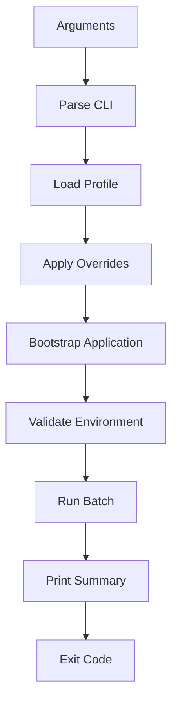
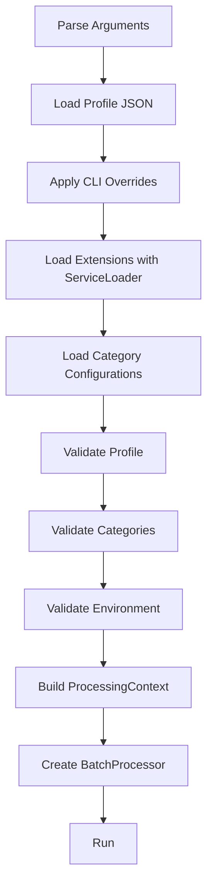
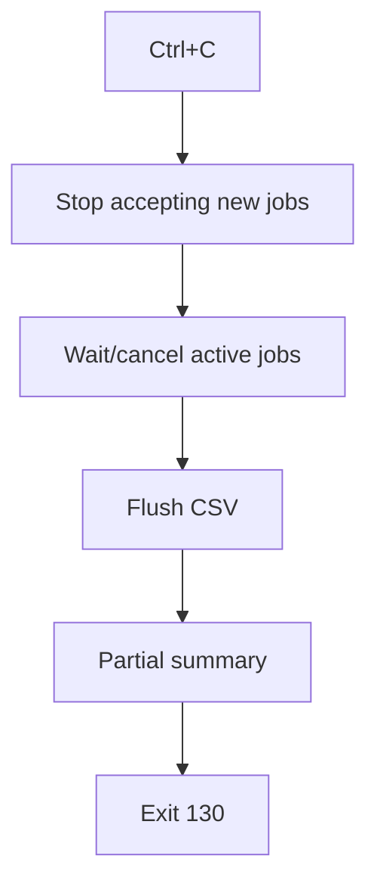
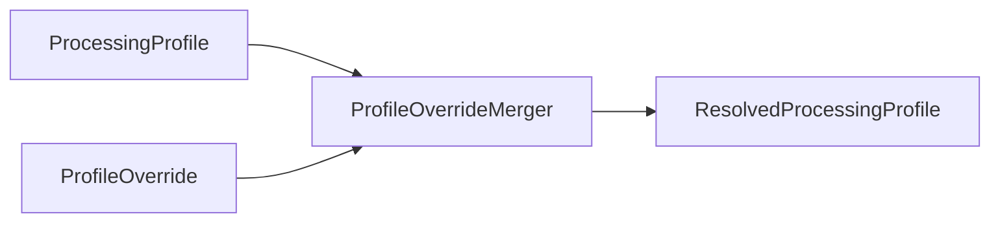
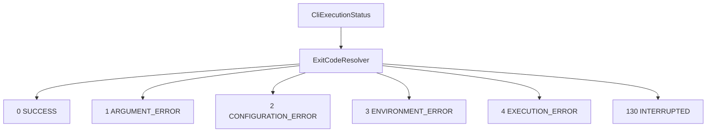

# Aplikacja CLI

| Pole          | Wartość                                                        |
| ------------- | -------------------------------------------------------------- |
| ID dokumentu  | DOC-012                                                        |
| Tytuł         | Specyfikacja aplikacji CLI                                     |
| Wersja        | 0.1                                                            |
| Status        | Draft                                                          |
| Typ           | Technical Specification                                        |
| Źródło prawdy | Repozytorium dokumentacji projektu                             |
| Zależności    | `01-vision.md`, `02-glossary.md`, `03-functional-requirements.md`, `04-non-functional-requirements.md`, `05-architecture.md`, `06-domain-model.md`, `07-processing-pipeline.md`, `08-category-configuration.md`, `09-profile-configuration.md`, `10-extension-api.md`, `11-adr.md` |

## 1. Cel dokumentu

Celem dokumentu jest szczegółowe zdefiniowanie zachowania aplikacji CLI odpowiedzialnej za wsadowe przetwarzanie dokumentów.

Dokument określa:

- entry point aplikacji,
- składnię wywołania,
- wymagane i opcjonalne argumenty,
- sposób wskazania profilu,
- mechanizm override wartości profilu,
- walidację argumentów,
- bootstrap aplikacji,
- uruchomienie batcha,
- raportowanie postępu,
- stdout i stderr,
- exit codes,
- zachowanie przy przerwaniu procesu,
- batch summary,
- wymagania dotyczące automatyzacji i skryptów,
- relację CLI do wspólnego Core.

## 2. Odpowiedzialność CLI

CLI powinno mieć możliwie małą odpowiedzialność.



CLI nie implementuje:

- OCR,
- identyfikacji kategorii,
- geometrii,
- ekstrakcji pól,
- walidacji pól,
- logiki rozszerzeń.

## 3. Entry point

Rekomendowany entry point:

```text
pl.sk.ocr.cli.Main
```

lub:

```text
pl.sk.ocr.cli.OcrCliApplication
```

Preferowana nazwa klasy głównej:

```text
OcrCliApplication
```

## 4. Sposób uruchomienia

Przykład:

```bash
java -jar cli.jar --profile config/profiles/production.json
```

Jeżeli dystrybucja będzie wymagała classpath:

```bash
java -cp "cli.jar:plugins/*" pl.sk.ocr.cli.OcrCliApplication \
  --profile config/profiles/production.json
```

Dokładny model pakowania zostanie ustalony osobno.

## 5. Główna składnia

```text
cli --profile <file> [options]
```

`--profile` jest podstawowym wymaganym argumentem.

## 6. Argumenty podstawowe

| Argument | Typ | Wymagany | Znaczenie |
| -------- | --- | -------- | --------- |
| `--profile` | path | Tak | Plik profilu uruchomieniowego |
| `--input` | path | Nie | Override katalogu input |
| `--success` | path | Nie | Override katalogu success |
| `--error` | path | Nie | Override katalogu error |
| `--workers` | integer | Nie | Override liczby workerów |
| `--output` | path | Nie | Override pliku CSV |
| `--trace` | enum | Nie | `OFF`, `BASIC`, `FULL` |
| `--ocr-datapath` | path | Nie | Override Tesseract datapath |
| `--ocr-language` | string | Nie | Override języka OCR |
| `--log-level` | enum | Nie | `ERROR`, `WARN`, `INFO`, `DEBUG`, `TRACE` |
| `--help` | flag | Nie | Pomoc |
| `--version` | flag | Nie | Wersja aplikacji |

## 7. Przykład pełny

```bash
java -jar cli.jar \
  --profile config/profiles/production.json \
  --input /data/in \
  --success /data/success \
  --error /data/error \
  --workers 8 \
  --output /data/result.csv \
  --trace BASIC \
  --ocr-language pol \
  --log-level INFO
```

## 8. Override profilu

Hierarchia:

```text
application defaults
→ profile
→ CLI arguments
```

CLI ma najwyższy priorytet dla parametrów wykonawczych.

## 9. Parametry możliwe do override

| Profil | CLI |
| ------ | --- |
| `directories.input` | `--input` |
| `directories.success` | `--success` |
| `directories.error` | `--error` |
| `processing.workers` | `--workers` |
| `output.csv.file` | `--output` |
| `trace.mode` | `--trace` |
| `ocr.datapath` | `--ocr-datapath` |
| `ocr.language` | `--ocr-language` |
| `logging.level` | `--log-level` |

## 10. Parametry bez override w pierwszej wersji

Nie rekomenduje się override z CLI dla:

- `schemaVersion`,
- `profile.id`,
- `profile.version`,
- `categories.mode`,
- `categories.active`,
- złożonych parametrów category JSON,
- pipeline'ów pól,
- walidatorów.

## 11. Argument parser

CLI powinno używać dedykowanej biblioteki parsera argumentów.

Rekomendowany kandydat:

```text
picocli
```

Powody:

- dojrzałe API,
- automatyczne `--help`,
- walidacja typów,
- subcommands, jeśli kiedyś będą potrzebne,
- dobre wsparcie Java.

Decyzję należy utrwalić jako ADR przed implementacją, jeśli zostanie przyjęta.

## 12. Brak parsera ręcznego

Nie należy implementować własnego parsera:

```text
for args[]
if "--profile"
...
```

chyba że CLI pozostanie skrajnie małe.

Dedykowana biblioteka zmniejsza ryzyko błędów i boilerplate.

## 13. `--help`

Przykład oczekiwanego output:

```text
Usage: cli --profile <file> [options]

Options:
  --profile <file>        Processing profile JSON
  --input <dir>           Override input directory
  --success <dir>         Override success directory
  --error <dir>           Override error directory
  --workers <n>           Override number of workers
  --output <file>         Override CSV output file
  --trace <mode>          OFF, BASIC or FULL
  --ocr-datapath <dir>    Override Tesseract datapath
  --ocr-language <lang>   Override OCR language
  --log-level <level>     ERROR, WARN, INFO, DEBUG, TRACE
  --version               Print application version
  --help                  Show this help
```

## 14. `--version`

Przykład:

```text
pl.sk.ocr 0.1.0
Java 21
```

Opcjonalnie można dodać:

```text
build timestamp
git commit
```

ale nie jest to wymagane MVP.

## 15. Walidacja argumentów

Błędy powinny być wykrywane przed bootstrapem.

Przykłady:

```text
--workers 0
→ invalid argument

--trace SOMETHING
→ invalid enum

--profile missing.json
→ profile load error
```

## 16. `--workers`

Reguła:

```text
workers >= 1
```

Brak górnego sztywnego limitu w specyfikacji, ale aplikacja może stosować safety limit.

## 17. `--trace`

Dozwolone:

```text
OFF
BASIC
FULL
```

Wartość powinna być case-insensitive dla wygody CLI.

## 18. `--log-level`

Dozwolone:

```text
ERROR
WARN
INFO
DEBUG
TRACE
```

## 19. `--ocr-language`

Przykłady:

```text
pol
eng
pol+eng
```

Jeżeli język jest niedostępny w Tesseract:

```text
environment validation error
```

## 20. `--ocr-datapath`

Jeżeli wskazany:

- musi istnieć,
- musi być katalogiem,
- powinien zawierać wymagane `*.traineddata`.

## 21. Bootstrap

Bootstrap CLI powinien działać w następującej kolejności:



## 22. Fail-fast

Batch nie może wystartować, jeśli:

- profil jest błędny,
- kategoria jest błędna,
- ExtensionId nie istnieje,
- katalogi są niedostępne,
- CSV nie może zostać utworzone,
- datapath jest błędny,
- wymagany język OCR nie jest dostępny.

## 23. ProcessingContext

CLI buduje immutable snapshot:

```text
ProcessingProfile
CategoryRegistry
ExtensionRegistry
OcrEngine
DocumentLoaderRegistry
Output configuration
Trace configuration
```

Po rozpoczęciu batcha nie reloaduje plików.

## 24. Progress reporting

CLI powinno raportować postęp bez zatrzymywania procesu.

Przykład:

```text
Processed 1240/10000 | Success: 1211 | Failed: 29 | Active: 6
```

## 25. Częstotliwość postępu

Nie należy wypisywać jednej linii per każdy wewnętrzny etap dokumentu na INFO.

Rekomendacja:

- update co określony interwał czasu,
- albo co N dokumentów.

Dokładny interwał może być konfigurowalny później.

## 26. ProgressReporter

CLI powinno korzystać z abstrakcji:

```java
public interface ProgressReporter {
    void started(BatchStarted event);
    void progress(BatchProgress event);
    void completed(BatchResult result);
}
```

Implementacja CLI:

```text
ConsoleProgressReporter
```

## 27. stdout

Na stdout powinny trafiać:

- pomoc,
- wersja,
- informacje startowe,
- postęp,
- podsumowanie batcha.

## 28. stderr

Na stderr powinny trafiać:

- błędy argumentów,
- błędy bootstrapu,
- błędy globalne,
- ewentualnie stack trace przy DEBUG.

## 29. Logi vs stdout

Logback nie powinien mieszać się semantycznie z outputem CLI.

Rekomendacja:

- stdout dla kontrolowanego UI tekstowego,
- logi do konsoli/pliku według Logback,
- stderr dla fatal bootstrap/global errors.

## 30. Tryb cichy

Nie jest wymagany w pierwszej wersji.

Możliwy przyszły argument:

```text
--quiet
```

## 31. Tryb machine-readable

Nie jest wymagany w pierwszej wersji.

Możliwa przyszła funkcja:

```text
--summary-json
```

przydatna dla integracji.

## 32. Batch summary

Po zakończeniu:

```text
Batch completed

Profile: production
Documents: 12450
Success: 12298
Failed: 152
Warnings: 81
Duration: 00:18:42
Output: /data/ocr/result.csv
```

## 33. BatchResult

Rekomendowany model:

```java
@Value
@Builder
public class BatchResult {
    BatchId batchId;
    BatchStatus status;
    long total;
    long success;
    long failed;
    long warnings;
    Duration duration;
    Path outputFile;
}
```

## 34. BatchStatus

```java
public enum BatchStatus {
    COMPLETED,
    COMPLETED_WITH_DOCUMENT_ERRORS,
    ABORTED,
    FAILED
}
```

## 35. Dokumenty błędne a BatchStatus

Jeżeli batch technicznie się zakończył, ale część dokumentów trafiła do error:

```text
COMPLETED_WITH_DOCUMENT_ERRORS
```

## 36. Exit codes

Rekomendowana tabela:

| Kod | Znaczenie |
| --- | --------- |
| `0` | Batch zakończony technicznie poprawnie, niezależnie od pojedynczych błędów dokumentów |
| `1` | Błąd argumentów CLI |
| `2` | Błąd profilu lub konfiguracji kategorii |
| `3` | Błąd środowiska / brak wymaganych zasobów |
| `4` | Globalny błąd wykonania batcha |
| `130` | Przerwanie przez użytkownika (`SIGINT` / Ctrl+C), jeśli środowisko to wspiera |

## 37. Dlaczego błędne dokumenty nie zmieniają exit code

CLI jest narzędziem batchowym.

Jeżeli:

```text
10000 dokumentów
9990 success
10 error
```

proces wykonał swoje zadanie technicznie poprawnie.

System automatyzacji powinien rozróżniać:

```text
batch failed
```

od:

```text
some documents were rejected
```

## 38. Przykład automatyzacji

```bash
java -jar cli.jar --profile production.json

if [ $? -ne 0 ]; then
  echo "OCR batch execution failed"
  exit 1
fi
```

Liczba dokumentów błędnych jest dostępna w podsumowaniu/CSV.

## 39. Ctrl+C

Aplikacja powinna reagować na przerwanie użytkownika.

Rekomendowane zachowanie:

1. przestać przydzielać nowe dokumenty,
2. spróbować zakończyć aktualnie wykonywane zadania w kontrolowany sposób,
3. zamknąć writer CSV,
4. wypisać podsumowanie częściowe,
5. zwrócić exit code 130.

## 40. Graceful shutdown



## 41. Timeout shutdown

Nie należy czekać w nieskończoność.

Można przewidzieć:

```text
shutdownTimeout
```

jako przyszły parametr.

Pierwsza wersja może posiadać stałą techniczną.

## 42. Dokument aktualnie przetwarzany podczas Ctrl+C

Jeżeli bezpiecznie ukończy się przed timeoutem:

- wynik zostaje zapisany.

Jeżeli zostanie przerwany:

- nie powinien być cicho przeniesiony do success.

Szczegółowa polityka powinna być spójna z brakiem katalogu processing.

## 43. Brak katalogu processing a przerwanie

Ponieważ plik pozostaje w input do czasu finalnego przeniesienia:

- przerwany dokument może pozostać w input,
- może zostać przetworzony ponownie przy następnym uruchomieniu.

To jest pożądane.

## 44. Kolejność operacji końcowych

Dla dokumentu:

```text
process
→ build DocumentResult
→ write output row
→ move source file
```

Należy dokładnie ustalić transakcyjność w `15-output-format.md` i `14-error-model.md`.

## 45. Logowanie startu

Przykład INFO:

```text
Starting OCR batch
profile=production
workers=6
categories=3
input=/data/ocr/input
```

Bez wypisywania nadmiarowych danych konfiguracyjnych.

## 46. Logowanie dokumentu

INFO:

```text
document started
document completed
```

z correlation ID i nazwą pliku.

DEBUG:

- szczegóły pipeline'u,
- extension IDs,
- czasy etapów.

## 47. Sensitive data

CLI nie wypisuje na stdout pełnych wartości pól biznesowych.

Nie wypisuje np.:

```text
PESEL=...
```

Podgląd danych należy do Configuratora lub kontrolowanego outputu.

## 48. Batch ID

Każde uruchomienie batcha powinno posiadać `BatchId`.

Przykład:

```text
20260808-090601-4f3a2c
```

Format nie musi być publicznym kontraktem.

## 49. Correlation

Logi powinny zawierać:

```text
batchId
documentJobId
fileName
```

## 50. CLI a ServiceLoader

Pluginy są wykrywane podczas bootstrapu.

CLI nie powinno wymagać argumentu:

```text
--plugin-class
```

Providerzy są odkrywani automatycznie z classpath.

## 51. Informacja o pluginach

Przy DEBUG można wypisać:

```text
Loaded extensions:
  DETECTOR/text
  DETECTOR/qr
  MATCHER/fuzzy
  VALIDATOR/pesel
```

## 52. Brak pluginu

Jeżeli konfiguracja używa nieistniejącego pluginu:

```text
exit code 2
```

jako błąd konfiguracji.

## 53. CLI a Tesseract

CLI nie komunikuje się bezpośrednio z Tess4J.

Bootstrap tworzy adapter:

```text
Tess4JOcrEngine
```

i przekazuje go do Core.

## 54. CLI a PDFBox

Analogicznie:

```text
PdfBoxDocumentLoader
```

jest tworzony w bootstrapie, nie używany bezpośrednio przez parser CLI.

## 55. Testowalność CLI

Należy oddzielić:

```text
argument parsing
bootstrap
batch execution
console rendering
```

Tak, aby testy parsera nie uruchamiały OCR.

## 56. CliOptions

Przykładowy model:

```java
@Value
@Builder
public class CliOptions {
    Path profile;
    Path input;
    Path success;
    Path error;
    Integer workers;
    Path output;
    TraceMode trace;
    Path ocrDatapath;
    String ocrLanguage;
    LogLevel logLevel;
}
```

## 57. ProfileOverride

CLI powinno mapować opcje na jawny obiekt:

```java
@Value
@Builder
public class ProfileOverride {
    Path input;
    Path success;
    Path error;
    Integer workers;
    Path output;
    TraceMode trace;
    Path ocrDatapath;
    String ocrLanguage;
    LogLevel logLevel;
}
```

## 58. Profile merge



## 59. Brak mutacji oryginalnego profilu

Merge tworzy nowy immutable profil.

Nie mutuje obiektu wczytanego z JSON.

## 60. Validation after override

Po zastosowaniu CLI override profil musi zostać zwalidowany ponownie.

Przykład:

```text
profile workers=4
CLI --workers 0
→ invalid
```

## 61. Przykład podstawowy

```bash
java -jar cli.jar \
  --profile config/profiles/default.json
```

## 62. Override workers

```bash
java -jar cli.jar \
  --profile config/profiles/default.json \
  --workers 12
```

## 63. Override folderów

```bash
java -jar cli.jar \
  --profile config/profiles/default.json \
  --input /mnt/in \
  --success /mnt/success \
  --error /mnt/error
```

## 64. Tryb diagnostyczny

```bash
java -jar cli.jar \
  --profile config/profiles/default.json \
  --workers 1 \
  --trace FULL \
  --log-level DEBUG
```

## 65. Override datapath

```bash
java -jar cli.jar \
  --profile config/profiles/default.json \
  --ocr-datapath /opt/tessdata
```

## 66. Windows

Przykład:

```powershell
java -jar cli.jar `
  --profile C:\ocr\config\profiles\production.json `
  --input C:\ocr\input `
  --success C:\ocr\success `
  --error C:\ocr\error
```

## 67. Linux

```bash
java -jar cli.jar \
  --profile /opt/ocr/config/profiles/production.json
```

## 68. Ścieżki względne

`--profile` jest rozwiązywane względem current working directory.

Ścieżki wewnątrz profilu są rozwiązywane względem katalogu pliku profilu.

CLI override ścieżek:

- może być względny względem current working directory,
- powinno to być jasno udokumentowane.

## 69. Normalizacja ścieżek

Po parsowaniu ścieżki powinny być:

```text
toAbsolutePath()
normalize()
```

tam, gdzie nie niszczy to semantyki symbolic links.

## 70. Symbolic links

Pierwsza wersja nie musi mieć specjalnej semantyki.

System plików Javy obsługuje je zgodnie z API.

## 71. Input file filtering

CLI powinno przekazywać do batcha tylko wspierane formaty.

Przykładowo:

```text
.pdf
.tif
.tiff
.png
.jpg
.jpeg
```

## 72. Unsupported files

Pliki w input o nieobsługiwanym rozszerzeniu:

Rekomendacja:

```text
skip + warning
```

albo:

```text
process → UNSUPPORTED_DOCUMENT → error
```

Preferowany wariant wymaga decyzji w `14-error-model.md`.

## 73. Hidden/system files

Pliki typu:

```text
.DS_Store
Thumbs.db
```

powinny być ignorowane przez enumerator, jeśli nie są wspieranym dokumentem.

## 74. Rekurencyjne katalogi

Pierwsza wersja powinna przetwarzać tylko bezpośrednie pliki w `input`.

Rekurencja nie jest wymagana.

Możliwy przyszły parametr:

```text
--recursive
```

## 75. Puste input

Jeżeli nie ma dokumentów:

```text
batch completed
documents=0
exit code 0
```

Nie jest to błąd.

## 76. CSV istnieje

Jeżeli profil ma:

```text
overwrite=false
```

a plik istnieje:

```text
bootstrap error
exit code 3 lub 2 zależnie od klasyfikacji
```

Rekomendacja:

- klasyfikować jako błąd środowiska/output → `3`.

## 77. stdout w pustym batchu

```text
Batch completed
Documents: 0
Success: 0
Failed: 0
```

## 78. Exit code resolver

Warto wydzielić:

```java
public interface ExitCodeResolver {
    int resolve(CliExecutionResult result);
}
```

## 79. CliExecutionResult

```java
@Value
@Builder
public class CliExecutionResult {
    CliExecutionStatus status;
    BatchResult batchResult;
    String message;
}
```

## 80. CliExecutionStatus

```java
public enum CliExecutionStatus {
    SUCCESS,
    ARGUMENT_ERROR,
    CONFIGURATION_ERROR,
    ENVIRONMENT_ERROR,
    EXECUTION_ERROR,
    INTERRUPTED
}
```

## 81. Mapping status → exit code



## 82. Config errors

Do `CONFIGURATION_ERROR` należą:

- niepoprawny JSON profilu,
- nieobsługiwany `schemaVersion`,
- brak aktywnej kategorii,
- niepoprawny category JSON,
- brak ExtensionId,
- błędne parameters pluginu.

## 83. Environment errors

Do `ENVIRONMENT_ERROR` należą:

- input niedostępny,
- success/error niezapisywalny,
- Tesseract data unavailable,
- output CSV cannot be created,
- brak uprawnień filesystem.

## 84. Execution error

Globalny błąd już po starcie batcha:

- writer CSV przestał działać,
- dispatcher nie może kontynuować,
- krytyczny błąd infrastruktury.

## 85. Błąd pojedynczego dokumentu

Nie mapuje się na `CliExecutionStatus.EXECUTION_ERROR`.

Jest zawarty w `DocumentResult`.

## 86. Stack trace

Przy zwykłym INFO:

```text
ERROR: Profile file cannot be read: ...
```

Bez pełnego stack trace na stdout.

Przy DEBUG można logować stack trace przez SLF4J/Logback.

## 87. Obsługa wyjątków w main

`main` powinien być cienki.

Koncepcyjnie:

```java
public static void main(String[] args) {
    int code = new OcrCliApplication().run(args);
    System.exit(code);
}
```

## 88. `run(args)`

Powinno być testowalne bez wywoływania `System.exit`.

```java
public int run(String[] args)
```

## 89. System.exit

Powinien występować tylko w zewnętrznym entry poincie.

Testy jednostkowe wywołują `run`.

## 90. Shutdown hook

CLI może zarejestrować shutdown hook dla graceful shutdown.

```java
Runtime.getRuntime().addShutdownHook(...)
```

Hook powinien być minimalny i thread-safe.

## 91. ShutdownController

Rekomendowany komponent:

```java
public interface ShutdownController {
    void requestShutdown();
    boolean isShutdownRequested();
}
```

BatchProcessor może okresowo sprawdzać stan.

## 92. Worker shutdown

Po request:

```text
no new jobs
→ active jobs finish/cancel
→ executor shutdown
```

## 93. CSV flush

Przed exit należy spróbować:

```text
flush
close
```

writer wynikowy.

## 94. Nie blokować shutdown hook

Nie należy wykonywać ciężkiej logiki bezpośrednio w shutdown hook.

Hook ustawia sygnał, a główny przepływ przeprowadza shutdown.

## 95. Integracja ze schedulerem

CLI powinno być możliwe do uruchomienia przez:

- cron,
- Windows Task Scheduler,
- Jenkins,
- GitLab CI,
- systemd timer,
- zewnętrzny scheduler.

Nie wymaga interaktywnego terminala.

## 96. ANSI

Nie należy wymagać terminala obsługującego ANSI.

Kolorowy output może być przyszłą funkcją.

## 97. Postęp bez TTY

Jeżeli stdout nie jest interaktywnym terminalem, należy unikać dynamicznego nadpisywania jednej linii.

Preferowane są zwykłe linie tekstowe.

## 98. Progress format

Przykład:

```text
[INFO] processed=2500 total=10000 success=2460 failed=40 active=6
```

Jest prosty do parsowania i czytelny.

## 99. Podsumowanie do logu

Batch summary powinien być również logowany na INFO.

## 100. Konfiguracja CLI i Lombok

Można stosować Lombok do modeli opcji:

```text
@Value
@Builder
```

Dla klasy parsera zależy od wybranej biblioteki.

## 101. SLF4J

CLI używa:

```text
@Slf4j
```

dla logów technicznych.

Nie używa `System.out.println` do logowania błędów technicznych poza kontrolowanym rendererem CLI.

## 102. Pakiety

Proponowana struktura:

```text
pl.sk.ocr.cli
pl.sk.ocr.cli.command
pl.sk.ocr.cli.options
pl.sk.ocr.cli.bootstrap
pl.sk.ocr.cli.console
pl.sk.ocr.cli.shutdown
```

## 103. Komponenty

| Komponent | Odpowiedzialność |
| --------- | ---------------- |
| `OcrCliApplication` | Główny orchestrator CLI |
| `CliOptionsParser` | Parsowanie args |
| `ProfileOverrideMerger` | Nakładanie override |
| `CliBootstrap` | Budowa runtime |
| `ConsoleProgressReporter` | Postęp |
| `ConsoleSummaryRenderer` | Podsumowanie |
| `ShutdownController` | Graceful shutdown |
| `ExitCodeResolver` | Status → kod |

## 104. Testy CLI

Minimalny zestaw:

```text
help
version
missing profile
invalid workers
invalid trace
profile not found
valid minimal run bootstrap
override workers
override directories
environment failure
interrupted run
exit code mapping
```

## 105. Test help

Powinien sprawdzać, że `--help`:

- nie uruchamia bootstrapu,
- zwraca exit code 0,
- prezentuje wymagane argumenty.

## 106. Test version

`--version`:

- nie ładuje profilu,
- nie uruchamia batcha,
- zwraca 0.

## 107. Test argument error

```text
--workers abc
```

→ exit 1.

## 108. Test config error

Niepoprawny category JSON:

→ exit 2.

## 109. Test environment error

Brak dostępu do output:

→ exit 3.

## 110. Test document errors

Batch:

```text
10 docs
2 failed documents
```

→ exit 0.

## 111. Test Ctrl+C

Warstwa batch powinna być testowalna przez sztuczny `ShutdownController`, bez wysyłania realnego SIGINT w unit testach.

## 112. Mermaid — pełny przepływ CLI

```mermaid
sequenceDiagram
    participant U as User/Scheduler
    participant CLI as OcrCliApplication
    participant PAR as Options Parser
    participant PROF as Profile Loader
    participant BOOT as Bootstrap
    participant BATCH as BatchProcessor
    participant OUT as Console
    participant EXIT as ExitCodeResolver

    U->>CLI: args
    CLI->>PAR: parse
    PAR-->>CLI: CliOptions
    CLI->>PROF: load profile
    PROF-->>CLI: ProcessingProfile
    CLI->>CLI: apply overrides
    CLI->>BOOT: build runtime
    BOOT-->>CLI: ProcessingContext
    CLI->>BATCH: run
    BATCH-->>OUT: progress
    BATCH-->>CLI: BatchResult
    CLI->>OUT: summary
    CLI->>EXIT: resolve
    EXIT-->>CLI: exit code
    CLI-->>U: process exit
```

## 113. Kryteria akceptacji

CLI jest gotowe do implementacji, jeśli:

1. `--profile` jest głównym wymaganym argumentem,
2. CLI umożliwia override kluczowych ustawień runtime,
3. parser argumentów jest oddzielony od Core,
4. bootstrap waliduje runtime przed batch'em,
5. CLI nie implementuje pipeline'u OCR,
6. postęp jest raportowany niezależnie od logów,
7. stdout i stderr mają jasną semantykę,
8. błędy dokumentów nie zmieniają exit code na non-zero,
9. błędy bootstrap/globalne mają stabilne exit codes,
10. `run(args)` jest testowalne bez `System.exit`,
11. Ctrl+C uruchamia graceful shutdown,
12. przerwany dokument może pozostać w input,
13. CLI działa bez GUI,
14. CLI jest odpowiednie do schedulerów,
15. ServiceLoader jest używany przy bootstrapie,
16. Tess4J i PDFBox są tworzone przez bootstrap,
17. profile override tworzy nowy immutable snapshot,
18. unknown CLI arguments są błędem,
19. `--help` i `--version` nie wymagają profilu,
20. testy mogą zweryfikować exit codes bez rzeczywistego OCR.

## 114. Otwarte decyzje

Do dalszego doprecyzowania pozostają:

1. czy użyć picocli — rekomendowane,
2. finalna nazwa artefaktu JAR,
3. finalny sposób pakowania pluginów na classpath,
4. finalny format output `--version`,
5. finalny format progress reporting,
6. timeout graceful shutdown,
7. szczegółowa polityka dokumentu przerwanego podczas OCR,
8. czy unsupported files są ignorowane czy trafiają do error,
9. czy dodać `--recursive`,
10. czy dodać `--quiet`,
11. czy dodać machine-readable summary,
12. finalna klasyfikacja istniejącego output CSV jako exit 2 czy 3.

## 115. Następny dokument

Następny dokument:

**`13-javafx-configurator.md`**

Powinien szczegółowo określić:

- strukturę UI,
- workflow użytkownika,
- otwieranie dokumentu,
- nawigację po stronach,
- zoom/pan,
- overlay hOCR,
- wybór elementów OCR,
- rysowanie regionów,
- konfigurację identyfikacji,
- konfigurację Anchor,
- geometrię,
- konfigurację pól,
- dynamiczne formularze ExtensionDescriptor,
- podgląd `ProcessingTrace`,
- input/output image per stage,
- tekst i context per stage,
- cache preview,
- invalidation cache,
- async execution,
- obsługę anulowania preview,
- save/load JSON,
- walidację draft configuration.
