# Configurator JavaFX

| Pole          | Wartość                                                                                                                                                                                                                                                                                         |
| ------------- | ----------------------------------------------------------------------------------------------------------------------------------------------------------------------------------------------------------------------------------------------------------------------------------------------- |
| ID dokumentu  | DOC-013                                                                                                                                                                                                                                                                                         |
| Tytuł         | Specyfikacja aplikacji JavaFX Configurator                                                                                                                                                                                                                                                      |
| Wersja        | 0.1                                                                                                                                                                                                                                                                                             |
| Status        | Draft                                                                                                                                                                                                                                                                                           |
| Typ           | Technical Specification                                                                                                                                                                                                                                                                         |
| Źródło prawdy | Repozytorium dokumentacji projektu                                                                                                                                                                                                                                                              |
| Zależności    | `01-vision.md`, `02-glossary.md`, `03-functional-requirements.md`, `04-non-functional-requirements.md`, `05-architecture.md`, `06-domain-model.md`, `07-processing-pipeline.md`, `08-category-configuration.md`, `09-profile-configuration.md`, `10-extension-api.md`, `11-adr.md`, `12-cli.md` |

## 1. Cel dokumentu

Celem dokumentu jest zdefiniowanie funkcjonalności i architektury aplikacji desktopowej JavaFX służącej do tworzenia, edycji, testowania i diagnostyki konfiguracji kategorii dokumentów OCR.

Najważniejszym założeniem jest użycie dokładnie tego samego Core i tych samych rozszerzeń, które są wykorzystywane podczas produkcyjnego przetwarzania dokumentów.

## 2. Cele Configuratora

Configurator powinien umożliwiać:

1. otwarcie przykładowego dokumentu,
2. nawigację po stronach,
3. wykonanie OCR/hOCR,
4. wizualizację elementów OCR i bounding boxów,
5. zaznaczanie regionów myszą,
6. tworzenie reguł identyfikacji,
7. tworzenie Anchor,
8. konfigurację geometrii,
9. tworzenie pól,
10. konfigurację `ImageProcessor`,
11. konfigurację OCR pola,
12. konfigurację `ValueTransformer`,
13. konfigurację `Validator`,
14. test pojedynczego etapu,
15. test całego pola,
16. test całej kategorii,
17. podgląd każdego `StageResult`,
18. porównanie obrazu wejściowego i wyjściowego,
19. podgląd rozpoznanego tekstu i wartości pośrednich,
20. walidację draft configuration,
21. zapis i odczyt konfiguracji JSON,
22. eksport obrazów diagnostycznych.

## 3. Użytkownik

Configurator jest narzędziem dla developera lub analityka technicznego przygotowującego konfiguracje OCR.

UI może używać terminów domenowych takich jak:

```text
Anchor
Detector
Matcher
Geometry
ImageProcessor
ValueTransformer
Validator
Trace
```

## 4. Technologia

| Obszar           | Decyzja            |
| ---------------- | ------------------ |
| UI               | JavaFX             |
| Java             | JDK 21             |
| Build            | Maven              |
| Domain/Core      | wspólny z CLI      |
| OCR              | Tess4J / Tesseract |
| PDF              | PDFBox             |
| QR/barcode       | ZXing              |
| Plugin discovery | ServiceLoader      |
| Logging          | SLF4J + Logback    |
| Boilerplate      | Lombok             |

## 5. Artefakt

Rekomendowana nazwa artefaktu:

```text
configurator.jar
```

CLI pozostaje osobnym artefaktem:

```text
sk-ocr.jar
```

## 6. Architektura

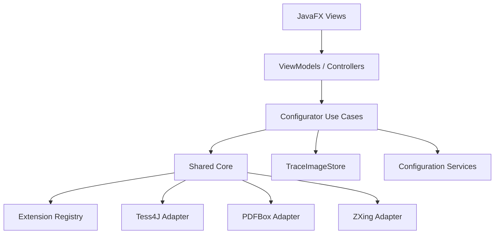

## 7. Zakazane zależności

JavaFX UI nie powinno bezpośrednio:

- uruchamiać Tesseracta,
- używać PDFBox,
- używać ZXing,
- wyliczać `GeometryTransform`,
- implementować validatorów,
- interpretować surowego JSON,
- implementować pipeline'u pola.

## 8. Główne use case'y

```text
OpenReferenceDocumentUseCase
RunPageOcrUseCase
CreateCategoryUseCase
LoadCategoryConfigurationUseCase
SaveCategoryConfigurationUseCase
ValidateDraftConfigurationUseCase
CreateIdentificationConditionUseCase
TestIdentificationUseCase
CreateAnchorUseCase
DetectAnchorUseCase
ConfigureGeometryUseCase
TestGeometryUseCase
CreateFieldUseCase
PreviewFieldUseCase
PreviewStageUseCase
TestCategoryUseCase
ExportDiagnosticImageUseCase
```

## 9. Główny layout

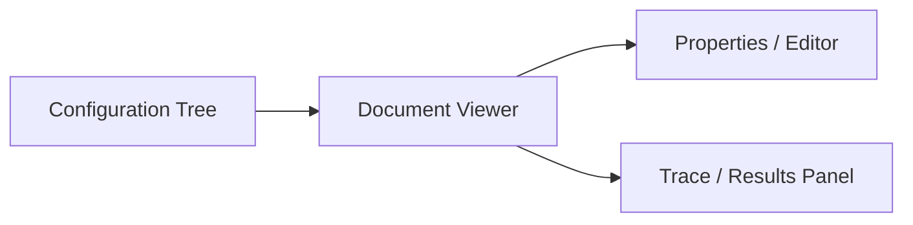

Przykładowy układ:

```text
+--------------------------------------------------------------+
| Toolbar                                                      |
+-------------------+-------------------------+----------------+
| Configuration     |                         | Properties     |
| Tree              |     Document Viewer     | / Editor       |
|                   |                         |                |
+-------------------+-------------------------+----------------+
| Trace / Results / Validation                                 |
+--------------------------------------------------------------+
```

## 10. Toolbar

Powinien zawierać co najmniej:

```text
New Category
Open Configuration
Save
Save As
Open Document
Previous Page
Next Page
Zoom In
Zoom Out
Fit Page
Run OCR
Test Category
Validate
```

## 11. Configuration Tree

Przykład:

```text
Category: formularz-abc
├── Identification
│   ├── Group 1
│   │   ├── Text condition
│   │   └── QR condition
│   └── Group 2
├── Anchors
│   ├── header-title
│   └── document-qr
├── Geometry
└── Fields
    ├── pesel
    │   ├── Image Processing
    │   ├── OCR
    │   ├── Transformations
    │   └── Validators
    └── first-name
```

## 12. Properties panel

Edytuje aktualnie zaznaczony element.

Przykłady:

- Category → id, displayName, pages,
- condition → page, matcher, expectedText,
- Anchor → detector, region, required,
- Geometry → strategy, Anchor IDs,
- Field → page, region, required,
- Extension step → dynamiczne parametry.

## 13. Document Viewer

Viewer powinien obsługiwać:

- renderowanie strony,
- zoom,
- pan,
- overlay OCR,
- zaznaczanie regionu,
- wybór bounding boxów OCR,
- wizualizację Anchor,
- wizualizację Field region,
- wizualizację resolved regions.

## 14. Warstwy viewera

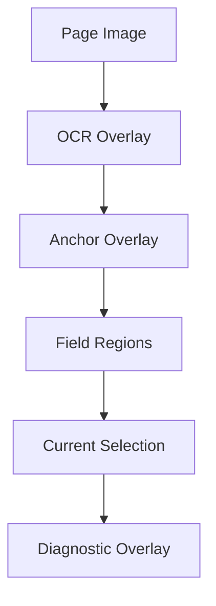

Warstwy powinny być niezależnie włączane i wyłączane.

## 15. Zoom i pan

Viewer powinien obsługiwać:

```text
Zoom In
Zoom Out
Fit Width
Fit Page
100%
Pan
```

Zoom nie może zmieniać współrzędnych zapisanych w konfiguracji.

## 16. Układy współrzędnych

```text
Screen Coordinates
Viewer Coordinates
Image Coordinates
Reference Coordinates
```

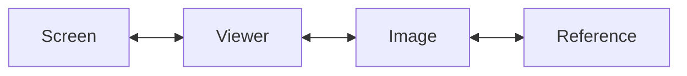

## 17. CoordinateMapper

```java
public interface CoordinateMapper {
    Point2D screenToImage(Point2D point);
    Point2D imageToScreen(Point2D point);
    Region screenToImage(Region region);
    Region imageToScreen(Region region);
}
```

## 18. Otwieranie dokumentu

Po otwarciu:

1. dokument jest analizowany,
2. UI pokazuje liczbę stron,
3. renderowana jest pierwsza strona,
4. tworzona jest `ConfigurationSession`.

Obsługiwane formaty:

```text
PDF
TIFF
PNG
JPEG
```

## 19. ConfigurationSession

Model aplikacyjny:

```text
ConfigurationSession
- reference document
- draft CategoryConfiguration
- current page
- page cache
- OCR cache
- detector cache
- geometry cache
- latest ProcessingTrace
- TraceImageStore
- dirty state
- current preview run
```

## 20. Workflow nowej konfiguracji

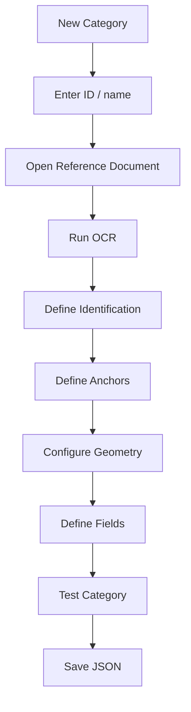

## 21. OCR strony

Akcja `Run OCR` działa poza JavaFX Application Thread.

Po zakończeniu:

- zapisuje `PageOcrResult`,
- tworzy overlay OCR,
- udostępnia wynik do tworzenia condition i Anchor.

## 22. OCR overlay

Tryby:

```text
WORDS
LINES
BLOCKS
OFF
```

Kliknięcie elementu powinno pokazywać:

- tekst,
- confidence,
- bounding box,
- numer strony.

## 23. Akcje na elemencie OCR

```text
Use as Identification Condition
Use as Anchor
Copy text
Copy bounds
```

## 24. Zaznaczanie regionu

Viewer powinien mieć tryby:

```text
Select
Pan
Draw Region
```

Zaznaczony region można wykorzystać jako:

```text
searchRegion
field region
anchor searchRegion
```

## 25. Identification editor

UI powinno odzwierciedlać model:

```text
OR Groups
  AND Conditions
```

Przykład:

```text
Group 1
  [TEXT] FORMULARZ ABC
  [QR]   ^ABC:

OR

Group 2
  [TEXT] ABC-2026
```

## 26. Condition editor

Dla TEXT:

```text
Page
Search region
Expected text
Matcher
Matcher parameters
```

Dla QR/BARCODE:

```text
Page
Search region
Matcher
Matcher parameters
```

## 27. Test Identification

Powinien pokazywać:

- groups,
- conditions,
- match result,
- score,
- actual,
- expected,
- status końcowy.

## 28. Anchor editor

Dla Anchor:

```text
ID
Page
Detector
Search region
Required
Reference feature geometry
```

## 29. Tworzenie text Anchor z OCR

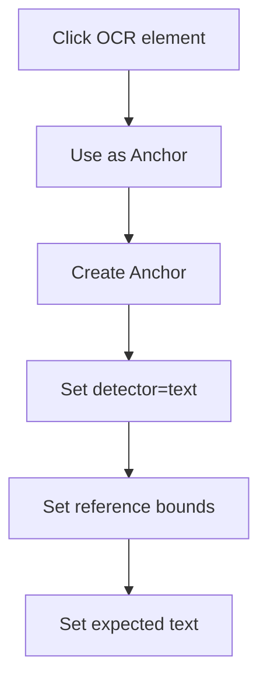

## 30. QR Anchor

Workflow:

1. zaznacz region,
2. wybierz detector `qr`,
3. uruchom detector,
4. pokaż wykryty QR,
5. zaakceptuj geometrię.

Podgląd powinien pokazywać:

- bounds,
- center,
- punkty ZXing po mapowaniu,
- payload.

## 31. Geometry editor

Powinien umożliwiać:

```text
Reference width
Reference height
Strategy
Anchor list
Strategy parameters
```

## 32. Test Geometry

Po uruchomieniu UI pokazuje:

- `GeometryStatus`,
- użyte Anchor,
- warnings,
- parametry transformacji,
- resolved regions.

## 33. Field editor

Dla pola:

```text
ID
Display name
Page
Region
Required
OCR options
ImageProcessingPipeline
ValueTransformationPipeline
Validators
ValidationPolicy
Output
```

## 34. Tworzenie pola

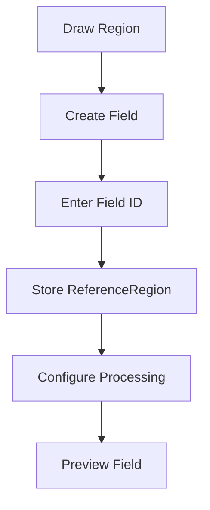

## 35. Pipeline editor

Przykład:

```text
Image Processing
1. remove-boxes
2. condense-content
3. crop-empty-margins
```

UI powinno umożliwiać:

```text
Add
Remove
Move Up
Move Down
Configure
Preview
```

## 36. Dynamiczne formularze ExtensionDescriptor

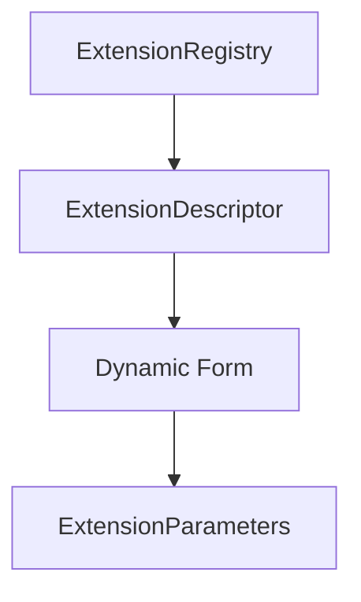

## 37. Mapping parametru na kontrolkę

| Typ          | JavaFX kontrolka    |
| ------------ | ------------------- |
| STRING       | TextField           |
| INTEGER      | Spinner / TextField |
| LONG         | TextField           |
| DECIMAL      | TextField           |
| BOOLEAN      | CheckBox            |
| ENUM         | ComboBox            |
| REGEX        | TextField           |
| STRING_LIST  | List editor         |
| INTEGER_LIST | List editor         |

## 38. Walidacja parametrów pluginu

Powinna działać:

- przy edycji,
- przed preview,
- przed zapisem.

Błąd powinien zostać pokazany przy odpowiedniej kontrolce.

## 39. OCR options editor

Powinien umożliwiać:

```text
language
pageSegMode
ocrEngineMode
dpi
variables
```

Puste pola oznaczają dziedziczenie.

## 40. Effective OCR options

UI powinno pokazywać źródło wartości:

```text
language: pol        [profile]
dpi: 300             [profile]
pageSegMode: 7       [field]
```

## 41. Preview Field

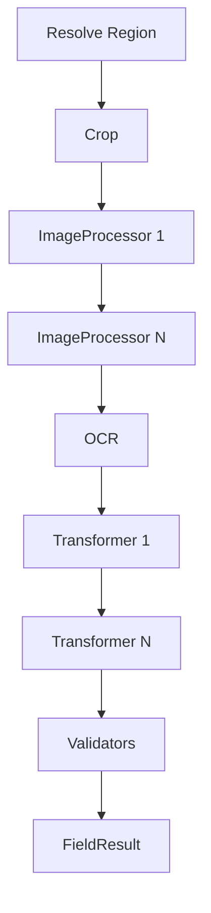

Configurator używa `TraceMode.FULL`.

## 42. Trace Viewer

Powinien pokazywać chronologiczną listę:

```text
01 FIELD_REGION_RESOLUTION
02 CROP
03 IMAGE_PROCESSING remove-boxes
04 IMAGE_PROCESSING condense-content
05 FIELD_OCR
06 VALUE_TRANSFORMATION trim
07 VALUE_TRANSFORMATION substring
08 VALIDATION pesel
```

## 43. Stage details

Po wybraniu etapu:

- stage,
- operation,
- status,
- duration,
- page,
- field,
- anchor,
- input image,
- output image,
- region,
- recognized text,
- context,
- warnings,
- errors.

## 44. Podgląd obrazów

Minimalny layout:

```text
+----------------------+----------------------+
| Input                | Output               |
|                      |                      |
|      image           |       image          |
|                      |                      |
+----------------------+----------------------+
```

MVP: side-by-side.

## 45. Context panel

`StageResult.context` powinien być prezentowany jako tabela Markdown-equivalent w UI:

| Key             | Value  |
| --------------- | ------ |
| `threshold`     | `0.85` |
| `linesDetected` | `18`   |
| `linesRemoved`  | `17`   |

## 46. Eksport obrazu etapu

Akcja:

```text
Save Image As...
```

pobiera obraz z `TraceImageStore`.

## 47. Test Category

Uruchamia:

```text
identification
→ anchors
→ geometry
→ all fields
→ validation
```

Wynik powinien pokazywać:

```text
CategoryId
IdentificationStatus
GeometryStatus
FieldResults
DocumentStatus
Errors
Warnings
Trace
```

## 48. Field results

| Field      | Raw   | Transformed | Validation | Status  |
| ---------- | ----- | ----------- | ---------- | ------- |
| pesel      | `...` | `...`       | VALID      | SUCCESS |
| first-name | `JAN` | `JAN`       | VALID      | SUCCESS |

## 49. Validation panel

Powinien prezentować np.:

```text
ERROR fields[0].validators[1].id
Unknown validator 'pesell'

WARNING geometry
Optional anchor not used
```

Kliknięcie problemu powinno zaznaczyć odpowiedni element konfiguracji.

## 50. Zapis

Przepływ:

```text
draft
→ validation
→ DTO mapping
→ deterministic JSON
→ atomic save
```

## 51. Zapis niedokończonego draftu

MVP powinno pozwolić zapisać draft nawet z błędami konfiguracji.

Warunki:

- UI wyraźnie pokazuje błędy,
- `Test Category` może się nie uruchomić,
- produkcyjny CLI i tak odrzuci błędną konfigurację.

To pozwala zachować częściowo wykonaną pracę.

## 52. Dirty state

Po zmianie:

```text
dirty = true
```

Po zapisie:

```text
dirty = false
```

Przy zamknięciu:

```text
Save
Discard
Cancel
```

## 53. Deterministyczny JSON

Zapis:

- UTF-8,
- 2 spaces,
- stabilna kolejność pól,
- końcowy newline.

## 54. Cache sesji

ConfigurationSession powinna cache'ować:

```text
rendered pages
prepared pages
PageOcrResult
detector results
reference features
geometry
field preview states
```

## 55. Cache invalidation

| Zmiana                 | Unieważnij                            |
| ---------------------- | ------------------------------------- |
| profile OCR language   | OCR i downstream                      |
| field OCR              | OCR pola, transformations, validators |
| Anchor detector params | detection, geometry, fields           |
| Geometry strategy      | geometry, fields                      |
| Field region           | dane pola od region resolution        |
| ImageProcessor         | pole od zmienionego kroku             |
| Transformer            | pole od zmienionego transformera      |
| Validator              | validation                            |
| Output config          | bez ponownego OCR                     |
| displayName            | nic                                   |

## 56. Dependency graph cache

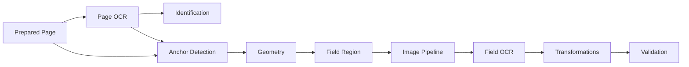

## 57. Preview Run ID

Każdy async preview powinien posiadać `PreviewRunId`.

Jeśli starszy run kończy się po nowszym, jego wynik jest ignorowany.

## 58. Asynchroniczność

Poza JavaFX Application Thread działają:

- PDF render,
- OCR,
- ZXing,
- image processing,
- Test Category,
- eksport większych danych diagnostycznych.

## 59. BackgroundExecutor

```java
public interface BackgroundExecutor {
    <T> CompletionStage<T> submit(Callable<T> task);
}
```

## 60. Aktualizacja UI

```text
background thread
→ Platform.runLater(...)
→ update ViewModel/UI
```

## 61. Busy state

Przykłady:

```text
Running OCR...
Testing field...
Testing category...
```

## 62. Cancel preview

MVP powinno wspierać logiczne anulowanie:

- wynik starego runu zostaje zignorowany,
- nowy run może wystartować.

Techniczne przerwanie Tess4J może zostać dodane później.

## 63. UI pattern

Preferowane:

```text
View
→ ViewModel
→ Use Case
→ Core
```

Kontrolery JavaFX nie powinny zawierać logiki OCR.

## 64. ViewModel

Przykładowe:

```text
CategoryEditorViewModel
FieldEditorViewModel
AnchorEditorViewModel
TraceViewModel
DocumentViewerViewModel
```

JavaFX properties mogą istnieć wyłącznie w warstwie prezentacji.

## 65. FXML

Rekomendacja:

- FXML dla większych statycznych widoków,
- programmatic UI dla formularzy tworzonych z `ExtensionDescriptor`.

## 66. Extension picker

Lista powinna pokazywać:

```text
displayName
id
description
version
```

i filtrować po `ExtensionType`.

## 67. Brak pluginu po otwarciu JSON

Jeżeli ExtensionId nie istnieje:

- konfiguracja otwiera się z ERROR,
- step jest oznaczony jako unresolved,
- można go poprawić lub usunąć,
- preview zależnego pipeline'u jest zablokowany.

## 68. Page navigation

Dla wielu stron:

```text
< Previous
Page 2 / 5
Next >
```

Page thumbnails nie są wymagane MVP.

## 69. Multi-page elementy

Wybranie pola lub Anchor powinno automatycznie przełączyć viewer na odpowiednią stronę.

## 70. Reference dimensions

`referenceWidth` i `referenceHeight` powinny być pobierane automatycznie z obrazu referencyjnego.

## 71. Reference DPI

Rekomendacja MVP:

```text
reference DPI = PDF rendering DPI użyte przy tworzeniu konfiguracji
```

Po utworzeniu regionów zmiana reference DPI powinna wymagać jawnego resetu lub migracji geometrii.

Nie należy cicho zmieniać DPI.

## 72. Ustawienia runtime

Minimalne:

```text
Tesseract datapath
Default OCR language
Default PDF DPI
Last opened directory
```

Domyślny język:

```text
pol
```

## 73. Persistence ustawień UI

Można użyć:

```text
java.util.prefs.Preferences
```

Ustawienia UI nie trafiają do category JSON.

## 74. Memory management

`TraceMode.FULL` może przechowywać wiele obrazów.

MVP powinno przechowywać tylko:

```text
latest preview trace
```

Po nowym preview stary trace może zostać zwolniony.

## 75. Duże dokumenty

Nie renderować wszystkich stron od razu.

Strony są renderowane na żądanie.

Cache stron powinien być ograniczony.

## 76. Test konkretnego kroku

Configurator powinien umożliwić test samego:

```text
ImageProcessor
ValueTransformer
Validator
```

jeśli dostępny jest wymagany input.

Jest to szczególnie ważne dla strojenia pluginów.

## 77. Dynamic preview

Kosztownego OCR nie należy uruchamiać po każdym znaku edycji.

Preferowane:

```text
Edit
→ Preview
```

Walidacja lekkich parametrów może być wykonywana na bieżąco.

## 78. Undo/Redo

Nie jest wymagane w MVP.

## 79. Status bar

Może pokazywać:

```text
Page 1/3
Zoom 125%
OCR ready
Configuration: 2 errors, 1 warning
```

## 80. Menu

Proponowane:

```text
File
View
Run
Tools
Help
```

## 81. File

```text
New Category
Open Configuration
Save
Save As
Open Reference Document
Close
Exit
```

## 82. View

```text
OCR Overlay
Anchors
Field Regions
Trace Panel
Fit Page
100%
```

## 83. Run

```text
Run Page OCR
Test Identification
Test Geometry
Preview Field
Test Category
Validate Configuration
```

## 84. Tools

```text
Settings
```

Hot reload pluginów nie jest wymagany.

## 85. Help

```text
About
Application Version
Loaded Extensions
```

## 86. Loaded Extensions

| Type      | ID    | Version | Provider                  |
| --------- | ----- | ------- | ------------------------- |
| MATCHER   | fuzzy | 1.0     | StandardExtensionProvider |
| VALIDATOR | pesel | 1.0     | StandardExtensionProvider |

## 87. Save As

`CategoryId` nie jest automatycznie zmieniane na podstawie nazwy pliku.

## 88. Błędny JSON

Składniowo błędny JSON:

- nie jest mapowany do Domain,
- UI pokazuje line/column, jeśli dostępne.

Semantycznie błędny JSON:

- może zostać otwarty jako draft,
- błędy są prezentowane w Validation panel.

## 89. Raw JSON editor

Nie jest wymagany w MVP.

## 90. Workflow pola

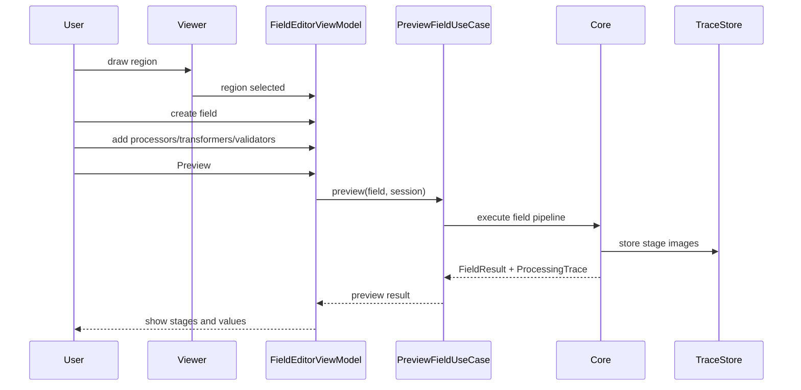

## 91. Workflow QR Anchor

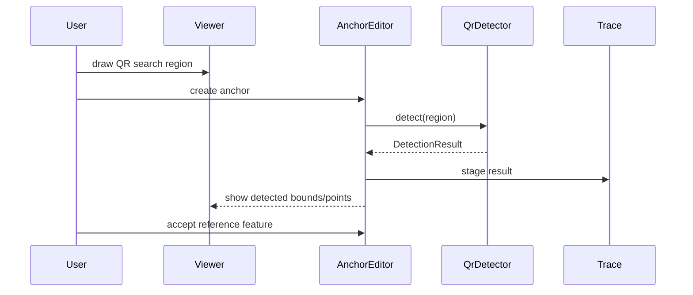

## 92. Testowalność

Należy oddzielić:

```text
View
ViewModel
Use Case
Core
```

Większość logiki ma być testowalna bez pełnego okna JavaFX.

## 93. Testy ViewModel

Przykłady:

```text
dirty state
validation errors
preview run race protection
cache invalidation request
selection changes
extension parameter validation
```

## 94. Testy viewer geometry

Powinny sprawdzać:

```text
screen → image
image → screen
zoom
pan
region selection
```

## 95. Test async

Należy sprawdzić, że:

- OCR nie działa na FX Application Thread,
- wynik jest aplikowany na FX thread,
- stary preview run jest ignorowany.

## 96. Pakiety

```text
pl.sk.ocr.configurator
pl.sk.ocr.configurator.app
pl.sk.ocr.configurator.session
pl.sk.ocr.configurator.viewer
pl.sk.ocr.configurator.viewmodel
pl.sk.ocr.configurator.view
pl.sk.ocr.configurator.trace
pl.sk.ocr.configurator.validation
pl.sk.ocr.configurator.settings
pl.sk.ocr.configurator.async
```

## 97. Główne komponenty

| Komponent                 | Odpowiedzialność        |
| ------------------------- | ----------------------- |
| `ConfiguratorApplication` | JavaFX entry point      |
| `ConfigurationSession`    | Stan bieżącej sesji     |
| `DocumentViewer`          | Obraz i overlay         |
| `CoordinateMapper`        | Współrzędne             |
| `CategoryEditorViewModel` | Draft kategorii         |
| `FieldEditorViewModel`    | Pole                    |
| `AnchorEditorViewModel`   | Anchor                  |
| `TraceViewModel`          | ProcessingTrace         |
| `TraceImageStore`         | Obrazy trace            |
| `PreviewCache`            | Cache sesji             |
| `PreviewCacheInvalidator` | Unieważnianie cache     |
| `BackgroundExecutor`      | Operacje poza FX thread |
| `DraftValidationService`  | Walidacja konfiguracji  |
| `ExtensionFormFactory`    | Dynamiczne formularze   |

## 98. Definition of Done MVP

MVP jest kompletne, jeśli użytkownik może:

1. uruchomić aplikację,
2. otworzyć PDF,
3. zobaczyć stronę,
4. zmienić stronę,
5. zoomować i przesuwać,
6. wykonać OCR,
7. zobaczyć bounding boxy OCR,
8. kliknąć rozpoznany tekst,
9. utworzyć condition,
10. utworzyć Anchor,
11. wykryć QR przez ZXing,
12. ustawić geometrię,
13. zaznaczyć region pola,
14. utworzyć `FieldDefinition`,
15. dodać `ImageProcessor`,
16. skonfigurować parametry z `ExtensionDescriptor`,
17. dodać transformer,
18. dodać validator,
19. uruchomić Preview Field,
20. zobaczyć każdy `StageResult`,
21. zobaczyć input/output obrazu,
22. zobaczyć raw OCR,
23. zobaczyć transformed value,
24. zobaczyć `ValidationResult`,
25. uruchomić Test Category,
26. zobaczyć errors i warnings,
27. zapisać JSON,
28. ponownie otworzyć JSON,
29. wyeksportować wybrany obraz diagnostyczny,
30. wykonać wszystko bez blokowania FX Application Thread.

## 99. Kryteria akceptacji architektury UI

Configurator spełnia założenia projektu, jeśli:

1. korzysta z tego samego Core co CLI,
2. nie implementuje alternatywnego pipeline'u,
3. używa `TraceMode.FULL`,
4. dynamicznie wykrywa Extensions przez Registry,
5. formularze pluginów powstają z Descriptor,
6. OCR overlay wykorzystuje wewnętrzny model OCR,
7. UI nie zależy od surowego hOCR,
8. UI nie zależy od typów ZXing,
9. UI nie zależy od Tess4J,
10. ciężkie operacje nie blokują FX thread,
11. cache preview jest lokalny dla sesji,
12. zmiany konfiguracji unieważniają tylko wymagane downstream stages,
13. stary async preview nie nadpisuje nowego,
14. trace images są poza Domain,
15. zapis JSON jest deterministyczny,
16. błędna konfiguracja może być poprawiana w UI,
17. nie ma wymogu hot reload pluginów,
18. Configurator pozostaje desktopowy i nie wymaga serwera.

## 100. Otwarte decyzje

Do dalszego doprecyzowania pozostają:

1. finalny layout paneli,
2. dokładne gestures zoom/pan,
3. czy dodać OCR text explorer do MVP,
4. czy dodać snapping regionów do OCR bounds,
5. czy dodać page thumbnails,
6. finalny limit cache stron,
7. format diagnostic bundle,
8. czy Extension API 1.0 wspiera custom editors parametrów,
9. finalny model persistence ustawień UI,
10. packaging JavaFX runtime.

## 101. Następny dokument

Następny dokument:

**`14-error-model.md`**

Powinien szczegółowo zdefiniować:

- hierarchię błędów,
- `ErrorCode`,
- `WarningCode`,
- `ProcessingStage`,
- różnicę między błędem dokumentu, pola, extension i globalnym,
- mapowanie wyjątków infrastrukturalnych,
- wpływ błędów na `FieldResult`,
- wpływ błędów na `DocumentResult`,
- wpływ błędów na `BatchResult`,
- mapowanie do exit codes CLI,
- prezentację błędów w JavaFX,
- kontrakt błędu w CSV i machine-readable summary.
