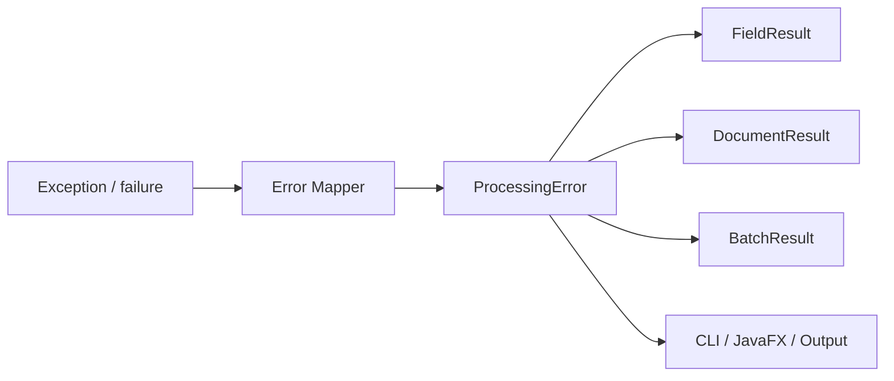
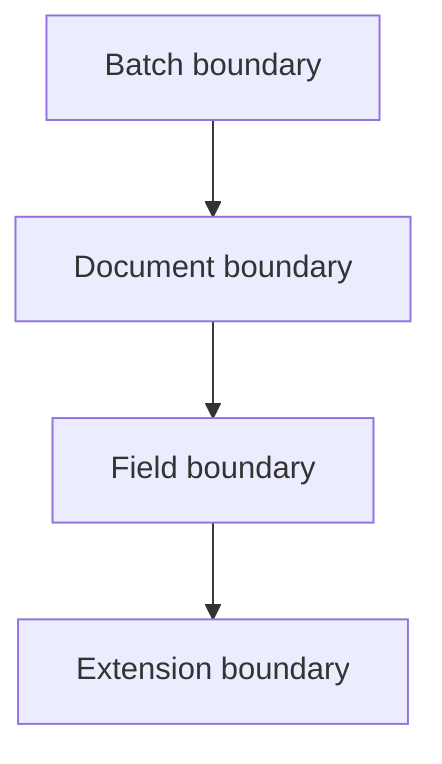
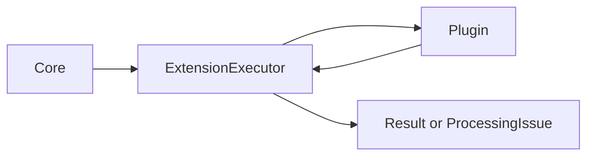
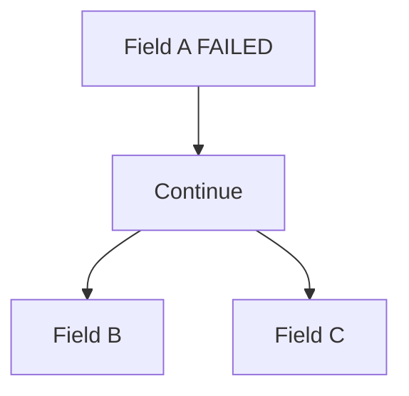
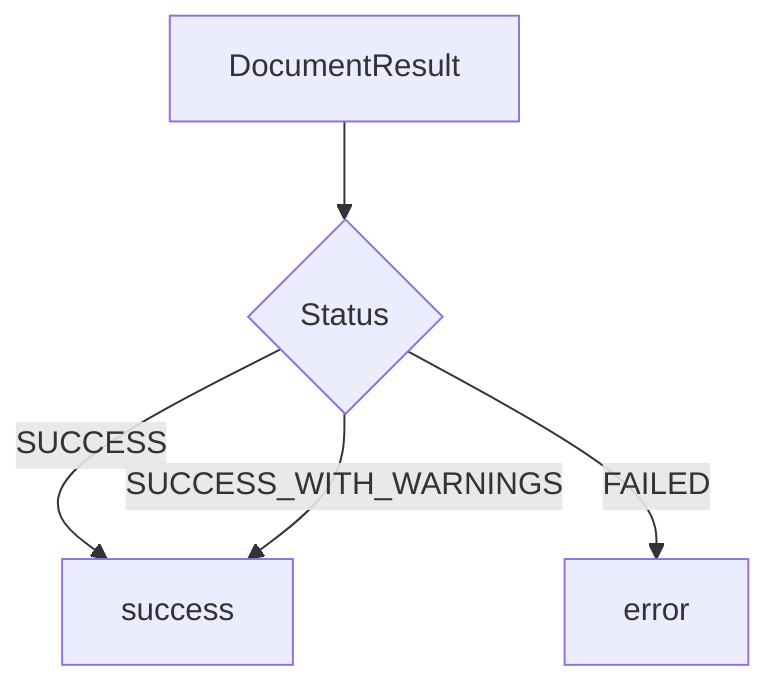
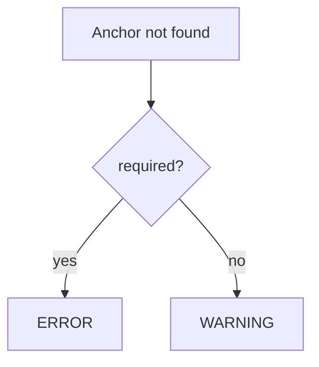
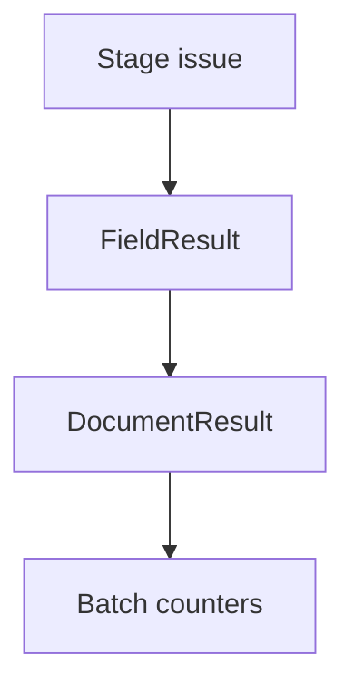
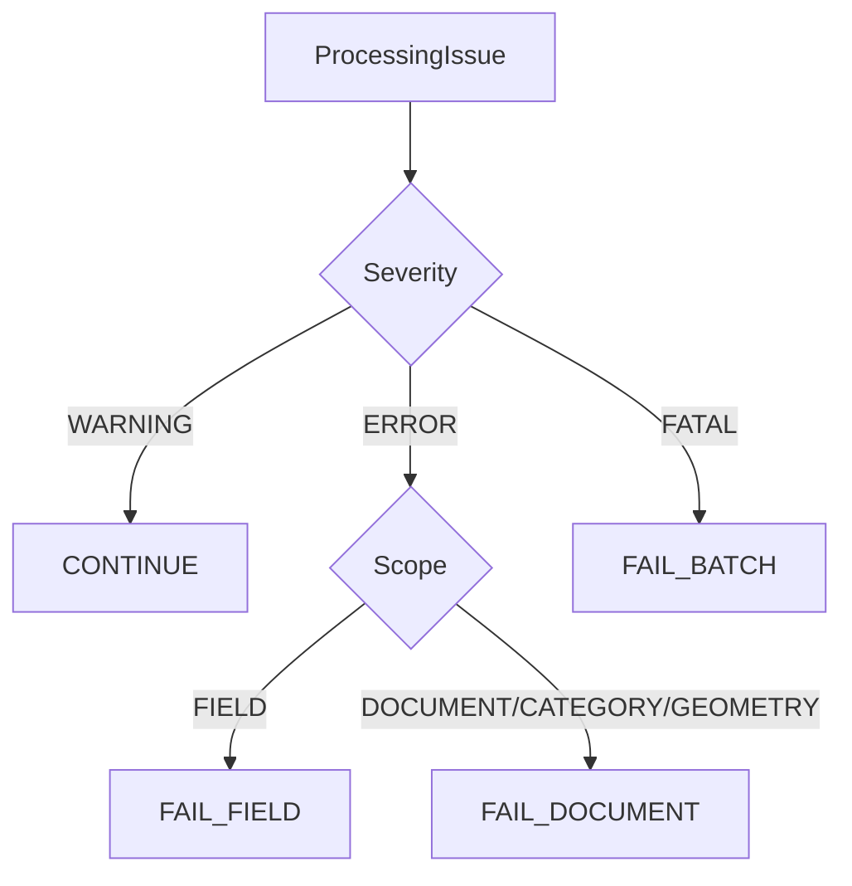
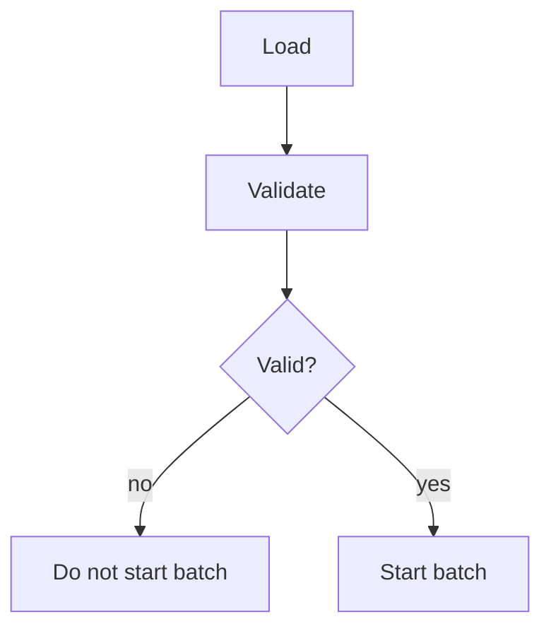

# Model błędów i ostrzeżeń

| Pole          | Wartość                                                        |
| ------------- | -------------------------------------------------------------- |
| ID dokumentu  | DOC-014                                                        |
| Tytuł         | Model błędów i ostrzeżeń                                       |
| Wersja        | 0.1                                                            |
| Status        | Draft                                                          |
| Typ           | Technical Specification                                        |
| Źródło prawdy | Repozytorium dokumentacji projektu                             |
| Zależności    | `01-vision.md`, `02-glossary.md`, `03-functional-requirements.md`, `04-non-functional-requirements.md`, `05-architecture.md`, `06-domain-model.md`, `07-processing-pipeline.md`, `08-category-configuration.md`, `09-profile-configuration.md`, `10-extension-api.md`, `11-adr.md`, `12-cli.md`, `13-javafx-configurator.md` |

## 1. Cel dokumentu

Celem dokumentu jest zdefiniowanie jednolitego modelu błędów, ostrzeżeń i statusów używanego przez cały system `pl.sk.ocr`.

Model musi być wspólny dla:

- Core,
- CLI,
- JavaFX Configurator,
- rozszerzeń ładowanych przez `ServiceLoader`,
- przetwarzania pojedynczego pola,
- przetwarzania dokumentu,
- batcha,
- logowania,
- CSV,
- machine-readable summary.

## 2. Założenia

System rozróżnia:

1. błędy konfiguracji,
2. błędy środowiska,
3. błędy globalne batcha,
4. błędy pojedynczego dokumentu,
5. błędy konkretnego etapu,
6. błędy pola,
7. błędy rozszerzeń,
8. błędy walidacji biznesowej,
9. ostrzeżenia.

Błąd pojedynczego dokumentu nie powinien zatrzymywać całego batcha.

## 3. Podstawowa zasada

Wyjątek techniczny nie jest publicznym modelem błędu.



Wyjątki służą do sterowania przepływem technicznym. `ProcessingError` jest stabilnym kontraktem aplikacyjnym.

## 4. Severity

```java
public enum Severity {
    WARNING,
    ERROR,
    FATAL
}
```

Znaczenie:

| Severity | Znaczenie |
| -------- | --------- |
| `WARNING` | Problem nie uniemożliwia kontynuowania danego zakresu przetwarzania |
| `ERROR` | Bieżące pole lub dokument nie może zostać poprawnie zakończony |
| `FATAL` | Problem uniemożliwia dalsze działanie batcha lub aplikacji |

## 5. ErrorScope

```java
public enum ErrorScope {
    CONFIGURATION,
    ENVIRONMENT,
    BATCH,
    DOCUMENT,
    PAGE,
    CATEGORY,
    ANCHOR,
    GEOMETRY,
    FIELD,
    EXTENSION,
    OUTPUT
}
```

`ErrorScope` określa logiczny obszar problemu, a nie miejsce wystąpienia wyjątku w kodzie.

## 6. ProcessingStage

```java
public enum ProcessingStage {
    BOOTSTRAP,
    CONFIGURATION_LOADING,
    CONFIGURATION_VALIDATION,
    DOCUMENT_DISCOVERY,
    DOCUMENT_LOADING,
    PAGE_RENDERING,
    PAGE_PREPARATION,
    PAGE_OCR,
    CATEGORY_IDENTIFICATION,
    ANCHOR_DETECTION,
    GEOMETRY_RESOLUTION,
    FIELD_REGION_RESOLUTION,
    FIELD_CROP,
    IMAGE_PROCESSING,
    FIELD_OCR,
    VALUE_TRANSFORMATION,
    FIELD_VALIDATION,
    OUTPUT_WRITING,
    SOURCE_FILE_MOVE,
    BATCH_FINALIZATION
}
```

## 7. ProcessingError

Rekomendowany model:

```java
@Value
@Builder
public class ProcessingError {
    ErrorCode code;
    Severity severity;
    ErrorScope scope;
    ProcessingStage stage;
    String message;

    String categoryId;
    String anchorId;
    String fieldId;
    String extensionId;

    Integer page;
    Map<String, Object> context;
}
```

Model nie powinien zawierać `Throwable`.

## 8. Dlaczego bez Throwable

`Throwable`:

- nie jest stabilnym kontraktem,
- utrudnia serializację,
- może zawierać dane techniczne lub wrażliwe,
- nie powinien trafiać do CSV ani machine-readable output.

Pełny wyjątek pozostaje w logach technicznych.

## 9. ErrorCode

`ErrorCode` jest stabilnym, maszynowo interpretowalnym identyfikatorem.

Przykład:

```text
DOCUMENT_UNSUPPORTED_FORMAT
CATEGORY_NOT_IDENTIFIED
ANCHOR_REQUIRED_NOT_FOUND
FIELD_OCR_FAILED
FIELD_VALIDATION_FAILED
OUTPUT_WRITE_FAILED
```

Kod nie powinien zawierać dynamicznych danych.

## 10. Konwencja ErrorCode

Format:

```text
<AREA>_<PROBLEM>
```

Przykłady:

```text
CONFIGURATION_INVALID
OCR_LANGUAGE_UNAVAILABLE
DOCUMENT_LOAD_FAILED
GEOMETRY_RESOLUTION_FAILED
EXTENSION_EXECUTION_FAILED
```

## 11. Katalog kodów konfiguracji

| ErrorCode | Severity | Znaczenie |
| --------- | -------- | --------- |
| `CONFIGURATION_FILE_NOT_FOUND` | FATAL | Nie znaleziono pliku konfiguracji |
| `CONFIGURATION_READ_FAILED` | FATAL | Nie można odczytać konfiguracji |
| `CONFIGURATION_JSON_INVALID` | FATAL | Błędny JSON |
| `CONFIGURATION_SCHEMA_UNSUPPORTED` | FATAL | Nieobsługiwana wersja schematu |
| `CONFIGURATION_INVALID` | FATAL | Konfiguracja semantycznie błędna |
| `PROFILE_INVALID` | FATAL | Profil jest niepoprawny |
| `CATEGORY_CONFIGURATION_INVALID` | FATAL | Konfiguracja kategorii jest niepoprawna |
| `EXTENSION_NOT_FOUND` | FATAL | Brak wymaganego extension |
| `EXTENSION_PARAMETERS_INVALID` | FATAL | Błędne parametry extension |

## 12. Katalog kodów środowiska

| ErrorCode | Severity | Znaczenie |
| --------- | -------- | --------- |
| `INPUT_DIRECTORY_UNAVAILABLE` | FATAL | Katalog input jest niedostępny |
| `SUCCESS_DIRECTORY_UNAVAILABLE` | FATAL | Katalog success jest niedostępny |
| `ERROR_DIRECTORY_UNAVAILABLE` | FATAL | Katalog error jest niedostępny |
| `OUTPUT_UNAVAILABLE` | FATAL | Nie można utworzyć lub użyć output |
| `TESSERACT_UNAVAILABLE` | FATAL | Tesseract nie jest dostępny |
| `TESSERACT_DATAPATH_INVALID` | FATAL | Niepoprawny datapath |
| `OCR_LANGUAGE_UNAVAILABLE` | FATAL | Brak wymaganego traineddata |
| `FILESYSTEM_PERMISSION_DENIED` | FATAL | Brak wymaganych uprawnień |

## 13. Katalog kodów dokumentu

| ErrorCode | Severity | Znaczenie |
| --------- | -------- | --------- |
| `DOCUMENT_UNSUPPORTED_FORMAT` | ERROR | Format pliku nie jest obsługiwany |
| `DOCUMENT_LOAD_FAILED` | ERROR | Nie udało się otworzyć dokumentu |
| `DOCUMENT_CORRUPTED` | ERROR | Dokument jest uszkodzony |
| `DOCUMENT_PAGE_UNAVAILABLE` | ERROR | Wymagana strona nie istnieje |
| `DOCUMENT_PROCESSING_FAILED` | ERROR | Nieklasyfikowany błąd przetwarzania dokumentu |
| `CATEGORY_NOT_IDENTIFIED` | ERROR | Nie rozpoznano kategorii |
| `CATEGORY_AMBIGUOUS` | ERROR | Dopasowano więcej niż jedną kategorię bez możliwości rozstrzygnięcia |

Nieobsługiwane pliki trafiają do katalogu `error`.

## 14. Katalog kodów stron i OCR

| ErrorCode | Severity | Znaczenie |
| --------- | -------- | --------- |
| `PAGE_RENDER_FAILED` | ERROR | Nie udało się wyrenderować strony |
| `PAGE_PREPARATION_FAILED` | ERROR | Nie udało się przygotować obrazu |
| `PAGE_OCR_FAILED` | ERROR | OCR całej strony zakończył się błędem |
| `OCR_RESULT_INVALID` | ERROR | Silnik zwrócił wynik niemożliwy do użycia |

## 15. Katalog kodów Anchor

| ErrorCode | Severity | Znaczenie |
| --------- | -------- | --------- |
| `ANCHOR_REQUIRED_NOT_FOUND` | ERROR | Wymagany Anchor nie został znaleziony |
| `ANCHOR_OPTIONAL_NOT_FOUND` | WARNING | Opcjonalny Anchor nie został znaleziony |
| `ANCHOR_DETECTION_FAILED` | ERROR | Detector zakończył się błędem |
| `ANCHOR_AMBIGUOUS` | ERROR | Wykryto niejednoznaczne dopasowanie |
| `ANCHOR_RESULT_INVALID` | ERROR | Wynik detectora jest niepoprawny |

## 16. Katalog kodów geometrii

| ErrorCode | Severity | Znaczenie |
| --------- | -------- | --------- |
| `GEOMETRY_INSUFFICIENT_ANCHORS` | ERROR | Za mało Anchor do obliczenia transformacji |
| `GEOMETRY_RESOLUTION_FAILED` | ERROR | Nie udało się wyliczyć transformacji |
| `GEOMETRY_TRANSFORM_INVALID` | ERROR | Transformacja jest matematycznie niepoprawna |
| `GEOMETRY_OUT_OF_BOUNDS` | ERROR | Wyliczony region wychodzi poza dopuszczalny obraz |
| `GEOMETRY_LOW_CONFIDENCE` | WARNING | Geometria została wyznaczona z niską pewnością |

## 17. Katalog kodów pól

| ErrorCode | Severity | Znaczenie |
| --------- | -------- | --------- |
| `FIELD_REGION_RESOLUTION_FAILED` | ERROR | Nie udało się ustalić regionu pola |
| `FIELD_REGION_OUT_OF_BOUNDS` | ERROR | Region pola jest poza stroną |
| `FIELD_CROP_FAILED` | ERROR | Nie udało się wyciąć regionu |
| `FIELD_IMAGE_PROCESSING_FAILED` | ERROR | Błąd pipeline'u obrazu |
| `FIELD_OCR_FAILED` | ERROR | OCR pola zakończył się błędem |
| `FIELD_VALUE_TRANSFORMATION_FAILED` | ERROR | Błąd transformacji wartości |
| `FIELD_VALIDATION_FAILED` | ERROR | Pole nie przeszło wymaganej walidacji |
| `FIELD_REQUIRED_VALUE_MISSING` | ERROR | Wymagane pole jest puste |
| `FIELD_OPTIONAL_VALUE_MISSING` | WARNING | Opcjonalne pole jest puste |

## 18. Katalog kodów extension

| ErrorCode | Severity | Znaczenie |
| --------- | -------- | --------- |
| `EXTENSION_EXECUTION_FAILED` | ERROR | Extension zgłosiło błąd wykonania |
| `EXTENSION_RESULT_INVALID` | ERROR | Extension zwróciło niepoprawny wynik |
| `EXTENSION_CONTRACT_VIOLATION` | ERROR | Extension naruszyło kontrakt API |

`EXTENSION_NOT_FOUND` i `EXTENSION_PARAMETERS_INVALID` są błędami konfiguracji wykrywanymi przed batch'em.

## 19. Katalog kodów output

| ErrorCode | Severity | Znaczenie |
| --------- | -------- | --------- |
| `OUTPUT_WRITE_FAILED` | FATAL | Nie można kontynuować zapisu wyniku batcha |
| `OUTPUT_FLUSH_FAILED` | FATAL | Nie można poprawnie sfinalizować output |
| `SOURCE_FILE_MOVE_FAILED` | ERROR | Nie udało się przenieść dokumentu |
| `SOURCE_FILE_ALREADY_EXISTS` | ERROR | Rezerwowy kod; zgodnie z założeniem kolizje nazw nie są oczekiwane |

## 20. WarningCode

Można utrzymywać osobny enum:

```java
public enum WarningCode {
    ANCHOR_OPTIONAL_NOT_FOUND,
    GEOMETRY_LOW_CONFIDENCE,
    FIELD_OPTIONAL_VALUE_MISSING,
    OCR_LOW_CONFIDENCE,
    VALIDATION_WARNING
}
```

Alternatywnie warning może używać `ErrorCode + Severity.WARNING`.

Rekomendacja: jeden wspólny `IssueCode` byłby najbardziej ogólny, ale dla czytelności MVP dopuszcza `ErrorCode` i `WarningCode`.

Decyzja finalna powinna zostać utrwalona przed implementacją modelu.

## 21. Rekomendowany model Issue

Docelowo preferowany jest jeden model:

```java
@Value
@Builder
public class ProcessingIssue {
    IssueCode code;
    Severity severity;
    ErrorScope scope;
    ProcessingStage stage;
    String message;
    String categoryId;
    String anchorId;
    String fieldId;
    String extensionId;
    Integer page;
    Map<String, Object> context;
}
```

Dzięki temu warnings i errors mogą być obsługiwane tym samym mechanizmem.

## 22. IssueCode

Rekomendacja implementacyjna:

```java
public enum IssueCode {
    // configuration
    CONFIGURATION_FILE_NOT_FOUND,
    CONFIGURATION_READ_FAILED,
    CONFIGURATION_JSON_INVALID,
    CONFIGURATION_SCHEMA_UNSUPPORTED,
    CONFIGURATION_INVALID,
    PROFILE_INVALID,
    CATEGORY_CONFIGURATION_INVALID,

    // environment
    INPUT_DIRECTORY_UNAVAILABLE,
    SUCCESS_DIRECTORY_UNAVAILABLE,
    ERROR_DIRECTORY_UNAVAILABLE,
    OUTPUT_UNAVAILABLE,
    TESSERACT_UNAVAILABLE,
    TESSERACT_DATAPATH_INVALID,
    OCR_LANGUAGE_UNAVAILABLE,
    FILESYSTEM_PERMISSION_DENIED,

    // document
    DOCUMENT_UNSUPPORTED_FORMAT,
    DOCUMENT_LOAD_FAILED,
    DOCUMENT_CORRUPTED,
    DOCUMENT_PAGE_UNAVAILABLE,
    DOCUMENT_PROCESSING_FAILED,
    CATEGORY_NOT_IDENTIFIED,
    CATEGORY_AMBIGUOUS,

    // page / OCR
    PAGE_RENDER_FAILED,
    PAGE_PREPARATION_FAILED,
    PAGE_OCR_FAILED,
    OCR_RESULT_INVALID,
    OCR_LOW_CONFIDENCE,

    // anchor
    ANCHOR_REQUIRED_NOT_FOUND,
    ANCHOR_OPTIONAL_NOT_FOUND,
    ANCHOR_DETECTION_FAILED,
    ANCHOR_AMBIGUOUS,
    ANCHOR_RESULT_INVALID,

    // geometry
    GEOMETRY_INSUFFICIENT_ANCHORS,
    GEOMETRY_RESOLUTION_FAILED,
    GEOMETRY_TRANSFORM_INVALID,
    GEOMETRY_OUT_OF_BOUNDS,
    GEOMETRY_LOW_CONFIDENCE,

    // field
    FIELD_REGION_RESOLUTION_FAILED,
    FIELD_REGION_OUT_OF_BOUNDS,
    FIELD_CROP_FAILED,
    FIELD_IMAGE_PROCESSING_FAILED,
    FIELD_OCR_FAILED,
    FIELD_VALUE_TRANSFORMATION_FAILED,
    FIELD_VALIDATION_FAILED,
    FIELD_REQUIRED_VALUE_MISSING,
    FIELD_OPTIONAL_VALUE_MISSING,

    // extension
    EXTENSION_NOT_FOUND,
    EXTENSION_PARAMETERS_INVALID,
    EXTENSION_EXECUTION_FAILED,
    EXTENSION_RESULT_INVALID,
    EXTENSION_CONTRACT_VIOLATION,

    // output
    OUTPUT_WRITE_FAILED,
    OUTPUT_FLUSH_FAILED,
    SOURCE_FILE_MOVE_FAILED,
    SOURCE_FILE_ALREADY_EXISTS,

    // generic
    VALIDATION_WARNING,
    UNEXPECTED_ERROR
}
```

## 23. Stabilność IssueCode

`IssueCode` jest częścią kontraktu systemu.

Nie należy:

- zmieniać nazwy istniejącego kodu bez migracji,
- wykorzystywać `message` do automatycznej interpretacji,
- tworzyć kodów dynamicznie.

## 24. Message

`message` jest przeznaczony dla człowieka.

Przykład:

```text
Required anchor 'document-qr' was not found on page 1.
```

Nie jest API.

## 25. Context

Dane maszynowe należy umieszczać w `context`.

Przykład:

```json
{
  "expectedText": "FORMULARZ ABC",
  "actualText": "FORMULARZ A8C",
  "score": 0.82,
  "threshold": 0.90
}
```

## 26. Context a dane wrażliwe

Do `context` nie należy automatycznie wpisywać pełnych wartości biznesowych.

Dane takie jak PESEL powinny być dodawane wyłącznie wtedy, gdy są potrzebne w kontrolowanym trace diagnostycznym.

## 27. Wyjątki domenowe i aplikacyjne

Nie jest wymagane tworzenie osobnej klasy wyjątku dla każdego `IssueCode`.

Preferowana mała hierarchia:

```text
OcrApplicationException
├── ConfigurationException
├── EnvironmentException
├── DocumentProcessingException
├── ExtensionExecutionException
└── OutputException
```

## 28. Exception mapper

```java
public interface ProcessingIssueMapper {
    ProcessingIssue map(
        Throwable throwable,
        ProcessingStage stage,
        ProcessingContext context
    );
}
```

## 29. Unexpected exceptions

Każdy nieoczekiwany wyjątek na poziomie dokumentu:

```text
UNEXPECTED_ERROR
scope=DOCUMENT
severity=ERROR
```

i dokument trafia do `error`.

Nie powinien zatrzymać workerów obsługujących inne dokumenty.

## 30. Nieoczekiwany wyjątek globalny

Jeśli infrastruktura batcha nie może kontynuować:

```text
UNEXPECTED_ERROR
scope=BATCH
severity=FATAL
```

Batch kończy się `FAILED`.

## 31. Granice przechwytywania wyjątków



Na każdej granicy błąd powinien zostać przetłumaczony na odpowiedni model, jeśli może być lokalnie obsłużony.

## 32. Extension boundary

Każde wywołanie pluginu powinno być chronione przez adapter/executor.



Plugin nie powinien mieć możliwości przypadkowego przerwania całego batcha zwykłym `RuntimeException`.

## 33. Error vs validation result

Walidacja wartości biznesowej nie jest wyjątkiem technicznym.

```java
ValidationResult validate(...);
```

Przykład:

```text
PESEL ma złą sumę kontrolną
```

to wynik validatora, nie `throw`.

## 34. ValidationStatus

```java
public enum ValidationStatus {
    VALID,
    WARNING,
    INVALID,
    NOT_EXECUTED
}
```

## 35. ValidationResult

```java
@Value
@Builder
public class ValidationResult {
    ValidationStatus status;
    String validatorId;
    String message;
    Map<String, Object> context;
}
```

## 36. INVALID a ProcessingIssue

Jeżeli wymagany validator zwróci `INVALID`, Core tworzy:

```text
FIELD_VALIDATION_FAILED
severity=ERROR
scope=FIELD
```

Jeżeli polityka validatora dopuszcza warning:

```text
VALIDATION_WARNING
severity=WARNING
```

## 37. FieldStatus

```java
public enum FieldStatus {
    SUCCESS,
    SUCCESS_WITH_WARNINGS,
    FAILED,
    NOT_PROCESSED
}
```

## 38. FieldResult

Rekomendowany model:

```java
@Value
@Builder
public class FieldResult {
    String fieldId;
    FieldStatus status;
    String rawValue;
    String value;
    List<ValidationResult> validations;
    List<ProcessingIssue> issues;
}
```

## 39. Wyznaczanie FieldStatus

| Warunek | FieldStatus |
| ------- | ----------- |
| Brak issue | `SUCCESS` |
| Tylko WARNING | `SUCCESS_WITH_WARNINGS` |
| Co najmniej ERROR | `FAILED` |
| Pipeline nie został uruchomiony | `NOT_PROCESSED` |

## 40. Fail-fast pola

W ramach jednego pola pipeline powinien przerwać dalsze etapy, jeśli dalsze wykonanie nie ma sensu.

Przykład:

```text
crop failed
→ nie uruchamiaj OCR
→ nie uruchamiaj transformerów
→ nie uruchamiaj validatorów
```

## 41. Błąd jednego pola

Domyślnie błąd jednego pola nie powinien zatrzymywać ekstrakcji innych niezależnych pól.



## 42. Required field

Jeśli pole jest wymagane i kończy się `FAILED`, dokument nie może mieć statusu pełnego sukcesu.

## 43. Optional field

Opcjonalne pole może zakończyć się:

```text
FIELD_OPTIONAL_VALUE_MISSING
WARNING
```

i dokument nadal może być poprawnie przetworzony.

## 44. DocumentStatus

```java
public enum DocumentStatus {
    SUCCESS,
    SUCCESS_WITH_WARNINGS,
    FAILED
}
```

## 45. DocumentResult

```java
@Value
@Builder
public class DocumentResult {
    String documentJobId;
    String fileName;
    String categoryId;
    DocumentStatus status;
    List<FieldResult> fields;
    List<ProcessingIssue> issues;
    Duration duration;
}
```

## 46. Wyznaczanie DocumentStatus

| Warunek | DocumentStatus |
| ------- | -------------- |
| Brak błędów i warnings | `SUCCESS` |
| Tylko warnings | `SUCCESS_WITH_WARNINGS` |
| Błąd dokumentu lub wymaganej części | `FAILED` |

## 47. Kategorie błędów powodujące FAILED

Przykładowo:

- `DOCUMENT_UNSUPPORTED_FORMAT`,
- `DOCUMENT_LOAD_FAILED`,
- `CATEGORY_NOT_IDENTIFIED`,
- `CATEGORY_AMBIGUOUS`,
- wymagany Anchor nieznaleziony,
- geometry failure,
- wymagane pole failed,
- required validation failed.

## 48. Przenoszenie pliku



## 49. Błąd przenoszenia pliku

Jeżeli przetwarzanie zakończyło się poprawnie, ale nie udało się przenieść pliku:

```text
SOURCE_FILE_MOVE_FAILED
```

Dokument nie może być raportowany jako w pełni zakończony operacyjnie.

Rekomendacja: `DocumentStatus.FAILED`.

## 50. Brak katalogu processing

Plik pozostaje w `input` do momentu finalnego move.

Dzięki temu przy przerwaniu procesu dokument nie znika i może zostać przetworzony ponownie.

## 51. BatchStatus

Zgodnie z CLI:

```java
public enum BatchStatus {
    COMPLETED,
    COMPLETED_WITH_DOCUMENT_ERRORS,
    ABORTED,
    FAILED
}
```

## 52. BatchResult

```java
@Value
@Builder
public class BatchResult {
    String batchId;
    BatchStatus status;
    long total;
    long success;
    long successWithWarnings;
    long failed;
    long warnings;
    Duration duration;
    Path outputFile;
    List<ProcessingIssue> issues;
}
```

## 53. BatchStatus rules

| Warunek | BatchStatus |
| ------- | ----------- |
| Wszystkie dokumenty zakończone bez FAILED | `COMPLETED` |
| Co najmniej jeden dokument FAILED, batch działał do końca | `COMPLETED_WITH_DOCUMENT_ERRORS` |
| Użytkownik przerwał | `ABORTED` |
| Globalny FATAL | `FAILED` |

Warnings nie powodują `COMPLETED_WITH_DOCUMENT_ERRORS`.

## 54. Exit codes CLI

| Kod | Status |
| --- | ------ |
| `0` | `COMPLETED` lub `COMPLETED_WITH_DOCUMENT_ERRORS` |
| `1` | Błąd argumentów |
| `2` | Błąd konfiguracji |
| `3` | Błąd środowiska |
| `4` | Globalny błąd wykonania |
| `130` | Przerwanie użytkownika |

## 55. Dokumenty FAILED a exit code

Przykład:

```text
total=10000
success=9990
failed=10
BatchStatus=COMPLETED_WITH_DOCUMENT_ERRORS
exit=0
```

Jest to świadoma decyzja: batch technicznie wykonał zadanie.

## 56. Unsupported file

Nieobsługiwany plik:

```text
IssueCode=DOCUMENT_UNSUPPORTED_FORMAT
Severity=ERROR
Scope=DOCUMENT
DocumentStatus=FAILED
destination=error
```

Nie zatrzymuje batcha.

## 57. CATEGORY_NOT_IDENTIFIED

```text
Severity=ERROR
Scope=CATEGORY
Stage=CATEGORY_IDENTIFICATION
DocumentStatus=FAILED
destination=error
```

## 58. CATEGORY_AMBIGUOUS

Jeżeli kilka kategorii spełnia reguły i nie ma jednoznacznej strategii rozstrzygnięcia:

```text
CATEGORY_AMBIGUOUS
```

Nie wolno arbitralnie wybierać pierwszej kategorii.

## 59. Anchor required vs optional



Dalsze zachowanie zależy od strategii geometrycznej i tego, czy pozostałe Anchor wystarczają.

## 60. Geometry failure

Jeśli bez geometrii nie da się wyznaczyć regionów pól:

```text
GEOMETRY_RESOLUTION_FAILED
→ document FAILED
```

Nie uruchamia się pipeline'ów zależnych od geometrii.

## 61. OCR low confidence

Niski confidence nie jest automatycznie błędem.

Jeżeli konfiguracja ustala próg diagnostyczny:

```text
OCR_LOW_CONFIDENCE
severity=WARNING
```

Walidator może później zdecydować, że wartość jest niepoprawna.

## 62. Trace i błędy

Każdy `StageResult` powinien móc zawierać:

```text
issues[]
```

Przykład:

```text
FIELD_OCR
status=SUCCESS_WITH_WARNINGS
issues=[OCR_LOW_CONFIDENCE]
```

## 63. StageStatus

```java
public enum StageStatus {
    SUCCESS,
    SUCCESS_WITH_WARNINGS,
    FAILED,
    SKIPPED
}
```

## 64. SKIPPED

Etap ma `SKIPPED`, jeśli nie został uruchomiony z powodu wcześniejszego błędu.

Przykład:

```text
FIELD_CROP FAILED
FIELD_OCR SKIPPED
VALUE_TRANSFORMATION SKIPPED
FIELD_VALIDATION SKIPPED
```

## 65. Nie tworzyć sztucznych błędów dla SKIPPED

`SKIPPED` nie generuje dodatkowego `IssueCode`, jeśli przyczyna jest już znana.

Zapobiega to duplikowaniu błędów.

## 66. Error propagation



Nie wszystkie issue muszą być kopiowane do każdej listy.

Rekomendacja:

- `StageResult` ma szczegółowe issue,
- `FieldResult` agreguje issue pola,
- `DocumentResult` agreguje issue dokumentu i pól,
- `BatchResult` przechowuje tylko globalne issue oraz statystyki.

## 67. Unikanie duplikacji

`BatchResult` nie powinien zawierać tysięcy błędów wszystkich dokumentów.

Szczegóły dokumentów znajdują się w output.

## 68. Logowanie

Każdy issue `ERROR` lub `FATAL` powinien mieć odpowiedni wpis logu.

Log zawiera:

```text
batchId
documentJobId
fileName
categoryId
fieldId
stage
issueCode
```

## 69. Warning logging

Warnings mogą być logowane jako WARN.

W dużych batchach należy uważać na nadmiar logów.

Możliwe jest późniejsze dodanie rate limiting lub agregacji.

## 70. Stack trace

Stack trace:

- dla oczekiwanych błędów domenowych zwykle niepotrzebny,
- dla nieoczekiwanych wyjątków logowany,
- nie trafia do CSV,
- nie trafia do standardowego machine-readable summary.

## 71. JavaFX — prezentacja błędu

UI powinno prezentować:

```text
Severity
IssueCode
Stage
Field / Anchor
Message
Context
```

## 72. JavaFX — szczegóły techniczne

Dla nieoczekiwanego błędu można udostępnić:

```text
Show technical details
```

z możliwością skopiowania stack trace z logiki diagnostycznej.

## 73. JavaFX — nawigacja do błędu

Jeżeli issue posiada `fieldId` lub `anchorId`, kliknięcie powinno przenieść użytkownika do odpowiedniego elementu konfiguracji.

## 74. JavaFX — trace

Błąd etapu powinien być widoczny bezpośrednio przy odpowiednim `StageResult`.

## 75. CLI — prezentacja błędu dokumentu

Nie należy wypisywać pełnego stack trace dla każdego błędnego dokumentu.

Przykład:

```text
[WARN] file=form-123.pdf status=FAILED code=CATEGORY_NOT_IDENTIFIED
```

## 76. CLI — błąd globalny

Przykład:

```text
ERROR: Cannot initialize Tesseract.
code=TESSERACT_DATAPATH_INVALID
```

Przy DEBUG szczegóły trafiają do logu.

## 77. CSV — minimalny kontrakt błędu

Output dokumentu powinien umożliwiać zapis co najmniej:

```text
documentStatus
errorCodes
warningCodes
```

Dokładne kolumny definiuje `15-output-format.md`.

## 78. Wiele kodów w CSV

Jeżeli CSV posiada jedną kolumnę na kody, rekomendowany separator wewnętrzny:

```text
;
```

Przykład:

```text
FIELD_VALIDATION_FAILED;OCR_LOW_CONFIDENCE
```

Format zostanie finalnie określony w `15-output-format.md`.

## 79. Machine-readable summary

Summary powinno zawierać:

```json
{
  "batchId": "20260808-103600-abc123",
  "status": "COMPLETED_WITH_DOCUMENT_ERRORS",
  "total": 10000,
  "success": 9900,
  "successWithWarnings": 80,
  "failed": 20,
  "warnings": 91,
  "durationMs": 120000
}
```

Nie powinno domyślnie zawierać wszystkich błędów wszystkich dokumentów.

## 80. Global issues w summary

Można uwzględnić:

```json
{
  "issues": [
    {
      "code": "OUTPUT_FLUSH_FAILED",
      "severity": "FATAL",
      "scope": "OUTPUT"
    }
  ]
}
```

głównie dla błędów globalnych.

## 81. Idempotencja i retry

Model błędu powinien pozwalać w przyszłości oznaczyć problem jako retryable.

Nie jest to wymagane w MVP.

Możliwa przyszła właściwość:

```text
retryable
```

## 82. Nie kodować retry w IssueCode

Nie należy zakładać:

```text
*_RETRYABLE
```

Retry jest cechą polityki wykonania, nie nazwą błędu.

## 83. Error policy

Możliwa abstrakcja:

```java
public interface ErrorPolicy {
    ErrorAction resolve(ProcessingIssue issue, ProcessingContext context);
}
```

## 84. ErrorAction

```java
public enum ErrorAction {
    CONTINUE,
    FAIL_FIELD,
    FAIL_DOCUMENT,
    FAIL_BATCH
}
```

MVP może używać statycznego mapowania bez pluginowego `ErrorPolicy`.

## 85. Domyślna polityka



Szczegółowe kody mogą nadpisywać tę regułę.

## 86. Extension contract

Extension powinno:

- zwracać normalny wynik dla spodziewanych przypadków,
- używać wyniku domenowego dla negatywnego dopasowania,
- rzucać wyjątek tylko dla rzeczywistego błędu wykonania.

Przykład:

```text
TextMatcher: brak match → MatchResult.notMatched()
```

a nie:

```text
throw NoMatchException
```

## 87. Detector contract

Brak znalezionego elementu nie jest technicznym wyjątkiem.

```text
DetectionResult.notFound()
```

Core decyduje, czy dla required Anchor jest to ERROR.

## 88. Validator contract

Niepoprawna wartość:

```text
ValidationResult.INVALID
```

Nie wyjątek.

## 89. Transformer contract

Jeżeli input jest legalny, ale wynik jest pusty, może to być normalny rezultat.

Jeżeli transformer nie może wykonać zadania z powodów technicznych:

```text
EXTENSION_EXECUTION_FAILED
```

lub bardziej specyficznie:

```text
FIELD_VALUE_TRANSFORMATION_FAILED
```

Core powinien zachować `extensionId` w context.

## 90. ImageProcessor contract

Nieudana operacja obrazu:

```text
FIELD_IMAGE_PROCESSING_FAILED
```

z:

```text
extensionId
stage
fieldId
```

## 91. Detector/Matcher failures podczas identyfikacji

Techniczny błąd extension podczas identyfikacji nie może być interpretowany jako zwykłe `not matched`.

Należy rozróżnić:

```text
NOT_MATCHED
```

od:

```text
ERROR
```

## 92. IdentificationConditionStatus

```java
public enum IdentificationConditionStatus {
    MATCHED,
    NOT_MATCHED,
    ERROR
}
```

## 93. Category identification przy ERROR

Jeżeli warunek wymagany do oceny kategorii zakończył się technicznym ERROR, wynik kategorii nie powinien być uznany automatycznie za `NOT_MATCHED`.

Powinien powstać issue pozwalający odróżnić awarię od braku dopasowania.

## 94. Konfiguracja a runtime

Błędy, które można wykryć przed batch'em, powinny zostać wykryte przed batch'em.

Przykłady:

```text
unknown ExtensionId
invalid regex
workers < 1
missing required category
unsupported schemaVersion
```

## 95. Fail-fast konfiguracji



## 96. Błąd output podczas batcha

Jeżeli nie można dalej zapisywać wyników:

```text
OUTPUT_WRITE_FAILED
severity=FATAL
scope=OUTPUT
```

Batch powinien zostać zatrzymany.

Kontynuowanie przetwarzania bez możliwości utrwalenia wyników jest niepożądane.

## 97. Błąd move pojedynczego dokumentu

`SOURCE_FILE_MOVE_FAILED` jest lokalnym błędem dokumentu.

Nie powinien zatrzymać innych dokumentów, o ile nie wskazuje na globalną awarię filesystem.

## 98. Eskalacja powtarzalnego błędu filesystem

MVP nie musi automatycznie eskalować serii `SOURCE_FILE_MOVE_FAILED` do FATAL.

Może to zostać dodane później jako polityka.

## 99. Correlation

Każdy błąd runtime powinien być możliwy do skorelowania przez:

```text
batchId
documentJobId
```

Nie muszą one być częścią samego `ProcessingIssue`, jeśli są dostępne z obiektu nadrzędnego.

## 100. Thread safety

`ProcessingIssue`, `FieldResult`, `DocumentResult` i `BatchResult` powinny być immutable.

Jest to szczególnie ważne przy równoległym przetwarzaniu workerów.

## 101. Kolejność issue

Dla deterministycznego outputu issue powinny być przechowywane w kolejności wystąpienia w pipeline.

Jeżeli są agregowane równolegle między polami, należy zachować deterministyczną kolejność np.:

```text
field order
→ stage order
→ issue order
```

## 102. Deduplication

Nie należy automatycznie deduplikować wszystkich issue po samym `IssueCode`.

Dwa pola mogą legalnie mieć ten sam błąd.

## 103. Issue identity

Jeśli potrzebne będzie unikalne ID diagnostyczne, można dodać:

```text
issueId
```

Nie jest wymagane MVP.

## 104. Testy modelu błędów

Minimalny zestaw testów:

```text
warning does not fail field
error fails field
required field failure fails document
optional missing field creates warning
document error does not fail batch
fatal output error fails batch
unsupported file goes to error
ambiguous category fails document
extension RuntimeException is mapped
validator INVALID is not treated as technical exception
skipped stages do not create duplicate errors
batch with document failures exits 0
Ctrl+C maps to ABORTED / 130
```

## 105. Test exception mapping

Dla każdego adaptera infrastrukturalnego należy testować mapowanie typowych wyjątków na stabilne `IssueCode`.

## 106. Test plugin boundary

Plugin rzucający:

```java
new RuntimeException("boom")
```

nie może zakończyć JVM ani workera.

Powinien zostać przetłumaczony na issue odpowiedniego etapu.

## 107. Test danych wrażliwych

Należy sprawdzić, że standardowe błędy/logi nie zawierają automatycznie pełnych wartości pól biznesowych.

## 108. Pakiety

Proponowana struktura:

```text
pl.sk.ocr.error
pl.sk.ocr.error.model
pl.sk.ocr.error.mapping
pl.sk.ocr.error.policy
```

Jeśli projekt unika nadmiernej liczby modułów/pakietów, klasy mogą należeć bezpośrednio do odpowiednich pakietów Core.

## 109. Główne komponenty

| Komponent | Odpowiedzialność |
| --------- | ---------------- |
| `ProcessingIssue` | Stabilny model problemu |
| `IssueCode` | Maszynowy kod |
| `Severity` | Poziom problemu |
| `ErrorScope` | Zakres problemu |
| `ProcessingStage` | Etap pipeline'u |
| `ProcessingIssueMapper` | Exception → issue |
| `ErrorPolicy` | Issue → działanie |
| `ValidationResult` | Wynik walidatora |
| `FieldResult` | Wynik pola |
| `DocumentResult` | Wynik dokumentu |
| `BatchResult` | Wynik batcha |

## 110. Rekomendowane decyzje implementacyjne

Na podstawie całego modelu rekomendowane jest przyjęcie:

1. jednego `ProcessingIssue` zamiast osobnych `ProcessingError` i `ProcessingWarning`,
2. jednego `IssueCode`,
3. `Severity` jako osobnej właściwości,
4. braku `Throwable` w modelach domenowych,
5. małej hierarchii wyjątków technicznych,
6. mapowania wyjątków na granicach,
7. immutable result objects z Lombok `@Value` / `@Builder`,
8. stabilnych kodów jako części kontraktu output.

## 111. Kryteria akceptacji

Model błędów jest kompletny, jeśli:

1. każdy błąd ma stabilny kod,
2. każdy issue ma severity,
3. można wskazać scope i stage,
4. błędy dokumentu nie zatrzymują batcha,
5. błędy pola nie zatrzymują niezależnych pól,
6. FATAL zatrzymuje batch,
7. unsupported file trafia do `error`,
8. błędna walidacja nie jest wyjątkiem technicznym,
9. brak dopasowania nie jest wyjątkiem,
10. extension exception jest izolowany,
11. `FieldStatus` wynika z issue,
12. `DocumentStatus` wynika z wyników dokumentu,
13. `BatchStatus` rozróżnia błędy dokumentów i awarię batcha,
14. CLI exit codes są spójne z `12-cli.md`,
15. JavaFX może wskazać problem na konkretnym stage,
16. trace może prezentować issue per stage,
17. output może zapisać kody bez parsowania message,
18. stack trace nie trafia do publicznego modelu,
19. modele są immutable,
20. zachowanie jest deterministyczne przy concurrency.

## 112. Otwarte decyzje

Do dalszego doprecyzowania pozostają:

1. czy `ProcessingIssue.context` ma być `Map<String, Object>`, czy typowanym modelem,
2. czy `ErrorScope` powinien nazywać się bardziej ogólnie `IssueScope`,
3. dokładna polityka `GEOMETRY_OUT_OF_BOUNDS` dla częściowego przecięcia regionu ze stroną,
4. czy `OCR_LOW_CONFIDENCE` jest generowane przez Core czy dedykowany validator,
5. czy `SOURCE_FILE_MOVE_FAILED` zawsze ustawia `DocumentStatus.FAILED`,
6. czy `ErrorPolicy` ma być jawnie implementowane w MVP czy pozostać statyczną logiką Core,
7. czy machine-readable output ma zawierać ograniczoną listę przykładowych błędów dokumentów,
8. limit długości `message` i `context` w output,
9. czy `issueId` będzie potrzebne dla diagnostyki.

## 113. Następny dokument

Następny dokument:

**`15-output-format.md`**

Powinien zdefiniować:

- format CSV,
- kodowanie,
- nagłówki,
- kolejność kolumn,
- mapowanie pól kategorii na kolumny,
- kolumny techniczne,
- `documentStatus`,
- `errorCodes`,
- `warningCodes`,
- escaping,
- reprezentację null,
- kolejność rekordów przy concurrency,
- strategię zapisu i flush,
- zachowanie przy awarii writera,
- machine-readable summary JSON,
- opcję CLI dla summary,
- atomowość i finalizację output.
