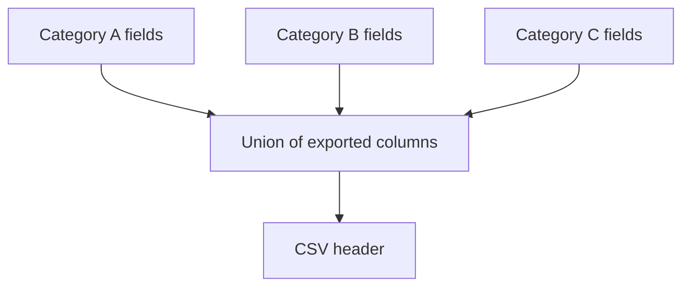
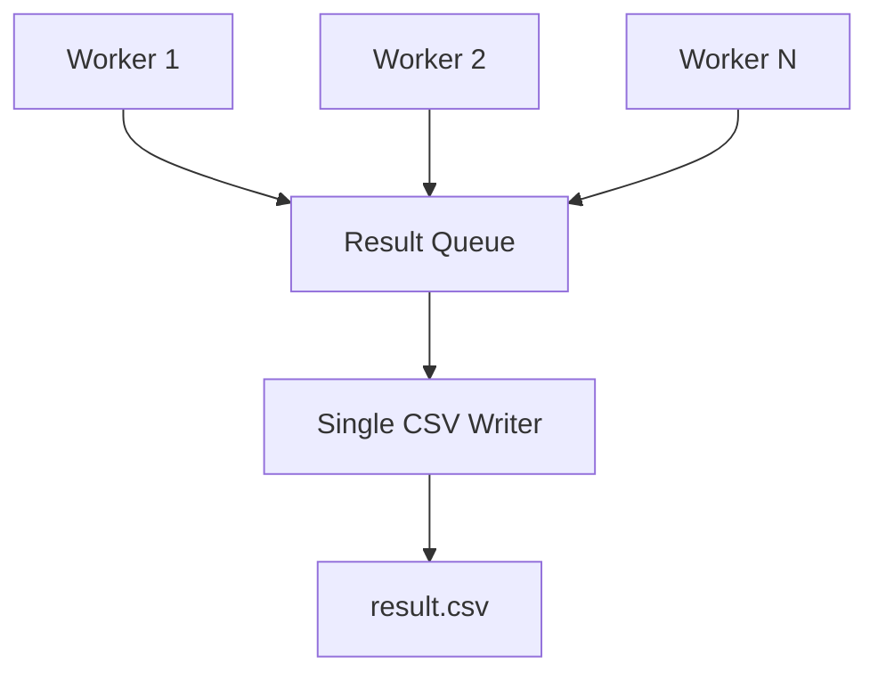
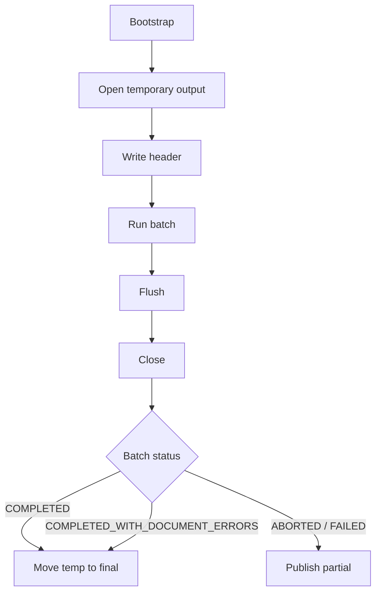

# Format wyników

| Pole          | Wartość                                                        |
| ------------- | -------------------------------------------------------------- |
| ID dokumentu  | DOC-015                                                        |
| Tytuł         | Format wyników i eksportu                                      |
| Wersja        | 0.1                                                            |
| Status        | Draft                                                          |
| Typ           | Technical Specification                                        |
| Źródło prawdy | Repozytorium dokumentacji projektu                             |
| Zależności    | `01-vision.md`, `02-glossary.md`, `03-functional-requirements.md`, `04-non-functional-requirements.md`, `05-architecture.md`, `06-domain-model.md`, `07-processing-pipeline.md`, `08-category-configuration.md`, `09-profile-configuration.md`, `10-extension-api.md`, `11-adr.md`, `12-cli.md`, `13-javafx-configurator.md`, `14-error-model.md` |

## 1. Cel dokumentu

Celem dokumentu jest zdefiniowanie kontraktu wynikowego systemu OCR.

Dokument określa:

- format CSV,
- kodowanie,
- separator,
- quoting i escaping,
- kolejność kolumn,
- kolumny techniczne,
- mapowanie pól kategorii na kolumny,
- reprezentację statusów i błędów,
- reprezentację pustych wartości,
- zachowanie przy równoległym przetwarzaniu,
- strategię zapisu,
- zachowanie przy awarii writera,
- machine-readable summary JSON,
- integrację z CLI.

## 2. Główne założenie

Podstawowym formatem wynikowym batcha jest:

```text
CSV
```

Każdy przetworzony dokument generuje dokładnie jeden logiczny rekord wynikowy.

## 3. Plik CSV

Ścieżka pochodzi z:

```text
profile.output.csv.file
```

lub z override CLI:

```text
--output
```

## 4. Kodowanie

Domyślne kodowanie:

```text
UTF-8
```

Nie zapisujemy BOM w MVP.

## 5. Separator

Domyślny separator:

```text
;
```

Profil może jawnie ustawić inny separator.

## 6. Quote character

Domyślnie:

```text
"
```

## 7. Nagłówek

Domyślnie:

```text
includeHeader = true
```

## 8. Escaping

Wartość musi zostać ujęta w cudzysłów, jeśli zawiera separator, quote character, znak nowej linii lub carriage return.

Przykład wartości:

```text
ABC;DEF
```

zostaje zapisany jako:

```text
"ABC;DEF"
```

Wewnętrzny quote jest podwajany zgodnie z regułami CSV.

## 9. Reprezentacja pustej wartości

Brak wartości pola:

```text
empty string
```

Nie zapisujemy `null`, `NULL` ani `N/A`.

## 10. Rekord dokumentu

Każdy rekord powinien zawierać:

1. kolumny techniczne,
2. kolumny biznesowe,
3. opcjonalne kolumny walidacyjne.

## 11. Kolumny techniczne

Minimalny zestaw:

```text
fileName
categoryId
documentStatus
errorCodes
warningCodes
processingDurationMs
```

## 12. Kolejność kolumn technicznych

| Kolejność | Kolumna |
| --------- | ------- |
| 1 | `fileName` |
| 2 | `categoryId` |
| 3 | `documentStatus` |
| 4 | `errorCodes` |
| 5 | `warningCodes` |
| 6 | `processingDurationMs` |

## 13. fileName

Zawiera nazwę pliku bez pełnej ścieżki.

Przykład:

```text
formularz-001.pdf
```

## 14. categoryId

Dla poprawnie rozpoznanego dokumentu:

```text
formularz-abc
```

Dla nierozpoznanego: pusta wartość.

## 15. documentStatus

Dozwolone wartości:

```text
SUCCESS
SUCCESS_WITH_WARNINGS
FAILED
```

## 16. errorCodes i warningCodes

`errorCodes` zawiera unikalne `IssueCode` o severity `ERROR` lub `FATAL`, w kolejności pierwszego wystąpienia.

`warningCodes` zawiera unikalne `IssueCode` o severity `WARNING`, również w kolejności pierwszego wystąpienia.

Przykład logiczny:

```text
FIELD_VALIDATION_FAILED;FIELD_REQUIRED_VALUE_MISSING
```

Ponieważ domyślny delimiter CSV również wynosi `;`, biblioteka CSV automatycznie zastosuje quoting tej komórki.

## 17. processingDurationMs

Czas przetwarzania dokumentu w milisekundach.

## 18. Kolumny biznesowe

Pochodzą z `FieldDefinition.output`.

Przykład:

```json
{
  "output": {
    "exported": true,
    "columnName": "pesel"
  }
}
```

## 19. Pole niewyeksportowane

Jeżeli `exported=false`, pole nie generuje kolumny biznesowej.

## 20. columnName

Rekomendowany format:

```text
[a-zA-Z0-9_]+
```

Przykłady:

```text
pesel
first_name
document_number
```

## 21. Globalny schemat CSV

Finalny CSV posiada sumę wszystkich eksportowanych kolumn aktywnych kategorii.



## 22. Unikalność kolumn

Nazwa `columnName` musi być unikalna w finalnym schemacie, chyba że różne kategorie używają tej samej nazwy dla tego samego znaczenia biznesowego.

Konflikt znaczeniowy powinien powodować błąd walidacji konfiguracji.

## 23. Kolejność kolumn biznesowych

Rekomendowana zasada:

1. kolejność aktywnych kategorii w profilu,
2. kolejność pól w category JSON,
3. pierwsze wystąpienie `columnName` ustala pozycję.

## 24. Brak pola dla danej kategorii

Jeżeli dokument danej kategorii nie posiada danej kolumny, zapisywana jest pusta wartość.

## 25. Validation status column

Jeżeli pole ma `exportValidationStatus=true`, generowana jest kolumna:

```text
<columnName>_validation
```

Przykład:

```text
pesel_validation
```

Dozwolone wartości:

```text
VALID
INVALID
WARNING
NOT_EXECUTED
```

## 26. Agregacja walidacji pola

- `INVALID`, jeśli którykolwiek wymagany validator zwróci INVALID,
- `WARNING`, jeśli brak INVALID, ale wystąpi warning,
- `VALID`, jeśli wszystkie wykonane walidacje są poprawne,
- `NOT_EXECUTED`, jeśli walidacja nie została wykonana.

## 27. Wartość raw vs transformed

CSV domyślnie eksportuje wartość po `ValueTransformationPipeline`.

Nie eksportuje `rawValue` w MVP.

## 28. Dokument FAILED

Dokument `FAILED` nadal generuje rekord CSV.

Dzięki temu wynik reprezentuje cały wsad, w tym dokumenty błędne.

## 29. Unsupported file

Nieobsługiwany plik trafia do katalogu `error` i generuje rekord:

```text
fileName = notes.txt
categoryId = <empty>
documentStatus = FAILED
errorCodes = DOCUMENT_UNSUPPORTED_FORMAT
```

Kolumny biznesowe pozostają puste.

## 30. Dokument częściowo odczytany

Jeżeli dokument kończy się `FAILED`, poprawnie odczytane pola mogą nadal zostać zapisane w odpowiednich kolumnach.

## 31. Error messages w CSV

Nie eksportujemy pełnych komunikatów błędów domyślnie.

Stabilnym kontraktem są `IssueCode`.

## 32. Architektura zapisu CSV



Workerzy nie zapisują bezpośrednio do CSV.

## 33. Kolejność rekordów

Przy równoległym przetwarzaniu rekordy mogą być zapisywane w kolejności zakończenia dokumentów.

Nie gwarantujemy kolejności zgodnej z input.

## 34. Deterministyczny nagłówek

Nagłówek jest budowany przed startem batcha i jest niezależny od kolejności zakończenia dokumentów.

## 35. OutputSchema

```java
@Value
@Builder
public class OutputSchema {
    List<OutputColumn> columns;
}
```

## 36. OutputColumn

```java
@Value
@Builder
public class OutputColumn {
    String name;
    OutputColumnType type;
    String sourceFieldId;
}
```

## 37. OutputColumnType

```java
public enum OutputColumnType {
    TECHNICAL,
    BUSINESS_VALUE,
    VALIDATION_STATUS
}
```

## 38. OutputRecord

Preferowany neutralny model:

```java
@Value
@Builder
public class OutputRecord {
    Map<String, String> values;
}
```

Writer zapisuje wartości zgodnie z uporządkowanym `OutputSchema`.

## 39. ResultRowMapper

```java
public interface ResultRowMapper {
    OutputRecord map(DocumentResult result, OutputSchema schema);
}
```

## 40. Biblioteka CSV

Rekomendowana biblioteka:

```text
Apache Commons CSV
```

Powody:

- dojrzałe API,
- poprawne quoting/escaping,
- konfigurowalny delimiter i quote,
- brak potrzeby ręcznego składania linii CSV.

Decyzję należy utrwalić jako ADR.

## 41. Lifecycle writera



## 42. Temp file

Rekomendowany model:

```text
result.csv.<batchId>.tmp
```

Po poprawnym zakończeniu:

```text
atomic move → result.csv
```

jeśli filesystem to wspiera.

## 43. Partial output

Dla `ABORTED` lub `FAILED`:

```text
result.csv.<batchId>.partial
```

Powinien zawierać poprawnie zapisane rekordy dokumentów zakończonych przed awarią/przerwaniem.

## 44. overwrite=false

Jeżeli finalny output istnieje:

```text
OUTPUT_UNAVAILABLE
```

przed startem batcha.

## 45. overwrite=true

Istniejący finalny plik jest zastępowany dopiero przy finalizacji poprawnie utworzonego pliku tymczasowego.

## 46. Flush

Writer powinien być flushowany okresowo oraz obowiązkowo przy finalizacji.

Nie ma potrzeby flushowania każdej komórki.

Dokładny interwał jest szczegółem implementacyjnym.

## 47. Awaria writera

Jeżeli CSV nie może być dalej zapisywany:

```text
OUTPUT_WRITE_FAILED
Severity = FATAL
```

Batch powinien zostać zatrzymany.

## 48. Kolejność move vs output

Nie istnieje prawdziwa transakcja pomiędzy filesystem move i append do CSV.

MVP przyjmuje kompromis:

```text
process document
→ move source file
→ write final row
```

Writer jest otwierany i walidowany przed startem batcha, aby zminimalizować ryzyko awarii po move.

## 49. Błąd move

Jeżeli move dokumentu nie powiedzie się:

```text
SOURCE_FILE_MOVE_FAILED
```

Dokument otrzymuje finalny status operacyjny zgodny z `14-error-model.md`, a rekord CSV zawiera ten kod.

## 50. Machine-readable summary

CLI ma wspierać machine-readable summary w formacie:

```text
JSON
```

## 51. Opcja CLI

Przyjęta opcja:

```text
--summary-json <file>
```

Przykład:

```bash
java -jar sk-ocr.jar   --profile production.json   --summary-json /data/summary.json
```

## 52. Human-readable summary

Niezależnie od JSON CLI nadal pokazuje standardowe podsumowanie na stdout.

## 53. Summary JSON — przykład

```json
{
  "schemaVersion": "1.0",
  "batchId": "20260808-103600-abc123",
  "status": "COMPLETED_WITH_DOCUMENT_ERRORS",
  "profile": {
    "id": "production",
    "version": "1.3"
  },
  "startedAt": "2026-08-08T10:36:00+02:00",
  "finishedAt": "2026-08-08T10:38:12+02:00",
  "durationMs": 132000,
  "documents": {
    "total": 10000,
    "success": 9900,
    "successWithWarnings": 80,
    "failed": 20,
    "notProcessed": 0
  },
  "warnings": 91,
  "issueCounts": {
    "CATEGORY_NOT_IDENTIFIED": 12,
    "FIELD_VALIDATION_FAILED": 8,
    "OCR_LOW_CONFIDENCE": 45
  },
  "output": {
    "csv": "/data/ocr/result.csv"
  },
  "issues": []
}
```

## 54. Summary schemaVersion

Summary posiada własne `schemaVersion`, niezależne od profilu i kategorii.

## 55. Timestamps

`startedAt` i `finishedAt` używają ISO-8601 z offsetem strefy czasowej.

## 56. documents

Sekcja zawiera:

```text
total
success
successWithWarnings
failed
notProcessed
```

`notProcessed` jest szczególnie istotne dla `ABORTED` i globalnego `FAILED`.

## 57. issueCounts

Summary zawiera agregację liczby wystąpień `IssueCode`.

Nie zawiera pełnych danych dokumentów.

## 58. Global issues

Sekcja `issues` zawiera wyłącznie problemy globalne/batchowe wymagane do diagnostyki summary.

Przykład:

```json
{
  "code": "OUTPUT_WRITE_FAILED",
  "severity": "FATAL",
  "scope": "OUTPUT",
  "stage": "OUTPUT_WRITING",
  "message": "Unable to write output file"
}
```

## 59. ABORTED summary

Przy Ctrl+C:

```text
status = ABORTED
```

Counts obejmują dokumenty ukończone, a `notProcessed` pozostałe.

## 60. FAILED summary

Przy globalnym błędzie:

```text
status = FAILED
```

`issues` zawiera odpowiednie globalne problemy.

## 61. Zapis summary

Jeżeli użytkownik jawnie podał `--summary-json`, brak możliwości zapisania tego pliku jest globalnym błędem wykonania.

## 62. Atomic summary write

Rekomendacja:

```text
summary.json.tmp
→ close
→ atomic move
```

## 63. Jackson

Summary JSON może używać tej samej biblioteki Jackson co konfiguracja.

## 64. Deterministyczny JSON

Summary powinno używać:

- UTF-8,
- 2 spaces,
- stabilnej kolejności pól,
- końcowego newline.

## 65. Publiczny kontrakt summary

Zmiana niekompatybilna wymaga zmiany `schemaVersion`.

## 66. Trace a output

Trace nie jest częścią standardowego CSV ani summary JSON.

Artefakty diagnostyczne są oddzielnym kanałem.

## 67. Dane wrażliwe

CSV jest celowym biznesowym outputem i może zawierać dane osobowe.

Nie należy kopiować tych wartości do logów ani summary JSON bez jawnego wymagania.

## 68. Walidacja output przed batch'em

Należy sprawdzić:

1. unikalność kolumn,
2. brak konfliktów z kolumnami technicznymi,
3. brak konfliktów suffixu `_validation`,
4. charset,
5. delimiter,
6. quote,
7. ścieżkę output,
8. overwrite policy,
9. możliwość utworzenia pliku tymczasowego.

## 69. Zarezerwowane kolumny techniczne

```text
fileName
categoryId
documentStatus
errorCodes
warningCodes
processingDurationMs
```

Kolumny biznesowe nie mogą używać tych nazw.

## 70. Pakiety

Proponowane:

```text
pl.sk.ocr.output
pl.sk.ocr.output.schema
pl.sk.ocr.output.csv
pl.sk.ocr.output.summary
pl.sk.ocr.output.mapping
```

## 71. Główne komponenty

| Komponent | Odpowiedzialność |
| --------- | ---------------- |
| `OutputSchemaBuilder` | Budowa kolumn przed batch'em |
| `OutputSchemaValidator` | Konflikty i poprawność |
| `ResultRowMapper` | `DocumentResult` → output record |
| `CsvResultWriter` | Zapis CSV |
| `BatchSummaryBuilder` | Budowa summary |
| `JsonBatchSummaryWriter` | Zapis JSON |
| `OutputLifecycleManager` | temp/final/partial |

## 72. Testy CSV

Minimalny zestaw:

```text
header order
UTF-8
semicolon delimiter
quote escaping
newline escaping
empty values
failed document row
multi-category union columns
validation columns
duplicate column detection
technical column collision
concurrent completion order
unsupported file row
partial output
```

## 73. Testy summary JSON

```text
COMPLETED
COMPLETED_WITH_DOCUMENT_ERRORS
ABORTED
FAILED
issueCounts
profile metadata
duration
notProcessed
atomic write
schemaVersion
```

## 74. Golden files

Warto utrzymywać:

```text
expected-result.csv
expected-summary.json
```

jako golden files w testach integracyjnych.

## 75. Rekomendowane decyzje MVP

1. CSV jako podstawowy format wyniku.
2. UTF-8 bez BOM.
3. `;` jako domyślny delimiter.
4. `"` jako quote.
5. Jeden rekord per dokument.
6. Union kolumn aktywnych kategorii.
7. Stałe kolumny techniczne.
8. Eksport transformed value.
9. Unikalne issue codes w kolejności pierwszego wystąpienia.
10. Single CSV writer.
11. Temp file + finalizacja.
12. `.partial` dla ABORTED/FAILED.
13. JSON summary przez `--summary-json <file>`.
14. `issueCounts` w summary.
15. Jackson dla summary JSON.
16. Apache Commons CSV jako preferowana biblioteka CSV.

## 76. Kryteria akceptacji

Format output jest kompletny, jeśli:

1. CSV ma deterministyczny nagłówek,
2. pola techniczne są zdefiniowane,
3. pola biznesowe pochodzą z category config,
4. różne kategorie mogą współistnieć w jednym CSV,
5. brak pola daje pustą wartość,
6. failed documents nadal mają rekord,
7. unsupported files mają rekord FAILED,
8. quoting jest poprawny,
9. writer jest pojedynczym punktem zapisu,
10. output write failure zatrzymuje batch,
11. finalizacja używa temp file,
12. ABORTED/FAILED daje partial output,
13. machine-readable summary jest JSON,
14. CLI posiada `--summary-json`,
15. summary ma własne `schemaVersion`,
16. issueCounts są dostępne,
17. status batcha jest spójny z `14-error-model.md`,
18. exit codes pozostają spójne z `12-cli.md`,
19. trace nie trafia do standardowego output,
20. format nadaje się do skryptów i integracji.

## 77. Otwarte decyzje

Do dalszego doprecyzowania pozostają:

1. finalna wersja Apache Commons CSV,
2. dokładny interwał flush,
3. czy `processingDurationMs` jest obowiązkowe w MVP,
4. czy eksportować `batchId` jako kolumnę techniczną,
5. czy validation status ma być agregatem czy per-validator,
6. czy summary JSON ma być generowane domyślnie także bez `--summary-json`,
7. finalna polityka nazwy `.partial`,
8. czy output powinien zawierać `profileId` per rekord,
9. czy w przyszłości dodać JSONL z pełnym `DocumentResult`.

## 78. Następny dokument

Następny dokument:

**`16-testing-strategy.md`**

Powinien zdefiniować:

- piramidę testów,
- unit tests,
- integration tests,
- adapter tests,
- Tess4J/Tesseract integration tests,
- PDFBox tests,
- ZXing tests,
- Extension API contract tests,
- configuration golden files,
- end-to-end tests,
- regression corpus dokumentów,
- performance tests,
- concurrency tests,
- memory tests,
- JavaFX ViewModel tests,
- testy output CSV/JSON,
- profile Maven do testów wymagających Tesseracta,
- zasady fixtures i danych testowych.
