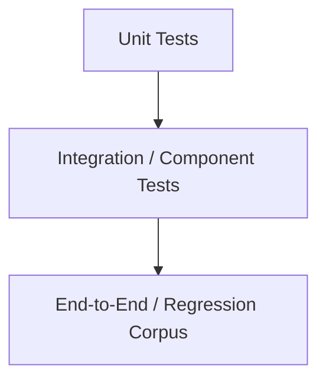
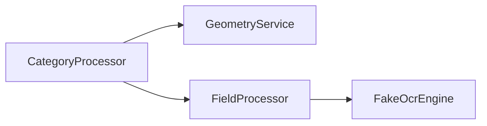
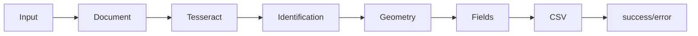

# Strategia testów

| Pole          | Wartość                                                        |
| ------------- | -------------------------------------------------------------- |
| ID dokumentu  | DOC-016                                                        |
| Tytuł         | Strategia testów                                               |
| Wersja        | 0.1                                                            |
| Status        | Draft                                                          |
| Typ           | Technical Specification                                        |
| Źródło prawdy | Repozytorium dokumentacji projektu                             |
| Zależności    | `01-vision.md`, `02-glossary.md`, `03-functional-requirements.md`, `04-non-functional-requirements.md`, `05-architecture.md`, `06-domain-model.md`, `07-processing-pipeline.md`, `08-category-configuration.md`, `09-profile-configuration.md`, `10-extension-api.md`, `11-adr.md`, `12-cli.md`, `13-javafx-configurator.md`, `14-error-model.md`, `15-output-format.md` |

## 1. Cel dokumentu

Celem dokumentu jest zdefiniowanie strategii testowania systemu `pl.sk.ocr`.

Strategia obejmuje:

- testy jednostkowe,
- testy komponentowe,
- testy integracyjne,
- testy kontraktowe Extension API,
- testy konfiguracji,
- testy OCR,
- testy PDFBox,
- testy ZXing,
- testy pipeline'u,
- testy CLI,
- testy JavaFX Configurator,
- testy output CSV i JSON,
- testy współbieżności,
- testy wydajnościowe,
- testy pamięci,
- testy end-to-end,
- corpus dokumentów regresyjnych.

## 2. Cele jakościowe

Testy powinny przede wszystkim chronić:

1. poprawność rozpoznawania kategorii,
2. poprawność geometrii dokumentu,
3. poprawność ekstrakcji pól,
4. deterministyczność konfiguracji i output,
5. stabilność Extension API,
6. izolację błędów dokumentów,
7. bezpieczeństwo przetwarzania równoległego,
8. poprawność obsługi plików,
9. zgodność CLI z kontraktem,
10. możliwość refaktoryzacji Core bez zmiany zachowania.

## 3. Piramida testów



Najwięcej powinno być szybkich testów jednostkowych.

Testy zależne od Tesseracta i pełnych dokumentów powinny stanowić mniejszą, ale istotną część zestawu.

## 4. Poziomy testów

| Poziom | Zakres | Szybkość | Zależności zewnętrzne |
| ------ | ------ | -------- | --------------------- |
| Unit | pojedyncza klasa / algorytm | bardzo szybkie | brak |
| Component | kilka komponentów Core | szybkie | zwykle brak |
| Integration | adapter + realna biblioteka | średnie | lokalne biblioteki / Tesseract |
| E2E | cały pipeline | wolniejsze | Tesseract + fixtures |
| Performance | throughput / memory | wolne | pełne środowisko |

## 5. Framework testowy

Podstawowy framework:

```text
JUnit 5
```

## 6. Assertions

Preferowane:

```text
AssertJ
```

Daje czytelniejsze asercje dla modeli domenowych i kolekcji.

## 7. Mocking

Preferowane:

```text
Mockito
```

Mocki należy stosować przede wszystkim na granicach infrastrukturalnych.

Nie należy mockować prostych modeli domenowych.

## 8. Testy parametryzowane

JUnit `@ParameterizedTest` powinien być szeroko stosowany dla:

- matcherów,
- transformerów,
- validatorów,
- geometrii,
- parsing konfiguracji,
- mapowania błędów.

## 9. Struktura katalogów

Standard Maven:

```text
src/main/java
src/main/resources
src/test/java
src/test/resources
```

Fixtures większych dokumentów mogą być wydzielone do:

```text
src/test/resources/fixtures
```

## 10. Nazewnictwo testów

Preferowane:

```text
shouldReturnNotMatchedWhenTextIsMissing
shouldFailDocumentWhenRequiredAnchorIsMissing
shouldMoveUnsupportedFileToErrorDirectory
```

Nazwa ma opisywać zachowanie, nie implementację.

## 11. Struktura testu

Preferowany układ:

```text
given
when
then
```

Komentarze `// given`, `// when`, `// then` są opcjonalne.

## 12. Unit tests — Domain

Testować:

- value objects,
- status aggregation,
- validation aggregation,
- geometry primitives,
- region calculations,
- issue propagation,
- builder invariants.

## 13. Unit tests — Identification

Minimalnie:

```text
single matching condition
single non-matching condition
AND all matched
AND one not matched
OR first group matched
OR second group matched
all groups not matched
condition ERROR
ambiguous categories
```

## 14. Unit tests — Matchers

Każdy matcher powinien posiadać własny zestaw kontraktowy.

Przykładowo dla fuzzy text matcher:

```text
exact match
case differences
OCR substitutions
below threshold
at threshold
above threshold
empty input
null/invalid parameters
```

## 15. Unit tests — Geometry

Testować:

- translation,
- scale,
- rotation,
- kombinacje transformacji,
- mapowanie punktu,
- mapowanie regionu,
- out-of-bounds,
- niewystarczającą liczbę Anchor,
- błędne dane wejściowe.

## 16. Geometry — tolerancja numeryczna

Asercje współrzędnych powinny używać tolerancji.

Przykład:

```java
assertThat(actualX).isCloseTo(expectedX, within(0.001));
```

Nie porównywać wartości floating point przez dokładne `equals`.

## 17. Unit tests — Field pipeline

Testować każdy etap osobno oraz sekwencję:

```text
region resolution
crop
image processor
OCR
transformer
validator
```

## 18. Pipeline fail-fast

Przykłady:

```text
crop FAILED → OCR SKIPPED
OCR FAILED → transformers SKIPPED
transformer FAILED → validators SKIPPED
```

Należy również sprawdzić, że `SKIPPED` nie generuje sztucznych issue.

## 19. Unit tests — Error model

Minimalnie:

```text
WARNING does not fail field
ERROR fails field
required field failure fails document
optional missing value creates warning
document error does not fail batch
FATAL fails batch
issue order is deterministic
duplicate issue codes are handled correctly in output
```

## 20. Unit tests — OutputSchema

Testować:

- techniczne kolumny,
- union kategorii,
- kolejność kategorii,
- kolejność pól,
- duplikaty `columnName`,
- konflikt z kolumną techniczną,
- konflikt `_validation`,
- `exported=false`.

## 21. Unit tests — CSV mapping

Testować mapowanie:

```text
DocumentResult → OutputRecord
```

bez zapisu do rzeczywistego pliku.

## 22. Unit tests — configuration validation

Testować wszystkie reguły semantyczne.

Przykłady:

```text
unknown extension
invalid extension parameters
duplicate field ID
duplicate anchor ID
invalid page number
invalid region
invalid matcher configuration
workers < 1
unsupported schemaVersion
```

## 23. Testy komponentowe

Test komponentowy powinien łączyć kilka rzeczywistych klas Core, ale zastępować granice infrastrukturalne.

Przykład:



## 24. Fake zamiast mock

Dla złożonych interfejsów często preferowany jest prosty fake.

Przykład:

```text
FakeOcrEngine
FakeDocumentRenderer
InMemoryTraceImageStore
FakeExtensionRegistry
```

## 25. Deterministyczny FakeOcrEngine

Powinien umożliwiać przypisanie:

```text
page/region → OCR result
```

Dzięki temu pipeline można testować bez Tesseracta.

## 26. Testy Extension API

Każdy typ extension powinien mieć contract test.

Dotyczy:

```text
Matcher
Detector
ImageProcessor
ValueTransformer
Validator
```

## 27. Contract test kit

Core powinien udostępniać testowe klasy bazowe lub helpery.

Przykład koncepcyjny:

```java
abstract class ValidatorContractTest {
    protected abstract Validator createValidator();
}
```

## 28. Contract test — wspólne wymagania

Sprawdzać m.in.:

- poprawny `ExtensionDescriptor`,
- stabilne ID,
- brak null dla wymaganych wyników,
- walidację parametrów,
- obsługę legalnych pustych danych,
- brak niekontrolowanego wycieku wyjątków.

## 29. ServiceLoader tests

Należy sprawdzić:

```text
provider discovered
all descriptors registered
duplicate ExtensionId rejected
wrong extension type rejected
```

Test powinien korzystać z prawdziwego `ServiceLoader`.

## 30. Testy Tess4J / Tesseract

Powinny być oznaczone jako testy integracyjne.

Nie mogą być wymagane do każdego szybkiego `mvn test`.

## 31. Maven profile dla OCR

Rekomendowany profil:

```text
ocr-integration
```

Przykładowe uruchomienie:

```bash
mvn verify -Pocr-integration
```

## 32. Warunek środowiskowy Tesseract

Testy OCR wymagają:

- zainstalowanego Tesseracta,
- dostępnego `tessdata`,
- języka `pol`.

Datapath może pochodzić z property:

```text
sk.ocr.test.tesseract.datapath
```

## 33. Brak Tesseracta

Zwykłe:

```text
mvn test
```

nie może padać tylko dlatego, że Tesseract nie jest zainstalowany.

Profil integracyjny może wymagać środowiska i wtedy brak zależności jest błędem test environment.

## 34. OCR fixtures

Należy przygotować małe obrazy:

```text
clean-text.png
rotated-text.png
low-contrast-text.png
polish-diacritics.png
numeric-field.png
```

## 35. OCR assertions

Nie należy przesadnie uzależniać testów od dokładnego confidence.

Preferowane asercje:

```text
recognized text normalized equals expected
required token exists
bounding box intersects expected region
```

## 36. Tolerancja OCR

Tesseract może nieznacznie zmieniać wynik między wersjami.

Dlatego testy integracyjne powinny rozdzielać:

- kontrakt adaptera,
- jakość konkretnego corpus.

## 37. Test adaptera Tess4J

Sprawdzać:

- konfigurację języka,
- datapath,
- page segmentation mode,
- OCR obrazu,
- mapowanie bounding box,
- mapowanie hOCR do modelu wewnętrznego,
- obsługę błędu silnika.

## 38. Testy PDFBox

Integracyjne fixtures:

```text
single-page.pdf
multi-page.pdf
rotated-page.pdf
mixed-page-size.pdf
```

## 39. PDFBox assertions

Sprawdzać:

- liczbę stron,
- rendering wskazanej strony,
- rozmiar obrazu,
- DPI,
- obsługę nieistniejącej strony,
- uszkodzony PDF.

## 40. Testy TIFF

Jeżeli TIFF jest wspierany w MVP, fixtures powinny obejmować:

```text
single-page.tiff
multi-page.tiff
```

## 41. Testy ZXing

Fixtures:

```text
qr-clean.png
qr-rotated.png
qr-scaled.png
qr-with-text.png
no-qr.png
```

## 42. ZXing assertions

Sprawdzać:

- payload,
- znalezienie kodu,
- punkty detekcji,
- mapowanie punktów na model domenowy,
- brak kodu jako `notFound`,
- błędny obraz bez wyjątku technicznego.

## 43. QR Anchor integration test

Pełny scenariusz:


## 44. Testy image processing

Dla każdego `ImageProcessor` powinny istnieć fixtures przed/po.

Przykłady:

```text
remove-boxes
condense-content
crop-empty-margins
```

## 45. Porównywanie obrazów

Nie należy wymagać zawsze identyczności byte-to-byte.

Możliwe strategie:

- identyczne dimensions,
- histogram/statystyki,
- pixel difference z tolerancją,
- golden image dla deterministycznych algorytmów.

## 46. Golden image

Dla deterministycznego procesora można przechowywać:

```text
input.png
expected.png
```

i porównywać piksele.

## 47. Configuration golden files

Należy utrzymywać zestaw poprawnych i błędnych JSON.

Przykład:

```text
categories/
  minimal-valid.json
  full-valid.json
  invalid-unknown-extension.json
  invalid-duplicate-field.json

profiles/
  minimal-valid.json
  full-valid.json
  invalid-workers.json
```

## 48. Round-trip konfiguracji

Test:

```text
JSON
→ DTO
→ Domain
→ DTO
→ JSON
```

Powinien zachować semantykę i deterministyczny format.

## 49. Deterministic JSON test

Ten sam model zapisany wielokrotnie powinien dawać identyczny tekst.

## 50. Schema compatibility tests

Dla każdej wspieranej `schemaVersion` powinien istnieć fixture.

Nieobsługiwana wersja:

```text
CONFIGURATION_SCHEMA_UNSUPPORTED
```

## 51. Testy profilu

Sprawdzać:

- listę kategorii,
- kolejność kategorii,
- override OCR,
- datapath,
- workers,
- input/success/error,
- output,
- summary,
- nieznane categoryId.

## 52. CLI tests

CLI powinno być testowane na dwóch poziomach:

1. command object bez uruchamiania procesu,
2. rzeczywiste uruchomienie JAR w testach E2E.

## 53. Picocli tests

Sprawdzać:

```text
required options
unknown option
invalid workers
help
version
output override
summary-json
exit codes
```

## 54. CLI exit code tests

Minimalnie:

| Scenariusz | Exit code |
| ---------- | --------- |
| Success | `0` |
| Document failures only | `0` |
| Invalid arguments | `1` |
| Configuration error | `2` |
| Environment error | `3` |
| Global execution failure | `4` |
| Interrupted | `130` |

## 55. CLI unsupported file test

Fixture w input:

```text
unsupported.txt
```

Oczekiwanie:

```text
DocumentStatus=FAILED
IssueCode=DOCUMENT_UNSUPPORTED_FORMAT
file moved to error
batch exit=0
```

## 56. File movement tests

Testować:

```text
SUCCESS → success directory
SUCCESS_WITH_WARNINGS → success directory
FAILED → error directory
```

## 57. Brak katalogu processing

Test powinien potwierdzać, że przed finalnym move dokument pozostaje w `input`.

## 58. Kolizje nazw

Zgodnie z decyzją architektoniczną pliki nie mają kolizji nazw.

Nie trzeba projektować rozbudowanego mechanizmu rename.

Warto jednak mieć test defensywny błędu filesystem.

## 59. Testy output CSV

Powinny obejmować:

```text
UTF-8
Polish characters
semicolon delimiter
quotes
embedded separator
embedded newline
empty value
failed document
union columns
header order
validation status
error codes
warning codes
partial output
```

## 60. Golden CSV

Przykład:

```text
expected-result.csv
```

Porównanie może być tekstowe, jeśli output jest deterministyczny.

## 61. Concurrency a CSV

Kolejność rekordów nie jest deterministyczna.

Testy nie powinny zakładać konkretnej kolejności rekordów przy `workers > 1`.

Nagłówek pozostaje deterministyczny.

## 62. Testowanie CSV przy concurrency

Należy:

1. odczytać CSV,
2. zmapować rekordy po `fileName`,
3. porównać zawartość logiczną.

## 63. Testy summary JSON

Sprawdzać:

```text
schemaVersion
batchId
status
counts
durationMs
issueCounts
output path
global issues
```

## 64. Summary counts invariant

Dla pełnego batcha:

```text
success + successWithWarnings + failed = total
```

## 65. Testy atomic output

Scenariusze:

```text
COMPLETED → final CSV exists
COMPLETED_WITH_DOCUMENT_ERRORS → final CSV exists
ABORTED → partial exists
FAILED → partial exists
```

## 66. Test writer failure

Wymusić błąd zapisu i sprawdzić:

```text
OUTPUT_WRITE_FAILED
Severity=FATAL
BatchStatus=FAILED
```

## 67. End-to-end tests

E2E powinien uruchamiać rzeczywisty pipeline:



## 68. Minimalny E2E corpus

Powinien zawierać co najmniej:

```text
1 poprawny dokument jednej kategorii
1 poprawny dokument wielostronicowy
1 dokument z QR Anchor
1 dokument nierozpoznany
1 dokument z błędem required field
1 unsupported file
```

## 69. Regression corpus

Docelowo najważniejszym aktywem jakościowym będzie corpus rzeczywistych, zanonimizowanych dokumentów.

Struktura:

```text
regression-corpus/
  category-a/
  category-b/
  category-c/
  negative/
```

## 70. Manifest corpus

Każdy dokument powinien mieć expected result.

Przykład:

```json
{
  "file": "sample-001.pdf",
  "categoryId": "formularz-abc",
  "expectedStatus": "SUCCESS",
  "fields": {
    "first_name": "JAN",
    "document_number": "ABC123"
  }
}
```

## 71. Dane osobowe w fixtures

Do repozytorium nie powinny trafiać niezanonimizowane dokumenty produkcyjne.

Fixtures powinny być:

- syntetyczne,
- zanonimizowane,
- lub formalnie dopuszczone do użycia testowego.

## 72. Regression runner

Powinien umożliwiać:

```text
run corpus
→ compare expected
→ report differences
```

## 73. Metryki corpus

W przyszłości można mierzyć:

```text
category accuracy
field exact-match accuracy
field normalized accuracy
anchor detection rate
document success rate
```

## 74. Baseline jakości OCR

Zmiana image processor, konfiguracji OCR lub wersji Tesseracta powinna być oceniana względem corpus.

Nie należy opierać decyzji tylko na jednym dokumencie.

## 75. Snapshot wyników

Dla corpus można przechowywać expected JSON, ale nie należy bezrefleksyjnie aktualizować snapshotów po każdej zmianie.

Każda różnica powinna zostać oceniona.

## 76. Testy wielostronicowe

Sprawdzać:

- category z 1 stroną,
- category z N stronami,
- category `all`,
- kilka aktywnych kategorii z różnymi limitami stron,
- brak OCR stron dalszych niż maksymalnie potrzebna.

## 77. Page processing optimization test

Jeżeli maksymalna aktywna kategoria wymaga 6 stron:

```text
page 1..6 may be processed
page 7+ must not be OCR'ed
```

## 78. Test selective category evaluation

Jeżeli po stronie 1 część kategorii nie wymaga dalszych stron, dalsze przetwarzanie powinno dotyczyć tylko kategorii, które tego potrzebują.

## 79. Concurrency tests

Sprawdzać:

- `workers=1`,
- `workers=2`,
- `workers=N`,
- brak podwójnego przetwarzania pliku,
- brak utraty wyników,
- poprawne counters,
- poprawne zakończenie executorów.

## 80. Dispatcher tests

Fake worker może używać latch/barrier, aby wymusić różne kolejności zakończenia.

## 81. Race condition tests

Szczególnie testować:

```text
writer
batch counters
shutdown
Ctrl+C
file move
result aggregation
```

## 82. Stress test

Wygenerować dużą liczbę małych syntetycznych dokumentów.

Przykład:

```text
10 000 jobs
```

Nie musi to oznaczać 10 000 ciężkich realnych PDF w standardowym CI.

## 83. Test throughput

Mierzyć:

```text
documents / minute
pages / minute
average document duration
```

Wynik zależy od sprzętu, więc nie powinien być sztywną asercją w zwykłym CI.

## 84. Performance baseline

Benchmark powinien zapisywać środowisko:

```text
CPU
RAM
JDK
Tesseract version
workers
DPI
document corpus
```

## 85. JMH

Dla mikrobenchmarków algorytmów można użyć:

```text
JMH
```

Nie jest wymagany dla MVP.

## 86. Testy pamięci

Szczególnie istotne dla:

- dużych PDF,
- wielu stron,
- `BufferedImage`,
- `TraceMode.FULL`,
- cache JavaFX.

## 87. Memory test CLI

CLI nie powinno przechowywać obrazów wszystkich zakończonych dokumentów.

Po zakończeniu dokumentu referencje do ciężkich obiektów powinny być zwalniane.

## 88. Memory test Configurator

Configurator może przechowywać:

```text
latest preview trace
limited page cache
OCR cache
```

Nie powinien akumulować trace wszystkich preview runów.

## 89. Testy TraceMode

Sprawdzać:

```text
OFF → brak ciężkich trace data
BASIC → metadane bez pełnych obrazów
FULL → obrazy dostępne przez TraceImageStore
```

zgodnie z finalnym modelem `07-processing-pipeline.md`.

## 90. TraceImageStore tests

Sprawdzać:

- zapis,
- odczyt,
- cleanup,
- replacement latest trace,
- brak obrazów w Domain.

## 91. JavaFX testing strategy

Nie należy próbować testować całej logiki przez kliknięcia UI.

Większość logiki Configuratora powinna być testowana przez ViewModel i Use Case.

## 92. JavaFX ViewModel tests

Minimalnie:

```text
dirty state
selection
validation messages
preview result
preview failure
cache invalidation
extension parameters
page change
field selection changes page
```

## 93. PreviewRunId race test

Scenariusz:

```text
run A starts
run B starts
run B finishes
run A finishes
```

Oczekiwanie:

```text
UI keeps result B
result A is ignored
```

## 94. JavaFX thread test

Należy sprawdzić, że ciężkie operacje nie wykonują się na JavaFX Application Thread.

## 95. CoordinateMapper tests

Testować:

```text
screen → image
image → screen
zoom
pan
fit page
round-trip mapping
region mapping
```

## 96. Viewer tests

Logikę geometryczną viewera należy wydzielić tak, aby była testowalna bez renderowania całego Stage.

## 97. UI smoke test

Powinien istnieć co najmniej smoke test:

```text
application starts
main view loads
```

Może wymagać headless JavaFX environment w CI.

## 98. TestFX

Możliwa biblioteka:

```text
TestFX
```

Nie jest obowiązkowa dla MVP, jeśli ViewModel jest dobrze wydzielony.

## 99. Test dynamic Extension form

Dla `ExtensionDescriptor` sprawdzać mapowanie:

| Parameter type | Expected control |
| -------------- | ---------------- |
| STRING | TextField |
| INTEGER | Spinner/TextField |
| BOOLEAN | CheckBox |
| ENUM | ComboBox |
| STRING_LIST | List editor |

## 100. Test błędnego pluginu w Configuratorze

Jeżeli konfiguracja wskazuje brakujące extension:

```text
configuration opens as draft
error is visible
dependent preview is blocked
user can edit/remove step
```

## 101. Test zapisu draftu

Semantycznie błędna konfiguracja może zostać zapisana przez Configurator.

CLI musi ją później odrzucić przed startem batcha.

## 102. Integration test między Configurator i CLI

Konfiguracja zapisana przez Configurator:

```text
save JSON
→ load same JSON in Core/CLI
→ semantic equality
```

To jest krytyczny test zgodności obu aplikacji.

## 103. Testy logowania

Nie należy testować każdego tekstu logu.

Testować tylko istotne kontrakty:

- brak pełnych wartości wrażliwych,
- correlation identifiers tam, gdzie wymagane,
- unexpected exception zawiera stack trace.

## 104. Security/privacy tests

Fixtures z wartościami takimi jak syntetyczny PESEL powinny pozwalać sprawdzić, że wartości nie trafiają przypadkowo do standardowych logów i `ProcessingIssue.message`.

## 105. Property-based testing

Może być przydatne dla:

- geometrii,
- regionów,
- escaping CSV,
- transformerów.

Nie jest wymagane MVP.

## 106. Mutation testing

Można rozważyć:

```text
PIT
```

dla krytycznych algorytmów Core.

Nie jest wymagane MVP.

## 107. Maven lifecycle

Rekomendowany podział:

```text
mvn test
```

uruchamia szybkie unit/component tests.

```text
mvn verify
```

uruchamia standardowe integration tests niewymagające zewnętrznego Tesseracta.

```text
mvn verify -Pocr-integration
```

uruchamia także testy z realnym Tesseractem.

## 108. Maven Surefire

Unit tests:

```text
maven-surefire-plugin
```

## 109. Maven Failsafe

Integration tests:

```text
maven-failsafe-plugin
```

Konwencja nazw:

```text
*IT.java
```

## 110. Test categories/tags

JUnit tags:

```text
unit
integration
ocr
e2e
performance
javafx
```

Nie należy przesadzać z liczbą tagów.

## 111. CI — szybki pipeline

Każdy commit/PR powinien uruchamiać:

```text
compile
unit tests
component tests
configuration tests
output tests
```

## 112. CI — pełny pipeline

Środowisko posiadające Tesseract powinno dodatkowo uruchamiać:

```text
Tess4J integration
PDFBox integration
ZXing integration
E2E corpus
```

## 113. CI — regresja

Regression corpus może być uruchamiany:

- przy merge do głównej gałęzi,
- przed release,
- po zmianach OCR/image processing/configuration.

## 114. Flaky tests

Flaky test jest defektem.

Nie należy maskować problemu przez wielokrotne automatyczne retry jako podstawową strategię.

## 115. Deterministyczność

Testy powinny kontrolować:

- locale,
- charset,
- timezone tam, gdzie wpływa na wynik,
- random seeds,
- kolejność danych.

## 116. Temporary directories

Testy filesystem powinny używać JUnit:

```java
@TempDir
```

Nie używać współdzielonych stałych katalogów.

## 117. Clock

Jeśli `batchId`, timestamp lub summary zależą od czasu, należy wstrzykiwać:

```java
Clock
```

aby testy były deterministyczne.

## 118. UUID / ID generation

Analogicznie generator identyfikatorów powinien być możliwy do zastąpienia w testach.

## 119. Test batchId

Nie testować regexem, jeśli można podać deterministyczny generator.

## 120. Cleanup

Testy nie powinny zostawiać:

- plików temp,
- `.partial`,
- logów,
- cache,
- procesów/threadów.

## 121. Thread leak test

Po zakończeniu batcha executory workerów i writer powinny być zamknięte.

## 122. Test Ctrl+C

Warstwę shutdown należy projektować tak, aby można było wywołać ją bez wysyłania prawdziwego sygnału OS w większości testów.

Osobny E2E może sprawdzać rzeczywisty proces.

## 123. Test shutdown

Oczekiwania:

```text
stop accepting new jobs
allow/stop active jobs according to policy
close writer
produce partial output
BatchStatus=ABORTED
exit=130
```

## 124. Error directory retry scenario

Test:

1. dokument kończy się FAILED,
2. trafia do `error`,
3. użytkownik przenosi go ponownie do `input`,
4. uruchamia z poprawioną konfiguracją,
5. dokument może zakończyć się SUCCESS.

System nie powinien przechowywać ukrytego stanu blokującego retry.

## 125. Test wersjonowania konfiguracji

Zmiana category/profile JSON powinna być możliwa do zweryfikowania przez golden files w repozytorium.

Diff powinien być czytelny dzięki deterministycznemu JSON.

## 126. Test manualny Configuratora

Przed release należy wykonać checklistę:

```text
open PDF
run OCR
show OCR overlay
create condition
create text anchor
create QR anchor
test geometry
create field
add image processor
preview stages
add transformer
add validator
save JSON
reopen JSON
test category
export diagnostic image
```

## 127. Test manualny CLI

Checklist:

```text
help
version
single worker
multiple workers
valid batch
document errors
unsupported file
invalid profile
missing tessdata
summary JSON
Ctrl+C
```

## 128. Definition of Done dla funkcji

Nowa funkcja jest kompletna, jeśli:

1. posiada testy jednostkowe tam, gdzie ma logikę,
2. posiada test integracyjny, jeśli dotyka adaptera,
3. aktualizuje fixtures, jeśli zmienia kontrakt,
4. nie obniża istniejącego regression corpus bez świadomej decyzji,
5. nie wprowadza flaky tests,
6. dokumentacja kontraktu jest aktualna.

## 129. Definition of Done dla extension

Nowe extension jest kompletne, jeśli:

1. ma stabilne ID,
2. ma `ExtensionDescriptor`,
3. przechodzi contract test,
4. ma test parametrów,
5. ma test happy path,
6. ma test negative path,
7. ma test błędu wykonania,
8. jest wykrywane przez `ServiceLoader`.

## 130. Definition of Done dla category configuration

Nowa konfiguracja kategorii jest gotowa, jeśli:

1. przechodzi walidację,
2. ma reprezentatywny corpus,
3. poprawnie identyfikuje dokumenty pozytywne,
4. nie identyfikuje dokumentów negatywnych,
5. Anchor są stabilne,
6. wszystkie wymagane pola mają expected results,
7. regression runner przechodzi.

## 131. Pokrycie kodu

Nie należy ustanawiać jednego arbitralnego procentu jako celu jakościowego.

Coverage jest wskaźnikiem pomocniczym.

Szczególnie wysokie pokrycie jest oczekiwane dla:

- Core,
- geometrii,
- konfiguracji,
- error policy,
- output mapping.

## 132. JaCoCo

Rekomendowane narzędzie:

```text
JaCoCo
```

Raport powinien być generowany w `verify`.

## 133. Wyłączenia coverage

Można wyłączyć:

- proste DTO,
- JavaFX bootstrap,
- wygenerowany boilerplate Lombok.

Nie należy wyłączać klas tylko po to, aby poprawić procent.

## 134. Test report

CI powinno publikować:

- JUnit results,
- JaCoCo report,
- E2E regression report,
- opcjonalnie performance report.

## 135. Regression report

Powinien pokazywać co najmniej:

```text
document
expected category
actual category
expected status
actual status
field differences
```

## 136. Diagnostyka failed regression

Dla failed case warto umożliwić zapis `ProcessingTrace` i obrazów etapów.

To jest funkcja testowo-diagnostyczna, nie Domain.

## 137. Wersje zależności

Testy integracyjne powinny raportować:

```text
JDK version
Tesseract version
Tess4J version
PDFBox version
ZXing version
```

co ułatwi analizę regresji.

## 138. Test matrix JDK

Projekt docelowo używa:

```text
JDK 21
```

Nie ma potrzeby testowania wielu wersji JDK w MVP.

## 139. Platformy OS

Core powinien być możliwie niezależny od OS.

Tesseract integration i JavaFX packaging mogą wymagać smoke tests na docelowych systemach operacyjnych.

Zakres finalny zależy od sposobu dystrybucji.

## 140. Testy ścieżek

Należy uwzględnić:

- spacje,
- polskie znaki,
- długie nazwy plików w rozsądnych granicach.

## 141. Test pliku bez rozszerzenia

Powinien zostać sklasyfikowany zgodnie z mechanizmem detekcji formatu.

Jeśli unsupported:

```text
DOCUMENT_UNSUPPORTED_FORMAT
```

i trafia do `error`.

## 142. Test corrupted file

Plik z obsługiwanym rozszerzeniem, ale niepoprawną zawartością:

```text
DOCUMENT_CORRUPTED
```

lub odpowiedni bardziej precyzyjny kod adaptera zmapowany do modelu błędów.

## 143. Test category ambiguity

Dwie kategorie spełniają warunki.

Oczekiwanie:

```text
CATEGORY_AMBIGUOUS
DocumentStatus=FAILED
```

Nie wybierać pierwszej kategorii.

## 144. Test required Anchor

Brak required Anchor:

```text
ANCHOR_REQUIRED_NOT_FOUND
```

i odpowiednie zatrzymanie zależnego pipeline'u.

## 145. Test optional Anchor

Brak optional Anchor:

```text
ANCHOR_OPTIONAL_NOT_FOUND
Severity=WARNING
```

Jeśli geometria może działać dalej, dokument nie musi być FAILED.

## 146. Test geometry out-of-bounds

Powinien sprawdzać finalną politykę przyjętą w `14-error-model.md`.

Do czasu finalizacji decyzji test oznaczyć jako wymagający doprecyzowania.

## 147. Test OCR low confidence

Jeśli mechanizm jest aktywny:

```text
OCR_LOW_CONFIDENCE
```

nie powinien automatycznie oznaczać pola jako FAILED bez odpowiedniej polityki/validatora.

## 148. Test Extension RuntimeException

Extension rzuca:

```text
RuntimeException
```

Oczekiwanie:

- wyjątek zostaje przechwycony,
- powstaje `ProcessingIssue`,
- worker pozostaje żywy,
- inne dokumenty są przetwarzane.

## 149. Test global FATAL

Przykład:

```text
CSV writer failure
```

Oczekiwanie:

```text
BatchStatus=FAILED
```

i brak pobierania kolejnych jobów po wykryciu globalnej awarii.

## 150. Test workers configuration

Dla:

```text
workers=1
workers=2
workers=availableProcessors
```

dispatcher powinien zachowywać ten sam kontrakt funkcjonalny.

## 151. Performance acceptance MVP

Nie należy na tym etapie deklarować twardej liczby dokumentów/minutę bez reprezentatywnego corpus i sprzętu referencyjnego.

Pierwszy etap implementacji powinien ustanowić baseline.

## 152. Memory acceptance MVP

Podobnie należy ustanowić baseline na reprezentatywnych dokumentach.

Krytyczne kryterium funkcjonalne:

```text
memory usage must not grow proportionally to total number of completed documents
```

przy stałym profilu dokumentów.

## 153. Test długiego batcha

Powinien potwierdzić, że po wielu dokumentach:

- cache nie rośnie bez ograniczeń,
- trace jest zwalniany,
- file handles są zamykane,
- PDF resources są zamykane,
- obrazy mogą zostać zebrane przez GC.

## 154. Resource leak tests

Szczególną uwagę zwrócić na:

```text
PDDocument
InputStream
OutputStream
CSV printer/writer
BufferedImage references
ExecutorService
```

## 155. Test architecture boundaries

Można użyć:

```text
ArchUnit
```

do ochrony reguł architektonicznych.

## 156. ArchUnit — przykładowe reguły

```text
domain must not depend on JavaFX
core must not depend on CLI
core must not depend on Configurator
JavaFX must not directly depend on Tess4J
JavaFX must not directly depend on ZXing
CLI must use shared Core
```

## 157. Rekomendacja ArchUnit

Warto wprowadzić od początku.

Koszt jest niski, a projekt posiada wyraźne granice modułów.

## 158. Test braku package processing

Zgodnie z ADR nie ma katalogu/pakietu `processing` jako ogólnego worka.

ArchUnit może chronić strukturę przed powstawaniem niepożądanych zależności, ale nie musi testować samej nazwy katalogu.

## 159. Test Lombok

Nie testować wygenerowanych getterów, builderów ani `equals` bez konkretnego powodu domenowego.

## 160. Test fixtures ownership

Fixtures powinny należeć do warstwy, którą testują.

Nie tworzyć jednego ogromnego katalogu bez struktury.

## 161. Proponowana struktura fixtures

```text
fixtures/
├── configuration/
├── pdf/
├── images/
├── qr/
├── ocr/
├── output/
├── e2e/
└── regression/
```

## 162. Reuse fixtures

Małe techniczne fixtures mogą być współdzielone.

Dokumenty regresyjne powinny mieć własny manifest expected results.

## 163. Buildery testowe

Warto utworzyć:

```text
TestCategoryBuilder
TestProfileBuilder
TestDocumentResultBuilder
TestFieldResultBuilder
TestOcrResultBuilder
```

aby testy były krótkie i czytelne.

## 164. Object Mother vs Builder

Preferowane są buildery testowe.

Pozwalają jawnie nadpisywać tylko dane istotne dla scenariusza.

## 165. Random test data

Losowe dane nie powinny utrudniać reprodukcji.

Jeśli używane:

```text
fixed seed
```

musi być raportowany przy błędzie.

## 166. Testy kompatybilności output

Zmiana `IssueCode`, nazw kolumn technicznych lub summary schema powinna powodować świadomą zmianę golden files.

## 167. Release gate

Przed wydaniem wersji należy wymagać:

1. `mvn verify`,
2. `mvn verify -Pocr-integration`,
3. przejścia E2E corpus,
4. przejścia regression corpus,
5. braku nowych krytycznych regresji,
6. smoke test CLI,
7. smoke test JavaFX Configurator.

## 168. Rekomendowane zależności testowe

| Biblioteka | Zastosowanie |
| ---------- | ------------ |
| JUnit 5 | Framework testowy |
| AssertJ | Assertions |
| Mockito | Mocking |
| JaCoCo | Coverage |
| ArchUnit | Reguły architektoniczne |
| Maven Surefire | Unit tests |
| Maven Failsafe | Integration tests |

Opcjonalnie:

| Biblioteka | Zastosowanie |
| ---------- | ------------ |
| TestFX | UI tests |
| JMH | Microbenchmarks |
| PIT | Mutation testing |

## 169. Kryteria akceptacji strategii

Strategia jest kompletna, jeśli:

1. Core może być testowany bez Tesseracta,
2. istnieje osobny profil dla realnego OCR,
3. Tess4J posiada testy adaptera,
4. PDFBox posiada fixtures integracyjne,
5. ZXing posiada fixtures QR,
6. Extension API ma contract tests,
7. ServiceLoader jest testowany realnie,
8. konfiguracje mają golden files,
9. JSON round-trip jest testowany,
10. pipeline fail-fast jest testowany,
11. error model jest testowany,
12. CLI exit codes są testowane,
13. unsupported files trafiają do `error`,
14. CSV posiada golden tests,
15. summary JSON posiada golden/contract tests,
16. concurrency nie zakłada kolejności rekordów,
17. dispatcher ma race-condition tests,
18. JavaFX logika jest głównie testowana przez ViewModel,
19. `PreviewRunId` ma test wyścigu,
20. Configurator JSON jest zgodny z CLI/Core,
21. istnieje E2E corpus,
22. istnieje regression corpus,
23. dokumenty produkcyjne w fixtures są anonimizowane,
24. performance ma baseline zamiast arbitralnego limitu,
25. memory growth jest testowany,
26. zasoby są zamykane,
27. granice architektury są chronione,
28. testy są deterministyczne,
29. flaky tests są traktowane jako defekty,
30. release posiada jasno określony gate.

## 170. Otwarte decyzje

Do dalszego doprecyzowania pozostają:

1. dokładne wersje JUnit, AssertJ, Mockito, JaCoCo i ArchUnit,
2. czy TestFX wejdzie do MVP,
3. czy JMH będzie częścią repozytorium od początku,
4. gdzie fizycznie będzie przechowywany większy regression corpus,
5. czy corpus będzie częścią głównego repozytorium,
6. docelowe systemy operacyjne dla smoke tests,
7. sprzęt referencyjny dla performance baseline,
8. progi jakościowe corpus po zebraniu reprezentatywnych dokumentów,
9. finalna polityka geometry out-of-bounds,
10. sposób generowania raportu regression corpus.

## 171. Następny dokument

Następny dokument:

**`17-implementation-plan.md`**

Powinien zdefiniować:

- strukturę projektu Maven,
- kolejność implementacji modułów,
- bootstrap projektu,
- model domenowy,
- konfigurację,
- Extension API,
- adaptery PDFBox/Tess4J/ZXing,
- pipeline,
- dispatcher,
- output,
- CLI,
- JavaFX Configurator,
- testy i corpus,
- milestone'y MVP,
- zależności między zadaniami,
- Definition of Done dla kolejnych etapów,
- kolejność pracy dogodną dla implementacji z użyciem Codex.
