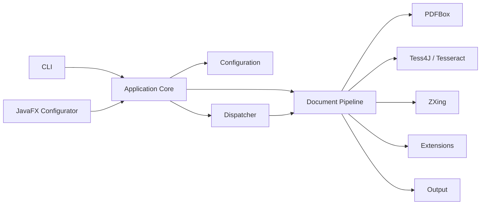
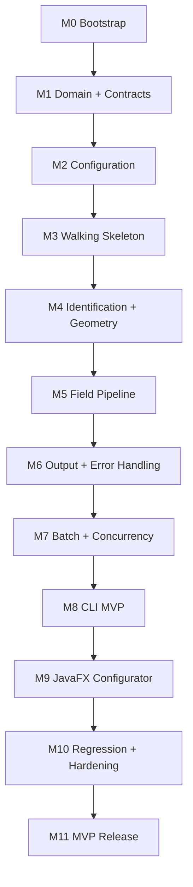
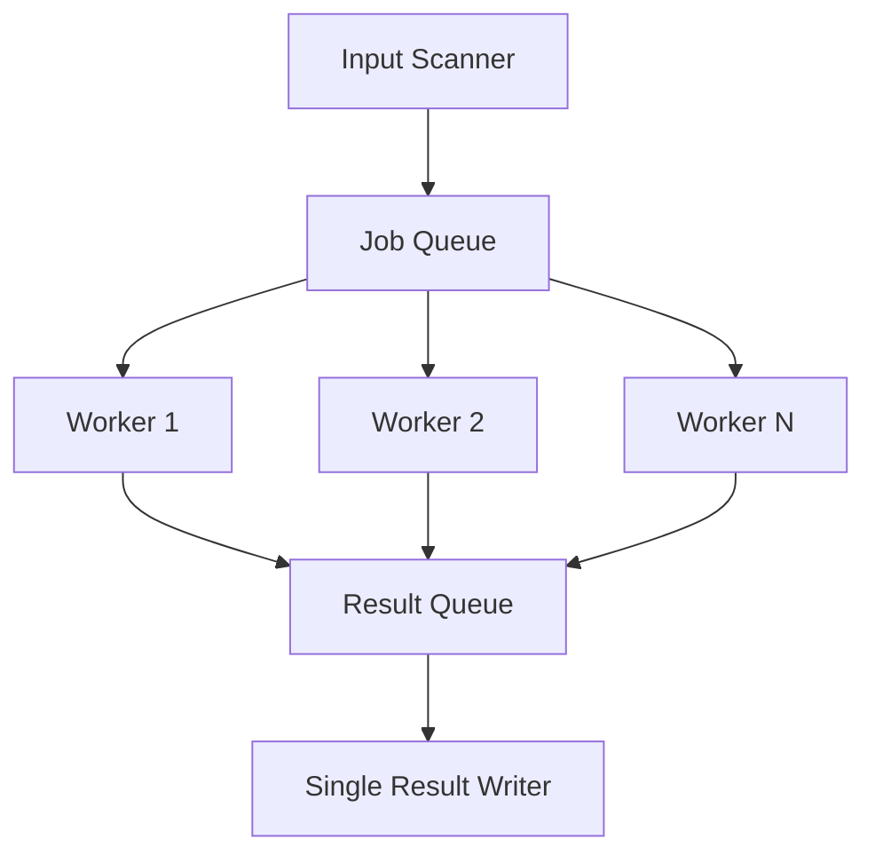
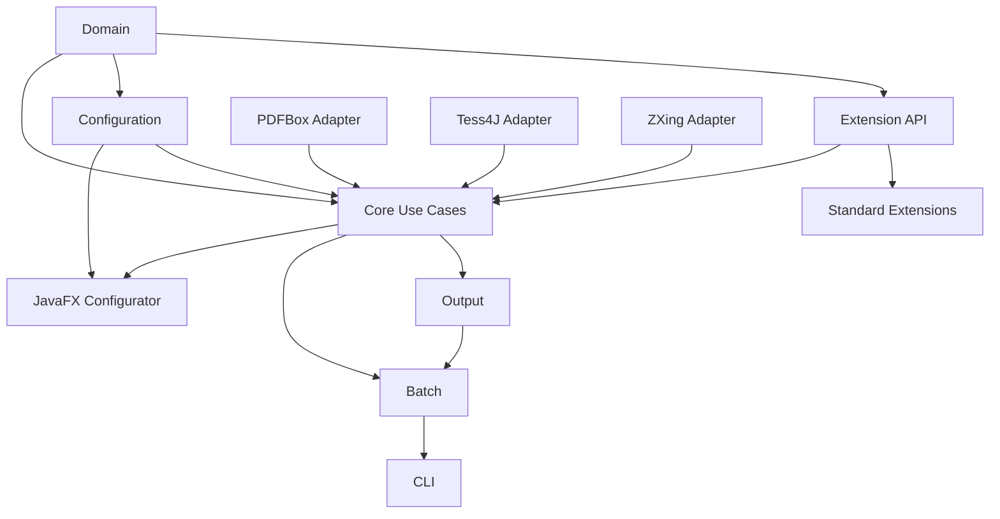
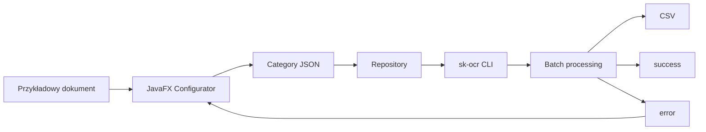

# Plan implementacji

| Pole          | Wartość                                                        |
| ------------- | -------------------------------------------------------------- |
| ID dokumentu  | DOC-017                                                        |
| Tytuł         | Plan implementacji                                             |
| Wersja        | 0.1                                                            |
| Status        | Draft                                                          |
| Typ           | Implementation Plan                                            |
| Źródło prawdy | Repozytorium dokumentacji projektu                             |
| Zależności    | `01-vision.md` – `16-testing-strategy.md`                      |

## 1. Cel dokumentu

Celem dokumentu jest zdefiniowanie kolejności implementacji systemu `pl.sk.ocr` w sposób:

- iteracyjny,
- testowalny,
- minimalizujący ryzyko,
- umożliwiający pracę z użyciem Codex,
- zapewniający możliwie szybkie uzyskanie działającego pionowego przekroju aplikacji,
- zachowujący granice architektoniczne opisane w dokumentacji projektu.

Plan nie jest harmonogramem kalendarzowym. Definiuje kolejność techniczną, zależności, zakres etapów i kryteria ukończenia.

## 2. Cel MVP

MVP powinno umożliwiać:

1. uruchomienie `sk-ocr` z CLI,
2. wskazanie profilu JSON,
3. załadowanie kategorii dokumentów,
4. pobranie plików z katalogu input,
5. obsługę PDF przez PDFBox,
6. OCR przez Tess4J/Tesseract,
7. identyfikację kategorii,
8. wykrywanie Anchor tekstowych i QR,
9. wyznaczenie geometrii dokumentu,
10. ekstrakcję regionów,
11. wykonanie image processors,
12. OCR pól,
13. wykonanie transformerów,
14. wykonanie validatorów,
15. zapis CSV,
16. zapis machine-readable summary JSON,
17. przeniesienie dokumentów do success/error,
18. przetwarzanie równoległe,
19. diagnostyczny ProcessingTrace,
20. konfigurację kategorii przez aplikację JavaFX.

## 3. Zasada implementacji

Nie implementujemy najpierw wszystkich warstw poziomo.

Preferowany model:

```text
walking skeleton
→ pierwszy vertical slice
→ rozszerzanie pipeline
→ batch/concurrency
→ configurator
→ hardening
```

Pierwszy działający scenariusz powinien powstać możliwie wcześnie.

## 4. Docelowy przepływ



## 5. Podstawowe decyzje technologiczne

| Obszar | Decyzja |
| ------ | ------- |
| JDK | JDK 21 |
| Build | Maven |
| Root package | `pl.sk.ocr` |
| PDF | Apache PDFBox |
| OCR | Tess4J / Tesseract |
| QR/barcode | ZXing |
| UI | JavaFX |
| CLI | picocli |
| JSON | Jackson |
| Logging API | SLF4J |
| Logging implementation | Logback |
| Boilerplate | Lombok |
| Extensions | Java `ServiceLoader` |
| CSV | Apache Commons CSV |
| Tests | JUnit 5 |
| Assertions | AssertJ |
| Mocking | Mockito |
| Architecture tests | ArchUnit |
| Coverage | JaCoCo |

## 6. Założenia środowiskowe

Tesseract nie jest dostarczany razem z aplikacją.

Zakładamy, że:

- Tesseract jest zainstalowany w systemie,
- dane językowe są dostępne,
- domyślnym językiem jest `pol`,
- opcjonalny `datapath` można wskazać w konfiguracji.

## 7. Repozytorium

Rekomendowana struktura:

```text
sk-ocr/
├── pom.xml
├── README.md
├── docs/
├── domain/
├── core/
├── config/
├── extension-api/
├── extensions-standard/
├── adapters/
├── cli/
├── javafx/
└── test-support/
```

Dokładna liczba modułów może zostać skorygowana podczas bootstrapu, ale granice odpowiedzialności powinny pozostać czytelne.

## 8. Parent Maven

Root `pom.xml` powinien:

- ustalać JDK 21,
- zarządzać wersjami zależności,
- definiować plugin management,
- definiować moduły,
- konfigurować testy,
- konfigurować JaCoCo,
- definiować profil `ocr-integration`.

## 9. Zakaz modułu `processing`

Nie tworzymy ogólnego:

```text
processing
```

ani pakietu:

```text
pl.sk.ocr.processing
```

Logika powinna znajdować się w modułach i pakietach odpowiadających rzeczywistym odpowiedzialnościom.

## 10. Strategia milestone

Plan dzieli implementację na milestone'y:



# M0 — Bootstrap projektu

## 11. Cel

Uzyskać kompilujący się projekt wielomodułowy z podstawową infrastrukturą developerską.

## 12. Zadania

1. utworzyć parent Maven,
2. ustawić JDK 21,
3. utworzyć moduły,
4. skonfigurować Lombok,
5. skonfigurować SLF4J/Logback,
6. skonfigurować JUnit 5,
7. skonfigurować AssertJ,
8. skonfigurować Mockito,
9. skonfigurować Surefire,
10. skonfigurować Failsafe,
11. skonfigurować JaCoCo,
12. skonfigurować ArchUnit,
13. dodać `.gitignore`,
14. dodać podstawowy README,
15. dodać katalog `docs`.

## 13. Kryteria ukończenia M0

```text
mvn clean verify
```

musi zakończyć się sukcesem.

Każdy moduł powinien zawierać co najmniej test bootstrapowy lub rzeczywisty test architektury.

# M1 — Domain i kontrakty

## 14. Cel

Zaimplementować model domenowy i kontrakty, bez zależności od PDFBox, Tess4J, ZXing i JavaFX.

## 15. Kolejność

Najpierw:

```text
identifiers
→ geometry
→ OCR model
→ issues
→ results
→ configuration domain
→ extension contracts
→ trace contracts
```

## 16. Identyfikatory

Zaimplementować m.in.:

```text
CategoryId
FieldId
AnchorId
ExtensionId
BatchId
DocumentId
```

Tam, gdzie uzasadnione, jako value objects.

## 17. Geometry primitives

Zaimplementować:

```text
Point
Size
Region
Rotation
Scale
Transform
```

oraz operacje mapowania.

## 18. OCR model

Zaimplementować neutralny model niezależny od Tess4J:

```text
OcrResult
OcrText
OcrWord
BoundingBox
Confidence
```

## 19. Error model

Zaimplementować kontrakty z `14-error-model.md`:

```text
ProcessingIssue
IssueCode
Severity
ErrorScope
ProcessingStage
```

## 20. Result model

Zaimplementować:

```text
StageResult
FieldResult
DocumentResult
BatchResult
```

oraz agregację statusów.

## 21. Trace model

Zaimplementować:

```text
ProcessingTrace
TraceEntry
TraceMode
TraceImageRef
```

Obrazy nie należą do Domain.

## 22. Extension API

Zaimplementować interfejsy:

```text
Matcher
Detector
ImageProcessor
ValueTransformer
Validator
```

oraz:

```text
ExtensionDescriptor
ExtensionParameterDescriptor
ExtensionRegistry
```

## 23. ServiceLoader

Zdefiniować SPI i mechanizm ładowania providerów.

Na tym etapie wystarczy testowy provider.

## 24. Testy M1

Priorytet:

- value objects,
- geometry,
- status aggregation,
- issue propagation,
- extension descriptors,
- ServiceLoader,
- ArchUnit.

## 25. Kryteria ukończenia M1

Domain:

- nie zależy od infrastruktury,
- nie zależy od JavaFX,
- nie zależy od CLI,
- nie zależy od Tess4J/PDFBox/ZXing,
- posiada testy krytycznej logiki.

# M2 — Konfiguracja

## 26. Cel

Możliwość załadowania i walidacji profilu oraz kategorii JSON.

## 27. Implementacja Jackson

Zaimplementować DTO dla:

```text
profile
category
identification
geometry
anchors
fields
extensions
output
OCR settings
```

## 28. Rozdzielenie DTO i Domain

Przepływ:


Nie używać Jackson annotations bezpośrednio w modelu domenowym, jeśli nie jest to konieczne.

## 29. Configuration loader

Zaimplementować:

```text
ProfileLoader
CategoryLoader
ConfigurationRepository
```

## 30. Validation

Dwa poziomy:

```text
syntactic JSON validation
semantic configuration validation
```

## 31. Semantic validators

Zaimplementować m.in.:

- duplicate IDs,
- unknown extension,
- invalid extension parameters,
- invalid regions,
- invalid page limits,
- duplicate output columns,
- unknown category in profile,
- workers < 1,
- invalid OCR language/datapath settings.

## 32. Deterministyczny zapis JSON

Potrzebny dla Configuratora i Git.

Ustalić:

- UTF-8,
- pretty print,
- stabilną kolejność,
- final newline.

## 33. Fixtures

Utworzyć:

```text
minimal-valid-category.json
full-valid-category.json
minimal-valid-profile.json
full-valid-profile.json
```

oraz zestaw konfiguracji błędnych.

## 34. Kryteria ukończenia M2

Możliwe jest:

```text
load profile
→ load referenced categories
→ validate
→ create immutable runtime configuration
```

bez uruchamiania OCR.

# M3 — Walking Skeleton

## 35. Cel

Pierwszy pełny pionowy przepływ jednego prostego dokumentu.

Zakres celowo minimalny.

## 36. Scenariusz

```text
PDF
→ render first page
→ OCR full page
→ identify one category
→ crop one fixed region
→ OCR field
→ return DocumentResult
```

Bez:

- zaawansowanej geometrii,
- QR,
- concurrency,
- pełnego output,
- JavaFX.

## 37. PDFBox adapter

Zaimplementować port i adapter:

```text
DocumentReader
PdfBoxDocumentReader
```

## 38. Tess4J adapter

Zaimplementować:

```text
OcrEngine
Tess4jOcrEngine
```

Adapter mapuje wynik Tess4J do neutralnego modelu Core.

## 39. Pierwszy matcher

Zaimplementować minimalny matcher tekstowy:

```text
contains text
```

dla pełnej strony.

## 40. Pierwszy field extractor

Obsłużyć statyczny region strony.

## 41. Pierwszy integration test

Fixture:

```text
simple-document.pdf
```

Oczekiwanie:

```text
category identified
field extracted
expected normalized text returned
```

## 42. Kryteria ukończenia M3

Mamy działający dowód architektury:

```text
PDFBox + Tess4J + Core + JSON configuration
```

# M4 — Identification, Anchors i Geometry

## 43. Cel

Zaimplementować pełny model identyfikacji i pozycjonowania dokumentu.

## 44. Identification condition tree

Zaimplementować model odpowiadający:

```text
AND group
OR between groups
```

czyli logicznie:

```text
(A AND B) OR (C AND D) OR E
```

## 45. Matchery identyfikacyjne

Pierwsze standardowe rozszerzenia:

```text
text exists on page
text exists in region
fuzzy text match
```

## 46. Category ambiguity

Jeżeli wiele kategorii spełnia warunki:

```text
CATEGORY_AMBIGUOUS
```

Nie wybierać arbitralnie pierwszej.

## 47. Text Anchor

Zaimplementować Anchor bazujący na:

- tekście,
- OCR bounding box,
- oczekiwanej pozycji.

## 48. ZXing adapter

Zaimplementować:

```text
BarcodeDetector
ZxingBarcodeDetector
```

Obsłużyć przede wszystkim QR.

## 49. QR Anchor

Anchor może używać:

- payload,
- regex/pattern payload,
- punktów detekcji,
- rozmiaru,
- orientacji.

## 50. Geometry resolver

Zaimplementować:

```text
translation
scale
rotation
```

na podstawie Anchor.

## 51. Trace

Każdy etap powinien dodawać dane diagnostyczne do `ProcessingTrace`.

## 52. Kryteria ukończenia M4

Na reprezentatywnym dokumencie:

```text
category
→ anchors
→ geometry
→ normalized coordinates
```

działają bez UI.

# M5 — Field Processing Pipeline

## 53. Cel

Zaimplementować pełny pipeline pola.

## 54. Pipeline


## 55. Region resolution

Region pola jest definiowany w przestrzeni referencyjnej kategorii i transformowany przez geometrię dokumentu.

## 56. ImageProcessor API

Zaimplementować standardowe procesory zgodnie z potrzebami MVP.

Pierwsze kandydaty:

```text
crop empty margins
remove boxes/frames
content condensation
```

Nie implementować procesora bez fixture i testu obrazowego.

## 57. OCR pola

Obsłużyć możliwość konfiguracji języka.

Domyślnie:

```text
pol
```

## 58. ValueTransformer

Pierwsze standardowe implementacje:

```text
trim
normalize whitespace
substring
replace
regex replace
uppercase/lowercase
```

## 59. Validator

Pierwsze standardowe implementacje:

```text
required
regex
length
numeric
```

Specyficzne walidatory domenowe mogą być dodawane jako extensions.

## 60. Fail-fast pola

Każdy etap musi respektować kontrakt `SKIPPED`.

## 61. ProcessingTrace FULL

Zapewnić możliwość zapisania obrazu po każdym istotnym etapie:

```text
source region
after processor 1
after processor 2
...
OCR result
```

przez diagnostyczny `TraceImageStore`.

## 62. Kryteria ukończenia M5

Jedno pole może przejść pełny, konfigurowalny pipeline z rozszerzeniami ładowanymi przez `ServiceLoader`.

# M6 — Error Model i Output

## 63. Cel

Domknąć zachowanie operacyjne pojedynczego dokumentu i kontrakt output.

## 64. Error policy

Zaimplementować wszystkie wymagane mapowania z `14-error-model.md`.

## 65. OutputSchema

Zaimplementować:

```text
OutputSchemaBuilder
OutputSchemaValidator
OutputColumn
```

## 66. CSV

Zaimplementować przez Apache Commons CSV:

```text
CsvResultWriter
ResultRowMapper
```

## 67. Techniczne kolumny

Co najmniej:

```text
fileName
categoryId
documentStatus
errorCodes
warningCodes
processingDurationMs
```

## 68. Union kolumn kategorii

Schema budowany jest przed startem batcha.

## 69. Summary JSON

Zaimplementować:

```text
BatchSummary
BatchSummaryBuilder
JsonBatchSummaryWriter
```

z własnym:

```text
schemaVersion
```

## 70. Atomic output

Zaimplementować:

```text
.tmp
→ final
```

oraz:

```text
.partial
```

dla przerwanego/nieudanego batcha.

## 71. Kryteria ukończenia M6

Pojedynczy dokument daje:

- poprawny `DocumentResult`,
- poprawny rekord CSV,
- poprawne issue,
- poprawny trace,
- deterministyczny output.

# M7 — Batch i Concurrency

## 72. Cel

Przejść od pojedynczego dokumentu do dziesiątek tysięcy plików.

## 73. Dispatcher

Zaimplementować:

```text
BatchDispatcher
DocumentJob
WorkerPool
```

## 74. Model workerów



## 75. Liczba workerów

Pochodzi z profilu/CLI.

Walidacja:

```text
workers >= 1
```

## 76. Input scanner

MVP:

- tylko wskazany katalog,
- bez `--recursive`,
- każdy plik jest kandydatem,
- unsupported file kończy się FAILED i trafia do error.

## 77. File movement

Po finalizacji dokumentu:

```text
SUCCESS → success
SUCCESS_WITH_WARNINGS → success
FAILED → error
```

## 78. Brak katalogu processing

Plik pozostaje w input podczas przetwarzania.

## 79. Single writer

Workerzy nie zapisują CSV bezpośrednio.

## 80. Counters

Zaimplementować thread-safe agregację:

```text
total
success
successWithWarnings
failed
warnings
issueCounts
```

## 81. Shutdown

Zaimplementować kontrolowane przerwanie:

```text
stop scheduling
finish/cancel according to policy
close writer
create partial output
produce ABORTED summary
```

## 82. Memory discipline

Po zakończeniu dokumentu nie przechowywać ciężkich:

```text
BufferedImage
PDF page images
full ProcessingTrace
```

jeśli nie są już potrzebne.

## 83. Kryteria ukończenia M7

Test batcha z tysiącami lekkich syntetycznych jobów nie wykazuje:

- utraty rekordów,
- podwójnego przetwarzania,
- race conditions,
- nieograniczonego wzrostu pamięci.

# M8 — CLI MVP

## 84. Cel

Dostarczyć produkcyjny entry point:

```text
sk-ocr
```

## 85. Artefakt

Finalna nazwa JAR:

```text
sk-ocr
```

## 86. Picocli

Zaimplementować opcje zgodnie z `12-cli.md`.

Obowiązkowo obsłużyć m.in.:

```text
profile
output override
workers override
summary-json
help
version
```

## 87. Bez `--recursive`

Nie dodawać w MVP.

## 88. Bez `--quiet`

Nie dodawać w MVP.

## 89. Startup validation

Przed rozpoczęciem batcha:

```text
CLI args
→ profile
→ categories
→ extensions
→ Tesseract environment
→ directories
→ output
→ run
```

## 90. Exit codes

Zaimplementować kontrakt z `12-cli.md`.

## 91. Logging

SLF4J + Logback.

W klasach Lombok:

```java
@Slf4j
```

tam, gdzie logging jest potrzebny.

## 92. CLI E2E

Uruchomić rzeczywisty JAR jako osobny proces.

## 93. Kryteria ukończenia M8

Można wykonać realny batch wyłącznie z terminala, bez JavaFX.

To jest pierwszy funkcjonalnie użyteczny MVP backend.

# M9 — JavaFX Configurator

## 94. Cel

Zbudować narzędzie do tworzenia, strojenia i diagnostyki category JSON.

## 95. Priorytet

UI implementujemy dopiero po ustabilizowaniu Core.

JavaFX nie może definiować alternatywnej logiki OCR/pipeline.

## 96. Application services

Configurator używa tych samych:

```text
configuration loaders
validators
pipeline services
extension registry
OCR adapter
geometry
trace
```

co CLI.

## 97. Pierwszy ekran

Minimalny shell:

- menu,
- category document,
- document preview,
- configuration tree,
- property editor,
- diagnostics panel.

## 98. Document viewer

Zaimplementować:

```text
page navigation
zoom
pan
fit page
overlay
region selection
```

## 99. CoordinateMapper

Wydzielić niezależnie od JavaFX controls i przetestować jednostkowo.

## 100. OCR overlay

Pokazywać:

- bounding boxes,
- recognized text,
- confidence, jeśli dostępne.

## 101. Identification editor

Pozwalać tworzyć:

```text
OR groups
AND conditions
matcher configuration
page/region scope
```

## 102. Anchor editor

Obsłużyć:

```text
text anchors
QR anchors
required/optional
reference geometry
```

## 103. Geometry preview

Pokazać:

- znalezione Anchor,
- reference positions,
- transform,
- wynikowe regiony.

## 104. Field editor

Obsłużyć:

```text
region
page
image processors
OCR
transformers
validators
output settings
```

## 105. Dynamic extension forms

UI generowane na podstawie:

```text
ExtensionDescriptor
```

Nie kodować osobnego formularza dla każdego pluginu, jeśli nie jest to konieczne.

## 106. Processing preview

Kluczowa funkcja Configuratora.

Dla każdego etapu pokazać:

- aktualny obraz,
- region,
- wejście,
- wynik,
- OCR text,
- issue,
- timing.

## 107. PreviewRunId

Zaimplementować ochronę przed wyścigiem asynchronicznych preview.

## 108. Cache

Dodać ograniczony cache dla:

- rendered pages,
- OCR pages,
- ostatniego preview.

Nie optymalizować przed pomiarem.

## 109. Save draft

Configurator może zapisać semantycznie błędny draft.

Musi jednak wyraźnie pokazać błędy.

## 110. Test category

Dodać funkcję uruchomienia całej aktualnej kategorii na otwartym dokumencie.

## 111. Diagnostic export

Umożliwić zapis obrazu/trace na dysk jako funkcję diagnostyczną.

Nie jest to element Domain.

## 112. Kryteria ukończenia M9

Użytkownik może bez ręcznej edycji JSON:

1. otworzyć dokument,
2. utworzyć kategorię,
3. skonfigurować identification,
4. skonfigurować Anchor,
5. zobaczyć geometry,
6. utworzyć pola,
7. dodać processors/transformers/validators,
8. zobaczyć każdy etap,
9. uruchomić test,
10. zapisać JSON,
11. uruchomić ten JSON przez CLI.

# M10 — Regression Corpus i Hardening

## 113. Cel

Przejść od funkcjonalnego MVP do rozwiązania odpornego na realne dokumenty.

## 114. Regression corpus

Zbudować corpus dla każdej kategorii.

Każdy dokument ma manifest expected result.

## 115. Negative corpus

Dodać dokumenty:

- podobne do kategorii,
- błędnie zeskanowane,
- obrócone,
- niskiej jakości,
- nieobsługiwane,
- należące do innej kategorii.

## 116. Quality baseline

Zmierzyć:

```text
category accuracy
field accuracy
anchor detection rate
document success rate
```

## 117. Performance baseline

Na ustalonym sprzęcie zmierzyć:

```text
documents/minute
pages/minute
memory peak
average duration
```

dla kilku wartości workers.

## 118. Memory profiling

Sprawdzić szczególnie:

- PDFBox resources,
- BufferedImage,
- Tess4J,
- trace,
- JavaFX cache.

## 119. Failure injection

Dodać testy:

```text
OCR exception
plugin exception
corrupted PDF
output failure
move failure
shutdown
missing tessdata
```

## 120. Log review

Zweryfikować:

- brak niepotrzebnych danych OCR w logach,
- sensowne poziomy logowania,
- stack trace dla unexpected errors,
- możliwość korelacji po document/batch ID.

## 121. Kryteria ukończenia M10

System posiada mierzalny baseline jakości i wydajności oraz nie ma znanych krytycznych problemów z resource leaks lub concurrency.

# M11 — MVP Release

## 122. Cel

Przygotować pierwszą wersję nadającą się do rzeczywistego użycia.

## 123. Release gate

Wymagane:

```text
mvn clean verify
mvn verify -Pocr-integration
```

oraz:

- E2E green,
- regression corpus green zgodnie z zaakceptowanym baseline,
- CLI smoke test,
- JavaFX smoke test,
- dokumentacja konfiguracji aktualna,
- przykładowe profile i kategorie,
- brak krytycznych błędów.

## 124. Artefakty

Co najmniej:

```text
sk-ocr CLI JAR
JavaFX Configurator artifact
example configuration
documentation
```

Sposób packaging JavaFX może zostać doprecyzowany osobnym zadaniem.

# Kolejność implementacji komponentów

## 125. Dependency graph



## 126. Priorytet klas

Przy pracy z Codex nie należy generować całego projektu jednym promptem.

Preferowana kolejność:

1. contracts,
2. tests,
3. implementation,
4. integration,
5. refactor,
6. documentation update.

## 127. Rozmiar zadania dla Codex

Jedno zadanie powinno dotyczyć jednego spójnego celu.

Dobre:

```text
Implement Region and geometry transformation primitives according to 06-domain-model.md.
Add unit tests covering translation, scale and rotation.
Do not add infrastructure dependencies.
```

Złe:

```text
Implement the whole OCR application.
```

## 128. Dokumenty jako kontekst Codex

Do każdego zadania należy przekazywać tylko potrzebne dokumenty.

Przykład dla geometrii:

```text
05-architecture.md
06-domain-model.md
07-processing-pipeline.md
11-adr.md
16-testing-strategy.md
```

Nie ma potrzeby za każdym razem ładować całego `docs/`.

## 129. Prompt implementacyjny

Każdy prompt powinien zawierać:

```text
Goal
Relevant documentation
Scope
Out of scope
Acceptance criteria
Tests required
```

## 130. Przykład zadania Codex

```text
Goal:
Implement the Tess4J OCR adapter.

Relevant documentation:
- docs/05-architecture.md
- docs/06-domain-model.md
- docs/07-processing-pipeline.md
- docs/11-adr.md
- docs/16-testing-strategy.md

Scope:
- implement OcrEngine adapter using org.sourceforge.tess4j:tess4j
- support language configuration
- support optional datapath
- map Tess4J output to the domain OCR model
- provide integration tests

Out of scope:
- JavaFX
- batch processing
- category identification

Acceptance criteria:
- no Tess4J types leak into domain/core
- default language is pol
- missing datapath uses Tesseract default
- integration tests run under ocr-integration Maven profile
```

## 131. Test-first dla algorytmów

Dla:

- geometry,
- matching,
- aggregation,
- configuration validation,
- output mapping,

preferować najpierw testy.

## 132. Adapter-first spike

Dla niepewnych integracji warto wykonać mały spike przed właściwą implementacją.

Dotyczy szczególnie:

```text
Tess4J bounding boxes
ZXing result points
PDFBox rendering
```

## 133. Spike Tess4J

Cel:

- potwierdzić OCR polskiego tekstu,
- sprawdzić API bounding boxes,
- sprawdzić konfigurację datapath,
- ustalić mapping confidence.

Wynik spike powinien zostać przepisany do właściwego adaptera, a kod eksperymentalny usunięty.

## 134. Spike ZXing

Cel:

- odczytać QR,
- uzyskać result points,
- sprawdzić obrót,
- sprawdzić możliwość oszacowania geometrii kodu.

## 135. Spike PDFBox

Cel:

- render page do `BufferedImage`,
- potwierdzić DPI,
- sprawdzić rotated page,
- sprawdzić lifecycle `PDDocument`.

# Plan standardowych extensions

## 136. Kolejność

Najpierw minimalne rozszerzenia niezbędne do vertical slice.

## 137. Matcher MVP

```text
TextContainsMatcher
TextFuzzyMatcher
```

## 138. Detector MVP

```text
TextAnchorDetector
QrCodeDetector
```

## 139. ImageProcessor MVP

Implementować tylko te, które są potrzebne na realnych fixtures.

Kandydaci:

```text
TrimEmptyMarginsProcessor
RemoveFrameProcessor
CondenseContentProcessor
```

## 140. Transformer MVP

```text
TrimTransformer
NormalizeWhitespaceTransformer
SubstringTransformer
ReplaceTransformer
RegexReplaceTransformer
UppercaseTransformer
LowercaseTransformer
```

## 141. Validator MVP

```text
RequiredValidator
RegexValidator
LengthValidator
NumericValidator
```

# Plan konfiguracji

## 142. Category schema implementation order

```text
metadata
→ page policy
→ identification
→ anchors
→ geometry
→ fields
→ output
```

## 143. Profile schema implementation order

```text
metadata
→ category references
→ directories
→ OCR
→ workers
→ output
```

## 144. Versioning

Od pierwszej wersji konfiguracja powinna posiadać:

```text
schemaVersion
```

Nie odkładać wersjonowania na później.

# Plan błędów

## 145. IssueCode implementation

Nie implementować kodów błędów ad hoc w trakcie pisania adapterów.

Najpierw utworzyć centralny katalog `IssueCode`.

## 146. Mapping exceptions

Każdy adapter powinien mieć jawne mapowanie:

```text
technical exception
→ ProcessingIssue
```

## 147. Unexpected exceptions

Granica worker/use case powinna przechwytywać unexpected exception i zapobiegać śmierci całego worker pool, chyba że błąd ma charakter globalny/FATAL.

# Plan output

## 148. Kolejność

```text
OutputSchema
→ ResultRowMapper
→ CSV writer
→ temp/final lifecycle
→ BatchSummary
→ JSON writer
```

## 149. Testy przed concurrency

CSV writer powinien być w pełni przetestowany przed podłączeniem do workerów.

# Plan JavaFX

## 150. Kolejność UI

Nie zaczynać od pełnego layoutu.

Preferowana kolejność:

```text
application shell
→ document viewer
→ OCR overlay
→ configuration model binding
→ identification editor
→ anchor editor
→ field editor
→ processing preview
→ save/load
→ test category
```

## 151. ViewModel-first

Logika UI powinna trafiać do ViewModel/Application Service przed implementacją rozbudowanych controls.

## 152. Preview-first

Najważniejszą wartością JavaFX Configuratora jest diagnostyka pipeline.

Dlatego `ProcessingTrace` i preview należy wdrożyć przed kosmetycznym dopracowaniem UI.

# Zadania równoległe

## 153. Co można implementować równolegle

Po ustabilizowaniu Domain można równolegle rozwijać:

```text
configuration
PDFBox adapter
Tess4J adapter
ZXing adapter
standard extensions
```

## 154. Czego nie rozpoczynać zbyt wcześnie

Nie warto rozpoczynać pełnej implementacji:

```text
JavaFX Configurator
batch concurrency
performance tuning
packaging
```

przed działającym vertical slice.

# Zarządzanie zmianami dokumentacji

## 155. Dokumentacja jako kontrakt

Jeżeli podczas implementacji okaże się, że dokumentacja jest błędna lub niewystarczająca:

```text
nie omijać dokumentacji
```

Najpierw podjąć decyzję, następnie zaktualizować odpowiedni dokument/ADR.

## 156. ADR

Nowy ADR jest potrzebny dla decyzji:

- trudnej do odwrócenia,
- wpływającej na wiele modułów,
- zmieniającej wcześniejsze założenie,
- wybierającej istotną bibliotekę lub wzorzec.

## 157. Dokumenty konfiguracyjne

Zmiana kontraktu category/profile JSON musi aktualizować:

```text
08-category-configuration.md
09-profile-configuration.md
fixtures
tests
```

## 158. Extension API

Breaking change wymaga aktualizacji:

```text
10-extension-api.md
contract tests
standard extensions
```

# Proponowana kolejność commitów

## 159. Małe commity

Preferowane commity:

```text
bootstrap parent Maven
add domain geometry model
add error model
add extension contracts
add category configuration loader
add Tess4J adapter
...
```

Nie tworzyć jednego ogromnego commita całego MVP.

## 160. Commit a test

Każdy commit implementujący zachowanie powinien zawierać odpowiadające testy.

# Definition of Done milestone

## 161. Ogólne DoD

Milestone jest ukończony, jeśli:

1. kod się kompiluje,
2. wszystkie właściwe testy przechodzą,
3. nie ma znanych blockerów w zakresie milestone,
4. ArchUnit nie wykazuje naruszeń,
5. dokumentacja odpowiada implementacji,
6. nowe publiczne kontrakty mają testy,
7. brak TODO zastępujących wymagane zachowanie,
8. zasoby są poprawnie zamykane,
9. błędy są mapowane do error model,
10. nie ma zależności infrastrukturalnych w Domain.

# Definition of Done MVP

## 162. Funkcjonalne

MVP jest gotowe, gdy:

- CLI przetwarza batch,
- profile i categories są ładowane z JSON,
- PDF działa przez PDFBox,
- OCR działa przez Tess4J,
- QR działa przez ZXing,
- identification działa,
- geometry działa,
- fields działają,
- extensions działają przez ServiceLoader,
- CSV jest generowany,
- summary JSON jest generowany,
- success/error movement działa,
- concurrency działa,
- Configurator może tworzyć i testować category JSON.

## 163. Niefunkcjonalne

MVP musi:

- działać na JDK 21,
- nie wymagać serwera,
- nie wymagać płatnych usług,
- być możliwe do uruchomienia offline,
- zachowywać stabilność przy błędzie pojedynczego dokumentu,
- nie zwiększać pamięci proporcjonalnie do liczby zakończonych dokumentów,
- posiadać deterministyczne konfiguracje,
- posiadać testy regresyjne.

# Priorytety

## 164. P0 — konieczne

```text
Domain
Configuration
Extension API
PDFBox
Tess4J
Identification
Geometry
Field pipeline
Error model
CSV
Batch
CLI
Tests
```

## 165. P1 — konieczne dla pełnego zakładanego MVP

```text
ZXing QR Anchor
ProcessingTrace
JavaFX Configurator
machine-readable summary
concurrency
regression corpus
```

## 166. P2 — po MVP

Przykładowo:

```text
additional barcode formats
advanced image processors
JSONL output
plugin JAR hot-loading outside classpath
advanced performance telemetry
additional CLI modes
recursive scanning
quiet mode
```

# Ryzyka implementacyjne

## 167. OCR variability

Ryzyko:

Tesseract może zachowywać się różnie zależnie od wersji i jakości dokumentu.

Mitigacja:

- regression corpus,
- normalization,
- fuzzy matching,
- image processing,
- raportowanie wersji Tesseracta.

## 168. Geometry

Ryzyko:

Dokumenty mogą mieć przesunięcie, skalę, obrót i deformacje.

Mitigacja:

- kilka Anchor,
- QR jako stabilny punkt,
- trace,
- wizualny preview,
- geometry tests.

## 169. Tess4J native integration

Ryzyko:

Problemy środowiskowe i datapath.

Mitigacja:

- startup validation,
- osobny integration profile,
- jasne komunikaty błędów.

## 170. Memory

Ryzyko:

Renderowane strony i trace mogą zużywać dużo pamięci.

Mitigacja:

- bounded lifecycle,
- brak globalnego przechowywania obrazów,
- ograniczony cache,
- test długiego batcha.

## 171. Concurrency

Ryzyko:

Race conditions i problemy z output.

Mitigacja:

- immutable runtime configuration,
- stateless extensions, gdzie możliwe,
- single writer,
- testy concurrency.

## 172. Plugin API

Ryzyko:

Zbyt szybkie zamrożenie niewłaściwego API.

Mitigacja:

- zacząć od standardowych extensions,
- contract tests,
- unikać ujawniania infrastrukturalnych typów.

## 173. Configurator scope

Ryzyko:

JavaFX może stać się większym projektem niż Core.

Mitigacja:

- ViewModel-first,
- dynamic extension forms,
- reuse Core,
- preview jako główny cel,
- kosmetyka UI po funkcjonalności.

# Pierwsze zadania implementacyjne

## 174. Kolejność startowa

Rekomendowana pierwsza seria zadań dla Codex:

### Zadanie 1

Bootstrap Maven multi-module project.

### Zadanie 2

Implement domain identifiers and basic geometry primitives.

### Zadanie 3

Implement processing issue/error model.

### Zadanie 4

Implement OCR-neutral domain model.

### Zadanie 5

Implement result models and status aggregation.

### Zadanie 6

Implement Extension API contracts and descriptors.

### Zadanie 7

Implement ServiceLoader extension registry.

### Zadanie 8

Implement category/profile DTO and Jackson configuration.

### Zadanie 9

Implement semantic configuration validation.

### Zadanie 10

Create PDFBox adapter spike and production adapter.

### Zadanie 11

Create Tess4J adapter spike and production adapter.

### Zadanie 12

Implement first end-to-end walking skeleton.

## 175. Punkt kontrolny po pierwszych 12 zadaniach

Nie przechodzić automatycznie dalej.

Zweryfikować:

- czy podział modułów jest właściwy,
- czy Domain jest czysty,
- czy konfiguracja jest wygodna,
- czy Tess4J daje potrzebne dane,
- czy model OCR jest wystarczający,
- czy vertical slice działa.

To jest dobry moment na pierwszy refactoring architektury.

# Druga seria implementacyjna

## 176. Kolejność

Po zaakceptowaniu walking skeleton:

1. identification condition engine,
2. fuzzy text matcher,
3. text Anchor,
4. ZXing adapter,
5. QR Anchor,
6. geometry resolver,
7. field region resolution,
8. image processing chain,
9. field OCR,
10. transformers,
11. validators,
12. full ProcessingTrace.

# Trzecia seria implementacyjna

## 177. Kolejność

Następnie:

1. OutputSchema,
2. CSV,
3. summary JSON,
4. file movement,
5. dispatcher,
6. worker pool,
7. shutdown,
8. CLI,
9. CLI E2E,
10. stress tests.

# Czwarta seria implementacyjna

## 178. JavaFX

Po stabilizacji Core:

1. JavaFX bootstrap,
2. main ViewModel,
3. document loading,
4. page viewer,
5. coordinate mapping,
6. OCR overlay,
7. category editor,
8. identification editor,
9. Anchor editor,
10. field editor,
11. extension parameter forms,
12. processing preview,
13. trace viewer,
14. save/load,
15. category test,
16. diagnostic export.

# Piąta seria implementacyjna

## 179. Hardening

1. regression corpus,
2. negative corpus,
3. OCR tuning,
4. image processing tuning,
5. performance baseline,
6. memory profiling,
7. concurrency stress,
8. failure injection,
9. packaging,
10. release verification.

# Definition of Ready dla zadania Codex

## 180. Zadanie jest gotowe do implementacji, gdy

1. ma jasno określony cel,
2. wiadomo, które dokumenty są źródłem wymagań,
3. scope jest ograniczony,
4. out-of-scope jest jawny,
5. istnieją kryteria akceptacji,
6. wiadomo, jakie testy są wymagane,
7. decyzje architektoniczne są już podjęte lub zadanie jest jawnie spike.

# Checklista code review

## 181. Każda zmiana powinna zostać oceniona pod kątem

- zgodności z dokumentacją,
- granic modułów,
- przecieków typów infrastrukturalnych,
- obsługi błędów,
- zamykania zasobów,
- thread-safety,
- deterministyczności,
- testowalności,
- logowania,
- niepotrzebnego boilerplate zamiast Lombok,
- rozszerzalności przez Extension API.

# Kryteria akceptacji dokumentu

## 182. Plan jest kompletny, jeśli

1. definiuje kolejność implementacji,
2. zaczyna od bootstrapu i Domain,
3. konfiguracja powstaje przed pełnym pipeline,
4. walking skeleton powstaje wcześnie,
5. PDFBox, Tess4J i ZXing mają jawne etapy,
6. Extension API powstaje przed standardowymi extensions,
7. geometry jest oddzielona od OCR,
8. field pipeline jest implementowany etapowo,
9. error model jest wspólny,
10. output powstaje przed concurrency,
11. concurrency powstaje przed finalnym CLI,
12. CLI jest użyteczne bez JavaFX,
13. JavaFX używa tego samego Core,
14. ProcessingTrace wspiera Configurator,
15. regression corpus jest częścią planu,
16. performance baseline powstaje po funkcjonalnym pipeline,
17. dokument określa strategię pracy z Codex,
18. zadania dla Codex są małe i kontekstowe,
19. dokumentacja jest traktowana jako kontrakt,
20. release posiada jednoznaczny gate.

## 183. Rezultat

Po realizacji tego planu repozytorium powinno zawierać dwa główne artefakty uruchomieniowe:

```text
sk-ocr
JavaFX Configurator
```

korzystające ze wspólnego Core i tego samego kontraktu konfiguracji.

System powinien umożliwiać cykl:



Dzięki temu konfiguracja kategorii może być iteracyjnie poprawiana na dokumentach problematycznych, wersjonowana w repozytorium i następnie używana przez CLI do masowego przetwarzania.
