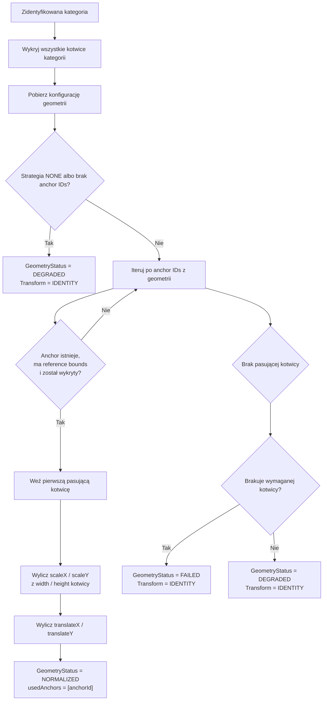
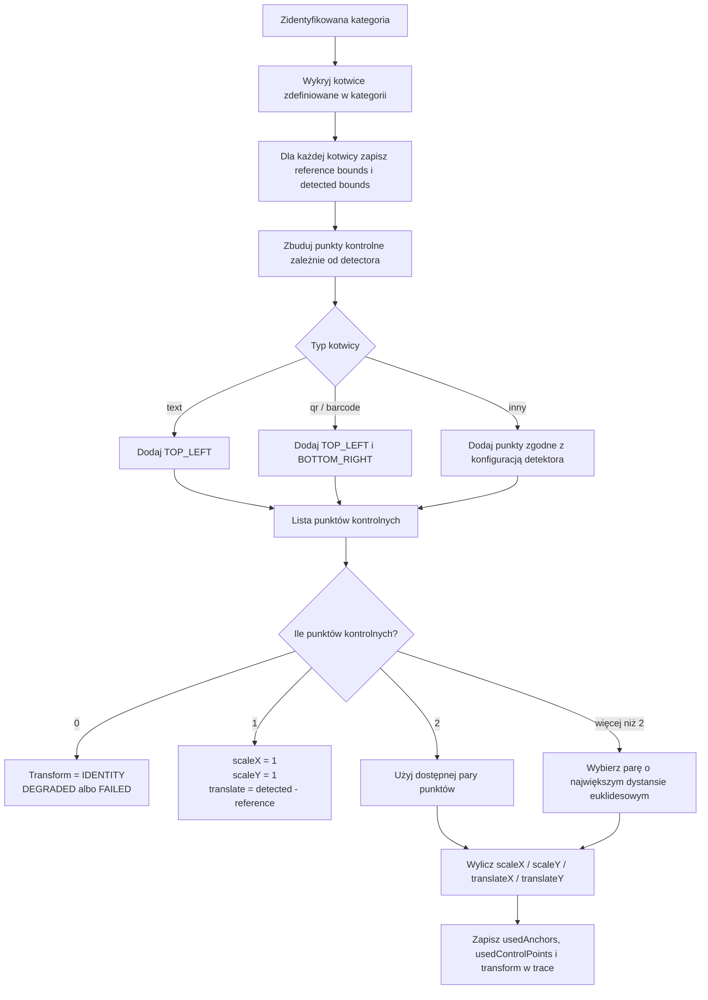

# Geometria dokumentu i kotwice

## 1. Cel

Dokument opisuje sposób działania kotwic oraz normalizacji geometrii dokumentu w aplikacji OCR. Jest też punktem wejścia do dalszej implementacji geometrii opartej o wiele kotwic.

## 2. Model pojęciowy

Kotwica (`Anchor`) służy do znalezienia w dokumencie docelowym obiektu, którego położenie można porównać z położeniem tego samego obiektu w dokumencie wzorcowym.

Kotwica składa się z:

- `searchRegion` - obszaru, w którym szukamy kotwicy w dokumencie docelowym; może być pusty, co oznacza szukanie na całej stronie,
- `detector` - mechanizmu wykrywania obiektu, np. `text`, `qr`, `barcode`,
- `expectedText` i `matcher` - reguły dopasowania treści wykrytej kotwicy,
- `referenceFeature.bounds` - referencyjnych współrzędnych obiektu w dokumencie wzorcowym,
- `required` - informacji, czy brak kotwicy powinien blokować geometrię.

Ważne rozróżnienie:

- `searchRegion` nie jest znalezioną kotwicą,
- `referenceFeature.bounds` opisuje pozycję kotwicy w dokumencie wzorcowym,
- detected bounds opisuje faktyczną pozycję kotwicy znalezionej w dokumencie docelowym.

## 3. Oczekiwany przypadek użycia

1. Użytkownik definiuje kotwicę w kategorii.
2. Dla kotwicy wskazuje `searchRegion`, czyli miejsce, gdzie kotwica powinna być szukana.
3. Użytkownik wskazuje `referenceFeature.bounds`, czyli dokładny prostokąt obiektu referencyjnego wewnątrz dokumentu wzorcowego.
4. Podczas testu lub przetwarzania system szuka kotwicy w `searchRegion` dokumentu docelowego.
5. Detektor zwraca dokładne bounds znalezionego obiektu docelowego.
6. Geometria buduje punkty kontrolne z par:
   - referencyjne bounds kotwicy,
   - wykryte bounds kotwicy.
7. Wyliczona transformacja jest stosowana do regionów pól.

## 4. Aktualna implementacja

Aktualnie `AnchorDetectionService` wykrywa wszystkie kotwice zdefiniowane w kategorii.

`GeometryNormalizationService` działa jednak w uproszczony sposób:

1. Pobiera listę anchor IDs z konfiguracji geometrii.
2. Iteruje po niej w kolejności konfiguracji.
3. Dla pierwszej kotwicy, która istnieje, ma `referenceFeature.bounds` i została wykryta, wylicza transformację.
4. Pozostałe kotwice nie są używane do transformacji.

To oznacza, że obecnie geometria jest liczona z jednej kotwicy.

Aktualny wzór:

```text
scaleX = detected.width / reference.width
scaleY = detected.height / reference.height
translateX = detected.x - reference.x * scaleX
translateY = detected.y - reference.y * scaleY
```

To podejście jest zbyt wrażliwe na rozmiar kotwicy. Kotwica tekstowa często obejmuje mały obszar, a różnica kilku pikseli w szerokości lub wysokości może istotnie zaburzyć skalowanie pól.

## 5. Aktualny algorytm



## 6. Ograniczenia obecnej implementacji

Problemy obecnego podejścia:

- jedna błędnie znaleziona kotwica przesuwa wszystkie pola,
- skalowanie z `width/height` jednej małej kotwicy jest niestabilne,
- zdefiniowanie wielu kotwic nie poprawia jakości geometrii,
- trace może pokazywać wiele znalezionych kotwic, ale transformacja używa tylko pierwszej pasującej,
- dla tekstu rozmiar bounds zależy od OCR, czcionki, granic słów i jakości skanu.

## 7. Uzgodniony model punktów kontrolnych

Geometria nie powinna bezpośrednio skalować na podstawie `width/height` pojedynczej kotwicy tekstowej.

Zamiast tego każda kotwica powinna dostarczać punkty kontrolne. Punkty kontrolne są tworzone zależnie od rodzaju kotwicy:

- kotwica tekstowa: jeden punkt kontrolny `TOP_LEFT`,
- kotwica QR/barcode: dwa punkty kontrolne `TOP_LEFT` oraz `BOTTOM_RIGHT`,
- w przyszłości inne detektory mogą deklarować własny zestaw punktów kontrolnych.

Dla tekstu najbardziej stabilny jest lewy górny punkt znalezionego bounds:

```text
TOP_LEFT = (x, y)
```

Dla QR/barcode bounds jest zwykle stabilniejszy geometrycznie niż bounds tekstu, więc pojedynczy kod może dostarczyć dwa punkty:

```text
TOP_LEFT = (x, y)
BOTTOM_RIGHT = (x + width, y + height)
```

Dzięki temu:

- jedna kotwica tekstowa daje jeden punkt i pozwala tylko na translację,
- dwie kotwice tekstowe dają dwa punkty i pozwalają na skalowanie,
- jedna kotwica QR/barcode daje dwa punkty i pozwala na skalowanie,
- wiele kotwic daje więcej punktów, z których można wybrać najstabilniejszą parę.

## 8. Uzgodniony algorytm dla obecnego `Transform`

Obecny `Transform` obsługuje:

- `scaleX`,
- `scaleY`,
- `translateX`,
- `translateY`.

Nie obsługuje rotacji ani transformacji afinicznej. Dlatego najbliższy etap implementacji powinien wyliczać tylko skalę i przesunięcie.

Reguły:

1. Jeśli nie znaleziono żadnego punktu kontrolnego:
   - `Transform.IDENTITY`,
   - `GeometryStatus = DEGRADED` albo `FAILED`, jeśli brakuje wymaganej kotwicy.
2. Jeśli znaleziono jeden punkt kontrolny:
   - `scaleX = 1`,
   - `scaleY = 1`,
   - wyliczana jest tylko translacja.
3. Jeśli znaleziono co najmniej dwa punkty kontrolne:
   - wybierana jest para punktów o największym dystansie euklidesowym w układzie referencyjnym,
   - z tej pary wyliczane są `scaleX`, `scaleY`, `translateX`, `translateY`.

Wzór dla jednego punktu:

```text
translateX = detected.x - reference.x
translateY = detected.y - reference.y
scaleX = 1
scaleY = 1
```

Wzór dla dwóch punktów:

```text
refDx = ref2.x - ref1.x
refDy = ref2.y - ref1.y
detDx = det2.x - det1.x
detDy = det2.y - det1.y

scaleX = abs(refDx) < epsilon ? 1 : detDx / refDx
scaleY = abs(refDy) < epsilon ? 1 : detDy / refDy

translateX = det1.x - ref1.x * scaleX
translateY = det1.y - ref1.y * scaleY
```

Dystans euklidesowy pary punktów:

```text
distance = sqrt((ref2.x - ref1.x)^2 + (ref2.y - ref1.y)^2)
```

Para o największym dystansie jest najmniej podatna na błąd kilku pikseli.

## 9. Docelowy algorytm punktów kontrolnych



## 10. Stabilność i zabezpieczenia

Należy dodać zabezpieczenia przed niestabilną geometrią:

- jeśli `refDx` jest bliskie `0`, nie wyliczać `scaleX` z tej pary,
- jeśli `refDy` jest bliskie `0`, nie wyliczać `scaleY` z tej pary,
- jeśli wynikowa skala jest poza dopuszczalnym zakresem, oznaczyć geometrię jako `DEGRADED` albo `FAILED`,
- jeśli QR/barcode ma bardzo mały bounds, można użyć tylko `TOP_LEFT`,
- jeśli kotwica ma niskie confidence, powinna być oznaczona w trace.

Proponowane parametry tolerancji:

```text
epsilon = 1.0 px
minQrBarcodeSize = 16 px
minScale = 0.5
maxScale = 2.0
```

Wartości powinny być konfigurowalne w przyszłości.

## 11. Strategie geometrii

### 11.1. `TRANSLATION_ONLY`

Strategia dla jednego punktu kontrolnego.

Używa tylko przesunięcia:

- `scaleX = 1`,
- `scaleY = 1`,
- `translateX = detected.x - reference.x`,
- `translateY = detected.y - reference.y`.

### 11.2. `TWO_POINT_SCALE_TRANSLATE`

Strategia dla co najmniej dwóch punktów kontrolnych.

Używa pary punktów o największym dystansie euklidesowym i wylicza:

- `scaleX`,
- `scaleY`,
- `translateX`,
- `translateY`.

Nie obsługuje rotacji.

### 11.3. `AFFINE`

Strategia przyszła dla minimum trzech punktów kontrolnych.

Wylicza transformację afiniczną:

```text
x' = a*x + b*y + tx
y' = c*x + d*y + ty
```

Wymaga rozszerzenia modelu `Transform`.

### 11.4. `ROBUST_AFFINE`

Strategia przyszła dla większej liczby punktów kontrolnych.

Powinna:

- wyliczać transformację z wielu par punktów,
- liczyć błąd dopasowania dla każdej kotwicy,
- odrzucać kotwice odstające,
- raportować użyte i odrzucone kotwice w trace.

## 12. Trace i diagnostyka

Trace powinien umożliwiać diagnozę geometrii bez zgadywania.

Dla etapu `ANCHOR_DETECTION` powinny być zapisywane:

- `categoryId`,
- `anchorId`,
- `detectorId`,
- `matcherId`,
- `expectedText`,
- `searchRegion`,
- `referenceBounds`,
- `detectedBounds`,
- `confidence`,
- `matched`,
- opcjonalnie tekst lub payload detektora.

Dla etapu `GEOMETRY_RESOLUTION` powinny być zapisywane:

- `strategy`,
- `status`,
- `usedAnchors`,
- `missingAnchors`,
- `rejectedAnchors`,
- `usedControlPoints`,
- `controlPointCount`,
- `selectedPairDistance`,
- `scaleX`,
- `scaleY`,
- `translateX`,
- `translateY`,
- residual error per anchor,
- final transform.

UI powinien pozwalać kliknąć:

- znalezioną kotwicę i pokazać jej `detectedBounds`,
- referencyjną kotwicę i pokazać jej `referenceFeature.bounds`,
- search region i pokazać obszar szukania,
- punkt kontrolny użyty do geometrii,
- odrzuconą kotwicę i pokazać powód odrzucenia.

## 13. Wniosek

Obecne zachowanie, w którym geometria używa tylko jednej kotwicy i skaluje po `width/height`, jest zbyt niestabilne dla kotwic tekstowych.

Najbliższy kierunek implementacji:

1. Zmienić `GeometryNormalizationService`, aby budował punkty kontrolne.
2. Dla jednej kotwicy tekstowej liczyć tylko translację.
3. Dla QR/barcode traktować `TOP_LEFT` i `BOTTOM_RIGHT` jako dwa punkty kontrolne, jeśli bounds jest wystarczająco duży.
4. Dla dwóch lub więcej punktów wybierać parę o największym dystansie euklidesowym.
5. Rozszerzyć trace o `usedControlPoints`, wybraną parę i wartości transformacji.

## 14. Stan implementacji strategii

Zaimplementowane strategie geometrii:

- `NONE` - brak normalizacji geometrii, używany jest `Transform.IDENTITY`.
- `ANCHOR_TRANSLATION` - wylicza tylko przesunięcie `dx/dy` jako średnią różnicę pomiędzy punktami referencyjnymi i wykrytymi; skala pozostaje `1.0`.
- `TWO_POINT_SCALE_TRANSLATE` - formalna nazwa strategii skalowania i przesunięcia. Strategia wybiera parę punktów kontrolnych o największym dystansie euklidesowym i wylicza `scaleX`, `scaleY`, `dx`, `dy`. Historyczna wartość `ANCHORS` jest traktowana jako alias tej strategii.
- `AFFINE` - wymaga co najmniej trzech punktów kontrolnych i wylicza transformację afiniczną metodą najmniejszych kwadratów:

```text
x' = a*x + b*y + tx
y' = c*x + d*y + ty
```

- `ROBUST_AFFINE` - wariant odporny na pojedyncze odstające kotwice. Dla wielu punktów kontrolnych testuje modele affine budowane z trójek punktów, wybiera model z najlepszym zbiorem inlierów i ponownie dopasowuje transformację na punktach zaakceptowanych. Przy remisie preferowana jest transformacja o mniejszym zniekształceniu względem identyczności.

Trace geometrii zawiera:

- `scaleX`, `scaleY`,
- `translateX`, `translateY`,
- `affineA`, `affineB`, `affineC`, `affineD`,
- `usedControlPoints`,
- `controlPointCount`,
- `selectedPairDistance` dla strategii dwupunktowej.
