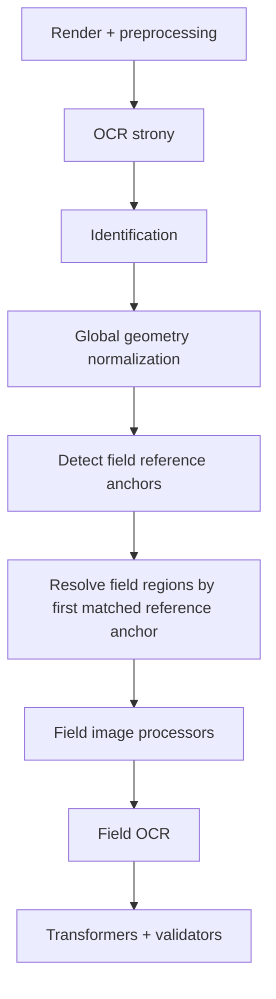
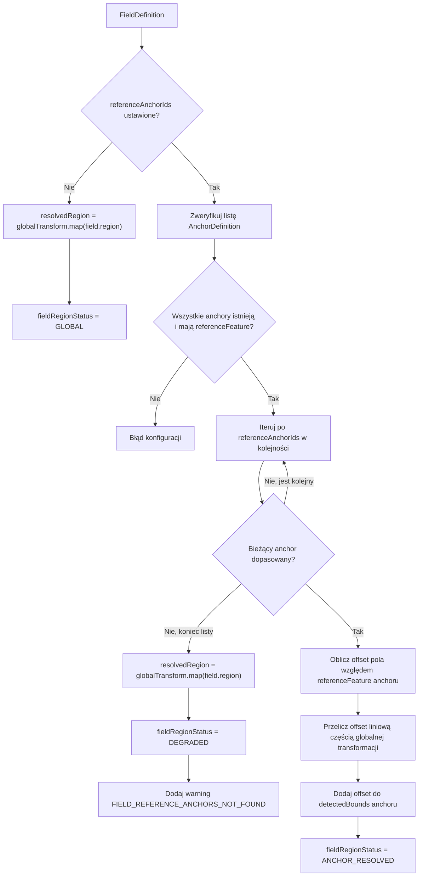

# Kotwice referencyjne pola

| Pole | Wartość |
| ---- | ------- |
| Dokument | `30-field-reference-anchor.md` |
| Status | Draft |
| Powiązane | `06-domain-model.md`, `07-processing-pipeline.md`, `08-category-configuration.md`, `13-javafx-configurator.md`, `29-geometry-anchors.md` |

## 1. Cel

Celem zmiany jest umożliwienie definiowania dla pola uporządkowanej listy kotwic referencyjnych, względem których wyznaczany jest docelowy region wyszukiwania pola.

Mechanizm ma rozwiązać przypadki, w których globalna geometria strony poprawnie stabilizuje dokument jako całość, ale konkretne pole lepiej pozycjonować względem bliskiego elementu, na przykład etykiety pola. Lista kotwic pozwala dodatkowo zdefiniować fallbacki lokalne: jeśli najbliższa etykieta nie zostanie dopasowana, region pola może zostać ustalony względem kolejnej kotwicy, na przykład etykiety pola sąsiedniego.

## 2. Decyzja kierunkowa

Pole może mieć opcjonalną listę `referenceAnchorIds`. Kolejność listy jest istotna: system używa pierwszej poprawnie dopasowanej kotwicy.

Jeżeli pole nie ma kotwic referencyjnych, jego region jest wyznaczany tak jak dotychczas, czyli wyłącznie przez globalną geometrię strony.

Jeżeli pole ma listę kotwic referencyjnych, system sprawdza je w kolejności zapisanej w konfiguracji i używa pierwszej poprawnie dopasowanej kotwicy.

Jeżeli żadna kotwica z listy nie została dopasowana, pole jest przetwarzane w trybie `DEGRADED`, a region jest wyznaczany przez globalną geometrię strony.

Kotwice pola:

- są wybierane z listy anchorów zdefiniowanych w kategorii,
- mają kolejność priorytetu,
- nie muszą być używane przez strategię geometrii strony,
- mogą, ale nie muszą, być tymi samymi anchorami co anchory geometrii,
- służą wyłącznie do lokalnego wyznaczania regionu konkretnego pola,
- nie zastępują globalnej transformacji dokumentu,
- działają po ustaleniu globalnej geometrii strony.

## 3. Terminologia

### 3.1. Globalna geometria strony

Globalna geometria strony to wynik `GeometryNormalizationService`. Jest liczona na podstawie strategii geometrii kategorii, na przykład:

- `NONE`,
- `ANCHOR_TRANSLATION`,
- `TWO_POINT_SCALE_TRANSLATE`,
- `AFFINE`,
- `ROBUST_AFFINE`.

Wynikiem globalnej geometrii jest transformacja dokumentu, która przelicza współrzędne z obrazu referencyjnego na obraz aktualnie przetwarzany.

### 3.2. Kotwice referencyjne pola

Kotwice referencyjne pola to anchory wskazane bezpośrednio w definicji pola. Służą do lokalnego wyznaczenia regionu tego pola.

Kolejność listy jest częścią konfiguracji:

1. pierwsza kotwica jest preferowana,
2. jeśli nie zostanie dopasowana, sprawdzana jest kolejna,
3. pierwsza poprawnie dopasowana kotwica wyznacza region pola,
4. jeśli żadna nie zostanie dopasowana, używany jest fallback globalny.

Ten sam anchor może być:

- tylko anchorem geometrii,
- tylko kotwicą referencyjną pola,
- jednocześnie anchorem geometrii i kotwicą referencyjną pola.

### 3.3. Offset pola względem wybranej kotwicy

Jeżeli pole ma kotwice referencyjne i jedna z nich została dopasowana, skonfigurowany region pola jest interpretowany względem referencyjnej pozycji wybranej kotwicy.

Punktem odniesienia kotwicy jest `Xmin`, `Ymin` jej wzorcowej pozycji:

```text
selectedAnchor.referenceFeature.bounds.x
selectedAnchor.referenceFeature.bounds.y
```

Offset pola:

```text
offsetX = field.region.x - selectedAnchor.referenceFeature.bounds.x
offsetY = field.region.y - selectedAnchor.referenceFeature.bounds.y
offsetW = field.region.width
offsetH = field.region.height
```

## 4. Model konfiguracji

### 4.1. FieldDefinition

Definicja pola powinna zostać rozszerzona o opcjonalne pole:

```java
List<AnchorId> referenceAnchorIds;
```

Znaczenie:

- `null`, brak wartości albo pusta lista oznacza dotychczasowe zachowanie,
- lista wskazuje anchory zdefiniowane w tej samej kategorii,
- kolejność listy określa priorytet wyboru,
- wskazane anchory nie muszą występować w `Geometry.anchorIds`.

Jeżeli w eksperymentalnych konfiguracjach pojawiłoby się jedno pole `referenceAnchorId`, importer może je potraktować jako skrót dla jednoelementowej listy. Docelowy model powinien jednak używać `referenceAnchorIds`.

### 4.2. JSON kategorii

Przykład:

```json
{
  "id": "amount",
  "displayName": "Amount",
  "page": 1,
  "referenceAnchorIds": [
    "amount-label",
    "neighbor-field-label",
    "document-code"
  ],
  "region": {
    "x": 220,
    "y": 420,
    "width": 160,
    "height": 34
  }
}
```

Wartość `region` nadal jest przechowywana we współrzędnych dokumentu referencyjnego. Różnica polega na sposobie jej interpretacji podczas przetwarzania, gdy `referenceAnchorIds` zawiera co najmniej jedną wartość.

### 4.3. Walidacja konfiguracji

Walidacja powinna sprawdzać:

- czy każdy element `referenceAnchorIds` wskazuje istniejący anchor,
- czy wskazane anchory mają `referenceFeature.bounds`,
- czy lista nie zawiera duplikatów,
- czy pole ma region,
- czy pole i każdy wskazany anchor są na tej samej stronie albo czy reguła strony jest jednoznaczna.

Na pierwszy etap rekomendacja jest prosta:

- każda kotwica referencyjna pola musi wskazywać anchor z tej samej strony co pole,
- jeśli `field.page` jest puste, użyć bieżącej/domyślnej strony zgodnie z aktualnym modelem pola,
- jeśli `anchor.page` jest puste, traktować go jako anchor dla strony pola.

## 5. Algorytm wyznaczania regionu pola

### 5.1. Pole bez kotwic referencyjnych

Dla pola bez `referenceAnchorIds` albo z pustą listą zachowanie pozostaje bez zmian:

```text
resolvedRegion = globalTransform.map(field.region)
fieldRegionStatus = GLOBAL
```

### 5.2. Pole z listą kotwic referencyjnych

Dla pola z `referenceAnchorIds`:

1. System waliduje definicje anchorów wskazane przez pole.
2. Anchory są wykrywane na aktualnym dokumencie tym samym mechanizmem co anchory geometrii.
3. System przechodzi przez `referenceAnchorIds` w kolejności z konfiguracji.
4. Pierwszy anchor z wynikiem dopasowania staje się aktywną kotwicą referencyjną pola.
5. Dla aktywnej kotwicy pobierany jest jej `detectedBounds`.
6. System liczy offset pola względem referencyjnego `referenceFeature.bounds` aktywnej kotwicy.
7. Offset jest przeliczany z uwzględnieniem globalnej transformacji strony.
8. Region pola jest składany względem znalezionej pozycji aktywnej kotwicy.

Rekomendowana formuła dla strategii bez rotacji:

```text
referenceAnchor = selectedAnchor.referenceFeature.bounds
detectedAnchor = selectedAnchor.detectedBounds

offsetX = field.region.x - referenceAnchor.x
offsetY = field.region.y - referenceAnchor.y

resolvedX = detectedAnchor.x + offsetX * globalTransform.scaleX
resolvedY = detectedAnchor.y + offsetY * globalTransform.scaleY
resolvedW = field.region.width * globalTransform.scaleX
resolvedH = field.region.height * globalTransform.scaleY
```

Dla transformacji affine należy przeliczać wektor offsetu przez część liniową transformacji, ale translację zastąpić punktem wykrytego anchoru:

```text
offset = field.topLeft - referenceAnchor.topLeft
resolvedTopLeft = detectedAnchor.topLeft + globalTransform.linear(offset)
resolvedCorners = detectedAnchor.topLeft + globalTransform.linear(fieldCorner - referenceAnchor.topLeft)
resolvedRegion = boundingBox(resolvedCorners)
```

Dzięki temu:

- globalna geometria nadal skaluje, obraca lub pochyla lokalny offset,
- lokalny punkt startowy pochodzi z faktycznie znalezionej kotwicy pola,
- nie dublujemy translacji globalnej geometrii.

### 5.3. Pole bez dopasowanej kotwicy referencyjnej

Jeżeli `referenceAnchorIds` zawiera wartości, ale żadna kotwica z listy nie została dopasowana:

```text
resolvedRegion = globalTransform.map(field.region)
fieldRegionStatus = DEGRADED
warning = FIELD_REFERENCE_ANCHORS_NOT_FOUND
```

Pole może być dalej przetwarzane. Status `DEGRADED` oznacza, że region został ustalony z fallbacku globalnego, a nie z żadnej lokalnej kotwicy.

### 5.4. Brak lub błędna definicja kotwicy

Jeżeli którykolwiek element `referenceAnchorIds` wskazuje anchor, którego nie ma w kategorii, jest to błąd konfiguracji.

Fallback `DEGRADED` dotyczy tylko sytuacji, w której konfiguracja jest poprawna, ale żadna z kotwic nie została wykryta w konkretnym dokumencie.

## 6. Statusy i wynik pola

Rekomendowany status lokalnego wyznaczenia regionu:

```java
public enum FieldRegionResolutionStatus {
    GLOBAL,
    ANCHOR_RESOLVED,
    DEGRADED
}
```

Znaczenie:

| Status | Opis |
| ------ | ---- |
| `GLOBAL` | Pole nie ma kotwic referencyjnych; region pochodzi z globalnej geometrii |
| `ANCHOR_RESOLVED` | Pole ma listę kotwic i region został ustalony względem pierwszej dopasowanej kotwicy |
| `DEGRADED` | Pole ma listę kotwic, ale żadna nie została dopasowana; użyto globalnej geometrii |

Ten status powinien trafić do trace i panelu wyników pola. Nie musi od razu zmieniać głównego `FieldResult.status`, chyba że brak lokalnej kotwicy ma być traktowany jako błąd biznesowy.

## 7. Trace i diagnostyka

Trace dla pola powinien zawierać:

- `fieldId`,
- `referenceAnchorIds`,
- `selectedReferenceAnchorId`,
- `fieldRegionResolutionStatus`,
- `referenceAnchorFound`,
- `referenceAnchorAttempts`,
- `referenceAnchorDetectedX/Y/Width/Height`,
- `referenceAnchorReferenceX/Y/Width/Height`,
- `globalResolvedX/Y/Width/Height`,
- `finalResolvedX/Y/Width/Height`,
- `fallbackReason`.

`referenceAnchorAttempts` powinno zawierać listę prób w kolejności konfiguracji:

```json
[
  { "anchorId": "amount-label", "matched": false },
  { "anchorId": "neighbor-field-label", "matched": true, "used": true },
  { "anchorId": "document-code", "matched": true, "used": false }
]
```

W UI po zaznaczeniu wyniku pola w `Field Results` powinno być możliwe pokazanie:

- finalnego regionu przekazanego do OCR,
- wykrytej i wybranej kotwicy referencyjnej pola,
- listy prób dopasowania kotwic,
- regionu wynikającego z samej globalnej geometrii jako fallback/porównanie.

## 8. JavaFX Configurator

### 8.1. Field Properties

W panelu `Field -> Properties` należy dodać sekcję `Reference Anchors`.

Kontrolki:

- lista wybranych anchorów referencyjnych pola,
- przycisk dodania anchoru z listy anchorów kategorii,
- przyciski zmiany kolejności góra/dół,
- przycisk usunięcia pozycji,
- opcja pustej listy jako odpowiednik `None`,
- informacja pomocnicza w tooltipie,
- opcjonalny przycisk przejścia do konfiguracji wybranego anchoru.

Przykład prezentacji:

```text
Reference Anchors
1. amount-label
2. neighbor-field-label
3. qr-document-code
```

Kolejność na liście powinna być widoczna, bo jest częścią logiki przetwarzania.

### 8.2. Viewer

Podczas edycji pola:

- standardowo pokazywać region pola,
- jeśli pole ma `referenceAnchorIds`, można dodatkowo pokazać `referenceFeature` aktualnie zaznaczonej kotwicy z listy innym kolorem,
- po `Test Category` pokazywać finalny region pola z trace, czyli rzeczywisty region przekazany do OCR.

### 8.3. Validation/Trace

Panel wyników powinien prezentować przy polu:

- status lokalnej geometrii pola,
- listę kotwic referencyjnych,
- id kotwicy ostatecznie użytej,
- informację, które kotwice były próbowane i czy zostały znalezione,
- finalny region OCR.

Przy `DEGRADED` użytkownik powinien widzieć, że OCR został uruchomiony, ale region pochodzi z fallbacku globalnego.

## 9. Pipeline przetwarzania

Miejsce zmiany w pipeline:



Rekomendacja implementacyjna:

- w czasie przetwarzania kategorii wykryć sumę anchorów potrzebnych do:
  - geometrii dokumentu,
  - lokalnych referencji pól,
- wyniki detekcji przechowywać w mapie `AnchorId -> AnchorDetectionResult`,
- globalna geometria korzysta tylko z anchorów wskazanych w `Geometry`,
- field region resolver korzysta z tej samej mapy dla `referenceAnchorIds`,
- field region resolver wybiera pierwszy dopasowany anchor z listy pola.

## 10. Mermaid: algorytm pola



## 11. Wpływ na konfiguracje istniejące

Zmiana jest kompatybilna wstecznie, jeśli `referenceAnchorIds` jest opcjonalne.

Istniejące pola bez `referenceAnchorIds` działają tak jak dotychczas.

Nowe zachowanie aktywuje się tylko dla pól, w których użytkownik jawnie wybierze co najmniej jedną kotwicę referencyjną.

Jeżeli w istniejących eksperymentalnych konfiguracjach pojawiłoby się jedno pole `referenceAnchorId`, importer może je przepisać do:

```json
"referenceAnchorIds": ["old-reference-anchor"]
```

## 12. Ryzyka

### 12.1. Błędnie dopasowana pierwsza kotwica

Błędnie dopasowana pierwsza kotwica referencyjna może przesunąć region pola w złe miejsce, mimo że kolejne kotwice na liście byłyby poprawne. Dlatego trace musi pokazywać:

- znaleziony anchor,
- pozycję anchoru na liście priorytetów,
- pozostałe próby dopasowania,
- finalny region pola,
- OCR wykonany na finalnym regionie.

### 12.2. Anchor bardzo blisko pola, ale niestabilny OCR

Lokalna kotwica często będzie etykietą tekstową. Jeżeli OCR etykiety jest niestabilny, region pola może często przechodzić na kolejną kotwicę z listy albo ostatecznie w `DEGRADED`.

Rekomendacja:

- stosować matcher `contains`,
- ograniczać `searchRegion`,
- dla etykiet dopuszczać szukanie kilkuwyrazowe,
- definiować alternatywne kotwice z etykiet sąsiednich pól,
- w razie potrzeby używać QR/barcode jako stabilniejszej kotwicy lokalnej,
- układać listę od najbardziej precyzyjnej i najbliższej pola do najbardziej ogólnej.

### 12.3. Affine i lokalny offset

Przy affine nie należy stosować pełnej transformacji do punktu `field.region` i potem dodawać wykrytej kotwicy, bo spowoduje to podwójną translację.

Należy przeliczać tylko wektor różnicy:

```text
fieldPoint - selectedAnchor.referencePoint
```

pełną translację zastępuje `selectedAnchor.detectedPoint`.

## 13. Kryteria akceptacji

Zmiana jest zakończona, gdy:

- model pola ma opcjonalne `referenceAnchorIds`,
- JSON kategorii zapisuje i odczytuje `referenceAnchorIds`,
- UI pozwala zarządzać uporządkowaną listą kotwic referencyjnych pola,
- walidacja sprawdza istnienie wszystkich wskazanych anchorów,
- walidacja wykrywa duplikaty na liście,
- pipeline wykrywa anchory potrzebne dla lokalnych referencji pól,
- pole bez `referenceAnchorIds` działa jak dotychczas,
- pole z listą kotwic używa pierwszej dopasowanej kotwicy,
- pole z listą bez żadnego dopasowania przechodzi w tryb `DEGRADED` i używa globalnej geometrii,
- trace pokazuje status lokalnej geometrii pola, listę kotwic, wybraną kotwicę i finalny region OCR,
- `Field Results` pozwala ocenić finalny region użyty do OCR.

