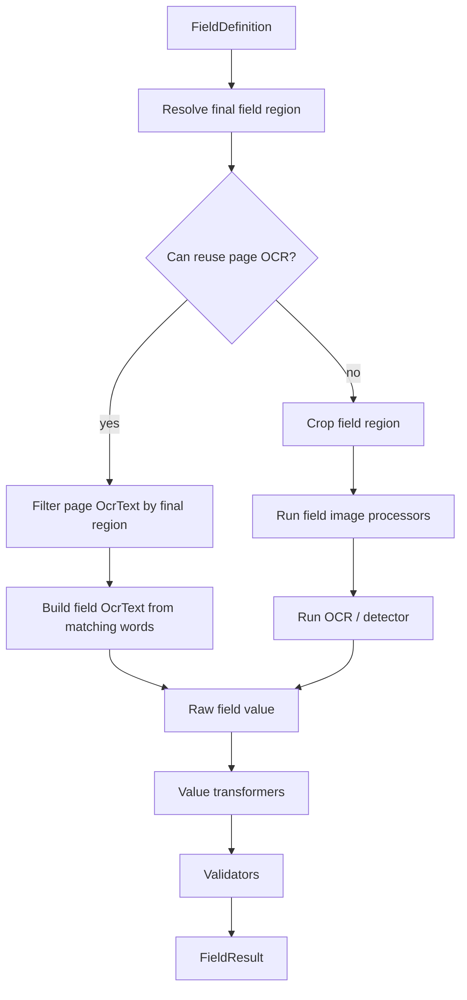

# Ponowne użycie OCR strony dla pól

## 1. Cel

Celem zmiany jest ograniczenie liczby wywołań OCR wykonywanych dla pól.

Aktualnie pole tekstowe może uruchamiać OCR regionu nawet wtedy, gdy:

- OCR całej strony został już wykonany,
- pole nie posiada własnych transformacji obrazu,
- pole korzysta z tych samych ustawień OCR co strona,
- wystarczy odczytać tekst z elementów hOCR znajdujących się w finalnym regionie pola.

W takich przypadkach system powinien ponownie wykorzystać wynik OCR strony,
zamiast uruchamiać Tesseract ponownie dla wycinka pola.

## 2. Kontekst

System posiada już model OCR oparty o strukturę:

- `OcrText`,
- `OcrArea`,
- `OcrParagraph`,
- `OcrLine`,
- `OcrWord`.

Źródłem prawdy są `areas`, a `paragraphs()`, `lines()` i `words()` są
projekcjami wyliczanymi z tej struktury.

OCR strony jest wykonywany na obrazie po preprocessingu dokumentu. Ten sam
obraz jest podstawą do:

- identyfikacji kategorii,
- wykrywania kotwic,
- wyliczenia geometrii,
- ustalania finalnych regionów pól.

Jeżeli pole nie modyfikuje swojego wycinka dodatkowymi image processorami,
wynik OCR strony jest często wystarczający do odczytania wartości pola.

## 3. Założenia

1. Regiony pól są definiowane względem obrazu po preprocessingu dokumentu.
2. OCR strony jest wykonywany dla tego samego obrazu, na którym ustalana jest geometria.
3. OCR strony zwraca hOCR i wewnętrzny model OCR z koordynatami elementów.
4. Optymalizacja nie może zmienić wyniku w przypadkach, w których pole wymaga osobnego OCR.
5. Mechanizm musi być możliwy do zdiagnozowania w trace.

## 4. Warunki użycia optymalizacji

Pole może użyć OCR strony zamiast osobnego OCR regionu, jeżeli spełnione są wszystkie warunki:

1. Detektor pola to domyślny detektor tekstowy `ocr`.
2. Pole nie ma zdefiniowanych `imageProcessors`.
3. Pole nie nadpisuje ustawień OCR względem efektywnych ustawień OCR strony:
   - `language`,
   - `datapath`,
   - w przyszłości również innych parametrów OCR.
4. Wynik OCR strony jest dostępny dla strony pola.
5. Finalny region pola został poprawnie ustalony przez geometrię globalną albo kotwice referencyjne pola.

Jeżeli którykolwiek z warunków nie jest spełniony, system zachowuje dotychczasowe działanie
i uruchamia osobny OCR/detektor dla pola.

## 5. Przypadki wymuszające osobny OCR pola

Osobny OCR albo detektor pola musi być uruchomiony, gdy:

- pole ma co najmniej jeden image processor,
- pole używa detektora `qr`, `barcode` albo innego detektora rozszerzeń,
- pole ma własny `language` albo `datapath` różny od OCR strony,
- OCR strony nie został wykonany albo nie jest dostępny w kontekście przetwarzania,
- pole wymaga diagnostyki dokładnego obrazu wejściowego do OCR regionu,
- w przyszłości pole ustawi parametry OCR, które wpływają na wynik rozpoznania.

## 6. Algorytm



## 7. Filtrowanie OCR strony

Filtrowanie powinno odbywać się od poziomu słów.

Nie należy wybierać całego akapitu, linii ani obszaru tylko dlatego, że przecina region pola.
Takie podejście mogłoby wciągnąć tekst spoza pola.

Rekomendowana reguła:

1. Przejść po strukturze `areas -> paragraphs -> lines -> words`.
2. Zachować słowo, jeżeli jego bounding box mieści się w regionie pola albo spełnia przyjęty próg pokrycia.
3. Odbudować strukturę OCR z zachowaniem pierwotnej hierarchii, ale tylko z wybranymi słowami.
4. Usunąć puste linie, akapity i obszary.
5. Ustawić `OcrText.value` na tekst z zachowanych linii.

### 7.1. Reguła dopasowania słowa

MVP może użyć reguły:

- słowo jest wybrane, jeżeli region pola zawiera lewy górny i prawy dolny punkt bounding boxa słowa.

Docelowo można dodać parametr progu pokrycia, np.:

- `minWordCoverage = 0.6`,
- słowo jest wybrane, jeżeli co najmniej 60% jego powierzchni leży w regionie pola.

Próg pokrycia jest bardziej odporny na drobne błędy geometrii i bounding boxów OCR.

## 8. Model i API

### 8.1. Nowy komponent

Proponowany komponent:

```text
OcrTextRegionExtractor
```

Odpowiedzialność:

- wejście: `OcrText pageOcr`, `Region region`,
- wyjście: `OcrText fieldOcr`,
- brak zależności od Tesseract, JavaFX i konfiguracji.

Komponent powinien znajdować się w module `core` albo `domain` zależnie od przyjętej granicy:

- `domain`, jeśli potraktujemy to jako czystą operację na modelu OCR,
- `core`, jeśli komponent ma obsługiwać trace albo politykę dopasowania.

Rekomendacja: zacząć w `core`, aby nie rozszerzać domeny przed ustaleniem docelowych reguł pokrycia.

### 8.2. FieldProcessingService

`FieldProcessingService` powinien otrzymać kontekst OCR strony.

Przykładowo:

```java
FieldResult extract(FieldDefinition field,
                    ProcessingImage pageImage,
                    Transform transform,
                    OcrText pageOcr,
                    OcrSettings pageOcrSettings)
```

Alternatywnie można dodać nowy obiekt kontekstu:

```java
FieldProcessingContext
```

Zawartość:

- `ProcessingImage pageImage`,
- `Transform transform`,
- `OcrText pageOcr`,
- `OcrSettings pageOcrSettings`,
- `TraceSink traceSink`.

Rekomendacja: użyć obiektu kontekstu, ponieważ liczba parametrów pipeline'u pola już rośnie.

## 9. Decyzja o ponownym użyciu OCR

Decyzję powinien podejmować core, nie UI.

Proponowana metoda:

```java
boolean canReusePageOcr(FieldDefinition field,
                        OcrSettings effectivePageOcrSettings,
                        OcrText pageOcr)
```

Warunki:

- `pageOcr != null`,
- `field.imageProcessors().isEmpty()`,
- `field.ocr().detector()` jest puste albo `ocr`,
- efektywne `field.ocr().language` i `field.ocr().datapath` są takie same jak OCR strony.

## 10. Trace i diagnostyka

Trace pola powinien zawierać informację, czy OCR strony został użyty ponownie.

Proponowane atrybuty:

```json
{
  "fieldOcrMode": "PAGE_OCR_REUSE",
  "fieldId": "amount",
  "resolvedRegion": {
    "x": 100,
    "y": 200,
    "width": 250,
    "height": 40
  },
  "selectedWords": 3,
  "selectedLines": 1,
  "fallbackReason": ""
}
```

Dla osobnego OCR:

```json
{
  "fieldOcrMode": "FIELD_OCR",
  "fallbackReason": "FIELD_HAS_IMAGE_PROCESSORS"
}
```

Przykładowe powody fallbacku:

- `FIELD_HAS_IMAGE_PROCESSORS`,
- `FIELD_USES_NON_OCR_DETECTOR`,
- `FIELD_OVERRIDES_OCR_SETTINGS`,
- `PAGE_OCR_MISSING`,
- `PAGE_OCR_EMPTY`.

## 11. Preview Field

`Preview Field` powinien używać tej samej logiki co właściwe przetwarzanie.

Jeżeli pole kwalifikuje się do ponownego użycia OCR strony:

- raw OCR powinien pochodzić z wycinka `OcrText` strony,
- trace powinien wskazać `PAGE_OCR_REUSE`,
- obraz wejściowy do OCR pola może nie wystąpić, ponieważ osobny OCR nie był wykonywany.

Jeżeli użytkownik potrzebuje zobaczyć obraz regionu, UI może nadal pokazywać crop diagnostyczny,
ale nie powinno to oznaczać wykonania osobnego OCR.

## 12. UI

### 12.1. Konfiguracja

Na start nie trzeba dodawać nowego przełącznika w UI.

Optymalizacja powinna być domyślnie włączona i działać tylko w bezpiecznych przypadkach.

W przyszłości można dodać ustawienie zaawansowane:

```text
Reuse page OCR when possible
```

Zakres:

- profil,
- kategoria,
- pole.

### 12.2. Trace / Validation

Panel `Validation / Trace` powinien pokazywać:

- tryb OCR pola: `PAGE_OCR_REUSE` albo `FIELD_OCR`,
- liczbę wybranych słów/linii,
- powód fallbacku,
- finalny region użyty do filtrowania OCR strony.

## 13. Eksport diagnostyczny

Eksport diagnostyczny powinien odróżniać:

- OCR strony użyty ponownie dla pola,
- osobny OCR pola.

Dla `PAGE_OCR_REUSE` paczka diagnostyczna powinna zawierać:

- hOCR strony,
- trace z regionem pola,
- wycinek modelu OCR użyty jako wynik pola,
- opcjonalnie obraz regionu jako artefakt pomocniczy.

Dla `FIELD_OCR` paczka pozostaje bez zmian:

- obraz wejściowy OCR pola,
- raw OCR/hOCR pola,
- trace image processors.

## 14. Ryzyka

### 14.1. Jakość OCR strony vs OCR regionu

OCR całej strony może być mniej dokładny dla małych pól niż OCR wycinka po cropie.

Dlatego optymalizacja nie powinna działać, jeżeli pole ma własny preprocessing obrazu albo własne parametry OCR.

### 14.2. Granice regionu

Zbyt ciasny region może odrzucić część słów.

Warto rozważyć:

- próg pokrycia słowa,
- opcjonalny margines tolerancji regionu,
- snapping regionów do OCR bounds.

### 14.3. Kolejność tekstu

Tekst pola powinien zachować kolejność wynikającą z modelu OCR:

- area,
- paragraph,
- line,
- word.

Nie należy sortować słów wyłącznie po `x/y`, jeśli parser hOCR już dostarcza logiczną strukturę kolejności.

## 15. Plan implementacji

### Etap 1: Ekstraktor OCR z regionu

- Dodać `OcrTextRegionExtractor`.
- Filtrować słowa po regionie.
- Odbudować strukturę `OcrText`.
- Dodać testy jednostkowe dla:
  - pustego OCR,
  - regionu bez słów,
  - regionu z częścią słów,
  - usuwania pustych linii/paragrafów/areas,
  - zachowania kolejności tekstu.

### Etap 2: Kontekst przetwarzania pola

- Dodać `FieldProcessingContext`.
- Przepiąć `DocumentProcessor` na przekazywanie `pageOcr` i efektywnych ustawień OCR strony.
- Zachować istniejące publiczne metody jako overloady kompatybilne wstecznie, jeśli są używane w testach lub UI.

### Etap 3: Decyzja o reuse/fallback

- Dodać regułę `canReusePageOcr`.
- W `FieldProcessingService` wybrać:
  - `PAGE_OCR_REUSE`,
  - albo dotychczasowy crop + OCR/detector.
- Dodać powody fallbacku.

### Etap 4: Trace

- Dodać trace entry dla trybu OCR pola.
- Uzupełnić eksport diagnostyczny o informację, czy OCR był wykonany osobno.

### Etap 5: Preview Field

- Przekazać OCR strony do `PreviewFieldUseCase`, jeśli jest dostępny w sesji.
- Zapewnić zgodność wyniku `Preview Field` z `Test Category`.

### Etap 6: UI diagnostyczne

- Pokazać tryb OCR pola w `Validation / Trace`.
- Przy wyborze wyniku pola pokazywać region użyty do filtrowania OCR strony.

## 16. Kryteria akceptacji

1. Pole bez image processorów i bez własnych ustawień OCR nie uruchamia osobnego OCR, jeżeli OCR strony jest dostępny.
2. Pole z image processorami nadal uruchamia osobny OCR/detektor.
3. Pole z detektorem `qr` albo `barcode` nadal uruchamia detektor na regionie.
4. Pole z własnym językiem OCR różnym od OCR strony uruchamia osobny OCR.
5. `Preview Field` i `Test Category` używają tej samej decyzji reuse/fallback.
6. Trace jasno pokazuje `PAGE_OCR_REUSE` albo `FIELD_OCR`.
7. Wynik OCR wycięty z OCR strony zachowuje strukturę `areas -> paragraphs -> lines -> words`.
8. Testy jednostkowe pokrywają filtrowanie słów i odbudowę struktury OCR.

## 17. Otwarte decyzje

1. Czy domyślną regułą dopasowania słowa ma być pełne zawarcie w regionie, czy próg pokrycia.
2. Czy dodać konfigurowalny margines tolerancji dla regionu.
3. Czy UI powinien mieć przełącznik wyłączający reuse per pole.
4. Czy reuse ma działać również wtedy, gdy pole ma ten sam język, ale jawnie wpisany w konfiguracji pola.
5. Czy eksport diagnostyczny powinien zapisywać osobny mini-hOCR wycięty z OCR strony.
